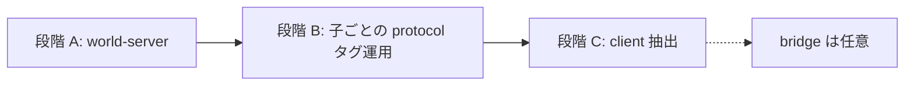

# 実施計画: `alchemy-engine` スーパープロジェクト化（world-server / client + protocol タグ固定）

> **置き場**: `.workspace/2_todo`（着手前。完了後に `3_done` へ）  
> **作成日**: 2026-09-22  
> **目的**: [alchemy-engine](https://github.com/FRICK-ELDY/alchemy-engine) を **ドキュメント／計画の正本を持つスーパープロジェクト**にし、実行コードを submodule で束ねる。第一子は **`alchemy-world-server`**。最終形では **`alchemy-client`** も親直下の submodule とする。  
> **protocol の取り込み方針（決定）**: 子は親レイアウトを見ない。各子が **`3rdparty/`（submodule）または Mix/Cargo の `deps`（git タグ）**で [alchemy-protocol](https://github.com/FRICK-ELDY/alchemy-protocol) を **自分でタグ固定**する。`PROTO_ROOT=../alchemy-protocol` のような親相対パスは **採用しない**。  
> **残すもの（親本体）**: **`.workspace`** と、実行子への gitlink / README。  
> **関連**: [protocol-repo-extraction-procedure.md](protocol-repo-extraction-procedure.md)、[alchemy-server-client-bridge-repos-plan.md](alchemy-server-client-bridge-repos-plan.md)、[client-server-separation-procedure.md](../3_done/client-server-separation-procedure.md)。bridge 別リポは **必須ではない**（§6.2）。

---

## 1. 要約と完了条件

### 1.1 依存の向き（保証の原則）

```text
親 alchemy-engine          … 子を知ってよい（どの world-server / client を束ねるか）
子 world-server / client   … 親を知ってはいけない
子                         … protocol を 3rdparty または deps の git タグで固定する
protocol                   … どの親／子からも独立した契約リポ
```

| 層 | 保証すること | 保証しないこと |
|:---|:---|:---|
| **親** | `.workspace` の設計・計画。束ねている **world-server / client のリビジョン**。互換の **推奨タグ表**（文書） | 子のビルドが親ディレクトリ構造に依存すること |
| **各子** | 自分が依存する **protocol タグ**（`3rdparty` / `deps` に明示）と、そのタグでのビルド・テスト | 隣の submodule や親パスの存在 |
| **protocol** | ワイヤ契約の形 | 特定エンジンのディレクトリレイアウト |

### 1.2 最終ゴール（レイアウト）

```text
alchemy-engine/                            # スーパープロジェクト（作業用玄関）
├── .workspace/                            # ドキュメント・計画・推奨互換表
├── .gitmodules
├── README.md
├── world-server/                          # submodule（リモートは alchemy-world-server）
│   ├── apps/  config/  mix.*  …
│   └── 3rdparty/alchemy-protocol/         # または Mix/Cargo deps（git tag）
│       └── （タグ vX.Y.Z に固定）
└── alchemy-client/                        # submodule（段階 C）
    └── 3rdparty/alchemy-protocol/         # または Cargo deps（git tag）
        └── （タグ vX.Y.Z に固定。server と揃える運用）
```

| リポジトリ | 役割 |
|:---|:---|
| **`alchemy-engine`** | メタの玄関。設計・計画。world-server / client の作業用ピン。 |
| **`alchemy-protocol`** | ワイヤ契約の SSoT（独立リポ。**親の必須 submodule にはしない**）。 |
| **`alchemy-world-server`** | サーバー実行体。protocol は自前でタグ固定。 |
| **`alchemy-client`** | クライアント実行体。protocol は自前でタグ固定。 |

**親に `alchemy-protocol/` を並べない理由**: 並べると開発者が `PROTO_ROOT=../...` に寄りやすく、子が親を知る契約になりがちだから。protocol の正本は常に **独立リポ＋タグ**、取り込みの正本は常に **各子の 3rdparty／deps**。

### 1.3 段階ゴール

| 段階 | 内容 |
|:---|:---|
| **A** | 親＋`alchemy-world-server`。コードを移し、protocol は **子内**の `3rdparty` または deps でタグ固定（現状の延長を正式化） |
| **B** | protocol 取り込み規約の固定（タグ必須・lock 文書・server/client 間の互換運用）。**親へ protocol を昇格させない** |
| **C** | `alchemy-client` を抽出し、同様に自前で protocol をタグ固定。親は client submodule を追加 |

### 1.4 完了条件

#### 段階 A

- [ ] `alchemy-world-server` が存在し、CI が通る。  
- [ ] 親が `.workspace` を保持し、world-server を submodule でピンする。  
- [ ] world-server が protocol を **自リポ内の 3rdparty または deps（git タグ）**で参照する（親相対パスなし）。  
- [ ] 親 README に clone 手順がある。launcher 追従またはイシュー起票済み。  

#### 段階 B / C（最終形）

- [ ] world-server と client のそれぞれに **protocol タグの明示**がある。  
- [ ] [protocol-lock.md](../0_docs/protocol-lock.md) が「各子のピンの見方／推奨一致タグ」を記述する（親ディレクトリに proto 実体を置かない）。  
- [ ] 子単体 clone だけでビルドできる。  
- [ ] 親一式 clone でも、ビルドは各子の 3rdparty／deps に依存する（親パス注入なし）。  
- [ ] 本計画が `3_done` へ移動している。  

---

## 2. 前提・非目標

### 2.1 前提

- 現行はモノレポ。`3rdparty/alchemy-protocol` と [protocol-lock.md](../0_docs/protocol-lock.md) でピンしてきた経緯がある。  
- **`alchemy-protocol` は既に独立リポ**。  
- クライアントはプロセス分離済み、リポ分割は未実施。  

### 2.2 非目標・採用しないもの

- **`PROTO_ROOT=../alchemy-protocol` 等、親／兄弟パスを前提にした取り込み**（子が親を知ることになるため）。  
- **親必須 submodule としての `alchemy-protocol/`**（閲覧用に任意 clone するのは可。ビルド契約にはしない）。  
- **bridge 別リポの必須化**（§6.2）。  
- **ドメイン再設計**。  

### 2.3 protocol 取り込みの推奨手段（子ごと）

| 手段 | 向く場合 | 備考 |
|:---|:---|:---|
| **A. `3rdparty/alchemy-protocol` を git submodule（タグ／SHA 固定）** | パスが安定し、現行に近い | clone 時 `--recurse-submodules` が必要 |
| **B. Mix / Cargo の git 依存（`tag: "vX.Y.Z"`）** | lock ファイルで再現しやすい | 展開先は `deps/` 等。生成タスクがそのパスを見る |

どちらでもよいが、**リポ内で一つに統一**し、README に書く。server と client で手段が違ってもよいが、**参照するタグ名の運用は揃える**。

---

## 3. 移すもの／残すもの

### 3.1 段階 A: `alchemy-world-server` へ

| 種別 | 現状 | 備考 |
|:---|:---|:---|
| Elixir / config / mix | `apps/**`, `config/**`, `mix.*` 等 | |
| Rust（暫定全部） | `rust/**` | 段階 C まで client 同居可 |
| assets / CI / development.md | 現行どおり | |
| protocol 取り込み | `3rdparty/alchemy-protocol` | **子に残す（最終形でも子に残す）**。タグ固定を明確化 |
| `.workspace` | — | **移さない** |

### 3.2 段階 B / C

| 対象 | 内容 |
|:---|:---|
| **B** | 各子の protocol ピン手順・CI・protocol-lock 文書を「子がタグで固定」に揃える。親相対パスが残っていれば削除 |
| **C** | `rust/client` → `alchemy-client`。client 側にも独自の 3rdparty または deps で同系タグを固定 |

### 3.3 親に残す／親がすること

| 種別 | 内容 |
|:---|:---|
| `.workspace` | 設計・計画・**推奨互換表**（例: world-server `@abc` + client `@def` は protocol `v0.1.2` 想定） |
| submodule | パス `world-server/`（リモート `alchemy-world-server`）、（段階 C 後）`alchemy-client` |
| しないこと | protocol 実体の必須配置、子への `PROTO_ROOT` 注入を前提にしたビルド |

---

## 4. 推奨レイアウトと命名

| リポ | 親からのパス | protocol の置き場 |
|:---|:---|:---|
| world-server | `world-server/`（リモート `alchemy-world-server`） | 子内 `3rdparty/` または `deps` |
| client | `alchemy-client/` | 同上 |
| protocol | （親には置かない） | 独立リポ。各子がタグで参照 |

---

## 5. フェーズ別実施手順

### フェーズ 0 — 合意

- [ ] §1.1 の依存の向き（子は親を知らない／protocol は子がタグ固定）を合意済みとする。  
- [ ] 各子の取り込み手段を **3rdparty submodule** か **deps git tag** か決める。  
- [ ] 履歴方針（§5.1）、freeze、launcher 影響を確認。  

### 5.1 履歴方針（決定: H1）

| 方式 | 内容 | 本計画 |
|:---|:---|:---|
| **H1. 履歴付き抽出** | `git filter-repo` 等で `.workspace` を除いた履歴を world-server へ。親は `.workspace`＋submodule | **採用** |
| H2. スナップショット | ある commit のツリーだけ初回コミット | 不採用（初回は履歴を残す） |
| H3. リモートリネーム＋新親 | 現行を world-server にリネームし空の親を新設 | 不採用 |

**H1 の実務手順（概要）**: 親を mirror clone → `git filter-repo --invert-paths --path .workspace/` でメタ履歴を除去 → 空の [alchemy-world-server](https://github.com/FRICK-ELDY/alchemy-world-server) へ push。親側の superproject 化は別コミット／PR。

### フェーズ 1 — 段階 A: world-server 新設

1. リポ作成しコード投入（`.workspace` 除外）。  
2. `3rdparty/alchemy-protocol`（または deps）を **タグ固定**で整える。  
3. ビルドが **子リポルートだけ**で完結することを確認（親パス不要）。  
4. CI 緑・タグ打つ。  

### フェーズ 2 — 段階 A: 親のスーパープロジェクト化

1. 親からコードツリー削除、`.workspace` 残置。  
2. パス `world-server/` に `alchemy-world-server` を submodule 追加。  
3. README・CI 分担（コード CI は子）。  

### フェーズ 3 — ドキュメント

- [ ] パス方針 D1/D2。  
- [ ] protocol-lock を「各子のピンの読み方＋推奨一致タグ」に更新。  
- [ ] 「親に proto を置く」「PROTO_ROOT で親を見る」記述があれば削除。  

### フェーズ 4 — 段階 B: protocol タグ運用の固定

1. world-server（と将来 client）で **タグ更新手順**を README に書く。  
2. 破壊的変更時は protocol `MAJOR` 上げ → 各子が意図的に追従する PR。  
3. 任意: 親 `.workspace` に「今の推奨セット」表を置き、ずれ検知は人間または軽いチェックスクリプト（子の lock／`.gitmodules` を読む。親に proto は置かない）。  

### フェーズ 5 — 段階 C: client 抽出

1. `alchemy-client` 新設、client ツリー移管。  
2. client も自前で protocol をタグ固定。  
3. 親に client submodule 追加。world-server から client 削除。  
4. **互換運用**: リリース／統合テスト前に server と client の protocol タグ一致（または互換範囲）を確認。  

### フェーズ 6 — 運用

- [ ] 親の submodule 更新 PR テンプレ（world-server / client）。  
- [ ] protocol 上げは **各子の PR**（必要なら親の推奨表も更新）。  
- [ ] 設計 Issue は親、実装 PR は子。  

---

## 6. 他計画との順序



### 6.2 bridge

本計画と直交。子が protocol を自前固定する構成でも bridge 別リポは必須ではない。

---

## 7. clone / 開発者体験

### 7.1 親一式（作業用）

```bash
git clone --recurse-submodules git@github.com:FRICK-ELDY/alchemy-engine.git
cd alchemy-engine/alchemy-world-server
mix deps.get && mix alchemy.setup   # protocol は子の 3rdparty/deps から解決
```

### 7.2 子だけ

```bash
git clone --recurse-submodules git@github.com:FRICK-ELDY/alchemy-world-server.git
# または deps 方式なら recurse 不要な場合あり（README に従う）
```

### 7.3 protocol だけ（契約レビュー）

```bash
git clone git@github.com:FRICK-ELDY/alchemy-protocol.git
git checkout v0.1.2
```

ビルド入力としては使わず、必要なら子側で同じタグに追従する。

---

## 8. リスク・未決事項

| 項目 | 内容 | 推奨 |
|:---|:---|:---|
| **タグずれ** | server と client が別 protocol タグを指す | 統合前チェック。親の推奨表。可能なら CI でタグ文字列を比較 |
| **更新コスト** | protocol 一上げで子が2 PR** | 受け入れ済み。独立性とのトレードオフ |
| **手段の混在** | 一方が 3rdparty、他方が deps | 可。タグ名の運用だけ揃える |
| **旧 PROTO_ROOT** | ローカル上書き習慣が残る | README で「親相対は非対応」。開発用上書きが必要なら **子リポ内パス**に限定 |
| **共有クレート** | client 切り出し時 | 段階 C 前に共有／専用表 |
| **bridge との混同** | client リポ ≠ client-bridge | 文書で区別 |

---

## 9. チェックリスト

### 9.1 段階 A

- [ ] world-server CI 緑（子単体）  
- [ ] 親に world-server gitlink  
- [ ] ビルドが親パスに依存しない  

### 9.2 段階 B

- [ ] protocol 更新手順が子 README にある  
- [ ] protocol-lock が「子のタグ」視点  
- [ ] 親相対 `PROTO_ROOT` が文書・スクリプトから消えている  

### 9.3 段階 C

- [ ] client が自前で protocol タグ固定  
- [ ] server / client の互換確認手順がある  
- [ ] launcher 追従  

---

## 10. 関連ドキュメント

| ドキュメント | 内容 |
|:---|:---|
| [vision.md](../0_docs/vision.md) | 保証範囲 |
| [overview.md](../0_docs/architecture/overview.md) | 二層の SSoT |
| [protocol-lock.md](../0_docs/protocol-lock.md) | ピン記録（子タグ視点へ更新予定） |
| [protocol-repo-extraction-procedure.md](protocol-repo-extraction-procedure.md) | ワイヤ契約リポ（取り込みは本計画の §2.3 を優先） |
| [alchemy-server-client-bridge-repos-plan.md](alchemy-server-client-bridge-repos-plan.md) | bridge（任意） |
| [client-server-separation-procedure.md](../3_done/client-server-separation-procedure.md) | プロセス分離 |

---

## 11. 改訂履歴

| 日付 | 内容 |
|:---|:---|
| 2026-09-22 | 初版（world-server 移管・スーパープロジェクト化） |
| 2026-09-22 | protocol / client を親並列 submodule 案として追記 |
| 2026-09-22 | **決定**: 子は親を見ない。protocol は各子が 3rdparty／deps の **git タグで固定**。親への protocol 昇格と親相対 `PROTO_ROOT` は不採用 |
| 2026-09-22 | **決定**: コード移管の履歴方針は **H1（git filter-repo で `.workspace` を除いて履歴付き）** |
| 2026-09-22 | 親内の submodule **パス**を `world-server/` とする（リモートリポ名は `alchemy-world-server` のまま） |
