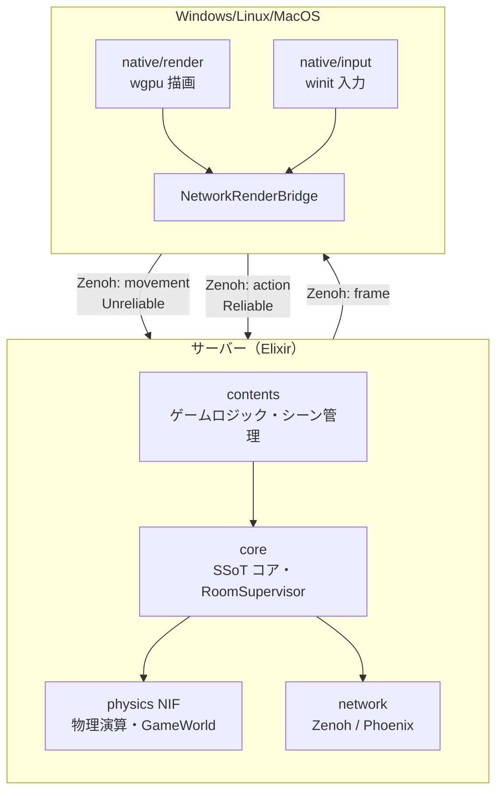

# AlchemyEngine
  

> A platform for worlds. You bring the rules.

3D空間とそこに存在するユーザーを保証する Elixir x Rust 製のエンジンです。

詳細は [ビジョンと設計思想](./docs/vision.md) を参照。

## 🏗️ Architecture

### 全体構成



> クライアント・サーバー分離の詳細と実装手順は [client-server-separation-procedure.md](./docs/plan/client-server-separation-procedure.md) を参照。

## ハイライト

- **Elixir as SSoT**
> 状態とロジックはすべて Elixir 側で管理します。クライアント用のコードをそのままヘッドレスのマルチプレイサーバーとして転用可能です。1000人規模のプレイヤーが交差する大規模ネットワークも Elixir の並行処理能力で捌きます。
- **Rust ECS for Physics & Rendering & Audio**
> Elixir から同期された状態をもとに、Rust の ECS が 60Hz 固定の物理演算・描画・オーディオ処理を行います。SoA（Structure of Arrays）と SIMD による CPU キャッシュ最適化で、高フレームレートを維持します。
- **Zero NIF Serialization Overhead**
> Elixir <--> Rustの通信は軽量な識別子のみ。バイナリのシリアライズコストを設計レベルで排除しています。
- **SuperCollider-inspired Audio**
> Elixir が「指揮者」として非同期コマンドを発行し、Rust の専用スレッドが DSP 処理を行います。複雑な空間オーディオと動的ルーティングを低遅延で実現します。

詳細は [プラス点 詳細一覧](./docs/evaluation/specific-strengths.md) を参照。

## 🚀 Getting Started

### Prerequisites

開発環境に以下のツールがインストールされている必要があります。

- [Elixir](https://elixir-lang.org/install.html) **1.19 / OTP 28**
- [Rust](https://www.rust-lang.org/tools/install) (stable)
- [zenohd](https://github.com/eclipse-zenoh/zenohd)（一括起動・リモート起動時）: `cargo install eclipse-zenoh`

### Setup & Run

```bash
git clone git@github.com:FRICK-ELDY/alchemy-engine.git
cd alchemy-engine
mix deps.get
mix compile
mix run --no-halt
```

**開発者向け**: 起動手順の詳細・ランチャー・品質保証コマンドなどは [development.md](./development.md) を参照してください。

---

## ✅ 品質保証

すべての push で GitHub Actions が自動実行されます。開発時の品質保証コマンドの詳細は [development.md](./development.md) および [docs/warranty/ci.md](./docs/warranty/ci.md) を参照。

---

## 🤝 Contributing

（※チーム開発時のガイドラインや、コントリビューションルールの詳細をここに記載します）

---

## 📄 License

This project is licensed under the [Eclipse Public License 2.0 (EPL-2.0)](LICENSE).