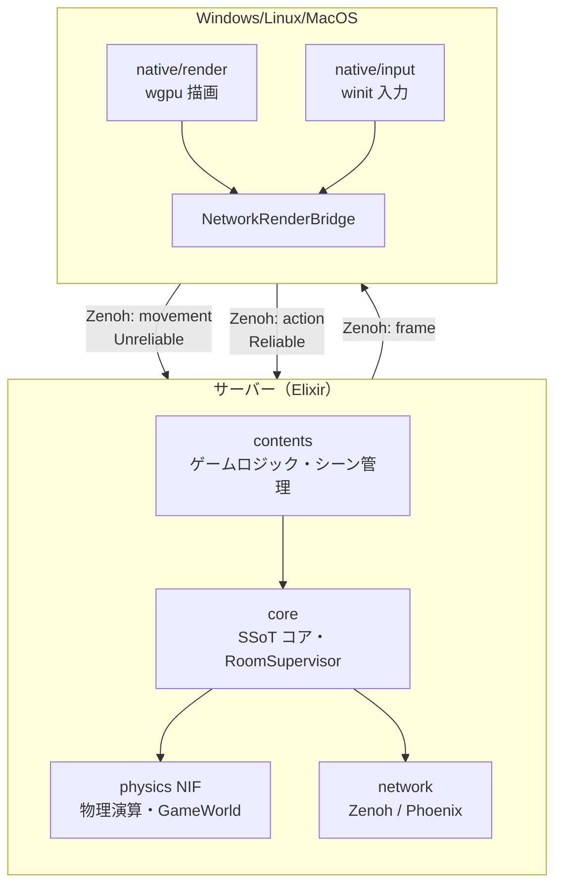

# AlchemyEngine
  

> A platform for worlds. You bring the rules.

3D空間とそこに存在するユーザーを保証する Elixir x Rust 製のエンジンです。

詳細は [ビジョンと設計思想](./docs/vision.md) を参照。

## 🏗️ Architecture

### 全体構成



> クライアント・サーバー分離の詳細と実装手順は [client-server-separation-procedure.md](./docs/plan/client-server-separation-procedure.md) を参照。

## ハイライト

- **Elixir as SSoT**
> 状態とロジックはすべて Elixir 側で管理します。クライアント用のコードをそのままヘッドレスのマルチプレイサーバーとして転用可能です。1000人規模のプレイヤーが交差する大規模ネットワークも Elixir の並行処理能力で捌きます。
- **Rust ECS for Physics & Rendering & Audio**
> Elixir から同期された状態をもとに、Rust の ECS が 60Hz 固定の物理演算・描画・オーディオ処理を行います。SoA（Structure of Arrays）と SIMD による CPU キャッシュ最適化で、高フレームレートを維持します。
- **Zero NIF Serialization Overhead**
> Elixir <--> Rustの通信は軽量な識別子のみ。バイナリのシリアライズコストを設計レベルで排除しています。
- **SuperCollider-inspired Audio**
> Elixir が「指揮者」として非同期コマンドを発行し、Rust の専用スレッドが DSP 処理を行います。複雑な空間オーディオと動的ルーティングを低遅延で実現します。

詳細は [プラス点 詳細一覧](./docs/evaluation/specific-strengths.md) を参照。

## 🚀 Getting Started

### Prerequisites

開発環境に以下のツールがインストールされている必要があります。

- [Elixir](https://elixir-lang.org/install.html) **1.19 / OTP 28**
- [Rust](https://www.rust-lang.org/tools/install) (stable)

### Setup & Run

1. リポジトリをクローンします。
  ```bash
   git clone git@github.com:FRICK-ELDY/alchemy-engine.git
   cd alchemy-engine
  ```
2. Elixir の依存関係を取得し、Rust のネイティブコードをコンパイルします。
  ```bash
   mix deps.get
   mix compile
  ```
3. 起動方法を選択します（下記参照）。

### 起動方法

#### ローカル起動（組み込み描画ウィンドウ）

サーバー内蔵の描画ウィンドウでゲームを表示します。

```bash
mix run --no-halt
```

#### リモートクライアント起動（desktop_client）

Zenoh 経由でサーバーとクライアントを分離して起動します。別マシンからの接続や、ウィンドウを分けたい場合に使用します。

**前提**: [zenohd](https://github.com/eclipse-zenoh/zenohd) をインストール済み（`cargo install eclipse-zenoh`）

1. ターミナル 1: zenohd を起動
   ```bash
   zenohd
   ```

2. ターミナル 2: サーバーを起動
   ```bash
   mix run --no-halt
   ```

3. ターミナル 3: デスクトップクライアントを起動
   ```bash
   # Windows
   bin\windows_client.bat

   # Linux / macOS
   cargo run -p desktop_client -- --connect tcp/127.0.0.1:7447 --room main
   ```

接続先やルームを変更する場合:
- `bin\windows_client.bat tcp/127.0.0.1:7447 main`
- `config/config.exs` の `zenoh_connect` でサーバー側の接続先を指定

### 分散クラスタ起動（複数ノード）

複数ノードでクラスタを形成する場合は、`config/runtime.exs` に libcluster の topologies を設定したうえで、別ターミナルで各ノードを起動します。

```bash
# ターミナル 1
elixir --name a@127.0.0.1 -S mix run

# ターミナル 2
elixir --name b@127.0.0.1 -S mix run
```

`a` と `b` はノード名（ノードを識別するための名前）で、`127.0.0.1` はホストです。libcluster の設定例は `config/config.exs` の libcluster コメントを参照してください。

---

## ✅ 品質保証

| 対象 | ツール | 保証内容 |
|:---|:---|:---|
| Rust コードスタイル | `cargo fmt` | フォーマット統一 |
| Rust 静的解析 | `cargo clippy -D warnings` | 警告ゼロ |
| Rust ユニットテスト | `cargo test` | 物理演算ロジックの正確性 |
| Rust パフォーマンス | `cargo bench`（main のみ） | 前回比 +10% 超の劣化をブロック |
| Elixir コードスタイル | `mix format` | フォーマット統一 |
| Elixir 静的解析 | `mix credo --strict` | コード品質・一貫性 |
| Elixir コンパイル | `mix compile --warnings-as-errors` | 警告ゼロ |
| Elixir 統合テスト | `mix test`（NIF ビルド込み） | Elixir/Rust 結合の動作保証 |

すべての push で GitHub Actions が自動実行されます。詳細は [docs/warranty/ci.md](./docs/warranty/ci.md) を参照。

---

## 🤝 Contributing

（※チーム開発時のガイドラインや、コントリビューションルールの詳細をここに記載します）

---

## Acknowledgments

### Vision Correction Pass（オプション機能）

VR/HMD 向けに、ソフトウェアによる視度補正（逆畳み込み Pre-filtering）を検討しています。本機能は **On/Off 切り替え可能** に設計します。詳細は [docs/paper/vision-correction-pass-tech-spec.md](./docs/paper/vision-correction-pass-tech-spec.md) を参照。

**参考研究**:
- Xu et al., "Software Based Visual Aberration Correction for HMDs," *IEEE VR*, 2018.
- Thibos et al., "Calculation of the geometrical point-spread function from wavefront aberrations," *Ophthalmic & Physiological Optics*, 2019.

### Patent Notice（特許に関する注意）

Vision Correction Pass で用いるアルゴリズム（逆畳み込み、処方箋からの PSF 導出、Wiener フィルタ等）は、第三者の特許の対象となる可能性があります。関連特許の例：US10529059B2（MIT/UCSD）、US20160314564A1（eSight）。本プロジェクトは特許の実施可能性（Freedom-to-Operate）を保証しません。利用前に適切な専門家にご相談ください。

---

## 📄 License

This project is licensed under either of

- [Apache License, Version 2.0](LICENSE-APACHE)
- [MIT License](LICENSE)

at your option.