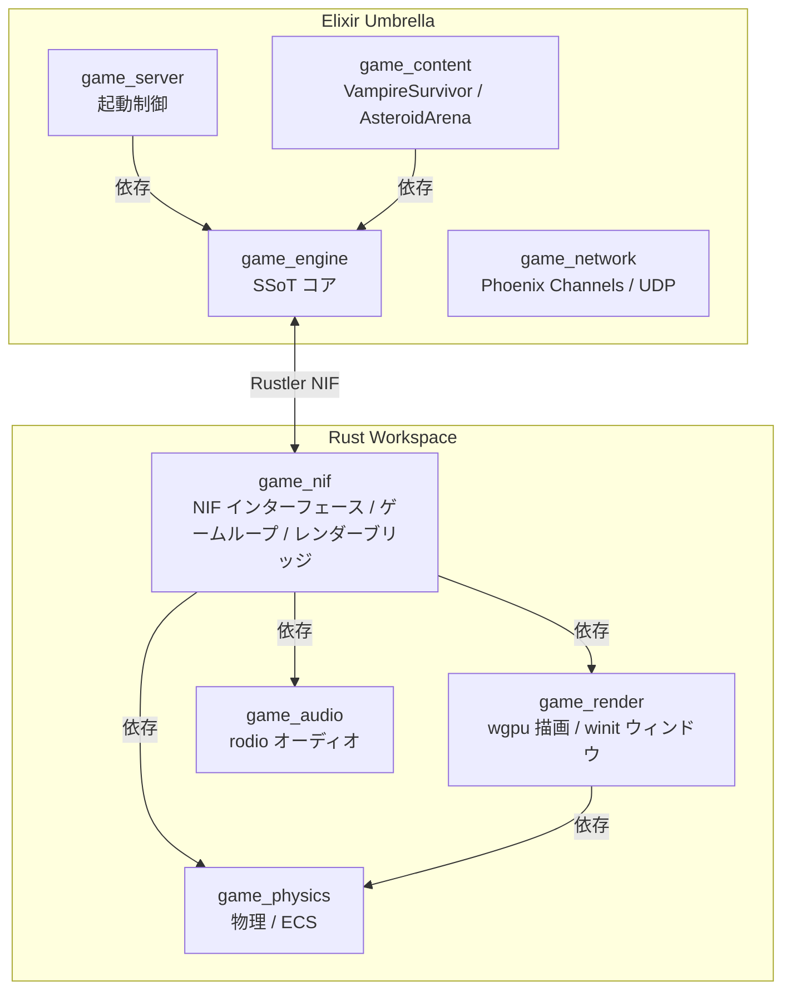
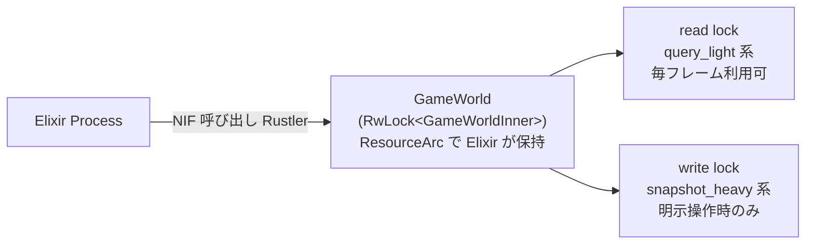
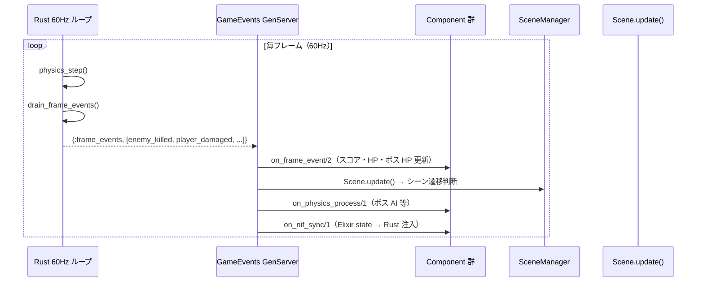
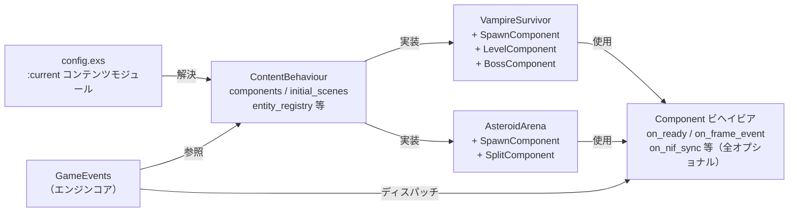

# AlchemyEngine — アーキテクチャ概要

## 設計思想

AlchemyEngine は **Elixir を Single Source of Truth（SSoT）** として、Rust の ECS で物理演算・描画・オーディオを処理するハイブリッドゲームエンジンです。

- **Elixir 側**: ゲームロジックの制御フロー・シーン管理・セーブ/ロード・イベント配信
- **Rust 側**: 60Hz 固定の物理演算・衝突判定・描画・オーディオ

---

## 全体構成



---

## ディレクトリ構造（ソース単位）

```
alchemy-engine/
├── mix.exs                          # Umbrella ルートプロジェクト定義
├── mix.lock                         # Elixir 依存ロックファイル
├── config/
│   └── config.exs                   # :current（コンテンツモジュール）/ :map 設定
│
├── apps/                            # Elixir アプリケーション群
│   ├── game_engine/                 # SSoT コアエンジン
│   │   ├── mix.exs
│   │   └── lib/game_engine/
│   │       ├── game_engine.ex       # 公開 API（エントリポイント）
│   │       ├── nif_bridge.ex        # Rustler NIF ラッパー
│   │       ├── nif_bridge_behaviour.ex  # NifBridge ビヘイビア（テスト用 Mock 対応）
│   │       ├── content_behaviour.ex # ContentBehaviour（コンテンツ定義インターフェース）
│   │       ├── component.ex         # Component ビヘイビア（コンテンツ構成単位）
│   │       ├── config.ex            # :current コンテンツモジュール解決
│   │       ├── scene_behaviour.ex   # シーンコールバック定義
│   │       ├── scene_manager.ex     # シーンスタック管理 GenServer
│   │       ├── game_events.ex       # メインゲームループ GenServer
│   │       ├── game_events/
│   │       │   └── diagnostics.ex   # ログ・FrameCache 更新ヘルパー
│   │       ├── room_supervisor.ex   # DynamicSupervisor
│   │       ├── room_registry.ex     # Registry ラッパー
│   │       ├── event_bus.ex         # フレームイベント配信 GenServer
│   │       ├── input_handler.ex     # キー入力 GenServer
│   │       ├── frame_cache.ex       # フレームスナップショット ETS
│   │       ├── map_loader.ex        # マップ障害物定義
│   │       ├── save_manager.ex      # セーブ/ロード
│   │       ├── stats.ex             # セッション統計 GenServer
│   │       ├── telemetry.ex         # Telemetry Supervisor
│   │       └── stress_monitor.ex    # パフォーマンス監視 GenServer
│   │
│   ├── game_server/                 # 起動プロセス
│   │   ├── mix.exs
│   │   └── lib/game_server/
│   │       ├── game_server.ex
│   │       └── application.ex       # OTP Application / Supervisor ツリー
│   │
│   ├── game_content/                # ゲームコンテンツ
│   │   ├── mix.exs
│   │   └── lib/game_content/
│   │       ├── vampire_survivor.ex        # ContentBehaviour 実装（VampireSurvivor）
│   │       ├── asteroid_arena.ex          # ContentBehaviour 実装（AsteroidArena）
│   │       ├── entity_params.ex           # EXP・スコア・ボスパラメータ（Elixir SSoT）
│   │       ├── vampire_survivor/
│   │       │   ├── spawn_component.ex     # Component: ワールド初期化・エンティティ登録
│   │       │   ├── level_component.ex     # Component: EXP・レベル・スコア管理
│   │       │   ├── boss_component.ex      # Component: ボス HP・AI 制御
│   │       │   ├── spawn_system.ex        # ウェーブスポーン
│   │       │   ├── boss_system.ex         # ボス出現スケジュール
│   │       │   ├── level_system.ex        # 武器選択肢生成
│   │       │   └── scenes/
│   │       │       ├── playing.ex         # プレイ中シーン
│   │       │       ├── level_up.ex        # レベルアップ選択シーン
│   │       │       ├── boss_alert.ex      # ボス出現アラートシーン
│   │       │       └── game_over.ex       # ゲームオーバーシーン
│   │       └── asteroid_arena/
│   │           ├── spawn_component.ex     # Component: ワールド初期化
│   │           ├── split_component.ex     # Component: 小惑星分裂処理
│   │           ├── spawn_system.ex        # スポーン制御
│   │           └── scenes/
│   │               ├── playing.ex
│   │               └── game_over.ex
│   │
│   └── game_network/                # 通信レイヤー
│       ├── mix.exs                  # deps: phoenix ~> 1.8, phoenix_pubsub, plug_cowboy
│       └── lib/game_network/
│           ├── game_network.ex
│           ├── application.ex
│           ├── local.ex             # ローカルマルチルーム管理 GenServer
│           ├── channel.ex           # Phoenix Channels / WebSocket
│           ├── endpoint.ex          # Phoenix Endpoint（ポート 4000）
│           ├── router.ex
│           ├── user_socket.ex
│           └── udp/
│               ├── server.ex        # UDP サーバー（ポート 4001）
│               └── protocol.ex
│
├── native/                          # Rust クレート群
│   ├── Cargo.toml                   # Rust ワークスペース定義
│   ├── Cargo.lock
│   │
│   ├── game_physics/             # 物理演算・ECS（依存: rustc-hash / rayon / log）
│   │   └── src/
│   │       ├── lib.rs
│   │       ├── constants.rs         # 画面定数（スクリーンサイズ等）
│   │       ├── entity_params.rs     # EntityParamTables（NIF で外部注入）
│   │       ├── enemy.rs             # EnemyKind enum
│   │       ├── weapon.rs            # WeaponSlot（クールダウン管理）
│   │       ├── boss.rs              # BossState
│   │       ├── item.rs              # ItemKind / ItemWorld SoA
│   │       ├── util.rs              # ユーティリティ
│   │       ├── physics/
│   │       │   ├── rng.rs           # LCG 乱数（決定論的）
│   │       │   ├── spatial_hash.rs  # FxHashMap ベース空間ハッシュ
│   │       │   ├── separation.rs    # 敵分離アルゴリズム
│   │       │   └── obstacle_resolve.rs # 障害物押し出し
│   │       ├── world/
│   │       │   ├── mod.rs           # world モジュール再エクスポート
│   │       │   ├── game_world.rs    # GameWorld / GameWorldInner
│   │       │   ├── player.rs        # PlayerState
│   │       │   ├── enemy.rs         # EnemyWorld SoA
│   │       │   ├── bullet.rs        # BulletWorld SoA
│   │       │   ├── particle.rs      # ParticleWorld SoA
│   │       │   ├── boss.rs          # BossState
│   │       │   ├── game_loop_control.rs # AtomicBool pause/resume
│   │       │   └── frame_event.rs   # FrameEvent enum
│   │       └── game_logic/
│   │           ├── mod.rs
│   │           ├── physics_step.rs  # 1 フレーム物理ステップ
│   │           ├── chase_ai.rs      # SSE2 SIMD / rayon 並列 AI
│   │           └── systems/
│   │               ├── mod.rs
│   │               ├── weapons.rs   # 武器発射ロジック（FirePattern 対応）
│   │               ├── projectiles.rs # 弾丸移動・衝突・ドロップ
│   │               ├── boss.rs      # ボス物理（AI は Elixir 側）
│   │               ├── effects.rs   # パーティクル更新
│   │               ├── items.rs     # アイテム収集
│   │               ├── collision.rs # 敵 vs 障害物押し出し
│   │               └── spawn.rs     # スポーン位置生成
│   │
│   ├── game_nif/                    # NIF 通信インターフェース・ゲームループ
│   │   └── src/
│   │       ├── lib.rs               # Rustler エントリポイント・アトム定義
│   │       ├── nif/
│   │       │   ├── mod.rs
│   │       │   ├── load.rs          # パニックフック・リソース登録
│   │       │   ├── world_nif.rs     # ワールド生成・入力・スポーン・パラメータ注入
│   │       │   ├── action_nif.rs    # 武器スロット・ボス操作・HUD 状態注入
│   │       │   ├── read_nif.rs      # 状態読み取り（軽量クエリ）
│   │       │   ├── game_loop_nif.rs # ゲームループ制御
│   │       │   ├── push_tick_nif.rs # Elixir プッシュ型同期
│   │       │   ├── render_nif.rs    # レンダースレッド起動
│   │       │   ├── save_nif.rs      # セーブ/ロードスナップショット
│   │       │   ├── events.rs        # FrameEvent → Elixir アトム変換
│   │       │   └── util.rs          # 共通ユーティリティ
│   │       ├── render_bridge.rs     # RenderBridge 実装
│   │       ├── render_snapshot.rs   # RenderFrame 構築・補間
│   │       └── lock_metrics.rs      # RwLock 待機時間メトリクス
│   │
│   ├── game_audio/                  # rodio オーディオ管理
│   │   └── src/
│   │       ├── lib.rs
│   │       ├── audio.rs             # AudioManager・コマンドループ
│   │       └── asset/mod.rs         # アセット管理
│   │
│   └── game_render/                 # wgpu 描画パイプライン
│       └── src/
│           ├── lib.rs               # 公開型（RenderFrame / HudData）
│           ├── window.rs            # winit ウィンドウ管理・イベントループ
│           ├── headless.rs          # ヘッドレスモード（CI / テスト用）
│           └── renderer/
│               ├── mod.rs           # Renderer 構造体（wgpu 初期化・描画）
│               └── ui.rs            # egui HUD
│
├── assets/                          # スプライト・音声アセット
└── saves/                           # セーブデータ
    ├── session.dat                  # セッションデータ（Erlang term binary）
    └── high_scores.dat              # ハイスコア上位 10 件
```

---

## レイヤー間の責務分担

| レイヤー | 責務 | 技術 |
|:---|:---|:---|
| `game_server` | OTP Application 起動・Supervisor ツリー構築 | Elixir / OTP |
| `game_engine` | ゲームループ制御・シーン管理・イベント配信・セーブ・ContentBehaviour / Component インターフェース定義 | Elixir GenServer / ETS |
| `game_content` | ContentBehaviour 実装（VampireSurvivor / AsteroidArena）・Component 群・エンティティパラメータ | Elixir |
| `game_network` | Phoenix Channels（WebSocket）・UDP トランスポート・ローカルマルチルーム管理 | Elixir / Phoenix |
| `game_nif` | Elixir-Rust 間 NIF ブリッジ・ゲームループ・レンダーブリッジ | Rust / Rustler |
| `game_physics` | 物理演算・空間ハッシュ・ECS・外部注入パラメータテーブル | Rust |
| `game_render` | GPU 描画パイプライン・HUD・winit ウィンドウ管理・ヘッドレスモード | Rust / wgpu / egui / winit |
| `game_audio` | オーディオ管理・アセット読み込み | Rust / rodio |

---

## 主要な設計パターン

### 1. Rustler NIF による状態共有



### 2. SoA（Structure of Arrays）によるキャッシュ効率化

```rust
EnemyWorld {
    positions_x: Vec<f32>,   // 全敵の X 座標
    positions_y: Vec<f32>,   // 全敵の Y 座標
    velocities:  Vec<[f32;2]>,
    hp:          Vec<f32>,
    alive:       Vec<bool>,
    free_list:   Vec<usize>, // O(1) スポーン/キル
}
```

### 3. イベント駆動ゲームループ



### 4. ContentBehaviour + Component による拡張設計



---

## 関連ドキュメント

- [**ビジョンと設計思想**](./vision.md) ← エンジン・ワールド・ルール・ゲームの定義
- [Elixir レイヤー詳細](./elixir-layer.md)
- [Rust レイヤー詳細](./rust-layer.md)
- [データフロー・通信](./data-flow.md)
- [ゲームコンテンツ詳細](./game-content.md)
- [ビジュアルエディタ アーキテクチャ](./visual-editor-architecture.md)
- [改善計画](./improvement-plan.md) ← 既知の弱点と改善方針
