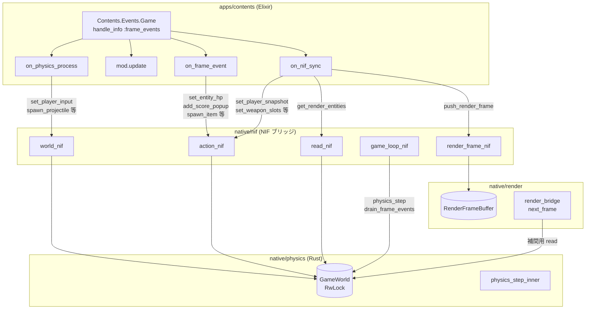
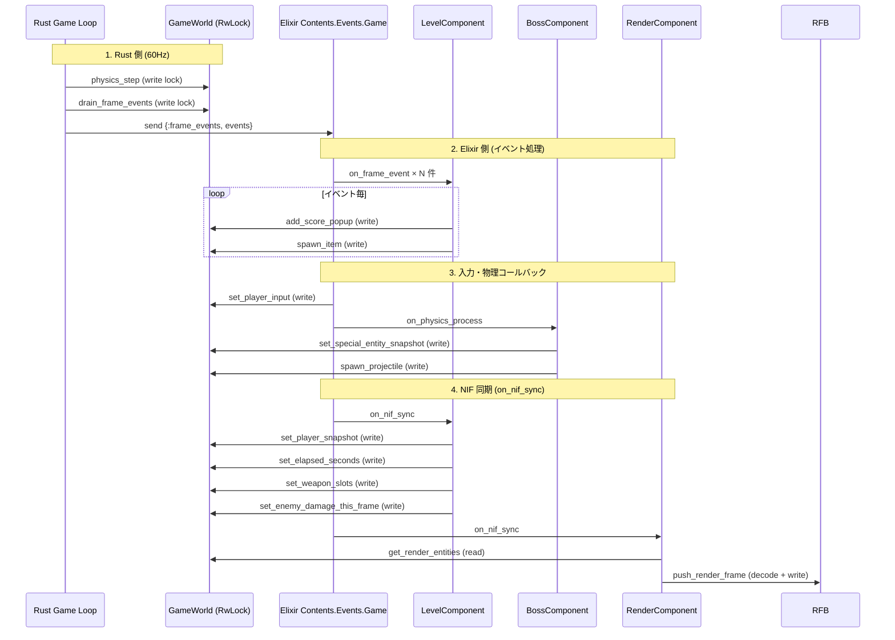
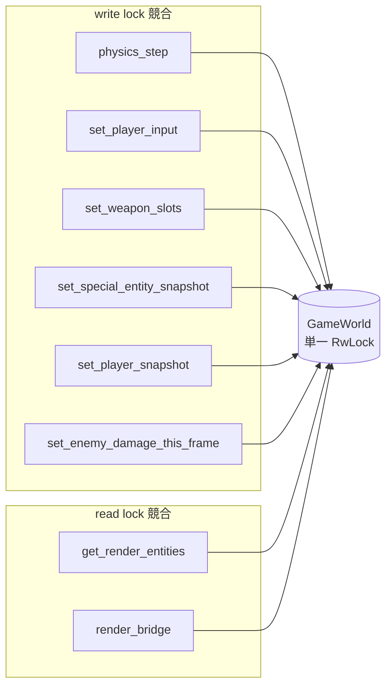
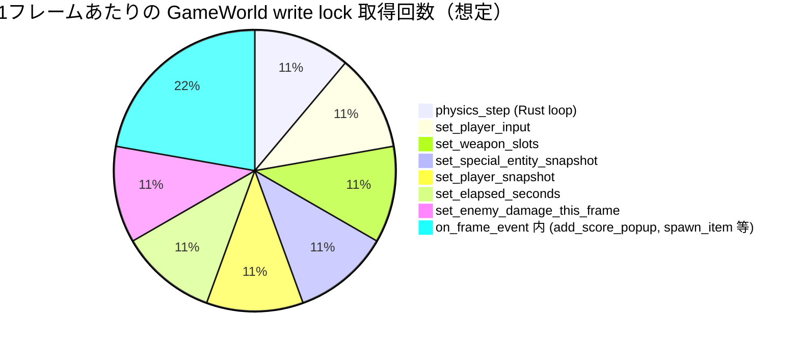
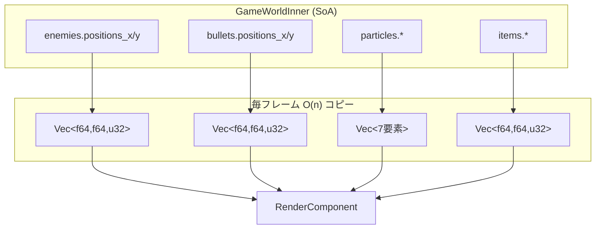
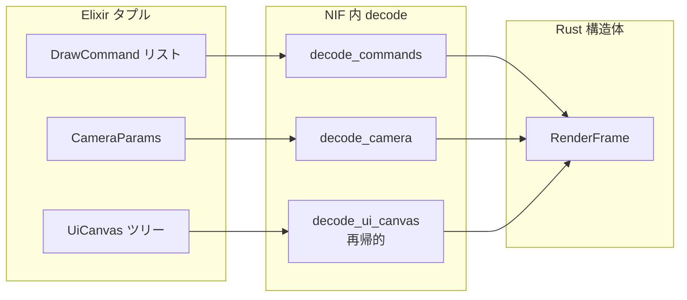
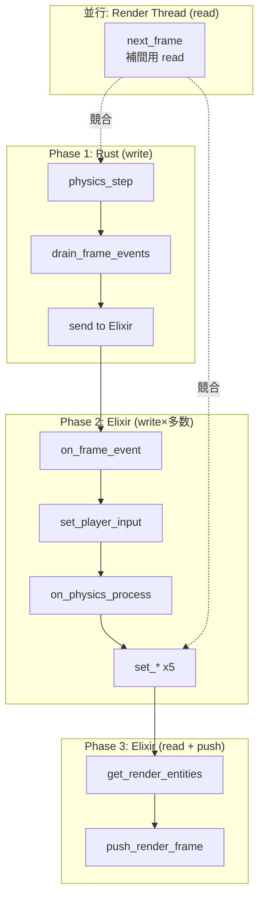

# apps/contents → native/physics データフローと技術的ボトルネック

> **アーカイブ（2026-04）**: ゲーム用 Rust NIF（`GameWorld`・`physics_step`・60Hz ループ）は撤去済み。以下は **旧アーキテクチャ** のボトルネック分析記録。現行は [overview.md](overview.md) を参照。

> 本ドキュメントは `apps/contents` から `native/physics` までのデータの流れを可視化し、
> 当時技術的にボトルネックになり得る箇所を分析した。

---

## 1. 全体データフロー概要

---

## 2. 1 フレームあたりの NIF 呼び出しシーケンス

Rust ゲームループ駆動のフレーム処理において、典型的な（旧）VampireSurvivor コンテンツでの NIF 呼び出し順序。

---

## 3. ボトルネック一覧と重症度

| # | ボトルネック | 重症度 | 影響範囲 |
|:--:|:---|:---:|:---|
| 1 | **GameWorld 単一 RwLock 競合** | 高 | 全 NIF・レンダー |
| 2 | **毎フレーム複数 write NIF 呼び出し** | 高 | Elixir ↔ Rust 境界 |
| 3 | **get_render_entities の O(n) コピー** | 中 | 敵・弾・パーティクル増加時 |
| 4 | **push_render_frame の decode オーバーヘッド** | 中 | UI 複雑化・DrawCommand 増加時 |
| 5 | **Rust ループと Elixir のタイミング競合** | 中 | ロック待ち・スケジューリング |
| 6 | **NIF 実行による BEAM ブロック** | 低〜中 | DirtyCpu 指定の有無に依存 |

---

## 4. ボトルネック詳細図

### 4.1 GameWorld RwLock 競合

**問題点:**
- 単一の `RwLock<GameWorldInner>` を全 NIF・レンダースレッドが共有
- write 要求が並ぶと、各 NIF 呼び出しごとに lock 取得・解放が発生
- `lock_metrics.rs` で 300μs(read) / 500μs(write) 超えで warn 出力

---

### 4.2 毎フレーム write NIF 呼び出し数（旧 VampireSurvivor 想定）

**最小 7〜9 回/フレーム** の write lock 取得が発生。バッチ化設計がないため、lock の取得・解放オーバーヘッドが積み重なる。

---

### 4.3 get_render_entities のデータ量

**問題点:**
- 敵 100体・弾 200発・パーティクル 500 の場合、毎フレーム数千要素の `Vec` を新規アロケーション
- read lock 保持時間が長くなり、Rust ループの physics_step 開始をブロック

---

### 4.4 push_render_frame の decode パイプライン

**問題点:**
- `decode_ui_canvas` は UiNode の再帰的デコード。UI が深いとコスト増
- DrawCommand が敵・弾・パーティクル分だけ増えると、タプル decode の繰り返しが重い

---

## 5. タイムライン上の競合

**競合の要点:**
- Rust ループが write 中は Elixir の NIF が待機
- Elixir が get_render_entities で read 中は、Rust の次の physics_step が write で待機
- レンダースレッドは next_frame で read を要求。write が長いと補間データ取得が遅延

---

## 6. 改善提案の方向性

| ボトルネック | 改善案 |
|:---|:---|
| 単一 RwLock | 注入データ用バッファを分離し、physics 計算と並列化可能な構造を検討。または lock-free キューでバッチ転送 |
| 複数 write NIF | `set_frame_injection(world, snapshot)` のような **1 回の NIF で全注入データをまとめて渡す** バッチ API を検討 |
| get_render_entities | 差分更新・オブジェクトプール・描画用ダブルバッファなど、コピー削減の設計を検討 |
| push_render_frame decode | UiCanvas の差分更新、またはバイナリ形式（protobuf）での転送を検討 |
| タイミング競合 | Rust ループと Elixir の処理順序を明確化。または「Rust が dt 進める → Elixir が NIF で注入」のフェーズ分離を固定 |

---

## 7. 採用しない方針（案 B）

**案 B: Rust 側で SoA から DrawCommand を生成** は **採用しない**。

理由: Rust に描画判断（メッシュ選択・UV・スプライト配置等）を持たせることになり、
「Elixir が定義、Rust が実行」の原則に反する。現行の設計（Elixir が DrawCommand を組み立て、
Rust が decode して描画する）を維持する。

参照: [contents-defines-rust-executes.md](../plan/backlog/contents-defines-rust-executes.md) セクション 5

---

## 8. 関連ドキュメント

- [Rust: nif](rust/nif.md)
- [Rust: physics](rust/nif/physics.md)
- [Elixir: core](elixir/core.md)
- [Elixir: contents](elixir/contents.md)
- [draw-command-spec.md](draw-command-spec.md) — DrawCommand タグ・フィールド仕様（SSoT）
