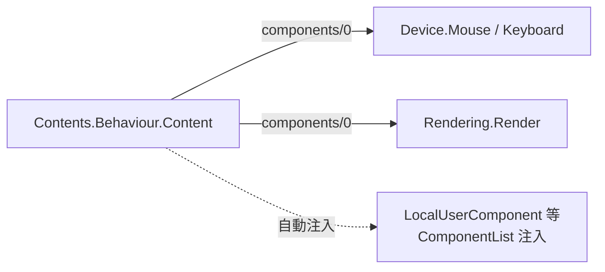
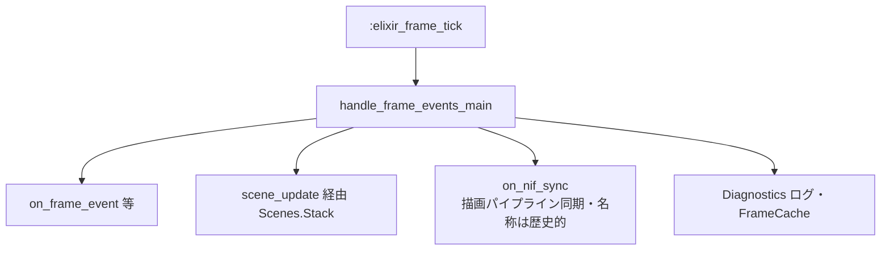

# Elixir: contents — ゲームコンテンツ層

> **2026-04 更新**: 第一級コンテンツは **3 本**（`CanvasTest` / `BulletHell3D` / `FormulaTest`）。メインループは **Elixir タイマー駆動**（Rust 60Hz ゲーム NIF なし）。

## 概要

`contents` は上記コンテンツの実装と、シーン管理・`Contents.Events.Game` によるディスパッチを担当します。エンジン本体（[core](./core.md)）はゲームロジックを知らず、`Contents.Behaviour.Content` に従ってコンポーネントへ委譲します。

描画は **Zenoh 専用**: Render コンポーネントが DrawCommand・Camera・UiCanvas を組み立て、`Content.FrameEncoder.encode_frame/5` で protobuf にし、`FrameBroadcaster.put(room_id, frame_binary)` で publish します。

使用するコンテンツは `config/config.exs` の `config :server, :current, ...` で指定します。`Application.get_env` 未設定時のフォールバックは `Core.Config` の `@default_content`（`Content.BulletHell3D`）。

---

## コンテンツとコンポーネント（現行パターン）

各コンテンツは `Contents.Behaviour.Content` と、`Core.Component` を実装するモジュール群で構成されます。**Spawner / PhysicsEntity は削除済み**のため、典型例は次のように **Device + Render** が中心です。



`BulletHell3D` 例: `Device.Mouse`, `Device.Keyboard`, `Rendering.Render`。

---

## `Contents.SceneBehaviour` — シーンコールバック

`apps/contents/lib/contents/scene_behaviour.ex` に定義。実装は `Contents.Behaviour.Content` の `scene_init/2`・`scene_update/3`・`scene_render_type/1` 経由。

```elixir
@callback init(init_arg)        :: {:ok, state}
@callback update(context, state) :: {:continue, new_state}
                                  | {:transition, transition, new_state}
@callback render_type()         :: atom()
```

**トランジション種別:**

| 種別 | 動作 |
|:---|:---|
| `:pop` | 現在のシーンをスタックから取り出す |
| `{:push, module, init_arg}` | 新しいシーンを積む |
| `{:replace, module, init_arg}` | 現在のシーンを置き換える |

---

## `Contents.Scenes.Stack`

シーンスタック GenServer。`apps/contents/lib/scenes/stack.ex`。`Server.Application` で `{Contents.Scenes.Stack, [content_module: content]}` として起動。

| 関数 | 説明 |
|:---|:---|
| `push_scene/2` | シーンを積む |
| `pop_scene/0` | 最上位を取り出す |
| `replace_scene/2` | 最上位を置換 |
| `update_current/1` | 現在シーン状態を更新 |
| `update_by_scene_type/3` | 種別で状態更新 |
| `get_scene_state/2` | 種別で状態取得 |

---

## `Contents.Events.Game` — メインゲームループ

`:main` ルームでは **約 16ms の `Process.send_after`（`:elixir_frame_tick`）** で `handle_frame_events_main` を回し、コンポーネントとシーンを更新します。`world_ref` / `control_ref` は **スタブ**（`:stub`）。

**後方互換**: `{:frame_events, events}` を受け取れるが、**Rust からの 60Hz 供給はない**。



**GenServer state（概念）**: `room_id`, `world_ref`, `control_ref`, `last_tick`, `frame_count`, `start_ms` 等（`world_ref` は実体を持たないスタブ）。

VR 入力は **`handle_info`**（`:head_pose` / `:controller_pose` / `:controller_button` 等）。**NIF 非経由**（Zenoh 等でメッセージ化）。

---

## コンテンツ実装（第一級・現行）

| コンテンツ | 説明 |
|:---|:---|
| `Content.CanvasTest` | Canvas / ワールド空間 UI デバッグ |
| `Content.BulletHell3D` | 3D 弾幕避け（Elixir 側状態・既定フォールバック） |
| `Content.FormulaTest` | Formula / Nodes 検証（`config/formula_test.exs` で切替可） |

**削除済み**（仕様書のみ残す場合は別ファイル）: `VampireSurvivor`, `AsteroidArena`, `SimpleBox3D`, `RollingBall` — 詳細は Git 履歴または [vampire_survivor.md](./contents/vampire_survivor.md) 等（**アーカイブ**）。

**補助モジュール**

| モジュール | 説明 |
|:---|:---|
| `Contents.ComponentList` | LocalUser・Telemetry 等の解決・注入 |
| `Contents.FrameBroadcaster` | Zenoh 向けフレーム配送 |
| `Content.FrameEncoder` | RenderFrame protobuf エンコード |

---

## 関連ドキュメント

- [アーキテクチャ概要](../overview.md)
- [server](./server.md) / [core](./core.md) / [network](./network.md)
