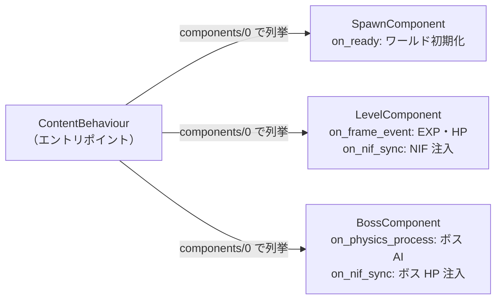
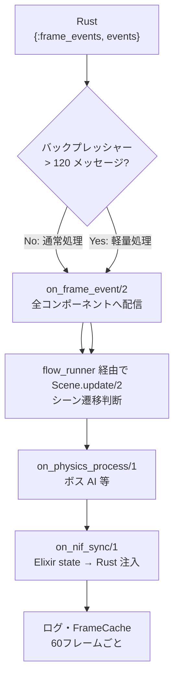
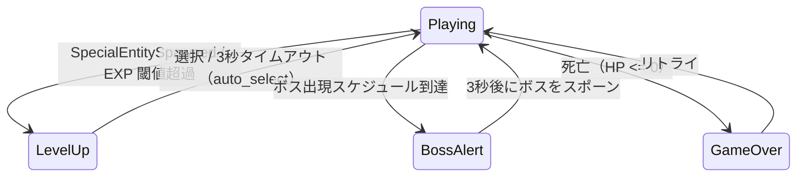

# Elixir: contents — ゲームコンテンツ層

## 概要

`contents` はゲームコンテンツ（VampireSurvivor / AsteroidArena）の実装と、シーン管理・メインゲームループのディスパッチを担当します。エンジン本体（[core](./core.md)）はゲームロジックを知らず、ContentBehaviour で定義されたインターフェースに従ってコンポーネントへ委譲します。

使用するコンテンツは `config.exs` で指定します。

```elixir
# Content.VampireSurvivor または Content.AsteroidArena
config :server, :current, Content.VampireSurvivor
```

---

## コンテンツ設計パターン

各コンテンツは `ContentBehaviour` を実装するエントリポイントモジュールと、`Component` ビヘイビアを実装するコンポーネント群で構成されます。



> VampireSurvivor は Spawn / Level / Boss の 3 コンポーネント。AsteroidArena は Spawn / Split の 2 コンポーネント。

---

## `Contents.SceneBehaviour` — シーンコールバック定義

各シーンが実装すべきコールバック。`apps/contents/lib/contents/scene_behaviour.ex` に定義。

```elixir
@callback init(init_arg)        :: {:ok, state}
@callback update(context, state) :: {:continue, new_state}
                                  | {:transition, transition, new_state}
@callback render_type()         :: atom()
```

**トランジション種別:**

| 種別 | 動作 |
|:---|:---|
| `:pop` | 現在のシーンをスタックから取り出す |
| `{:push, module, init_arg}` | 新しいシーンをスタックに積む |
| `{:replace, module, init_arg}` | 現在のシーンを置き換える |

---

## `Contents.SceneStack` — シーンスタック管理 GenServer

シーンスタックを管理する GenServer。`apps/contents/lib/contents/scene_stack.ex` に定義。起動時に `content_module.initial_scenes()` からスタックを初期化します。`Server.Application` で `{Contents.SceneStack, [content_module: content]}` として起動。

| 関数 | 説明 |
|:---|:---|
| `push_scene/2` | シーンをスタックに積む |
| `pop_scene/0` | 最上位シーンを取り出す |
| `replace_scene/2` | 最上位シーンを置き換える |
| `update_current/1` | 現在シーンの状態を更新 |
| `update_by_module/2` | スタック内の特定シーンの状態を更新 |
| `get_scene_state/1` | スタック内の特定シーンの状態を取得 |

---

## `Contents.GameEvents` — メインゲームループ GenServer

Rust の 60Hz ゲームループから `{:frame_events, events}` を受信し、コンポーネントへ委譲する。contents 層に配置され、エンジン自体はゲームロジックを知らず、ディスパッチのみを担う。

**GenServer state:**

```elixir
%{
  room_id: atom(),
  world_ref: reference(),
  control_ref: reference(),
  last_tick: integer(),
  frame_count: integer(),
  start_ms: integer(),
  render_started: boolean()
}
```

**フレーム処理フロー（毎フレーム）:**



**シーン遷移パターン:**



---

## コンテンツ実装

| コンテンツ | 説明 | 仕様 |
|:---|:---|:---|
| `Content.VampireSurvivor` | Spawn / Level / Boss コンポーネント、レベルアップ・ボスアラート・ゲームオーバーシーン | [vampire_survivor.md](./contents/vampire_survivor.md) |
| `Content.AsteroidArena` | Spawn / Split コンポーネント、playing / game_over シーンのみ | [asteroid_arena.md](./contents/asteroid_arena.md) |

---

## 関連ドキュメント

- [アーキテクチャ概要](../overview.md)
- [server](./server.md) / [core](./core.md) / [network](./network.md)
