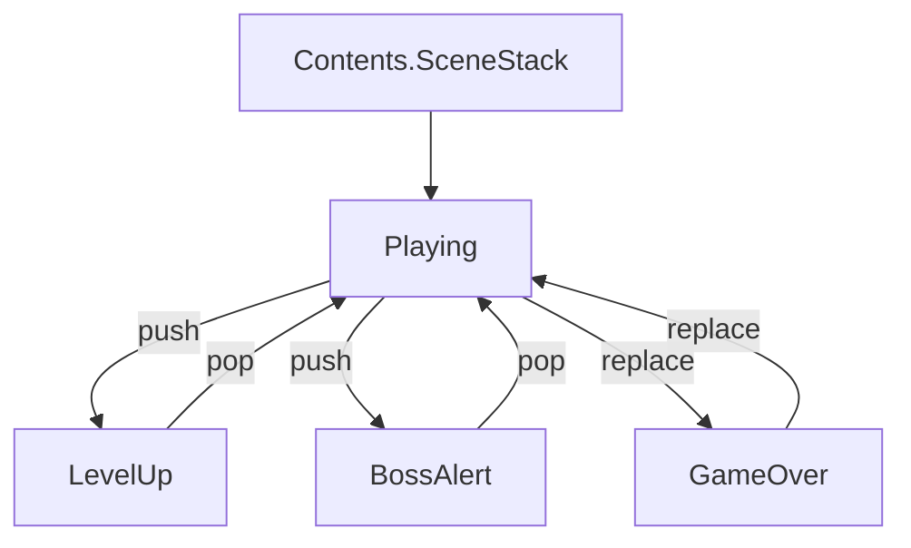

# VampireSurvivor コンテンツ仕様

## 概要

武器・ボス・レベルアップを備えた Vampire Survivor 風コンテンツ。`Content.VampireSurvivor` モジュール。

---

## コンポーネント構成

```elixir
def components do
  [
    Content.VampireSurvivor.SpawnComponent,   # ワールド初期化・エンティティ登録
    Content.VampireSurvivor.LevelComponent,   # EXP・レベル・スコア・HP・武器選択
    Content.VampireSurvivor.BossComponent     # ボス HP・AI 制御
  ]
end
```

---

## SpawnComponent

旧 `VampireSurvivorWorld` の責務を引き継ぐコンポーネント。

**`on_ready/1`:**
- `set_world_size` NIF でマップサイズ（4096×4096）を注入
- `set_entity_params` NIF でエンティティパラメータを注入

**`entity_registry/0`:**

```elixir
%{
  enemies: %{slime: 0, bat: 1, golem: 2, skeleton: 3, ghost: 4},
  weapons: %{magic_wand: 0, axe: 1, cross: 2, whip: 3, fireball: 4, lightning: 5, garlic: 6},
  bosses:  %{slime_king: 0, bat_lord: 1, stone_golem: 2}
}
```

---

## エンティティパラメータ（Elixir → Rust 注入）

### 敵パラメータ（`enemy_params/0`）

| ID | 種別 | HP | 速度 | 半径 | ダメージ/秒 | 障害物すり抜け |
|:---|:---|:---|:---|:---|:---|:---|
| 0 | Slime | 30 | 80 | 20 | 20 | ✗ |
| 1 | Bat | 15 | 160 | 12 | 10 | ✗ |
| 2 | Golem | 150 | 40 | 32 | 40 | ✗ |
| 3 | Skeleton | 60 | 60 | 22 | 15 | ✗ |
| 4 | Ghost | 40 | 100 | 16 | 12 | ✅（壁すり抜け） |

### 武器パラメータ（`weapon_params/0`）

| ID | 種別 | ダメージ | クールダウン | FirePattern |
|:---|:---|:---|:---|:---|
| 0 | magic_wand | 10 | 1.0s | Aimed（扇状） |
| 1 | axe | 25 | 1.5s | FixedUp（上方向） |
| 2 | cross | 15 | 2.0s | Radial（全方向） |
| 3 | whip | 30 | 1.0s | Whip（扇形判定） |
| 4 | fireball | 20 | 1.0s | Piercing（貫通） |
| 5 | lightning | 15 | 1.0s | Chain（連鎖） |
| 6 | garlic | 1 | 0.2s | Aura（オーラ） |

### ボスパラメータ（`boss_params/0`）

| ID | 種別 | HP | 速度 | 半径 | 特殊行動インターバル |
|:---|:---|:---|:---|:---|:---|
| 0 | Slime King | 1,000 | 60 | 48 | 5.0s |
| 1 | Bat Lord | 2,000 | 200 | 48 | 4.0s |
| 2 | Stone Golem | 5,000 | 30 | 64 | 6.0s |

---

## LevelComponent

EXP・レベル・スコア・プレイヤー HP・アイテムドロップ・武器選択 UI を担うコンポーネント。

**`on_frame_event/2`:**
- `{:enemy_killed, enemy_kind, x, y, _}` → EXP/スコア加算・アイテムドロップ・スコアポップアップ
- `{:player_damaged, damage_x1000, _, _, _}` → HP 減算（damage は 1000 倍整数で受け取り）

**`on_nif_sync/1`（差分検知して注入）:**
- `set_hud_state` — スコア・キル数
- `set_player_hp` — プレイヤー HP
- `set_elapsed_seconds` — 経過時間
- `set_hud_level_state` — レベル・EXP・武器選択肢（描画専用）
- `set_weapon_slots` — 武器スロット全体（I-2: 毎フレーム差分注入）

**`on_event/2`:**
- `{:ui_action, weapon_name}` — 武器選択 UI アクション処理
- `{:ui_action, "__skip__"}` — レベルアップスキップ
- `{:ui_action, "__auto_pop__", scene_state}` — 3秒タイムアウト自動選択

---

## BossComponent

ボス HP・AI 制御を担うコンポーネント。

**`on_frame_event/2`:**
- `{:special_entity_spawned, entity_kind, _, _, _}` → ボス HP を `EntityParams` から初期化
- `{:special_entity_damaged, damage, _, _, _}` → ボス HP 減算
- `{:special_entity_defeated, x, y, _}` → ボス撃破処理（Gem 散布・EXP 加算）

**`on_physics_process/1`:**
- `get_boss_state` NIF でボス状態取得
- `update_boss_ai` でボス AI 制御（`set_boss_velocity` / `set_boss_phase_timer` / `fire_boss_projectile` NIF）

**`on_nif_sync/1`:**
- `set_boss_hp` — ボス HP を差分検知して注入

---

## EntityParams（Elixir 側パラメータテーブル）

Elixir 側が EXP・スコア・ボスパラメータの SSoT を持つモジュール。

```elixir
defmodule Content.EntityParams do
  @enemy_exp_rewards %{0 => 5, 1 => 3, 2 => 20, 3 => 10, 4 => 8}
  @boss_exp_rewards %{0 => 200, 1 => 400, 2 => 800}
  @score_per_exp 2
  @boss_params %{
    0 => %{speed: 60.0, special_interval: 5.0},
    1 => %{speed: 200.0, special_interval: 4.0, dash_speed: 500.0, dash_duration_ms: 600},
    2 => %{speed: 30.0, special_interval: 6.0, projectile_speed: 200.0, ...},
  }
end
```

---

## シーン構成



- **Playing** — ベースシーン・常駐
- **LevelUp** — push: EXP 閾値超過時
- **BossAlert** — push: ボス出現スケジュール到達時
- **GameOver** — replace: 死亡時

### Playing シーン state（Elixir SSoT）

| キー | 説明 |
|:---|:---|
| `level`, `exp`, `exp_to_next` | レベル・EXP |
| `weapon_levels`, `level_up_pending`, `weapon_choices` | 武器 |
| `boss_kind_id`, `boss_hp`, `boss_max_hp`, `spawned_bosses` | ボス |
| `score`, `kill_count` | スコア・撃破数 |
| `player_hp`, `player_max_hp` | プレイヤー HP |
| `elapsed_ms`, `last_spawn_ms` | 経過・スポーン管理 |

### LevelUp シーン

武器選択肢を表示。`auto_select: true` で 3 秒タイムアウト自動選択。Esc / 1 / 2 / 3 キーで選択。選択後 `:pop` で Playing へ。

### BossAlert シーン

3 秒間アナウンス後、`spawn_boss` NIF でボススポーン → `:pop`。

### GameOver シーン

スコア・生存時間・撃破数を表示。リトライで Playing へ戻る。

---

## SpawnSystem — ウェーブスポーン

経過時間に応じてウェーブ定義から敵をスポーン。

| フェーズ | 開始時間 | スポーン間隔 | 1 回の数 | 敵種別 |
|:---|:---|:---|:---|:---|
| 1 | 0 秒 | 3,000ms | 3 体 | Slime |
| 2 | 30 秒 | 2,500ms | 5 体 | Slime + Bat |
| 3 | 60 秒 | 2,000ms | 7 体 | Bat + Golem |
| 4 | 120 秒 | 1,500ms | 10 体 | 全種混合 |
| 5 | 180 秒 | 1,000ms | 15 体 | 全種混合（高密度） |

- **エリート敵**: 45 秒以降、30% の確率で混入。HP × 3（`spawn_elite_enemy/4`）。
- **上限**: 最大同時存在数 10,000 体

---

## BossSystem — ボス出現スケジュール

| 時間 | ボス | HP |
|:---|:---|:---|
| 180秒（3分） | Slime King | 1,000 |
| 360秒（6分） | Bat Lord | 2,000 |
| 540秒（9分） | Stone Golem | 5,000 |

### ボスAI（BossComponent.on_physics_process/1）

| ボス | 通常移動 | 特殊行動 |
|:---|:---|:---|
| SlimeKing | プレイヤー追跡（60） | 周囲8方向にスライムスポーン |
| BatLord | プレイヤー追跡（200） | ダッシュ攻撃（500、600ms 無敵） |
| StoneGolem | プレイヤー追跡（30） | 4方向に岩弾発射 |

---

## LevelSystem — 武器選択肢生成

1. 未所持武器を優先
2. 低レベル順でソート
3. 最大 3 択を返す
4. 全武器が Lv8 なら空リスト

- **最大スロット数**: 8
- **各武器最大レベル**: 8

---

## EXP・レベルアップ曲線

```
Level → 必要累積 EXP
  1  →    0    2  →   10    3  →   25    4  →   45    5  →   70
  6  →  100    7  →  135    8  →  175    9  →  220   10  →  270
  ...
```

---

## アイテムシステム

| アイテム | 効果 |
|:---|:---|
| Gem | EXP 取得（敵撃破時にドロップ） |
| Potion | HP +20 回復 |
| Magnet | 画面内全 Gem を自動吸引 |

**ドロップ確率:**

| アイテム | 確率 | 効果 |
|:---|:---|:---|
| Magnet | 2% | 画面内全 Gem を自動吸引 |
| Potion | 5%（累積 7%） | HP +20 回復 |
| Gem | 残り 93% | EXP 取得（敵種別の報酬値） |

**自動収集範囲**: プレイヤー周囲 50px（Magnet 発動時は全画面）

---

## 関連ドキュメント

- [contents 概要](../contents.md)
- [contents 概要](../contents.md)
