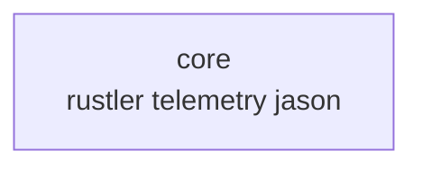

# Elixir: core — SSoT コアエンジン

> **2026-04 更新**: `Core` ファサードは **モジュールドキュメントのみ**（セーブ・ゲーム用 NIF API は撤去）。実装モジュールは `core/` 配下に残存。

## 概要

`core` はルーム・イベント・Formula・設定・Telemetry 等を提供します。シーンとメインループの実体は [contents](./contents.md) の `Contents.Scenes.Stack` / `Contents.Events.Game` です。

ゲーム用 **Rust NIF（GameWorld 等）は廃止**。`Core.NifBridge` は **`run_formula_bytecode/3` のみ**（呼び出しは **`Core.Formula`** 経由を正とする）。

**ローカル永続化**（セッションセーブ・ハイスコアファイル）は **未実装**（旧 `Core.SaveManager` 削除済み）。

---

## `core.ex` — 公開 API

`apps/core/lib/core.ex` は現状 **エントリ関数なし**（ドキュメントのみ）。ゲームやツールは **`Core.Config`**、`Core.Formula`、`Core.EventBus` 等を **直接**参照します。

---

## `nif_bridge.ex` — Rustler（Formula のみ）

`use Rustler` で `rust/nif` をロード。公開 NIF は **`run_formula_bytecode/3` のみ**。旧ゲーム用 NIF 一覧・RwLock カテゴリは **該当なし**。

詳細は [Rust: nif](../rust/nif.md) と [`rust/nif/README.md`](../../../rust/nif/README.md)。

---

## `Contents.Behaviour.Content`

`apps/contents/lib/behaviour/content.ex`。`Core.Config.current/0` が返すモジュールが実装する。

（コールバック一覧はソースが正。武器・ボス系は **オプショナル**で、3 本の維持コンテンツでは未使用のものも多い。）

---

## `component.ex` — Component ビヘイビア

全コールバック任意。`on_nif_sync/1` は名称が歴史的で、**Rust ゲームワールドへの注入は行わない**。主に **描画フレームの組み立て・Zenoh 送信**など。

**context** に `world_ref` が含まれる場合があるが、**スタブ参照**であり NIF リソースではない。

---

## `config.ex`

```elixir
Core.Config.current()     # :server :current または @default_content
Core.Config.components()  # current().components()
```

---

## `room_supervisor.ex` / `room_registry.ex`

ルームの起動・停止。`:main` で `Contents.Events.Game` を起動。

---

## `event_bus.ex`

Elixir プロセス間のイベント配信。フレームイベントの購読・ブロードキャスト（**Rust からの直接 push はない**が、contents からの `broadcast` は引き続き利用可）。

---

## `frame_cache.ex`

診断・Telemetry 用スナップショット ETS。`Contents.Events.Game.Diagnostics` が更新。

---

## `formula.ex` / `formula_graph.ex` / `formula_store.ex`

バイトコード実行は **`NifBridge.run_formula_bytecode`** を **`Core.Formula` 内だけ**から呼ぶ。Store・グラフは Elixir 側。

---

## 削除・未実装（参照用）

| 旧モジュール | 状態 |
|:---|:---|
| `Core.SaveManager` | 削除（永続化は別途設計） |
| ゲーム用 `Core.*` NIF ラッパー | 削除 |

---

## 依存関係（mix）

`core` アプリ: `rustler`, `telemetry`, `jason` 等（**mox は削除済み**）。



---

## 関連ドキュメント

- [アーキテクチャ概要](../overview.md)
- [server](./server.md) / [contents](./contents.md) / [network](./network.md)
- [Rust: nif](../rust/nif.md)
