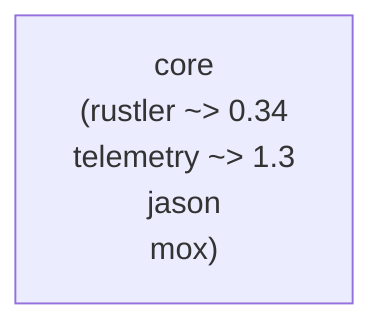

# Elixir: core — SSoT コアエンジン

## 概要

`core` はゲームの Single Source of Truth を担うコアエンジンです。公開 API・NIF ラッパー・ContentBehaviour / Component インターフェース・ルーム管理・イベント配信・セーブ/ロードなどを提供します。シーン管理の実体は [contents](./contents.md) 層の `Contents.SceneStack` / `Contents.GameEvents` が担当します。

---

## `core.ex` — 公開 API

`apps/core/lib/core.ex` に配置。外部から呼び出す全操作の窓口。エンティティ ID は `Core.Config.current().entity_registry()` から解決します。

**ゲームコンテンツ向け:**

| 関数 | 説明 |
|:---|:---|
| `spawn_enemies/3` | 敵をスポーン（atom → ID 自動解決） |
| `spawn_elite_enemy/4` | エリート敵をスポーン（HP 倍率付き） |
| `get_enemy_count/1` | 生存敵数を取得 |
| `player_dead?/1` | 死亡判定 |
| `get_frame_metadata/1` | フレームメタデータを取得 |
| `save_session/1` | セッションをセーブ |
| `load_session/1` | セッションをロード |
| `has_save?/0` | セーブデータ存在確認 |
| `save_high_score/1` | ハイスコアを保存 |
| `load_high_scores/0` | ハイスコア一覧を取得 |

**エンジン内部向け（GameEvents が使用）:**

| 関数 | 説明 |
|:---|:---|
| `create_world/0` | GameWorld リソースを生成 |
| `set_map_obstacles/2` | 障害物リストを設定 |
| `create_game_loop_control/0` | GameLoopControl リソースを生成 |
| `start_rust_game_loop/3` | Rust 60Hz ゲームループを開始 |
| `start_render_thread/5` | レンダースレッドを起動（world, render_buf, pid, title, atlas_path） |
| `pause_physics/1` | 物理演算を一時停止 |
| `resume_physics/1` | 物理演算を再開 |
| `physics_step/2` | 1 フレーム物理ステップ |
| `set_player_input/3` | 移動ベクトルを設定 |
| `drain_frame_events/1` | フレームイベントを取り出す |

`create_render_frame_buffer/0` は GameEvents が `Core.NifBridge` を直接呼び出して使用する（Core 公開 API には含まない）。

---

## `nif_bridge.ex` — Rustler NIF ラッパー

Rust NIF 関数の Elixir スタブ定義。`use Rustler` で `nif` クレートをロードします。

```elixir
use Rustler, otp_app: :core, crate: :nif, path: "../../native/nif"
```

NIF 関数は 3 カテゴリに分類されます：

| カテゴリ | 用途 | ロック種別 |
|:---|:---|:---|
| `control系` | ワールド生成・入力・ループ制御 | write lock |
| `query_light系` | HP・座標・HUD などの軽量読み取り | read lock（毎フレーム利用可） |
| `snapshot_heavy系` | セーブ/ロードスナップショット | write lock（明示操作時のみ） |

---

## `content_behaviour.ex` — コンテンツ定義インターフェース

コンテンツモジュールが実装すべきビヘイビア。旧 `WorldBehaviour` / `RuleBehaviour` の 2 分割設計を統合した設計。

**必須コールバック:**

```elixir
@callback components()        :: [module()]
@callback flow_runner(room_id())       :: pid() | nil   # シーンスタックの pid
@callback event_handler(room_id())    :: pid() | nil   # GameEvents の pid
@callback initial_scenes()    :: [%{module: scene_module(), init_arg: map()}]
@callback physics_scenes()    :: [scene_module()]
@callback playing_scene()     :: scene_module()
@callback game_over_scene()   :: scene_module()
@callback entity_registry()   :: map()
@callback enemy_exp_reward(kind_id :: non_neg_integer()) :: exp()
@callback score_from_exp(exp()) :: non_neg_integer()
@callback wave_label(elapsed_sec :: float()) :: String.t()
@callback context_defaults()  :: map()
```

**オプショナル: `scene_stack_spec/1`** — ルーム用 SceneStack の `child_spec`。マルチルーム時などに使用。

**オプショナルコールバック（武器・ボスの概念を持つコンテンツのみ）:**

```elixir
@callback level_up_scene()                              :: scene_module()
@callback boss_alert_scene()                            :: scene_module()
@callback boss_exp_reward(boss_kind())                  :: exp()
@callback generate_weapon_choices(weapon_levels :: map()) :: [weapon()]
@callback apply_weapon_selected(scene_state(), weapon()) :: scene_state()
@callback apply_level_up_skipped(scene_state())         :: scene_state()
@callback pause_on_push?(scene_module())                :: boolean()
```

---

## `component.ex` — Component ビヘイビア

コンテンツの構成単位。全コールバックがオプショナルであり、必要なものだけ実装する。

```elixir
@callback on_ready(world_ref())          :: :ok  # 初期化時（1回）
@callback on_process(context())          :: :ok  # 毎フレーム（Elixir 側）
@callback on_physics_process(context())  :: :ok  # 物理フレーム（60Hz）
@callback on_event(event(), context())   :: :ok  # UI アクション・内部イベント
@callback on_frame_event(event(), context()) :: :ok  # Rust フレームイベント
@callback on_nif_sync(context())         :: :ok  # 毎フレームの NIF 注入・push_render_frame
@callback on_engine_message(msg(), context()) :: :ok  # 遅延コールバック等のディスパッチ
```

**context マップのフィールド:**

| フィールド | 説明 |
|:---|:---|
| `context.world_ref` | Rust ワールドへの参照 |
| `context.render_buf_ref` | RenderFrameBuffer への参照（push_render_frame NIF に渡す） |
| `context.now` | 現在時刻（monotonic ms） |
| `context.elapsed` | ゲーム開始からの経過 ms |
| `context.frame_count` | フレームカウンタ |
| `context.tick_ms` | 目標フレーム時間（ms） |
| `context.start_ms` | ゲーム開始時刻（monotonic ms） |
| `context.push_scene.(mod, init_arg)` | シーンをスタックに積む |
| `context.pop_scene.()` | 現在のシーンをスタックから取り出す |
| `context.replace_scene.(mod, init_arg)` | 現在のシーンを置き換える |

---

## `config.ex` — 設定解決ヘルパー

`:current` の Application 設定を解決する。

```elixir
Core.Config.current()     # ContentBehaviour 実装モジュールを返す
Core.Config.components()  # current().components() を呼び出す
```

---

## `room_supervisor.ex` — DynamicSupervisor

ルーム（ゲームセッション）のライフサイクルを管理します。

| 関数 | 説明 |
|:---|:---|
| `start_room/1` | 新しいルームを起動 |
| `stop_room/1` | ルームを停止 |
| `list_rooms/0` | 実行中ルーム一覧 |

起動時に `:main` ルームを自動開始します。`config :server, :game_events_module` で起動する GameEvents モジュール（デフォルト `Contents.GameEvents`）を指定する。

---

## `room_registry.ex` — Registry ラッパー

`room_id → GameEvents pid` のマッピングを管理します。

---

## `event_bus.ex` — フレームイベント配信 GenServer

Rust から受信したフレームイベントを複数のサブスクライバーに配信します。

| 関数 | 説明 |
|:---|:---|
| `subscribe/1` | イベント購読を登録 |
| `broadcast/1` | イベントを全サブスクライバーに配信 |

`Process.monitor` でサブスクライバーの死活監視を行い、死亡時に自動的に購読解除します。

---

## `input_handler.ex` — キー入力 GenServer

キー入力を受け付け、ETS テーブル `:input_state` に移動ベクトルを書き込みます。

- **対応キー**: WASD + 矢印キー
- **斜め移動**: 正規化処理あり（速度が一定になる）

---

## `frame_cache.ex` — フレームスナップショット ETS

最新フレームのスナップショットを ETS に保持します。`StressMonitor` と `GameEvents` が利用します。

| 関数 | 説明 |
|:---|:---|
| `put/6` | フレームデータを書き込み |
| `get/0` | 最新フレームデータを取得 |

---

## `map_loader.ex` — マップ障害物定義

マップ種別ごとの障害物リストを返します。

| マップ | 障害物数 | 説明 |
|:---|:---|:---|
| `:plain` | 0 | 障害物なし |
| `:forest` | 8 | 木・岩など |
| `:minimal` | 2 | テスト用最小構成 |

---

## `save_manager.ex` — セーブ/ロード

| ファイル | 形式 | 内容 |
|:---|:---|:---|
| `saves/session.dat` | Erlang term binary（HMAC 署名付き） | セッション全データ |
| `saves/high_scores.dat` | Erlang term binary | ハイスコア上位 10 件リスト |

`config :core, :save_hmac_secret` で署名鍵を設定。本番では環境変数 `SAVE_HMAC_SECRET` で上書き推奨。

---

## `stats.ex` — セッション統計 GenServer

`EventBus` を購読して統計を集計します。

| イベント | 集計内容 |
|:---|:---|
| `enemy_killed` | 撃破数 |
| `level_up_event` | レベルアップ回数 |
| `item_pickup` | アイテム取得数 |

---

## `telemetry.ex` — Telemetry Supervisor

ゲームパフォーマンスメトリクスを計測します。

| メトリクス | 説明 |
|:---|:---|
| `game.tick.physics_ms` | 物理演算処理時間 |
| `game.tick.enemy_count` | 現在の敵数 |
| `game.level_up.count` | レベルアップ累計 |
| `game.boss_spawn.count` | ボス出現累計 |

---

## `stress_monitor.ex` — パフォーマンス監視 GenServer

1 秒ごとに `FrameCache` をサンプリングし、フレームバジェット超過時に `Logger.warning` を出力します。

---

## `formula.ex` — Formula 式評価 API

Elixir で定義した式グラフ（FormulaGraph）を Rust NIF VM で評価する API。`formula_nif` 経由で Elixir → Rust → Elixir の双方向計算フローを提供する。

---

## `formula_graph.ex` — 式グラフ（DAG）

入力・定数・演算・比較・Store read/write などをノードとする DAG を構築。`Core.Formula.eval/2` 等で NIF に渡して評価する。

---

## `formula_store.ex` — Store バックエンド

Formula 内の `read_store` / `write_store` ノードが参照するキー・値ストア。`config :core, :formula_store_broadcast` でネットワーク同期 MFA を指定可能。`Core.FormulaStore.LocalBackend` がローカル実装。

---

## 依存関係



---

## 関連ドキュメント

- [アーキテクチャ概要](../overview.md)
- [server](./server.md) / [contents](./contents.md) / [network](./network.md)
- [Rust: nif](../rust/nif.md)
- [contents](./contents.md)
