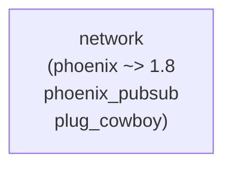

# Elixir: network — 通信レイヤー

## 概要

`network` は Phoenix Channels（WebSocket）と UDP トランスポートを提供します。ローカルマルチルーム管理により、OTP 隔離・同時 60Hz 実証などにも利用されます。

---

## モジュール一覧

| モジュール | 説明 |
|:---|:---|
| `Network.Local` | ローカルマルチルーム管理 GenServer（OTP 隔離・同時 60Hz 実証用） |
| `Network.Channel` | Phoenix Channels / WebSocket チャンネル |
| `Network.Endpoint` | Phoenix Endpoint（ポート 4000） |
| `Network.UDP` | UDP サーバー（ポート 4001） |
| `Network.UDP.Protocol` | UDP プロトコル定義 |

---

## `Network.Local` の主要 API

| 関数 | 説明 |
|:---|:---|
| `open_room/1` | 新しいルームを起動して登録 |
| `close_room/1` | ルームを停止して登録解除 |
| `register_room/1` | 既存プロセスを接続テーブルに登録（冪等） |
| `connect_rooms/2` | 2 つのルームを双方向接続 |
| `broadcast/2` | 指定ルームとその接続先にイベントを配信 |

---

## 依存関係

---

## 関連ドキュメント

- [アーキテクチャ概要](../overview.md)
- [server](./server.md) / [core](./core.md) / [contents](./contents.md)
- [データフロー・通信](../overview.md#データフロー通信)（イベントバス等）
