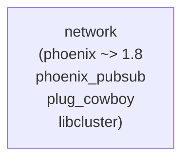

# Elixir: network — 通信レイヤー

## 概要

`network` は Phoenix Channels（WebSocket）と UDP トランスポートを提供します。ローカルマルチルーム管理により、OTP 隔離・同時 60Hz 実証などにも利用されます。

---

## モジュール一覧

| モジュール | 説明 |
|:---|:---|
| `Network` | 公開 API。Distributed / Local / Channel / UDP へ委譲 |
| `Network.Distributed` | 複数ノード間ルーム管理。libcluster クラスタ時は分散配置・RPC ブロードキャスト。単一ノード時は Local へ委譲 |
| `Network.Local` | ローカルマルチルーム管理 GenServer（OTP 隔離・同時 60Hz 実証用） |
| `Network.RoomToken` | Phoenix.Token によるルーム参加認証（WebSocket join 時のトークン検証） |
| `Network.Channel` | Phoenix Channels / WebSocket チャンネル |
| `Network.Endpoint` | Phoenix Endpoint（ポート 4000） |
| `Network.UDP` | UDP サーバー（ポート 4001） |
| `Network.UDP.Protocol` | UDP プロトコル定義 |

---

## `Network` 公開 API（Distributed へ委譲）

| 関数 | 説明 |
|:---|:---|
| `open_room/1` | 新しいルームを起動 |
| `close_room/1` | ルームを停止 |
| `register_room/1` | 既存プロセスを接続テーブルに登録 |
| `unregister_room/1` | 接続テーブルからルームを解除 |
| `connect_rooms/2` | 2 つのルームを双方向接続 |
| `disconnect_rooms/2` | 接続を解除 |
| `broadcast/2` | 指定ルームとその接続先にイベントを配信 |
| `list_rooms/0` | 起動中ルーム一覧 |
| `connected?/2` | 2 ルームが接続されているか |

## `Network.RoomToken`

ルーム参加用トークンの生成・検証。`Phoenix.Token.sign/verify` を使用。`Network.Channel` の join 認証に利用。

---

## 依存関係・設定

- **libcluster**: `config :libcluster, topologies: [...]` でクラスタ形成。空の場合は単一ノードで Local が使われる。

---

## 関連ドキュメント

- [アーキテクチャ概要](../overview.md)
- [server](./server.md) / [core](./core.md) / [contents](./contents.md)
- [データフロー・通信](../overview.md#データフロー通信)（イベントバス等）
