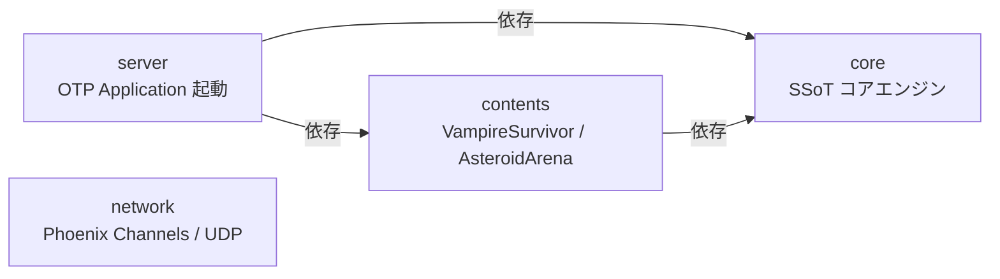
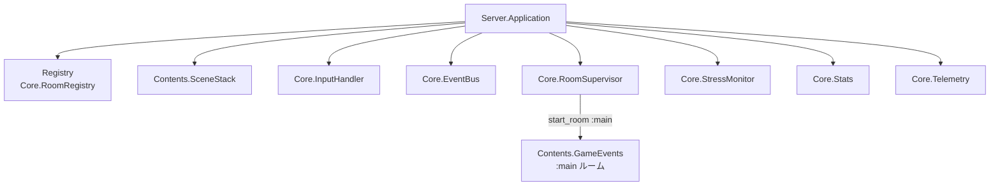

# Elixir: server — 起動プロセス

## 概要

`server` は OTP Application のエントリポイントです。Supervisor ツリーを構築し、全 GenServer を起動します。

---

## アプリケーション構成（Elixir Umbrella）



---

## `application.ex`



起動後に `Core.RoomSupervisor.start_room(:main)` を呼び出してメインルームを開始します。

---

## 設定（`config/config.exs`）

```elixir
# 使用するコンテンツモジュールを指定する
# 例: Content.VampireSurvivor / Content.AsteroidArena / Content.SimpleBox3D /
# Content.BulletHell3D / Content.RollingBall / Content.VRTest / Content.CanvasTest
config :server, :current, Content.SimpleBox3D
config :server, :map, :plain
config :server, :game_events_module, Contents.GameEvents
```

---

## 関連ドキュメント

- [アーキテクチャ概要](../overview.md)
- [core](./core.md) / [contents](./contents.md) / [network](./network.md)
- [contents](./contents.md)
