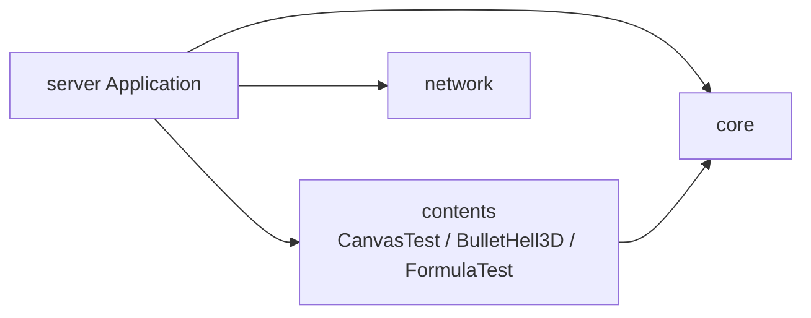
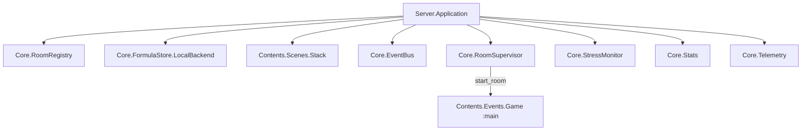

# Elixir: server — 起動プロセス

> **2026-04 更新**: 起動ツリーとコンテンツ一覧の記述を現行に合わせた。

## 概要

`server` は OTP Application のエントリポイント。Supervisor ツリーで Registry、Scenes.Stack、EventBus、RoomSupervisor、`Contents.Events.Game` 等を起動する。

---

## アプリケーション構成（Umbrella）



---

## `application.ex` 起動ツリー（概念）



`Core.RoomSupervisor.start_room(:main)` でメインルームの `Contents.Events.Game` を起動。

---

## 設定（`config/config.exs`）

```elixir
# 第一級コンテンツのいずれか:
#   Content.CanvasTest | Content.BulletHell3D | Content.FormulaTest
# FormulaTest 専用エントリは config/formula_test.exs でも切替可能
config :server, :current, Content.BulletHell3D
config :server, :map, :plain
config :server, :game_events_module, Contents.Events.Game
```

実際のリポジトリの `config :server, :current` は開発都合で変えてよい。未設定時は `Core.Config` の `@default_content`（`BulletHell3D`）。

---

## 関連ドキュメント

- [アーキテクチャ概要](../overview.md)
- [core](./core.md) / [contents](./contents.md) / [network](./network.md)
