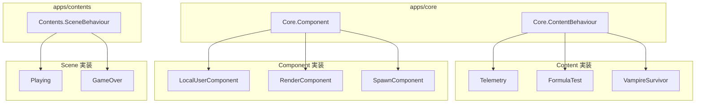
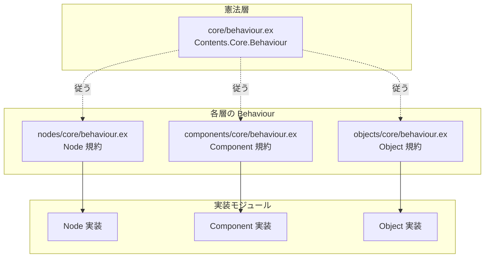

このドキュメントは、コンテンツを最小単位まで分解し、VR空間で直感的な論理構築を可能にするための究極の地図です。

# Blueprint

## 1. 存在の階層構造（The five Pillars）

すべてのデジタル体験は、以下の層の連鎖（パイプライン）で構成されます。

- **Contents（体験）**: ユーザーが知覚する最終的な物語や空間。既存の `lib/contents/` 配下に配置。
- **Objects（空間のピア）**: 空間に存在する実体（Entities）。GenServer として動作。
- **Components（状態のピア）**: ノードを束ねて特定の「機能」を持たせた細胞。状態を保持する。GenServer として動作。
- **Nodes（論理のピア）**: Action と Logic が交差する処理の原子。Logic Processors。プロセス化しない。
- **Structs（データの形）**: 世界に存在する物質そのものの定義。ノード・コンポーネントが扱うデータの型。`defstruct` / `@type` で定義。

## 2. 依存関係（Dependency Direction）

データ定義（structs）がプログラムの基礎。基盤から上位へ一方向に依存を積み上げます。

```
structs
structs |> nodes
structs |> components
structs |> objects
structs |> nodes |> objects
structs |> components |> objects
structs |> nodes |> components |> objects
```

## 3. 二種類のピン（Action & Logic Pins）

ノードプログラミングを「時間の制御」と「データの参照」に分離し、それらを自由に組み合わせます。各ノードは **pin**（接続点）を持ち、これらを接続して処理を構築します。

- **Action pins（実行フロー）**:
  - 役割: 「いつ（When）」を司る。パルス（信号）による実行権限の委譲。
  - 機能: 順次処理、並列処理、および複数の時間を束ねる Sync（同期）。
  - ピン: `action in` / `action out`。
- **Logic pins（データフロー）**:
  - 役割: 「何を（What）」を司る。情報の参照と変換。
  - 機能: 常に流れるストリーム、または要求に応じた値（Value）の返却。
  - ピン: `logic in` / `logic out`。

## 4. 統一ディレクトリ・アーキテクチャ（apps/contents）

```
apps/contents/
├── core/
│   └── behaviour.ex         # 憲法。全層共通の契約。（役割分担は別途詰める）
├── structs/                 # データの形。defstruct / @type による型定義。
│   └── category/
│       ├── value/           # スカラー・ベクトル・行列・色など
│       ├── text/            # 文字列・文字
│       ├── time/            # 日時・時間幅
│       ├── space/           # 空間に関わる型（Transform など）
│       └── users/
│           └── local_user.ex  # 操作者というコンテキスト
├── objects/                 # 空間のピア（Entities）
│   └── core/
│       └── behaviour.ex     # Object としてのインターフェース（GenServer 規約）
├── components/              # 状態のピア（State Holders）。GenServer で動作。
│   ├── core/
│   │   └── behaviour.ex     # 全コンポーネント共通のライフサイクル規約（GenServer 規約）
│   └── category/
│       └── uncategorized/
│           └── comment.ex   # VR 空間内のドキュメント化（付箋）
├── nodes/                   # 論理のピア（Logic Processors）
│   ├── pins/                # Action / Logic のピン定義（action in/out, logic in/out）
│   │   ├── action.ex
│   │   └── logic.ex
│   ├── core/
│   │   └── behaviour.ex     # ノードとしてのインターフェース（pins の宣言）
│   └── category/
│       ├── actions/         # 実行・副作用に軸を置くノード（Resonite に合わせた分類）
│       │   └── write.ex     # Action pin でトリガー、Logic pin でデータを書き換え
│       └── math/            # 純粋なロジック演算
│           └── add.ex
└── lib/contents/            # 既存 Contents（体験）。従来通り配置
    ├── vampire_survivor/
    ├── rolling_ball/
    ├── vr_test/
    └── ...
```

### 構成のコメント


| パス                          | 役割                                                                                                |
| --------------------------- | ------------------------------------------------------------------------------------------------- |
| `core/behaviour.ex`         | 憲法。全層が従う基本契約。役割分担は「Behaviour の流れ」参照。                                                              |
| `nodes/pins/`               | Action / Logic のピン（action in/out, logic in/out）を定義。ノード間の通信のルール。                                            |
| `structs/`                  | データの形を定義。`defstruct` / `@type`。`category` でドメイン別に分類し、VR 空間での型の可視性を高める。                                 |
| `structs/category/space/`   | 空間に関わる型。Resonite の Components に合わせた配置。transform など。3 次元ベクトルは value の Float.t3。 |
| `objects/`                  | 空間上の実体。ECS の Entity 相当。GenServer で動作。                                                             |
| `components/`               | 状態を保持する細胞。ノードを束ねて特定の機能を提供。GenServer で動作。                                                          |
| `nodes/`                    | 論理の原子。Action / Logic pins に基づく処理。プロセス化しない。`category/actions/` は Resonite の Actions に合わせた分類。 |


### プロセスモデル（GenServer）

Objects / Components は GenServer として実装。Nodes はプロセス化せず、Component 内の Executor が関数として呼び出す。一貫したモデルで実装を進め、負荷を計測したうえで、必要に応じて調整する。

#### 層ごとの GenServer 適用可否

| 層 | GenServer | 理由 |
|:---|:---|:---|
| **Content（体験）** | 既存のまま | GameEvents 等が担う。ルーム単位で 1 プロセス。 |
| **Object** | する | 空間実体・子管理・イベント受信に適している。 |
| **Component** | する | 状態保持とノード束ねの主体。 |
| **Node（状態なし）** | しない | 関数として Executor が呼び出す。 |
| **Node（状態あり）** | しない | Agent を検討。GenServer は使わない。 |

**コンテンツ全体**を 1 つの GenServer にすることは推奨しない。Content はオーケストレータであり、実体は Object / Component ツリー。

#### 実装パターン

- **パターン A**: ノードをプロセスにしない。Component 内の Executor がグラフをトラバースし、`handle_pulse` / `handle_sample` を直接呼び出す（Bevy の System に類似）。ノード数に比例してプロセスが増えない。
- **パターン B**: 状態ありノードのみ Agent を検討。状態なしノードは関数として実行。
- **パターン C**: 当面は実装を進め、負荷計測後にパターン A または B へ移行を検討する。

#### 推奨方針

- **短期**: Object / Component は GenServer。Node はプロセスにせず、Executor が関数として呼び出す。
- **中期**: 負荷計測を行い、必要に応じてパターン調整。

### Behaviour の流れ（現状と提案）

**現状**：Behaviour が `apps/core` と `apps/contents` に分散し、層ごとに独立した契約が存在する。




- `Core.ContentBehaviour`：コンテンツモジュールの契約
- `Core.Component`：コンポーネントの契約
- `Contents.SceneBehaviour`：シーンの契約
- 共通の「憲法」はなく、Object / Node の Behaviour は未定義

**提案**：`apps/contents` 配下に配置を統一し、`core/behaviour.ex`（憲法）を頂点に、各層の Behaviour が共通の土台に乗る構成。実装の積み上げ順は Node → Component → Object。




| Behaviour                        | 役割                                                                            |
| -------------------------------- | ----------------------------------------------------------------------------- |
| **core/behaviour.ex（憲法）**        | 全層共通の土台。GenServer の init/terminate、プロセス識別子、共通の型・コールバックの雛形。各層が「従う」前提の契約。       |
| **nodes/core/behaviour.ex**      | Node 固有の契約。Action/Logic pins（action in/out, logic in/out）の宣言、handle_pulse、handle_sample など。 |
| **components/core/behaviour.ex** | Component 固有の契約。状態保持、ノード束ね、on_ready / on_process などライフサイクル。                   |
| **objects/core/behaviour.ex**    | Object 固有の契約。空間上の実体としての init、handle_cast（空間イベント）、子の管理など。                      |


- **点線（-.->）**：core/behaviour は「従うべき原則」。継承や `@behaviour` による直接指定はせず、設計上の制約として扱う選択も可。
- **実線（-->）**：各層の実装モジュールは、対応する層の behaviour を `@behaviour` で指定する。

## 5. 設計のゴール：能動と受動の融合

ノードを「Action 型」か「Logic 型」かで分けるのではなく、**「どのようなピン（pin）を備えているか」**で定義します。

> 例：write.ex ノードの解釈  
> 「action in pin からパルスを受け取った瞬間に動き出し、logic in pin からデータを吸い上げ（Sample）、対象を書き換える。終われば action out pin へパルスを返す。」

## 6. VR 体験における開発指針

- **直感的な接続**: Action pins（時間）は「光る脈動」として、Logic pins（情報）は「静かな導管」として視覚化する。
- **対称性の保持**: 階層が違っても、インターフェースが同じであれば、ユーザーは一度覚えたルールでシステム全体を構築できる。
- **型の厳格さ**: structs がカテゴリー化されていることで、VR 空間で「今、何を触っているのか」を型レベルでユーザーが意識できるようにする。

---

この構造は、単なるコードの整理術ではなく、AlchemyEngine という「世界を構築するための言語」そのものです。この地図があれば、どれほど複雑なコンテンツであっても迷うことなく最小単位に分解し、再構築できるはずです。