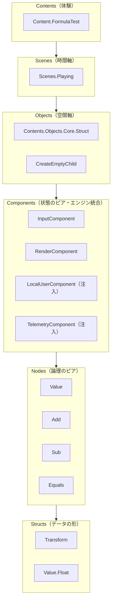
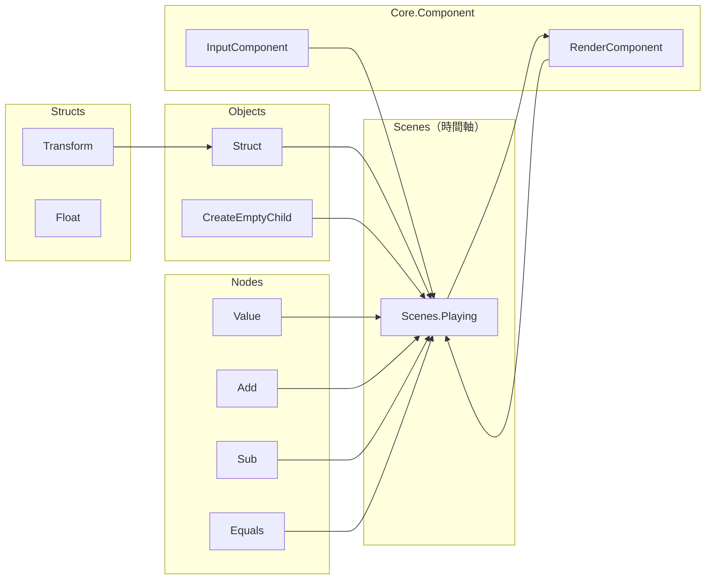
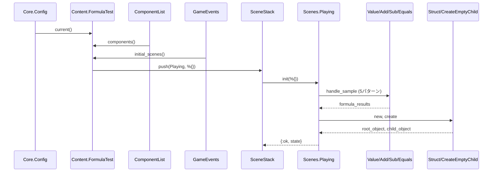
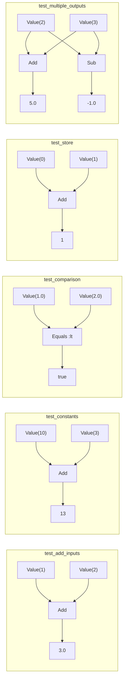
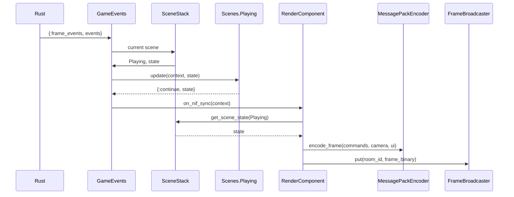
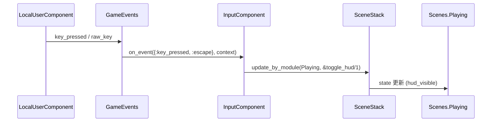
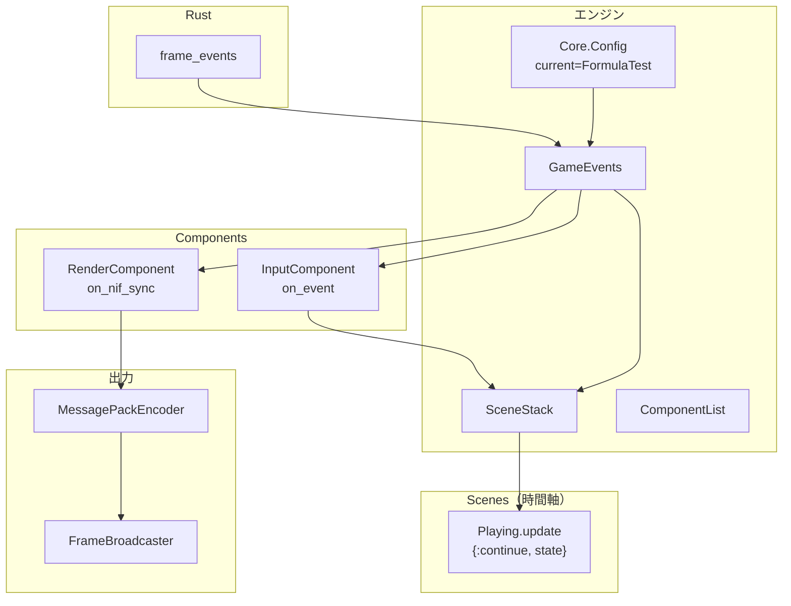

# FormulaTest Phase 1 アーキテクチャ

> 作成日: 2026-03-12  
> 更新日: 2026-03-15（Scene の位置づけを明示）  
> 対象: Phase 1 移行後の FormulaTest が通る全アーキテクチャを記載する。  
> 参照: [fix_contents.md](./fix_contents.md), [scene-and-object.md](./scene-and-object.md)

---

## 1. 概要

FormulaTest は、新アーキテクチャ（structs / nodes / components / objects / **scenes**）の動作を検証するコンテンツである。Phase 1 移行後、以下を用いて 5 パターンの式計算を行い、結果を HUD に表示する。

- **Structs**: データ型（Transform 等）
- **Nodes**: Value, Add, Sub, Equals（handle_sample による Logic フロー）
- **Objects**: Struct, CreateEmptyChild（空間階層）
- **Scenes**: Scenes.Playing（時間軸。Object ツリーのルート参照、遷移管理）
- **Contents**: Content モジュール、Core.Component（エンジン統合）

---

## 2. Six Pillars と使用モジュール（Scene 追加）



---

## 3. モジュール一覧

### 3.1 Contents 層

| モジュール | 役割 | パス |
|------------|------|------|
| `Content.FormulaTest` | コンテンツ定義。Core.ContentBehaviour を実装 | `contents/formula_test.ex` |

### 3.2 Scenes 層（時間軸）

| モジュール | 役割 | パス |
|------------|------|------|
| `Content.FormulaTest.Scenes.Playing` | メインシーン。Nodes を実行し Object を構築。root_object（着地点）を state に保持 | `contents/formula_test/scenes/playing.ex` |

### 3.3 Objects 層

| モジュール | 役割 | パス |
|------------|------|------|
| `Contents.Objects.Core.Struct` | オブジェクト構造体（name, parent, tag, active, persistent, transform） | `objects/core/struct.ex` |
| `Contents.Objects.Core.CreateEmptyChild` | 空の子オブジェクト作成 | `objects/core/create_empty_child.ex` |

### 3.4 Components 層（Core.Component = エンジン用）

| モジュール | 役割 | パス |
|------------|------|------|
| `Content.FormulaTest.InputComponent` | ESC で HUD トグル、__quit__ で終了 | `contents/formula_test/input_component.ex` |
| `Content.FormulaTest.RenderComponent` | HUD に検証結果を描画、NIF へ frame 送信 | `contents/formula_test/render_component.ex` |
| `Contents.LocalUserComponent` | キー・マウス入力（ComponentList により注入） | `contents/local_user_component.ex` |
| `Contents.TelemetryComponent` | 入力状態参照用（ComponentList により注入） | `contents/telemetry_component.ex` |

### 3.5 Nodes 層

| モジュール | 役割 | 使用するコールバック | パス |
|------------|------|----------------------|------|
| `Contents.Nodes.Category.Core.Input.Value` | 定数値入力。context[:value] を返す | handle_sample | `nodes/category/core/input/value.ex` |
| `Contents.Nodes.Category.Operators.Add` | 加算。%{a:, b:} → a + b | handle_sample | `nodes/category/operators/add.ex` |
| `Contents.Nodes.Category.Operators.Sub` | 減算。%{a:, b:} → a - b | handle_sample | `nodes/category/operators/sub.ex` |
| `Contents.Nodes.Category.Operators.Equals` | 比較。%{a:, b:, op:} → eq/lt/gt 等 | handle_sample | `nodes/category/operators/equals.ex` |

### 3.6 Structs 層

| モジュール | 役割 | パス |
|------------|------|------|
| `Structs.Category.Space.Transform` | 位置・回転・スケール | `structs/category/space/transform.ex` |
| `Structs.Category.Value.Float` | float, t3, quaternion 等の型定義 | `structs/category/value/float.ex` |

### 3.7 エンジン・インフラ

| モジュール | 役割 |
|------------|------|
| `Core.ContentBehaviour` | コンテンツの契約（components, flow_runner, initial_scenes 等） |
| `Core.Component` | エンジンが呼ぶコールバック（on_event, on_nif_sync 等） |
| `Contents.SceneBehaviour` | シーンの契約（init, update, render_type） |
| `Contents.Scenes.Stack` | シーンスタック管理 |
| `Contents.Events.Game` | フレームイベント受信・コンポーネント dispatch |
| `Contents.ComponentList` | コンポーネントリスト解決（LocalUser, Telemetry 注入） |
| `Core.Config` | 現在のコンテンツ取得（config :server, :current） |
| `Core.RoomRegistry` | ルーム・イベントハンドラ登録 |
| `Content.MessagePackEncoder` | frame の MessagePack エンコード |
| `Contents.FrameBroadcaster` | frame をクライアントへ配信 |
| `Content.MeshDef` | グリッド平面の頂点生成 |

---

## 4. 依存関係（依存方向）



※ Scenes.Playing は Object ツリーのルート（root_object：着地点）を保持。Objects は Scenes に依存しない。

---

## 5. 実行フロー

### 5.1 起動〜init



### 5.2 ノード実行（Scenes.Playing 内）

各テストは `handle_sample(inputs, context)` を直接呼び出す。



| テスト | 呼び出し |
|--------|----------|
| test_add_inputs | Value(1), Value(2) → Add → 3.0 |
| test_constants | Value(10), Value(3) → Add → 13 |
| test_comparison | Value(1.0), Value(2.0) → Equals(:lt) → true |
| test_store | Value(0), Value(1) → Add → 1（Store 未実装のため加算で代用） |
| test_multiple_outputs | Value(2), Value(3) → Add → 5, Sub → -1 |

### 5.3 フレームごとのループ



### 5.4 入力イベント



---

## 6. ファイルパス一覧（FormulaTest 通過に必要なもの）

```
apps/contents/lib/
├── contents/
│   ├── formula_test.ex
│   ├── formula_test/
│   │   ├── input_component.ex
│   │   ├── render_component.ex
│   │   └── scenes/
│   │       └── playing.ex
│   ├── component_list.ex
│   ├── scene_behaviour.ex
│   ├── scene_stack.ex
│   ├── game_events.ex
│   ├── frame_broadcaster.ex
│   ├── local_user_component.ex
│   ├── telemetry_component.ex
│   ├── message_pack_encoder.ex (Content 名前空間)
│   └── mesh_def.ex (Content 名前空間)
├── objects/
│   └── core/
│       ├── struct.ex
│       └── create_empty_child.ex
├── nodes/
│   ├── core/
│   │   └── behaviour.ex
│   └── category/
│       ├── core/input/value.ex
│       └── operators/
│           ├── add.ex
│           ├── sub.ex
│           └── equals.ex
└── structs/
    └── category/
        ├── space/transform.ex
        └── value/float.ex

apps/core/lib/
├── content_behaviour.ex
├── component.ex
├── config.ex
├── room_registry.ex
└── (NifBridge, MapLoader 等は GameEvents 経由で使用)
```

---

## 7. データフロー概要



---

## 8. 備考

- **Executor**: 未使用。Scenes.Playing が Nodes を直接 `handle_sample` で呼び出す。
- **Core.FormulaGraph**: 使用していない（VampireSurvivor 等の他コンテンツで使用中のため削除していない）。
- **physics_scenes**: FormulaTest では空リスト（物理演算なし）。
