# AlchemyEngine — アーキテクチャ概要

## 設計思想

AlchemyEngine は **Elixir を Single Source of Truth（SSoT）** として、Rust の ECS で物理演算・描画・オーディオを処理するハイブリッドゲームエンジンです。

- **Elixir 側**: ゲームロジックの制御フロー・セーブ/ロード・イベント配信（シーン管理は contents 層）
- **Rust 側**: 60Hz 固定の物理演算・衝突判定・描画・オーディオ

---

## 全体構成

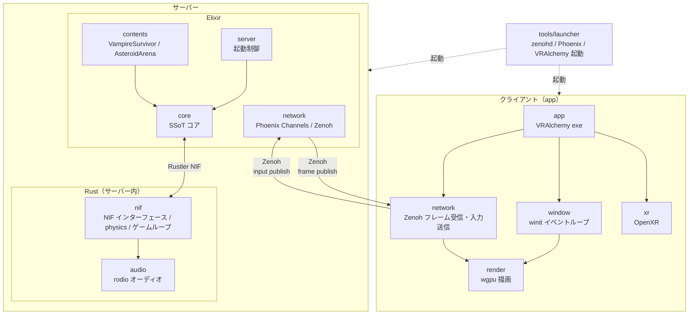

---

## ディレクトリ構造（ソース単位）

```
alchemy-engine/
├── mix.exs                          # Umbrella ルートプロジェクト定義
├── mix.lock                         # Elixir 依存ロックファイル
├── config/
│   ├── config.exs                   # :server :current / :map / libcluster / save_hmac_secret 等
│   └── runtime.exs                  # 実行時設定（ポート等）
│
├── apps/                            # Elixir アプリケーション群
│   ├── core/                        # SSoT コアエンジン
│   │   ├── mix.exs
│   │   └── lib/
│   │       ├── core.ex              # 公開 API（エントリポイント）
│   │       └── core/
│   │           ├── nif_bridge.ex        # Rustler NIF ラッパー
│   │           ├── nif_bridge_behaviour.ex  # NifBridge ビヘイビア（テスト用 Mock 対応）
│   │
│   │           ├── component.ex         # Component ビヘイビア（コンテンツ構成単位）
│   │           ├── config.ex            # :server :current でコンテンツモジュール解決
│   │           ├── room_supervisor.ex   # DynamicSupervisor
│   │           ├── room_registry.ex     # Registry ラッパー
│   │           ├── event_bus.ex         # フレームイベント配信 GenServer（subscribe / broadcast）
│   │           ├── input_handler.ex     # キー入力 GenServer
│   │           ├── frame_cache.ex       # フレームスナップショット ETS
│   │           ├── map_loader.ex        # マップ障害物定義
│   │           ├── save_manager.ex      # セーブ/ロード
│   │           ├── stats.ex             # セッション統計 GenServer
│   │           ├── telemetry.ex         # Telemetry Supervisor
│   │           ├── stress_monitor.ex    # パフォーマンス監視 GenServer
│   │           ├── formula.ex           # Formula 式評価 API
│   │           ├── formula_graph.ex     # 式グラフ（DAG）構築
│   │           ├── formula_store.ex     # Store バックエンド（read/write）
│   │           └── formula_store/
│   │               └── local_backend.ex # ローカル Store 実装
│   │
│   ├── server/                      # 起動プロセス
│   │   ├── mix.exs
│   │   └── lib/server/
│   │       └── application.ex       # OTP Application / Supervisor ツリー
│   │
│   ├── contents/                    # ゲームコンテンツ
│   │   ├── mix.exs
│   │   └── lib/
│   │       ├── behaviour/
│   │       │   └── content.ex             # Contents.Behaviour.Content（コンテンツ契約）
│   │       ├── contents/
│   │       │   ├── contents.ex            # Content 名前空間モジュール
│   │       │   ├── entity_params.ex       # 共通 EXP・スコア（Content.EntityParams）
│   │       │   ├── scene_behaviour.ex     # シーンコールバック定義
│   │       │   ├── frame_broadcaster.ex   # Zenoh フレーム配信（Process.put → ZenohBridge）
│   │       │   ├── component_list.ex      # コンポーネント解決（LocalUserComponent / TelemetryComponent 注入）
│   │       │   ├── message_pack_encoder.ex# Content.MessagePackEncoder（RenderFrame の MessagePack エンコード）
│   │       │   ├── local_user_component.ex# ローカル入力共通コンポーネント
│   │       │   ├── telemetry_component.ex # 入力状態参照用（全コンテンツに注入）
│   │       │   ├── menu_component.ex      # メニュー UI 共通コンポーネント
│   │       │   ├── content_loader.ex      # 将来用: descriptor ベース（stub）
│   │       │   ├── content_runner.ex      # 将来用（stub）
│   │       │   ├── component_registry.ex  # 将来用（stub）
│   │       │   ├── vampire_survivor.ex    # Content.VampireSurvivor（Spawner / Level / Boss / Render 使用）
│   │       │   ├── vampire_survivor/
│   │       │   │   ├── local_user_component.ex, entity_params.ex, sprite_params.ex
│   │       │   │   ├── spawn_system.ex, frame_builder.ex, helpers.ex
│   │       │   │   ├── playing.ex         # Playing シーン + LevelComponent + BossComponent + LevelSystem
│   │       │   │   ├── level_up.ex, boss_alert.ex, game_over.ex
│   │       │   ├── asteroid_arena.ex      # Spawner + PhysicsEntity 使用
│   │       │   ├── asteroid_arena/
│   │       │   │   └── playing.ex, game_over.ex
│   │       │   ├── simple_box_3d.ex / simple_box_3d/ playing.ex, game_over.ex
│   │       │   ├── bullet_hell_3d.ex / bullet_hell_3d/ playing.ex, game_over.ex
│   │       │   ├── rolling_ball.ex / rolling_ball/ title.ex, playing.ex, stage_clear.ex, ending.ex, game_over.ex
│   │       │   ├── canvas_test.ex / canvas_test/ playing.ex
│   │       │   └── formula_test.ex / formula_test/ playing.ex
│   │       ├── components/category/       # Spawner, PhysicsEntity, Rendering.Render 等（共有）
│   │       ├── events/
│   │       │   ├── game.ex                # Contents.Events.Game（メインゲームループ GenServer）
│   │       │   └── game/diagnostics.ex
│   │       └── scenes/
│   │           └── stack.ex               # Contents.Scenes.Stack（シーンスタック管理）
│   │
│   └── network/                     # 通信レイヤー
│       ├── mix.exs                  # deps: phoenix ~> 1.8, phoenix_pubsub, plug_cowboy, libcluster
│       └── lib/
│           ├── network.ex           # Network 公開 API（Distributed / Local / Channel / UDP 委譲）
│           └── network/
│               ├── application.ex
│               ├── local.ex             # ローカルマルチルーム管理 GenServer
│               ├── distributed.ex       # 複数ノード間ルーム管理（libcluster クラスタ時）
│               ├── zenoh_bridge.ex      # Zenoh フレーム publish・入力 subscribe（zenoh_enabled 時）
│               ├── room_token.ex        # Phoenix.Token によるルーム参加認証
│               ├── channel.ex           # Phoenix Channels / WebSocket
│               ├── endpoint.ex           # Phoenix Endpoint（ポート 4000）
│               ├── router.ex
│               ├── user_socket.ex
│               └── udp/
│                   ├── server.ex        # UDP サーバー（ポート 4001）
│                   └── protocol.ex
│
├── native/                          # Rust クレート群
│   ├── Cargo.toml                   # Rust ワークスペース定義
│   ├── Cargo.lock
│   │
│   ├── shared/                      # Elixir との契約・型・補間・予測（依存なし）
│   ├── audio/                       # rodio オーディオ（依存なし）
│   ├── xr/                          # OpenXR 入力ブリッジ（VR、依存なし）
│   ├── nif/                         # NIF ブリッジ・physics 内包 → audio
│   ├── render/                      # wgpu 描画・egui HUD → nif
│   ├── window/                      # winit イベントループ・窓層 → render
│   ├── network/                     # Zenoh 通信層 → render, shared
│   ├── app/                         # 統合層（VRAlchemy exe）→ network, render, window, xr, nif, audio
│   └── tools/
│       └── launcher/                # トレイアイコン・zenohd / Phoenix / VRAlchemy 起動（依存なし）
│
├── assets/                          # スプライト・音声アセット
└── saves/                           # セーブデータ
```

---

## Rust クレート依存関係

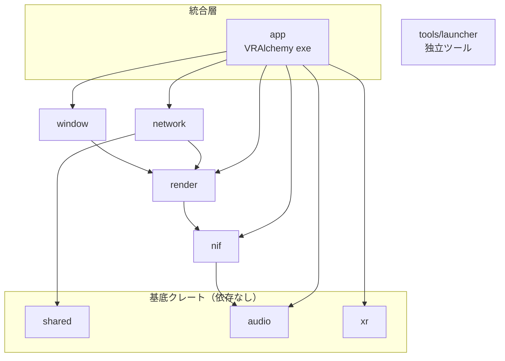

- **サーバー側**: `nif` が Elixir NIF としてロードされ、`audio` でオーディオ再生
- **クライアント側**: `app` が `window` + `render` で描画、`network` で Zenoh 経由のフレーム受信・入力送信
- **physics**: `nif` クレート内の `nif/src/physics/` に内包（独立クレートではない）

---

## レイヤー間の責務分担

| レイヤー | 責務 | 技術 |
|:---|:---|:---|
| `server` | OTP Application 起動・Supervisor ツリー構築 | Elixir / OTP |
| `core` | ゲームループ制御・イベント受信・セーブ・Core.Component インターフェース定義 | Elixir GenServer / ETS |
| `contents` | Contents.Events.Game・Contents.Scenes.Stack・Contents.Behaviour.Content 実装・Component 群・エンティティパラメータ | Elixir |
| `network` | Phoenix Channels・UDP・Zenoh（フレーム publish・入力 subscribe）・ローカルマルチルーム管理 | Elixir / Phoenix / Zenohex |
| `nif` | Elixir-Rust 間 NIF ブリッジ・ゲームループ・physics 内包 | Rust / Rustler |
| `render` | GPU 描画パイプライン・HUD・ヘッドレスモード（ウィンドウは window が生成） | Rust / wgpu / egui |
| `window` | winit イベントループ・窓生成・キーボード・マウス入力 | Rust / winit |
| `xr` | OpenXR セッション・VR 入力管理 | Rust / OpenXR |
| `app` | 統合層（VRAlchemy exe：Zenoh 経由で RenderFrame 受信・入力送信） | Rust / Zenoh |
| `tools/launcher` | トレイアイコン・zenohd / Phoenix Server / VRAlchemy の起動・終了 | Rust / tao / tray-icon |
| `audio` | オーディオ管理・アセット読み込み（platform/ で OS 切り替え） | Rust / rodio |

---

## 主要な設計パターン

### 1. Rustler NIF による状態共有

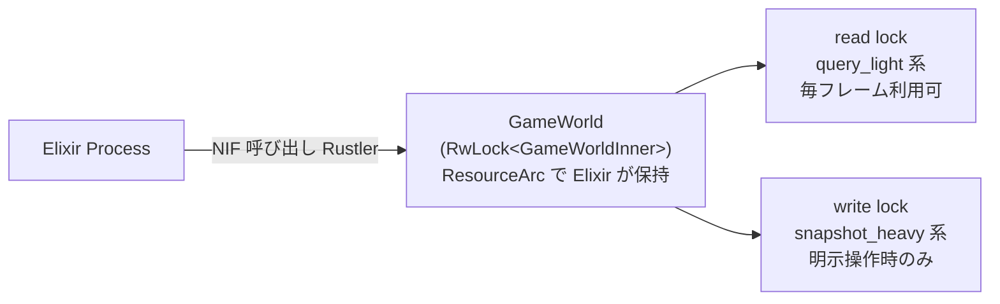

### 2. SoA（Structure of Arrays）によるキャッシュ効率化

```rust
EnemyWorld {
    positions_x: Vec<f32>,   // 全敵の X 座標
    positions_y: Vec<f32>,   // 全敵の Y 座標
    velocities:  Vec<[f32;2]>,
    hp:          Vec<f32>,
    alive:       Vec<bool>,
    free_list:   Vec<usize>, // O(1) スポーン/キル
}
```

### 3. イベント駆動ゲームループ

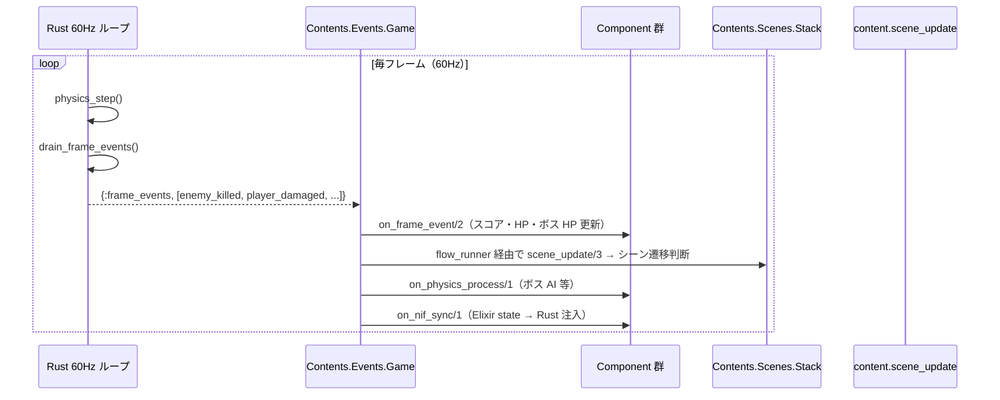

### 4. 描画命令の Zenoh 配信

Elixir 側（contents）の Render コンポーネントが DrawCommand リスト・CameraParams・UiCanvas を組み立て、`Content.MessagePackEncoder` で MessagePack にエンコードし、`FrameBroadcaster.put(room_id, frame_binary)` で Zenoh へ publish する。`Network.ZenohBridge` が受信し、`app`（VRAlchemy exe）が subscribe して描画する。ローカル描画は廃止済み（Zenoh 専用）。

### 5. Contents.Behaviour.Content + Component による拡張設計

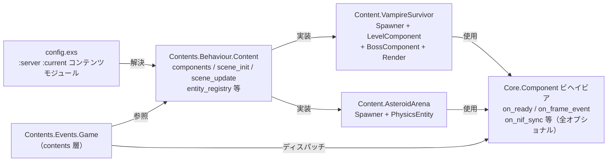

---

# データフロー・通信

## 起動シーケンス

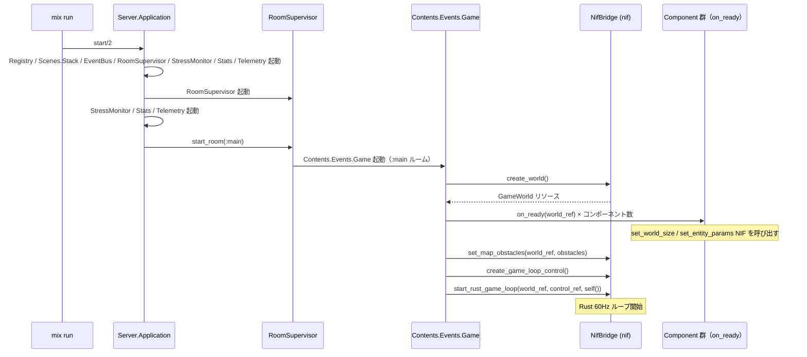

---

## メインゲームループ（定常状態）

### Rust 側（60Hz 固定ループ）

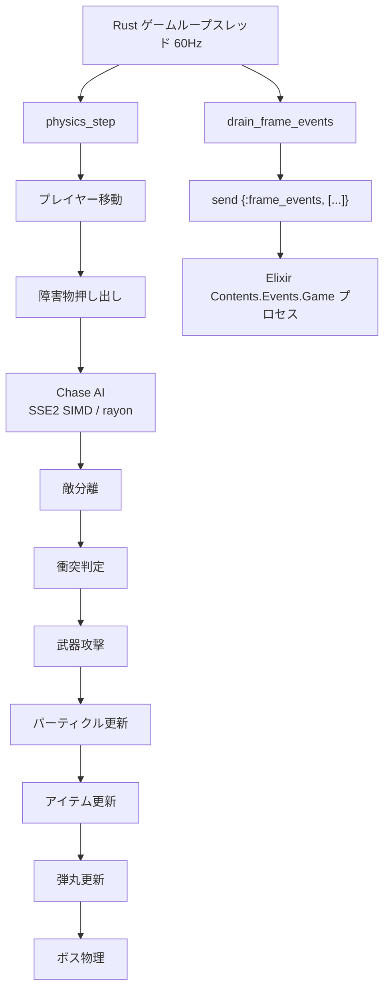

### Elixir 側（イベント駆動）


**フレーム処理の順序（毎フレーム）:**

1. `on_frame_event/2` — 全コンポーネントにフレームイベントを配信（スコア・HP・ボス HP 更新）
2. `content.scene_update/3` — シーン遷移判断（flow_runner 経由）
3. `on_physics_process/1` — ボス AI 等の物理コールバック（NIF 書き込みを含む）
4. `on_nif_sync/1` — Elixir state を Rust 側に注入。Render コンポーネントは `FrameBroadcaster.put` で DrawCommand・Camera・UiCanvas を Zenoh へ配信する

---

## クライアント動作モード

常に Zenoh 経由で `VRAlchemy`（app が生成）がフレームを受信する。`mix run` 単体ではウィンドウは開かず、サーバーのみ起動する。ゲームをプレイするには `zenohd` + `mix run` + `VRAlchemy` の 3 プロセスが必要。

---

## レンダリングフロー

Elixir の RenderComponent が `FrameBroadcaster.put` で Zenoh へ frame を publish。`app`（VRAlchemy exe）の `NetworkRenderBridge`（network クレート）が subscribe して描画する。

---

## ユーザー入力フロー

### キーボード入力（移動）

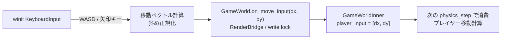

### UI アクション（武器選択・セーブ等）

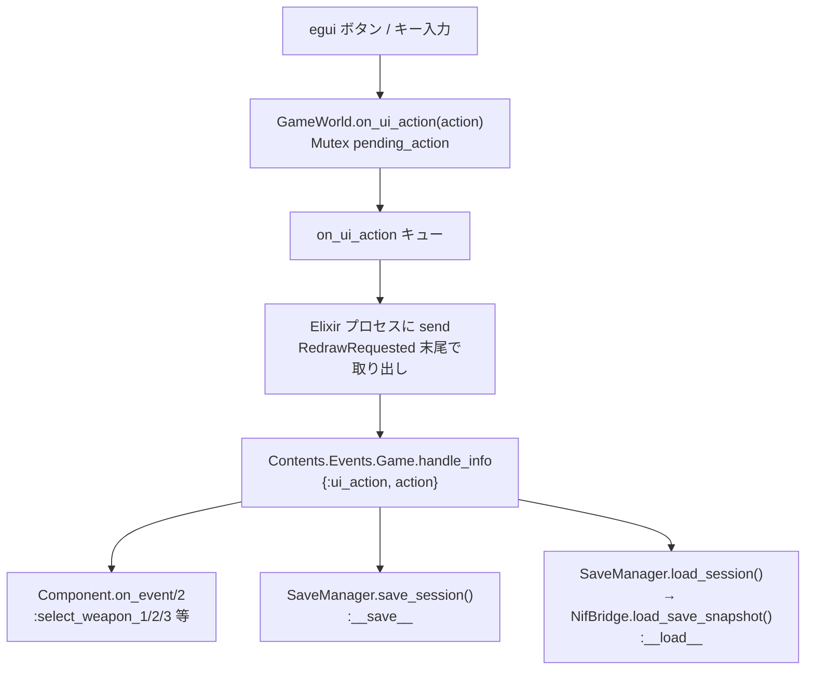

---

## NIF 通信詳細

### RwLock 競合戦略

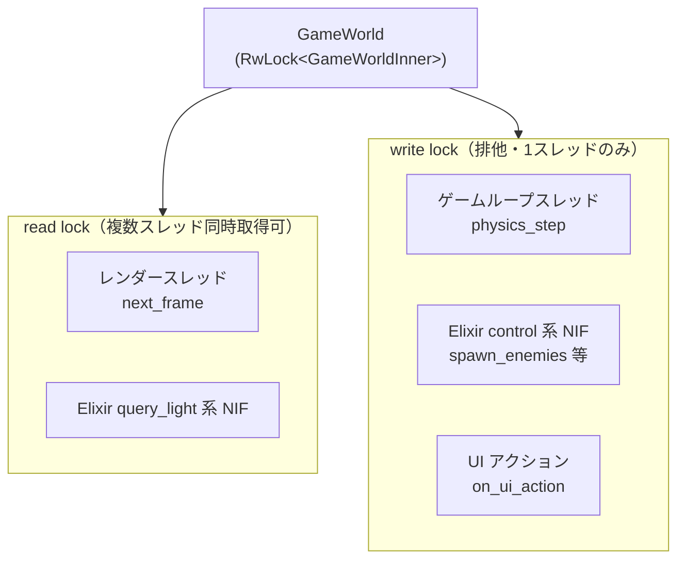

**競合監視（`lock_metrics.rs`）:**
- read lock 待機 > 300μs → `log::warn!`
- write lock 待機 > 500μs → `log::warn!`
- 5 秒ごとに平均待機時間をレポート

### NIF 関数カテゴリ別ロック種別

| カテゴリ | 代表関数 | ロック | 呼び出し頻度 |
|:---|:---|:---|:---|
| control | `create_world`, `spawn_enemies`, `set_entity_params` | write | 低（起動時・イベント時） |
| inject | `set_hud_state`, `set_hud_level_state`, `set_boss_velocity`, `set_weapon_slots` | write | 高（毎フレーム） |
| query_light | `get_player_hp`, `get_enemy_count`, `get_boss_state` | read | 高（毎フレーム可） |
| snapshot_heavy | `get_save_snapshot`, `load_save_snapshot` | write | 低（明示操作時） |
| game_loop | `physics_step`, `drain_frame_events` | write | 高（60Hz） |

---

## イベントバス（Elixir 内）

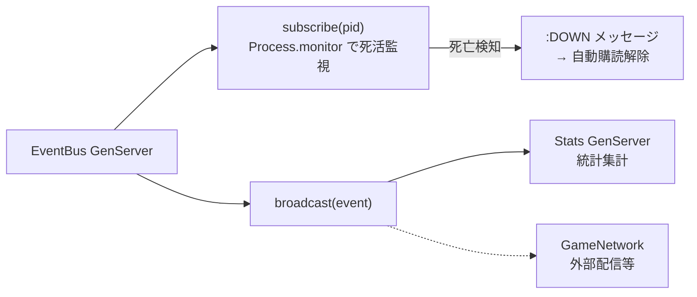

サブスクライバーが死亡した場合、`{:DOWN, ...}` メッセージで自動的に購読解除されます。

---

## セーブ/ロードフロー

### セーブ

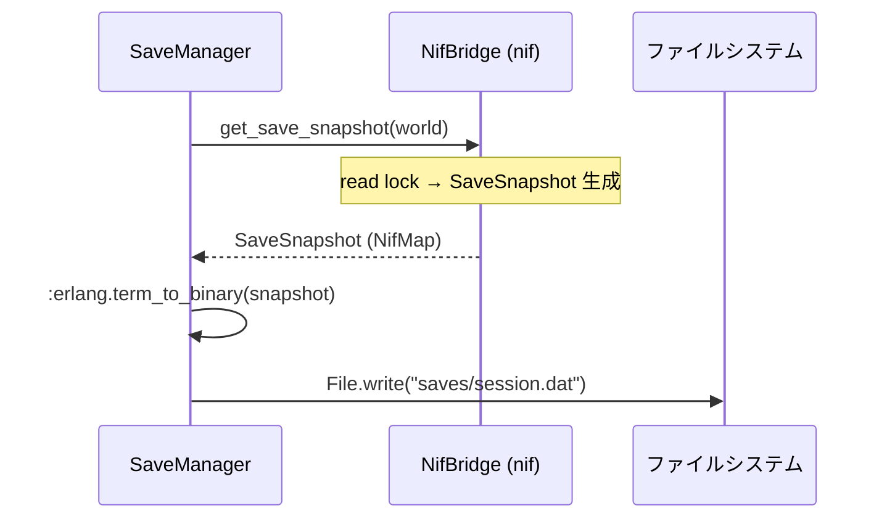

### ロード

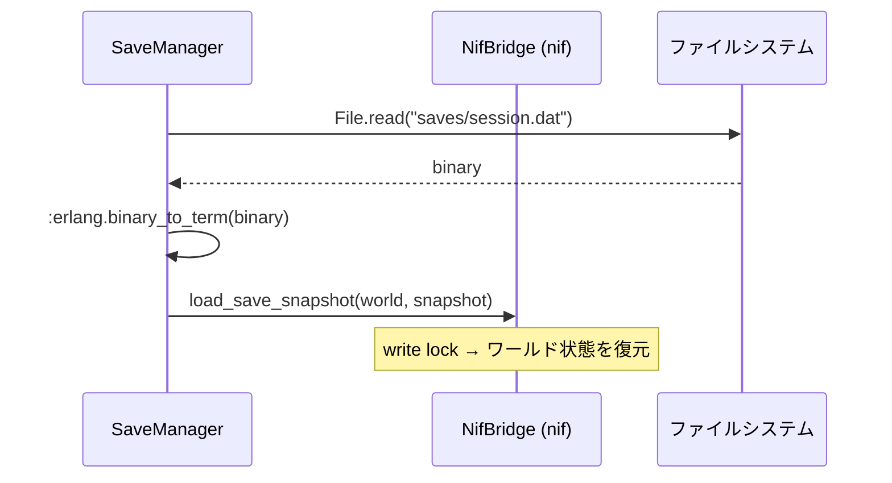

### ハイスコア

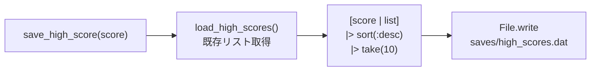

---

## スレッドモデル

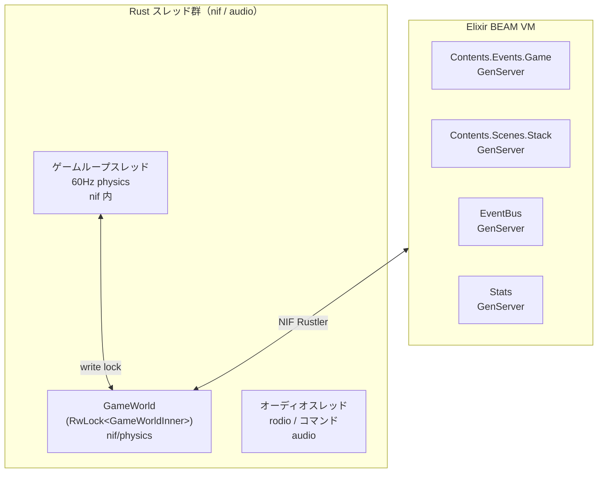

描画は `app`（VRAlchemy exe）プロセス内で行われる（Zenoh 経由で frame を受信）。

---

## 関連ドキュメント

- [**ビジョンと設計思想**](../vision.md) ← エンジン・ワールド・ルール・ゲームの定義
- **Elixir レイヤー**: [server](./elixir/server.md) / [core](./elixir/core.md) / [contents](./elixir/contents.md)（ゲームコンテンツ一覧・設計パターン含む）/ [network](./elixir/network.md)
- **Rust レイヤー**: [nif](./rust/nif.md)（physics 内包）/ [desktop_client](./rust/desktop_client.md)（app / VRAlchemy）/ [desktop 詳細](./rust/desktop/)（[input](./rust/desktop/input.md) = window / [render](./rust/desktop/render.md) = render / [input_openxr](./rust/desktop/input_openxr.md)）/ [nif/physics](./rust/nif/physics.md) / [audio](./rust/nif/audio.md) / [launcher](./rust/launcher.md)
- [改善計画](../plan/reference/improvement-plan.md) ← 既知の弱点と改善方針
