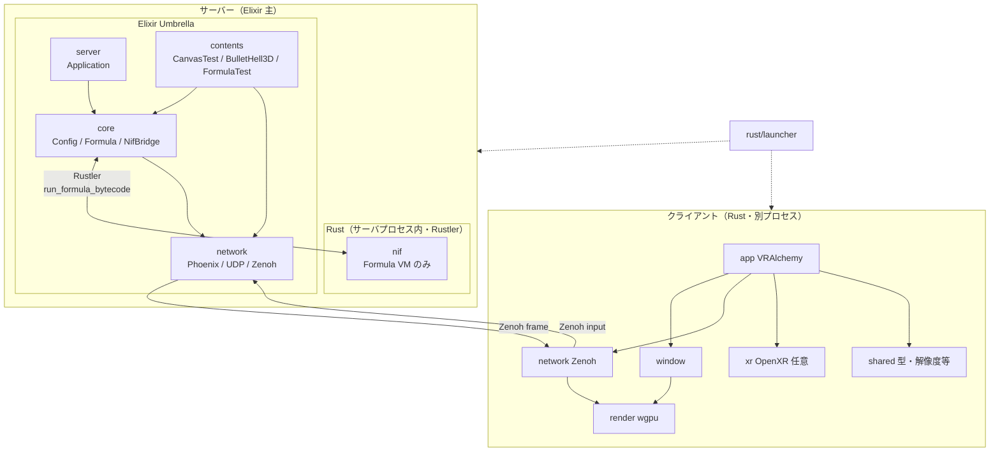
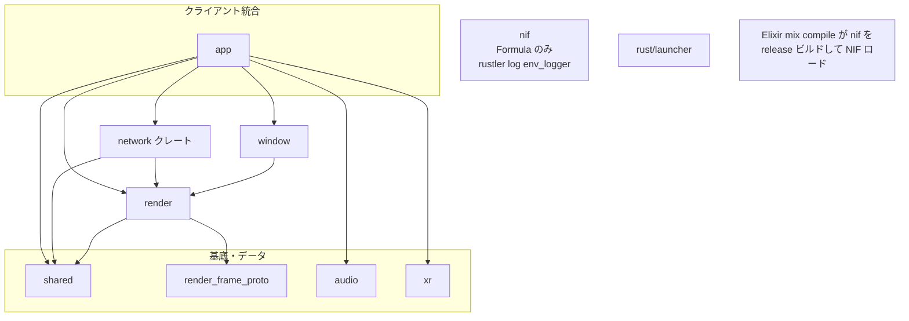
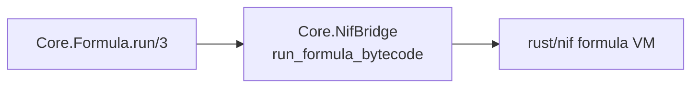
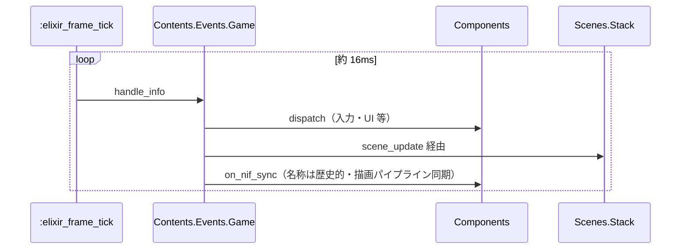
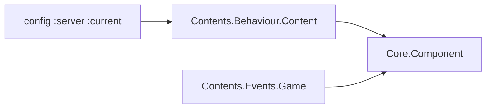
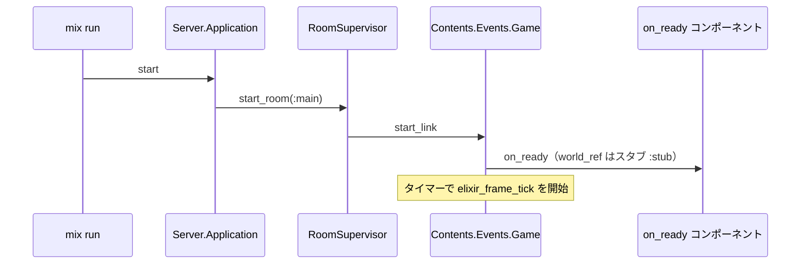
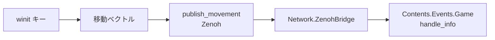
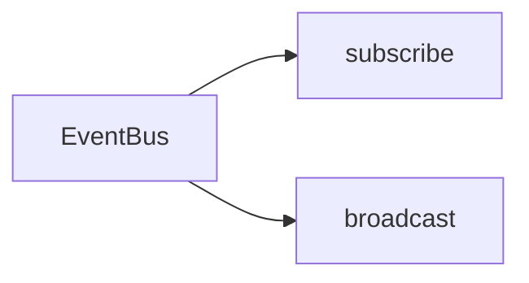
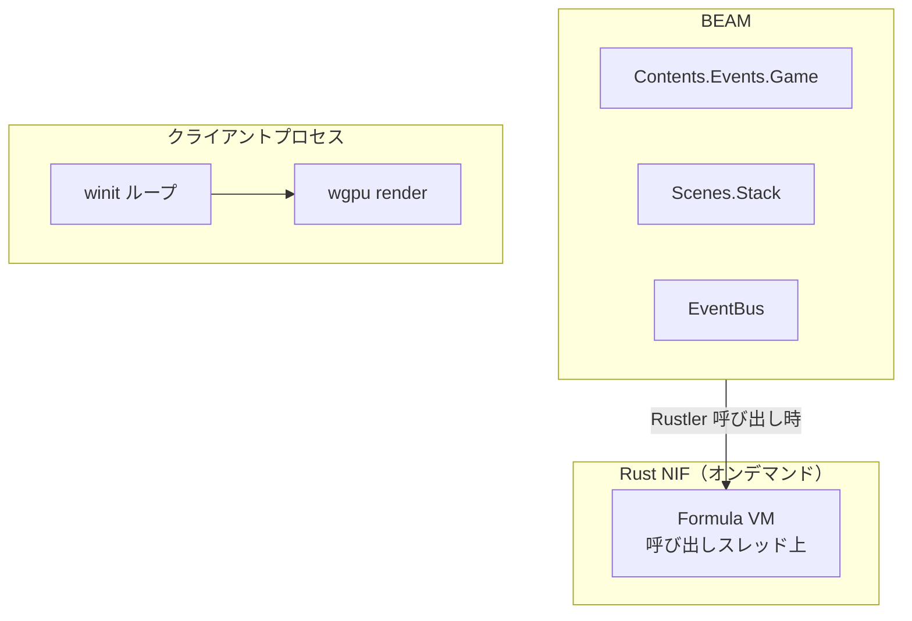

# AlchemyEngine — アーキテクチャ概要

> **2026-04 更新**: ゲーム用 Rust NIF（`rust/nif` 内 physics / 60Hz ループ）は撤去済み。サーバ上のゲーム状態・シミュレーションは **Elixir（contents）** が主担当。`nif` は **Formula VM（`run_formula_bytecode`）のみ**。ローカルディスクセーブは未実装。

## 設計思想

AlchemyEngine は **サーバー上の権威あるゲーム状態とルール**を **Elixir** を中心に置き、**数式 VM の実行**と**デスクトップ描画**に Rust を使う構成です。入力のキャプチャとサーバー側の公式入力列・tick 方針の整理は [authoritative-state-sync-policy.md](./authoritative-state-sync-policy.md) を参照。

### 二層の SSoT（ドメインとワイヤ契約）

ドキュメントや議論で **「SSoT」** と書くとき、**何についての単一の真実か**を混同しないようにします。

| 対象 | 主な担い手 | 例 |
|:---|:---|:---|
| **ドメイン**（公式状態、ルール、コンテンツ定義、「いつ何を送るか」の判断） | **Elixir**（contents / core / network のアプリロジック） | ルーム、tick、コンポーネント、`Content.FrameEncoder` が組み立てる論理データ |
| **ワイヤ契約**（プロセスや言語をまたいで **同じバイト列の意味** に合意する形） | **`proto/*.proto`**（Elixir / Rust は生成コードで従う） | `RenderFrame`、入力イベント等の Protobuf。UDP の外側ヘッダは `Network.UDP.Protocol` の独自バイナリ。Phoenix Channel は JSON など経路ごとのフォーマットあり |

**Elixir がドメインの SSoT であること**と、**`.proto` がバイナリメッセージ形の SSoT であること**は両立します。前者を捨てて後者に一本化する必要はありません。

- **Elixir（サーバ）**: シーン・コンポーネント・メインループ（約 16ms タイマー）、Zenoh への `RenderFrame` publish、入力・イベントの受信
- **Rust（サーバ `nif`）**: `Core.Formula` 経由のバイトコード実行のみ（Rustler NIF）
- **Rust（クライアント `app`）**: winit / wgpu 描画、Zenoh でフレーム受信・入力送信。`xr` は OpenXR（クライアント側）。**`nif` には依存しない**

---

## 全体構成



---

## ディレクトリ構造（ソース単位・要約）

```
alchemy-engine/
├── config/                    # :server :current（コンテンツ切替）等
├── apps/
│   ├── core/lib/core/         # NifBridge（Formula のみ）, Formula, Config, EventBus, …
│   ├── server/                # OTP 起動
│   ├── contents/lib/          # 維持 3 コンテンツ + behaviour / events / scenes / components
│   └── network/               # ZenohBridge, UDP, Phoenix …
├── rust/
│   ├── Cargo.toml             # ワークスペース（members に nif / launcher / client/*）
│   ├── nif/                   # Rustler・Formula VM のみ（physics なし）
│   ├── launcher/              # ルーター・サーバ・クライアント起動
│   └── client/
│       ├── shared/            # 契約型・display（既定解像度）等
│       ├── render_frame_proto/ # RenderFrame protobuf デコード
│       ├── network/           # クライアント側 Zenoh
│       ├── render/, window/   # wgpu / winit
│       ├── app/               # VRAlchemy（nif に非依存）
│       └── xr/, audio/        # クライアント VR・音声
├── proto/                     # render_frame / input 等
└── assets/
```

（削除済みコンテンツ用の `*.ex` はリポジトリに含めない。）

---

## Rust クレート依存関係（ワークスペース）



- **サーバ**: `core` アプリが **`nif` DLL** のみロード（Formula）。`nif` は **`audio` / `render` とリンクしない**。
- **クライアント**: `app` は **`nif` に依存しない**（既定ウィンドウサイズは `shared::display`）。

---

## レイヤー間の責務分担

| レイヤー | 責務 | 技術 |
|:---|:---|:---|
| `server` | OTP 起動・Supervisor | Elixir |
| `core` | `Core.Config`、`Core.Formula` → NIF、Telemetry 等 | Elixir / Rustler（Formula のみ） |
| `contents` | `Contents.Events.Game`（タイマー駆動 tick）、`Scenes.Stack`、コンテンツ・コンポーネント | Elixir |
| `network` | Phoenix / UDP / Zenoh（フレーム publish・入力） | Elixir / Zenohex |
| `nif` | `run_formula_bytecode`（VM） | Rust / Rustler |
| `render` / `window` / `app` | クライアント描画・入力・Zenoh | Rust / wgpu / winit |
| `xr` | OpenXR（クライアント。サーバへは Zenoh 等でメッセージ化） | Rust（optional OpenXR） |
| `audio` | クライアント側音声（`app` から利用） | Rust / rodio |

---

## 主要な設計パターン

### 1. Formula NIF（サーバ）



アプリ・コンテンツは **`Core.Formula` 経由**。ゲームワールド用 `ResourceArc` は **持たない**。

### 2. メインループ（`:main` ルーム・Elixir）



ネットワーク等からの `{:frame_events, _}` は **後方互換で受信可能**だが、Rust 60Hz ゲームループは **ない**。

### 3. 描画の Zenoh 配信

Render コンポーネント → `FrameEncoder` → protobuf → `FrameBroadcaster` → Zenoh → **クライアント `app`** が subscribe して描画。

### 4. Contents.Behaviour.Content + Component



**第一級コンテンツ（現行）**: `Content.CanvasTest`, `Content.BulletHell3D`, `Content.FormulaTest`（`Core.Config` のフォールバック既定は `BulletHell3D`）。

---

## 起動シーケンス（サーバ・要約）



---

## ユーザー入力（クライアント → サーバ）



VR 系はクライアント `xr` → 同様に **Zenoh/UDP 経由**で Elixir が `handle_info`（`:head_pose` 等）を受ける想定。**NIF 非経由**。

### UI アクション（例）

egui → `publish_action` → サーバ `{:ui_action, action}`。永続化 `__save__` / `__load__` は **現状ログのみ**（ローカルセーブ未実装）。

---

## イベントバス（Elixir 内）



---

## 永続化（セーブ / ハイスコア）

**現状未実装**（ディスクへのセッション・ハイスコア保存なし）。再導入時はネットワーク・権威付き状態の設計と併せて別途。

---

## スレッドモデル（要約）



ゲーム用 **Rust 60Hz スレッド + GameWorld RwLock** は **廃止済み**。

---

## 関連ドキュメント

- [ビジョンと設計思想](../vision.md)
- **Elixir**: [server](./elixir/server.md) / [core](./elixir/core.md) / [contents](./elixir/contents.md) / [network](./elixir/network.md)
- **Rust**: [nif](./rust/nif.md) / [desktop_client](./rust/desktop_client.md) / [desktop/input](./rust/desktop/input.md) / [desktop/render](./rust/desktop/render.md) / [launcher](./rust/launcher.md) / [audio](./rust/nif/audio.md)
- **歴史（削除済み physics）**: [nif/physics](./rust/nif/physics.md) はアーカイブ参照用
