# AlchemyEngine — アーキテクチャ概要

## 設計思想

AlchemyEngine は **Elixir を Single Source of Truth（SSoT）** として、Rust の ECS で物理演算・描画・オーディオを処理するハイブリッドゲームエンジンです。

- **Elixir 側**: ゲームロジックの制御フロー・セーブ/ロード・イベント配信（シーン管理は contents 層）
- **Rust 側**: 60Hz 固定の物理演算・衝突判定・描画・オーディオ

---

## 全体構成

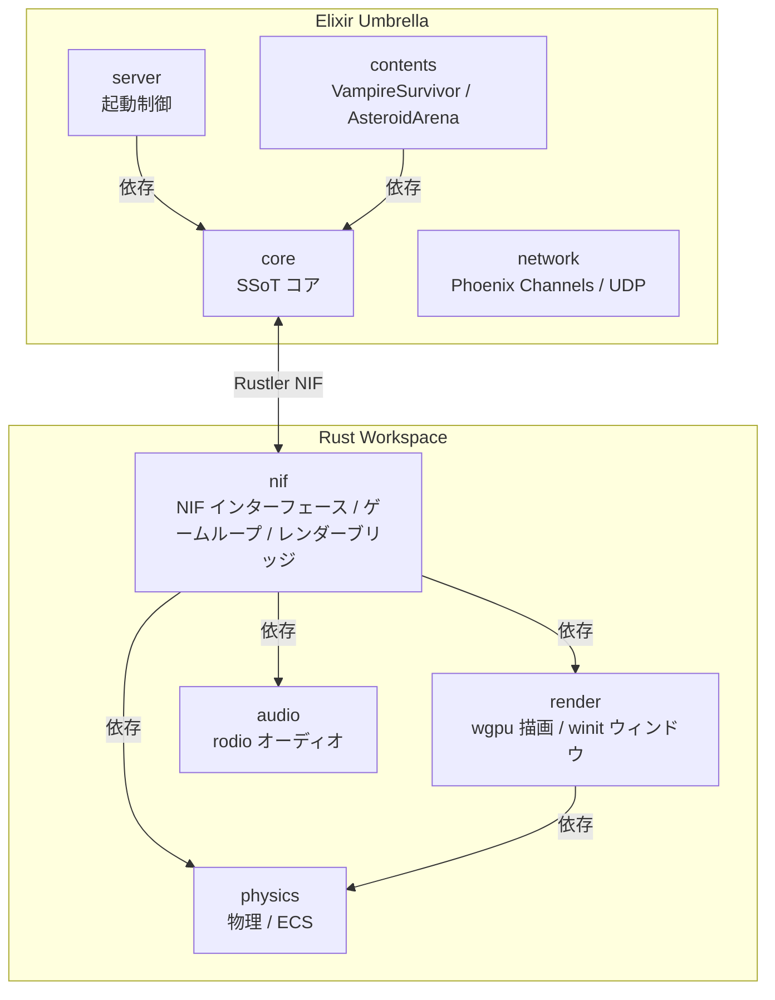

---

## ディレクトリ構造（ソース単位）

```
alchemy-engine/
├── mix.exs                          # Umbrella ルートプロジェクト定義
├── mix.lock                         # Elixir 依存ロックファイル
├── config/
│   ├── config.exs                   # :current / :map / libcluster / save_hmac_secret 等
│   └── runtime.exs                  # 実行時設定（ポート等）
│
├── apps/                            # Elixir アプリケーション群
│   ├── core/                        # SSoT コアエンジン
│   │   ├── mix.exs
│   │   └── lib/core/
│   │       ├── core.ex              # 公開 API（エントリポイント）
│   │       ├── nif_bridge.ex        # Rustler NIF ラッパー
│   │       ├── nif_bridge_behaviour.ex  # NifBridge ビヘイビア（テスト用 Mock 対応）
│   │       ├── content_behaviour.ex # ContentBehaviour（コンテンツ定義インターフェース）
│   │       ├── component.ex         # Component ビヘイビア（コンテンツ構成単位）
│   │       ├── config.ex            # :current コンテンツモジュール解決
│   │       ├── room_supervisor.ex   # DynamicSupervisor
│   │       ├── room_registry.ex     # Registry ラッパー
│   │       ├── event_bus.ex         # フレームイベント配信 GenServer（subscribe / broadcast）
│   │       ├── input_handler.ex     # キー入力 GenServer
│   │       ├── frame_cache.ex       # フレームスナップショット ETS
│   │       ├── map_loader.ex        # マップ障害物定義
│   │       ├── save_manager.ex      # セーブ/ロード
│   │       ├── stats.ex             # セッション統計 GenServer
│   │       ├── telemetry.ex         # Telemetry Supervisor
│   │       └── stress_monitor.ex    # パフォーマンス監視 GenServer
│   │
│   ├── server/                      # 起動プロセス
│   │   ├── mix.exs
│   │   └── lib/server/
│   │       ├── server.ex
│   │       └── application.ex       # OTP Application / Supervisor ツリー
│   │
│   ├── contents/                    # ゲームコンテンツ
│   │   ├── mix.exs
│   │   └── lib/contents/
│   │       ├── contents.ex                # Content モジュール（コンテンツ一覧）
│   │       ├── game_events.ex             # メインゲームループ GenServer（contents 層）
│   │       ├── game_events/
│   │       │   └── diagnostics.ex         # ログ・FrameCache 更新ヘルパー
│   │       ├── scene_behaviour.ex         # シーンコールバック定義（contents 層）
│   │       ├── scene_stack.ex             # シーンスタック管理 GenServer（contents 層）
│   │       ├── entity_params.ex           # EXP・スコア・ボスパラメータ（Elixir SSoT）
│   │       ├── content_loader.ex          # 将来用: descriptor ベースコンテンツ（stub）
│   │       ├── content_runner.ex          # 将来用: descriptor ベースコンテンツ（stub）
│   │       ├── component_registry.ex      # 将来用: descriptor ベースコンテンツ（stub）
│   │       ├── vampire_survivor.ex        # Content.VampireSurvivor
│   │       ├── vampire_survivor/
│   │       │   ├── spawn_component.ex
│   │       │   ├── level_component.ex
│   │       │   ├── boss_component.ex
│   │       │   ├── render_component.ex
│   │       │   ├── spawn_system.ex
│   │       │   ├── boss_system.ex
│   │       │   ├── level_system.ex
│   │       │   └── scenes/ playing.ex, level_up.ex, boss_alert.ex, game_over.ex
│   │       ├── asteroid_arena.ex          # Content.AsteroidArena
│   │       ├── asteroid_arena/
│   │       │   ├── spawn_component.ex
│   │       │   ├── split_component.ex
│   │       │   ├── spawn_system.ex
│   │       │   └── scenes/ playing.ex, game_over.ex
│   │       ├── simple_box_3d.ex           # Content.SimpleBox3D（Phase R-6 動作検証）
│   │       ├── simple_box_3d/
│   │       │   ├── spawn_component.ex, input_component.ex, render_component.ex
│   │       │   └── scenes/ playing.ex, game_over.ex
│   │       ├── bullet_hell_3d.ex          # Content.BulletHell3D（3D 弾幕避け）
│   │       ├── bullet_hell_3d/
│   │       │   ├── spawn_component.ex, input_component.ex, render_component.ex
│   │       │   ├── bullet_component.ex, damage_component.ex
│   │       │   └── scenes/ playing.ex, game_over.ex
│   │       ├── rolling_ball.ex            # Content.RollingBall（玉転がし）
│   │       ├── rolling_ball/
│   │       │   ├── spawn_component.ex, physics_component.ex, render_component.ex
│   │       │   ├── stage_data.ex
│   │       │   └── scenes/ title.ex, playing.ex, stage_clear.ex, ending.ex, game_over.ex
│   │       ├── vr_test.ex                 # Content.VRTest（VR 動作検証）
│   │       ├── vr_test/
│   │       │   ├── spawn_component.ex, input_component.ex, render_component.ex
│   │       │   └── scenes/ playing.ex, game_over.ex
│   │       ├── canvas_test.ex             # Content.CanvasTest（描画テスト）
│   │       └── canvas_test/
│   │           ├── input_component.ex, render_component.ex
│   │           └── scenes/ playing.ex
│   │
│   └── network/                     # 通信レイヤー
│       ├── mix.exs                  # deps: phoenix ~> 1.8, phoenix_pubsub, plug_cowboy, libcluster
│       └── lib/network/
│           ├── network.ex           # Distributed / Local / Channel / UDP 委譲
│           ├── application.ex
│           ├── local.ex             # ローカルマルチルーム管理 GenServer
│           ├── distributed.ex       # 複数ノード間ルーム管理（libcluster クラスタ時）
│           ├── room_token.ex        # Phoenix.Token によるルーム参加認証
│           ├── channel.ex           # Phoenix Channels / WebSocket
│           ├── endpoint.ex          # Phoenix Endpoint（ポート 4000）
│           ├── router.ex
│           ├── user_socket.ex
│           └── udp/
│               ├── server.ex        # UDP サーバー（ポート 4001）
│               └── protocol.ex
│
├── native/                          # Rust クレート群
│   ├── Cargo.toml                   # Rust ワークスペース定義
│   ├── Cargo.lock
│   │
│   ├── physics/                  # 物理演算・ECS（依存: rustc-hash / rayon / log）
│   ├── nif/                         # NIF ブリッジ・ゲームループ・RenderFrameBuffer
│   ├── audio/                       # rodio オーディオ管理
│   ├── render/                      # wgpu 描画パイプライン
│   ├── input/                       # デスクトップ入力・winit イベントループ（render に依存）
│   └── input_openxr/                # OpenXR 入力ブリッジ（VR）
│
├── assets/                          # スプライト・音声アセット
└── saves/                           # セーブデータ
```

---

## レイヤー間の責務分担

| レイヤー | 責務 | 技術 |
|:---|:---|:---|
| `server` | OTP Application 起動・Supervisor ツリー構築 | Elixir / OTP |
| `core` | ゲームループ制御・イベント受信・セーブ・ContentBehaviour / Component インターフェース定義 | Elixir GenServer / ETS |
| `contents` | GameEvents・シーンスタック・SceneBehaviour・ContentBehaviour 実装・Component 群・エンティティパラメータ | Elixir |
| `network` | Phoenix Channels（WebSocket）・UDP トランスポート・ローカルマルチルーム管理 | Elixir / Phoenix |
| `nif` | Elixir-Rust 間 NIF ブリッジ・ゲームループ・RenderFrameBuffer・push_render_frame デコード | Rust / Rustler |
| `physics` | 物理演算・空間ハッシュ・ECS・外部注入パラメータテーブル | Rust |
| `render` | GPU 描画パイプライン・HUD・winit ウィンドウ管理・ヘッドレスモード | Rust / wgpu / egui / winit |
| `audio` | オーディオ管理・アセット読み込み | Rust / rodio |

---

## 主要な設計パターン

### 1. Rustler NIF による状態共有

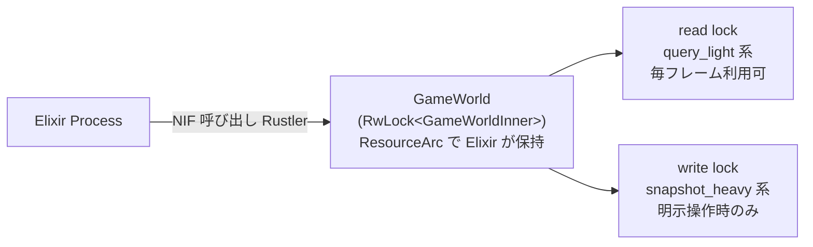

### 2. SoA（Structure of Arrays）によるキャッシュ効率化

```rust
EnemyWorld {
    positions_x: Vec<f32>,   // 全敵の X 座標
    positions_y: Vec<f32>,   // 全敵の Y 座標
    velocities:  Vec<[f32;2]>,
    hp:          Vec<f32>,
    alive:       Vec<bool>,
    free_list:   Vec<usize>, // O(1) スポーン/キル
}
```

### 3. イベント駆動ゲームループ

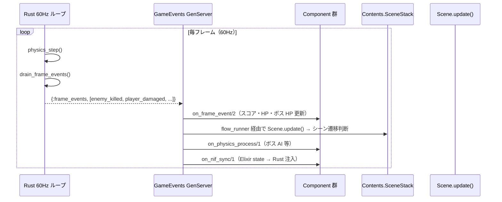

### 4. Phase R-2: Elixir 側による描画命令 push

Elixir 側（contents）が DrawCommand リスト・CameraParams・UiCanvas を組み立て、`push_render_frame` NIF 経由で `RenderFrameBuffer` に書き込む。Rust の `RenderBridge::next_frame()` はこのバッファから RenderFrame を取得し、2D の場合は GameWorld から補間データを読み取ってプレイヤー座標を補間する。

### 5. ContentBehaviour + Component による拡張設計

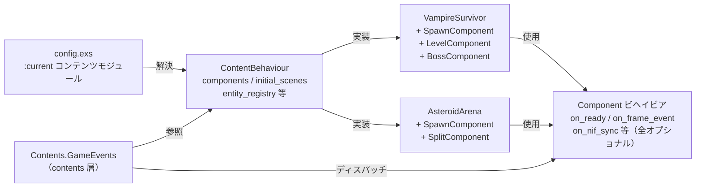

---

# データフロー・通信

## 起動シーケンス

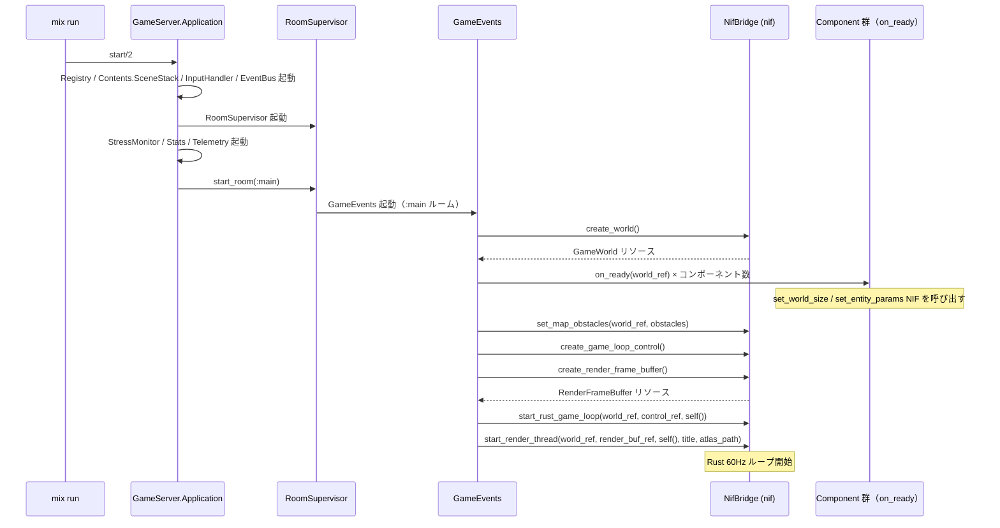

---

## メインゲームループ（定常状態）

### Rust 側（60Hz 固定ループ）

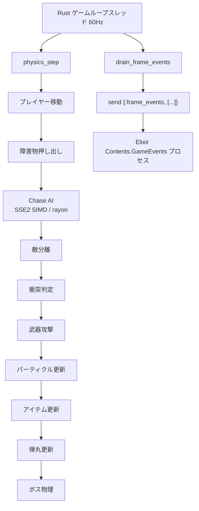

### Elixir 側（イベント駆動）

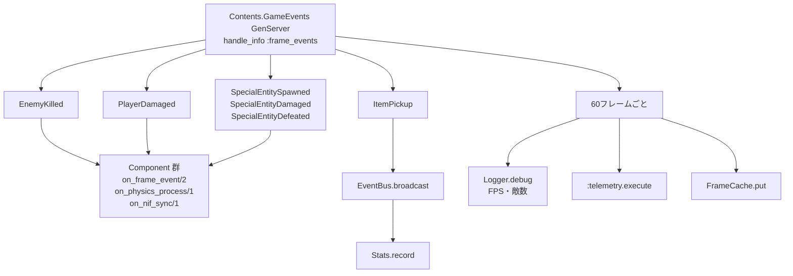

**フレーム処理の順序（毎フレーム）:**

1. `on_frame_event/2` — 全コンポーネントにフレームイベントを配信（スコア・HP・ボス HP 更新）
2. `Scene.update/2` — シーン遷移判断
3. `on_physics_process/1` — ボス AI 等の物理コールバック（NIF 書き込みを含む）
4. `on_nif_sync/1` — Elixir state を Rust 側に注入。RenderComponent は `push_render_frame` で DrawCommand・Camera・UiCanvas を RenderFrameBuffer に書き込む

---

## レンダリングスレッド（非同期）

Phase R-2: RenderBridge は `RenderFrameBuffer` から RenderFrame を取得する。Elixir の RenderComponent が `push_render_frame` で毎フレーム書き込む。2D の場合は GameWorld から補間データを読み取り PlayerSprite の座標を補間する。

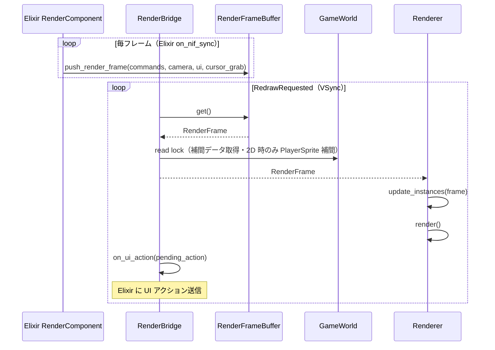

---

## ユーザー入力フロー

### キーボード入力（移動）


### UI アクション（武器選択・セーブ等）


---

## NIF 通信詳細

### RwLock 競合戦略

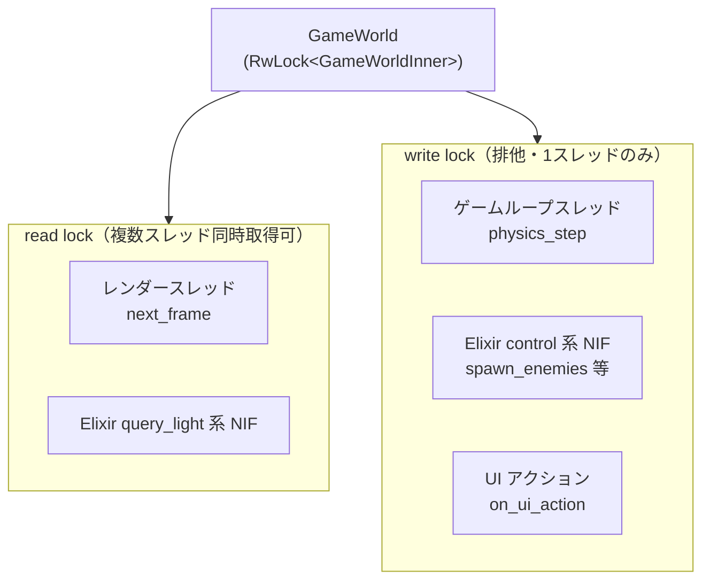

**競合監視（`lock_metrics.rs`）:**
- read lock 待機 > 300μs → `log::warn!`
- write lock 待機 > 500μs → `log::warn!`
- 5 秒ごとに平均待機時間をレポート

### NIF 関数カテゴリ別ロック種別

| カテゴリ | 代表関数 | ロック | 呼び出し頻度 |
|:---|:---|:---|:---|
| control | `create_world`, `create_render_frame_buffer`, `spawn_enemies`, `set_entity_params` | write | 低（起動時・イベント時） |
| inject | `set_hud_state`, `set_hud_level_state`, `set_boss_velocity`, `set_weapon_slots` | write | 高（毎フレーム） |
| render_push | `push_render_frame` | RenderFrameBuffer（別 RwLock） | 高（毎フレーム・on_nif_sync） |
| query_light | `get_player_hp`, `get_enemy_count`, `get_boss_state` | read | 高（毎フレーム可） |
| snapshot_heavy | `get_save_snapshot`, `load_save_snapshot` | write | 低（明示操作時） |
| game_loop | `physics_step`, `drain_frame_events` | write | 高（60Hz） |

---

## イベントバス（Elixir 内）

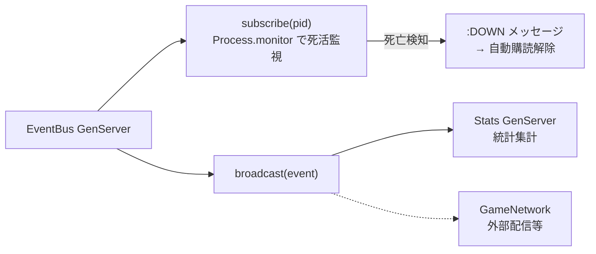

サブスクライバーが死亡した場合、`{:DOWN, ...}` メッセージで自動的に購読解除されます。

---

## セーブ/ロードフロー

### セーブ

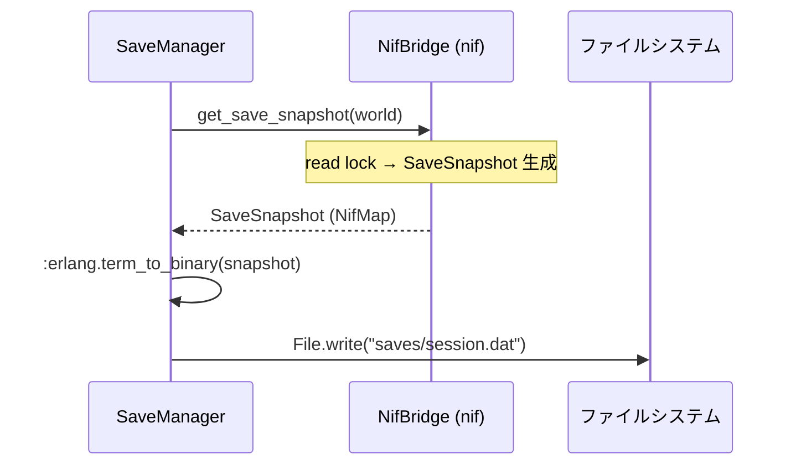

### ロード

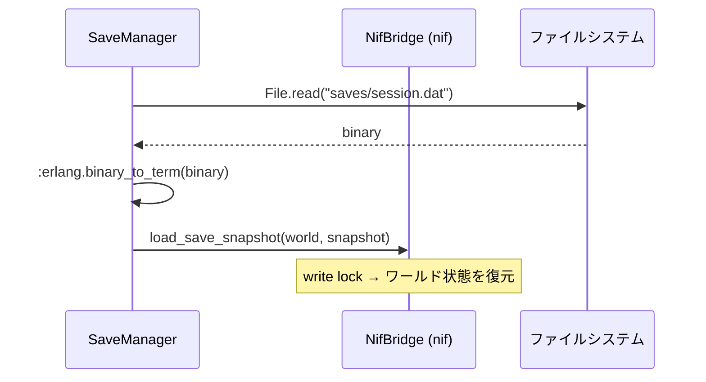

### ハイスコア

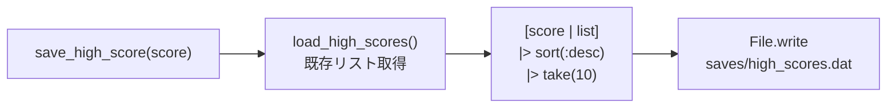

---

## スレッドモデル

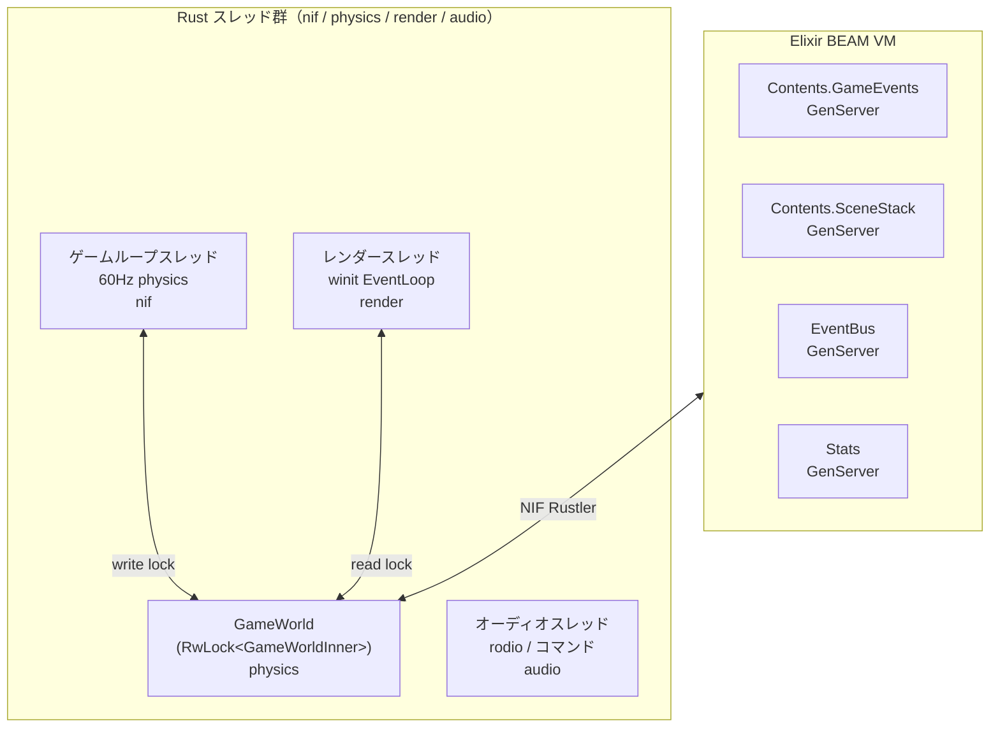

---

## 関連ドキュメント

- [**ビジョンと設計思想**](../vision.md) ← エンジン・ワールド・ルール・ゲームの定義
- **Elixir レイヤー**: [server](./elixir/server.md) / [core](./elixir/core.md) / [contents](./elixir/contents.md)（ゲームコンテンツ一覧・設計パターン含む）/ [network](./elixir/network.md)
- **Rust レイヤー**: [nif](./rust/nif.md) / [physics](./rust/physics.md) / [render](./rust/render.md) / [audio](./rust/audio.md) / [input_openxr](./rust/input_openxr.md)
- [改善計画](../task/improvement-plan.md) ← 既知の弱点と改善方針
