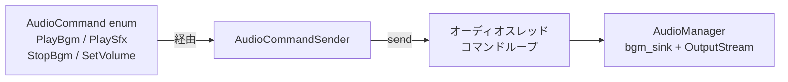
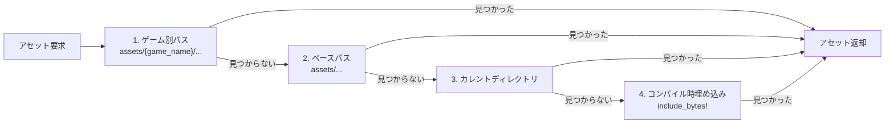

# Rust: audio — オーディオ管理

## 概要

`audio` クレートは rodio によるオーディオ再生とアセット読み込みを担当します。コマンド送信で BGM / SE の再生・停止・音量制御を行います。

---

## `audio.rs`

---

## `asset/mod.rs` — アセット管理

---

## 関連ドキュメント

- [アーキテクチャ概要](../overview.md)
- [nif](./nif.md)
