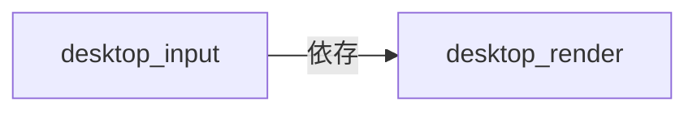
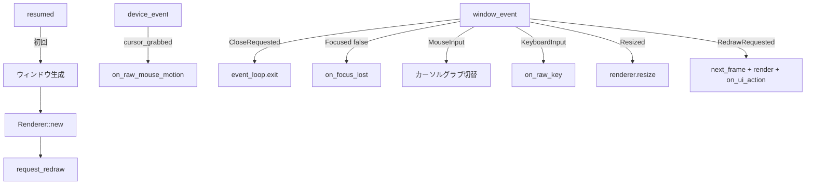

# Rust: desktop_input — デスクトップ入力・ウィンドウ・イベントループ

## 概要

`desktop_input` は **winit** によるウィンドウ生成とイベントループを担当します。`desktop_render` の `Renderer` を用いて描画しますが、イベントループの所有権はここにあります。

- **パス**: `native/desktop_input/`
- **依存**: `desktop_render`, `winit`, `pollster`

---

## クレート構成



---

## run_desktop_loop

### シグネチャ

```rust
pub fn run_desktop_loop<B: RenderBridge>(bridge: B, config: WindowConfig) -> Result<(), String>
```

`RenderBridge` トレイトを実装した任意のブリッジを受け取り、winit の `EventLoop` を構築して `ApplicationHandler` として実行します。

### 利用側

| 呼び出し元 | ブリッジ | 用途 |
|:---|:---|:---|
| `nif`（`run_render_thread`） | `NativeRenderBridge` | ローカル NIF モード |
| `desktop_client` | `NetworkRenderBridge` | Zenoh リモートモード |

---

## desktop_loop.rs — イベントハンドリング

### DesktopApp 構造体

- `bridge: B` — RenderBridge 実装
- `config: WindowConfig` — ウィンドウ設定
- `window: Option<Arc<Window>>`
- `renderer: Option<Renderer>`
- `ui_state: GameUiState`
- `cursor_grabbed: bool`
- `suppress_grab_frames: u8` — グラブ解除直後の誤検知防止

### イベントフロー



### イベント別処理

| イベント | 処理 |
|:---|:---|
| `resumed` | ウィンドウ未生成なら `create_window` → `Renderer::new`（pollster::block_on）→ `request_redraw` |
| `DeviceEvent::MouseMotion` | `cursor_grabbed` 時のみ `bridge.on_raw_mouse_motion(dx, dy)` |
| `WindowEvent::CloseRequested` | `event_loop.exit()` |
| `WindowEvent::Focused(false)` | グラブ解除、`bridge.on_focus_lost()` |
| `WindowEvent::MouseInput` | マウスクリックでカーソルグラブ切替（`suppress_grab_frames` で誤検知抑制） |
| `WindowEvent::KeyboardInput` | `repeat` を無視し、`bridge.on_raw_key(code, state)` |
| `WindowEvent::Resized` | `renderer.resize(width, height)` |
| `WindowEvent::RedrawRequested` | `bridge.next_frame()` → `frame.cursor_grab` でグラブ同期 → `renderer.update_instances` → `renderer.render` → `on_ui_action` → `request_redraw` |

### カーソルグラブ

- マウスクリックで `cursor_grabbed` をトグル
- `frame.cursor_grab` が `Some(grab)` ならその値に同期
- `suppress_grab_frames` でグラブ解除直後の余計な再グラブを防止

---

## 関連ドキュメント

- [アーキテクチャ概要](../../overview.md)
- [desktop_client](../desktop_client.md)
- [desktop/render](./render.md)（RenderBridge トレイト定義）
- [desktop/input_openxr](./input_openxr.md)（VR 入力）
