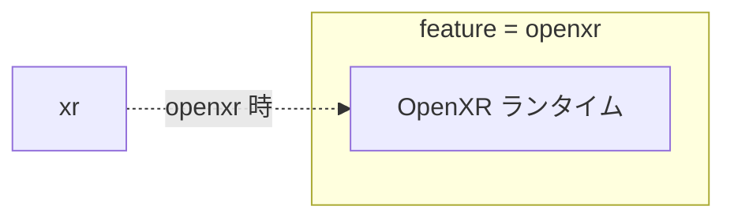

# Rust: xr — OpenXR 入力ブリッジ（VR）

## 概要

`xr` クレートは **OpenXR** を用いた VR 入力ブリッジです（The Shell for VR）。VR ヘッドセット・コントローラー・トラッカーの入力を受け取り、app が network 経由で Elixir に渡す役割を担います。

- **パス**: `rust/client/xr/`
- **依存**: `log = "0.4"`, `openxr = "0.21"`（`openxr` feature 有効時）

---

## クレート構成



---

## 機能

- **openxr** feature を有効にすると、OpenXR ランタイム経由で VR デバイスの入力を取得可能
- デスクトップのキーボード・マウスは [window](./input.md)（winit）が担当
- VR 入力は本クレートで別途扱う設計

---

## XrInputEvent 型

```rust
pub enum XrInputEvent {
    HeadPose { position, orientation, timestamp_us },
    ControllerPose { hand, position, orientation, timestamp_us },
    ControllerButton { hand, button, pressed },
    TrackerPose { tracker_id, position, orientation, velocity, timestamp_us },
}
```

---

## イベント送信先

nif 経由で Elixir に送信するアトム:

- `{:head_pose, data}` — ヘッドセットの位置・姿勢
- `{:controller_pose, data}` — コントローラーの位置・姿勢
- `{:controller_button, data}` — コントローラーボタン
- `{:tracker_pose, data}` — トラッカーの位置・姿勢

---

## run_xr_input_loop

```rust
pub fn run_xr_input_loop<F>(mut on_event: F)
where
    F: FnMut(XrInputEvent) + Send + 'static,
```

- VR ランタイムが利用できない場合は即座に戻る
- `openxr` フィーチャー有効時は OpenXR セッションを試行
- 現状は OpenXR 統合は未実装（スタブ）

---

## 関連ドキュメント

- [アーキテクチャ概要](../../overview.md)
- [desktop/input](./input.md)（デスクトップ入力・winit）
