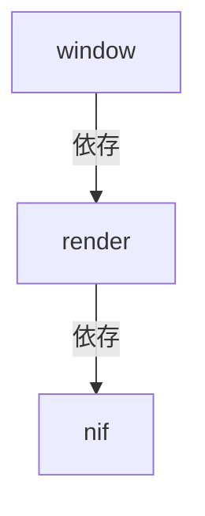
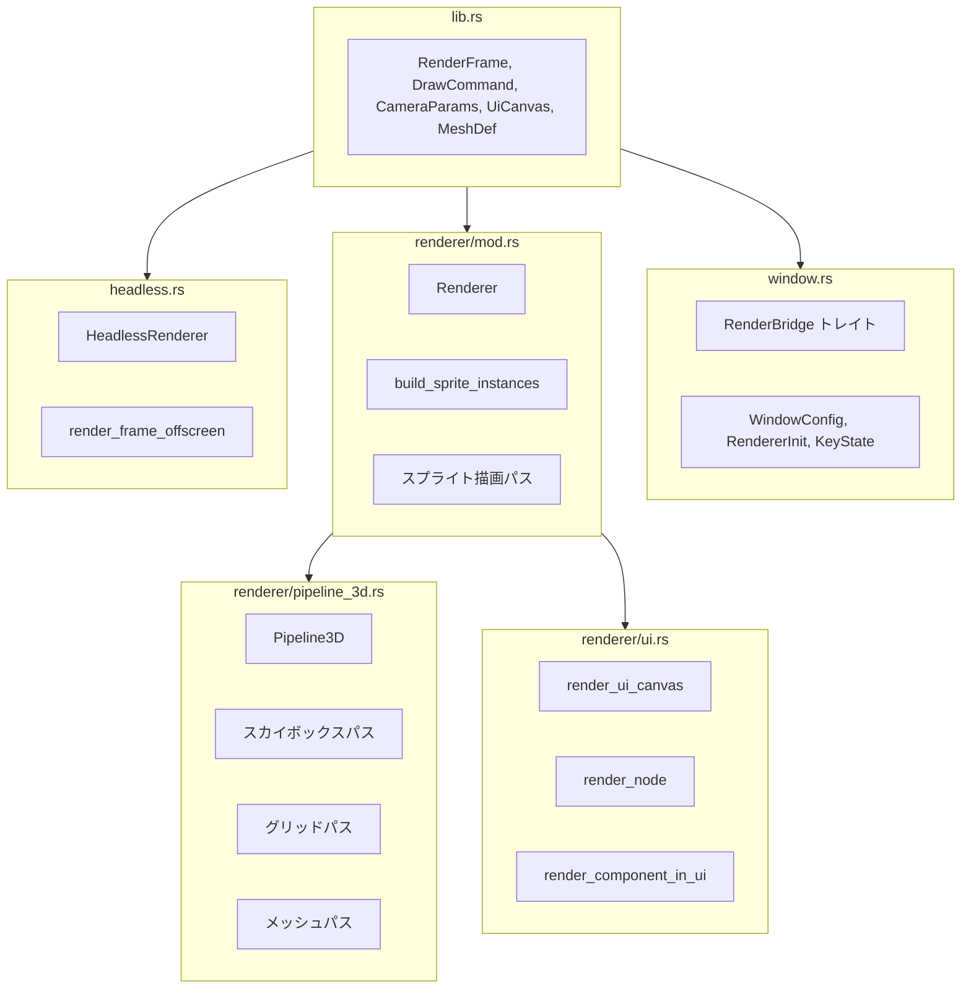
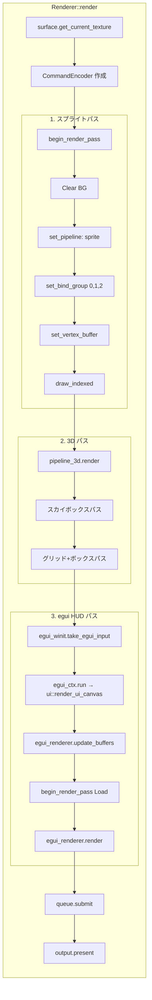
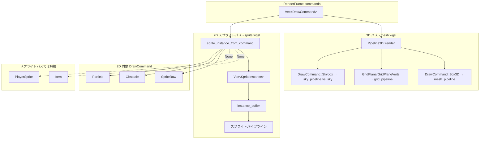
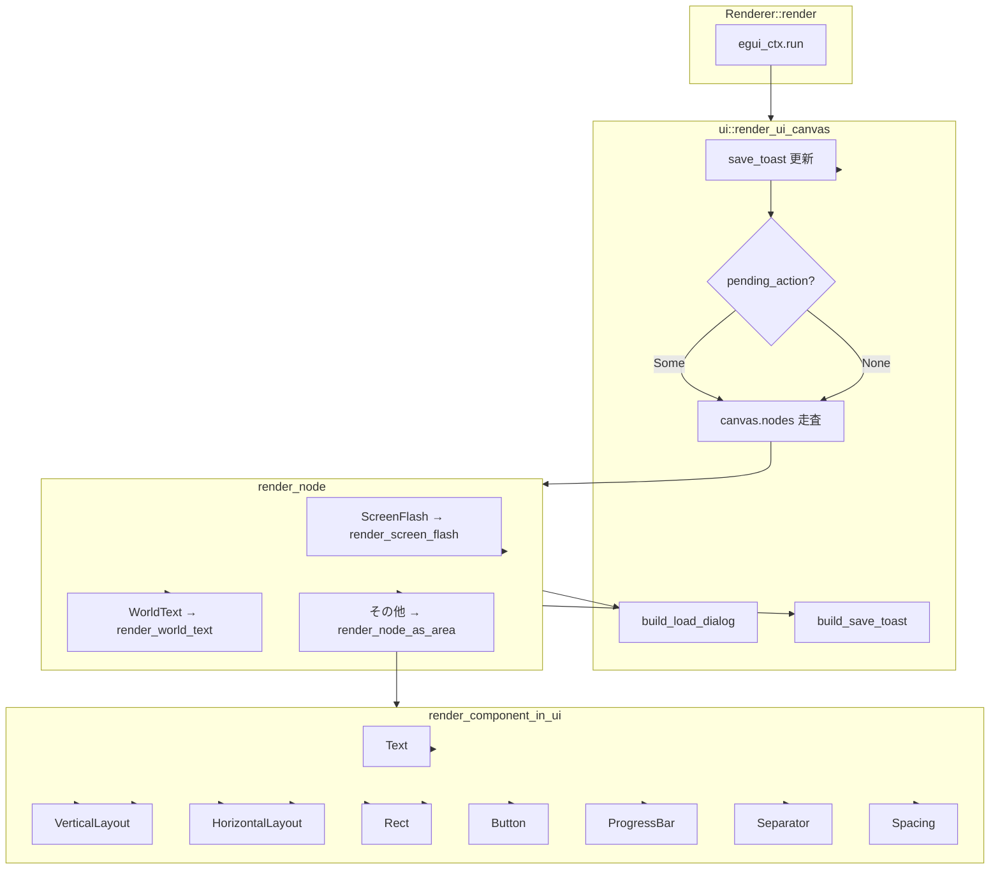
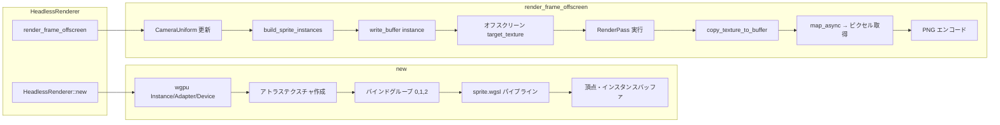

# Rust: render — 描画パイプライン・HUD

## 概要

`render` クレートは **wgpu** による GPU 描画パイプライン・**egui** HUD・ヘッドレスモードを担当します（The Eye）。ウィンドウとイベントループは [window](./input.md) が担当します。

**RenderFrame**（DrawCommand リスト・CameraParams・UiCanvas）は Elixir 側の Render コンポーネントが `Content.FrameEncoder` で protobuf（`proto/render_frame.proto`）にし、`FrameBroadcaster.put` → `Network.ZenohBridge.publish_frame` で Zenoh へ publish する。`app`（VRAlchemy）は `network` 経由で Zenoh の `game/room/{room_id}/frame` を subscribe し、`decode_pb_render_frame` でデコードして描画する。ローカル描画（NIF 内 RenderFrameBuffer）は廃止済み（Zenoh 専用）。

- **パス**: `native/render/`
- **依存**: `shared`, `prost`, `wgpu`, `winit`, `egui`, `bytemuck`, `image`, `pollster`, `log`

---

## クレート構成



---

## ソースコードレベルの流れ

### モジュール構成



### フレーム描画フロー（window 経由）

`window` のイベントループが `RedrawRequested` で描画を駆動する。`RenderBridge` を介して `render` が呼ばれる。

```mermaid
sequenceDiagram
    participant DL as desktop_loop
    participant RB as RenderBridge
    participant R as Renderer

    Note over DL,R: RedrawRequested イベント

    DL->>RB: next_frame()
    RB-->>DL: RenderFrame

    DL->>DL: cursor_grab 適用

    DL->>R: update_instances(frame)
    Note over R: CameraUniform 更新<br/>build_sprite_instances → instance_buffer

    DL->>R: render(window, ui, camera, commands, mesh_definitions, ui_state)
    Note over R: 描画パス実行（後述）
    R-->>DL: Option&lt;String&gt; (UI アクション)

    opt action あり
        DL->>RB: on_ui_action(action)
    end

    DL->>DL: window.request_redraw()
```

### render() 内部の描画パス順序



### DrawCommand → GPU 描画の変換フロー



### UiCanvas 描画フロー



### ヘッドレスモード（CI/テスト用）



---

## window.rs — RenderBridge トレイト・ウィンドウ設定

### RenderBridge トレイト

```rust
pub trait RenderBridge: Send + 'static {
    fn next_frame(&self) -> RenderFrame;
    fn on_ui_action(&self, action: String);
    fn on_raw_key(&self, key: KeyCode, state: KeyState);
    fn on_raw_mouse_motion(&self, dx: f32, dy: f32);
    fn on_focus_lost(&self);
}
```

### 型

- `WindowConfig` — タイトル・サイズ・`RendererInit`
- `RendererInit` — アトラス PNG、sprite.wgsl、mesh.wgsl（オプション）
- `KeyState` — `Pressed` / `Released`

### キー入力マッピング（ブリッジ経由で呼び出し元が処理）

| キー | 動作 |
|:---|:---|
| W / ↑ | 上移動 |
| S / ↓ | 下移動 |
| A / ← | 左移動 |
| D / → | 右移動 |
| 斜め入力 | 正規化（速度一定） |

### フレームループ（window の RedrawRequested）

`bridge.next_frame()` → `renderer.update_instances(frame)` → `renderer.render` → `bridge.on_ui_action(pending_action)`。

---

## lib.rs — 型定義

### RenderFrame

- `commands: Vec<DrawCommand>`
- `camera: CameraParams`
- `ui: UiCanvas`
- `cursor_grab: Option<bool>`
- `mesh_definitions: Vec<MeshDef>`

### DrawCommand

- `PlayerSprite`, `Particle`, `Item`, `Obstacle`
- `Box3D`, `GridPlane`, `GridPlaneVerts`, `Skybox`
- `SpriteRaw` — 汎用スプライト（UV・サイズをコンテンツ側が直接指定）

### CameraParams

- `Camera2D { offset_x, offset_y }`
- `Camera3D { eye, target, up, fov_deg, near, far }`

### UiCanvas / UiNode / UiComponent

vertical_layout, horizontal_layout, text, rect, progress_bar, button, world_text, screen_flash, separator, spacing 等。

---

## renderer/mod.rs — 描画パス

- `update_instances(RenderFrame)` — RenderFrame の `commands` から SpriteInstance 等を構築しインスタンスバッファ更新
- `render` — スプライトパス → egui HUD パス（`frame.ui`）
- DrawCommand: PlayerSprite, SpriteRaw, Particle, Item, Obstacle, Box3D, GridPlane, Skybox 等
- UiCanvas を egui で走査して描画

**スプライトアトラスレイアウト（1600×64px、2D コンテンツ用。旧 VampireSurvivor 系アセット互換）:**

| オフセット | 内容 |
|:---|:---|
| 0〜255 | プレイヤー 4 フレームアニメ |
| 256〜511 | 敵アニメ（Slime/Bat/Golem） |
| 512〜767 | 静止スプライト（アイテム等） |
| 768〜1023 | ボス（SlimeKing/BatLord/StoneGolem） |

---

## renderer/ui.rs — egui HUD

| 画面 | 内容 |
|:---|:---|
| タイトル | START ボタン |
| ゲームオーバー | 生存時間・スコア・撃破数・RETRY ボタン |
| プレイ中 | HP バー・EXP バー・スコア・タイマー・武器スロット・Save/Load |
| ボス戦 | 画面上部中央にボス HP バー |
| レベルアップ | 武器カード×3、Esc/1/2/3 キー対応、3 秒自動選択 |

---

## renderer/pipeline_3d.rs — 3D パイプライン

- Box3D, GridPlane, GridPlaneVerts, Skybox の描画
- mesh.wgsl を使用
- MVP 行列は CameraParams::Camera3D から計算

---

## headless.rs — ヘッドレスモード

CI / テスト向け。`[features] headless = []` で有効化。winit ウィンドウを開かずに描画パスを実行可能。

---

## シェーダー定義一覧（P4-1）

> 出典: [contents-defines-rust-executes.md](../../plan/backlog/contents-defines-rust-executes.md) P4-1  
> 目的: 現行シェーダー（sprite.wgsl, mesh.wgsl）の uniform・バインド・頂点レイアウトを SSoT として文書化。

### sprite.wgsl

| 項目 | 内容 |
|:---|:---|
| **パス** | `native/render/src/renderer/shaders/sprite.wgsl` または `assets/{game_id}/shaders/sprite.wgsl` |
| **用途** | 2D スプライト描画（アトラステクスチャ、インスタンシング） |
| **使用箇所** | `renderer/mod.rs`, `headless.rs` |

#### バインドグループ

| group | binding | 型 | 可視性 | 説明 |
|:---:|:---:|:---|:---|:---|
| 0 | 0 | `texture_2d<f32>` | FRAGMENT | スプライトアトラステクスチャ |
| 0 | 1 | `sampler` | FRAGMENT | サンプラー（ClampToEdge, Nearest） |
| 1 | 0 | `ScreenUniform` | VERTEX | 画面サイズ |
| 2 | 0 | `CameraUniform` | VERTEX | カメラオフセット（2D スクロール） |

#### Uniform 構造体

**ScreenUniform**（group 1）: `half_size`, `_pad`  
**CameraUniform**（group 2）: `offset`, `_pad`

#### 頂点・インスタンスレイアウト

**VertexInput**（location 0）: `vec2<f32>` 頂点位置  
**InstanceInput**（location 1〜5）: ワールド座標、サイズ、UV オフセット/サイズ、color_tint

#### Rust 側の対応

- Bind Group 0: アトラステクスチャビュー + サンプラー
- Bind Group 1: `ScreenUniform`（リサイズ時に更新）
- Bind Group 2: `CameraUniform`（`RenderFrame.camera` から更新）

### mesh.wgsl

| 項目 | 内容 |
|:---|:---|
| **パス** | `native/render/src/renderer/shaders/mesh.wgsl` または `assets/{game_id}/shaders/mesh.wgsl` |
| **用途** | 3D メッシュ（Box3D / GridPlane / Skybox）描画 |
| **使用箇所** | `renderer/pipeline_3d.rs` |

#### バインドグループ

| group | binding | 型 | 説明 |
|:---:|:---:|:---|:---|
| 0 | 0 | `MvpUniform` | Model-View-Projection 行列 |

#### 頂点レイアウト

**VertexInput**: `vec3<f32>` 位置、`vec4<f32>` 頂点色（`MeshVertex` と対応）

#### パイプライン別

| パイプライン | エントリポイント | MVP 使用 | トポロジ | 深度テスト |
|:---|:---|:---|:---|:---|
| mesh_pipeline | vs_main | あり | TriangleList | あり |
| grid_pipeline | vs_main | あり | LineList | あり |
| sky_pipeline | vs_sky | なし | TriangleList | なし |

### シェーダーと DrawCommand の対応

| シェーダー | DrawCommand | 備考 |
|:---|:---|:---|
| sprite.wgsl | SpriteRaw, Particle, Obstacle | 2D パス |
| mesh.wgsl (vs_main) | Box3D, GridPlane, GridPlaneVerts | 3D パス、深度テストあり |
| mesh.wgsl (vs_sky) | Skybox | 3D パス、深度テストなし |

### P4 実装状況

- 起動時ロード: `assets/{game_id}/shaders/sprite.wgsl`, `mesh.wgsl`
- フォールバック: ファイル未存在時は `include_str!` を使用
- 詳細: [shader-elixir-interface.md](../../shader-elixir-interface.md)

---

## window との責務分担

デスクトップ入力・ウィンドウ・イベントループは [window](./input.md) が担当。`render` は描画専用、`window` は winit によるウィンドウ生成と入力取得を担当。VR 入力は [desktop/input_openxr](./input_openxr.md) を参照。

---

## 関連ドキュメント

- [アーキテクチャ概要](../../overview.md)
- [desktop_client](../desktop_client.md)（app / VRAlchemy）
- [desktop/input](./input.md)（window クレート）
- [nif](../nif.md)
- [mesh-definitions.md](../../mesh-definitions.md) — メッシュ頂点型
- [shader-elixir-interface.md](../../shader-elixir-interface.md)
- [contents-defines-rust-executes.md](../../plan/backlog/contents-defines-rust-executes.md)
