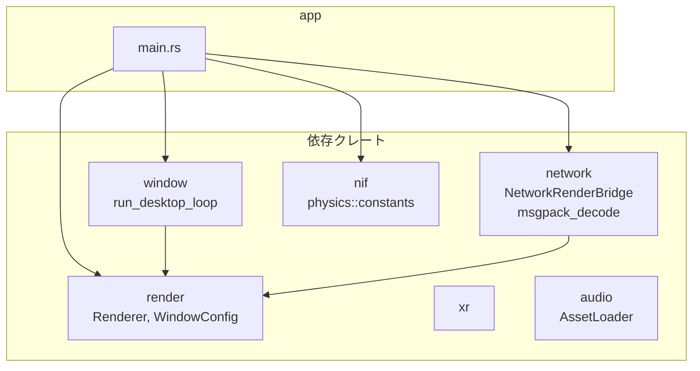
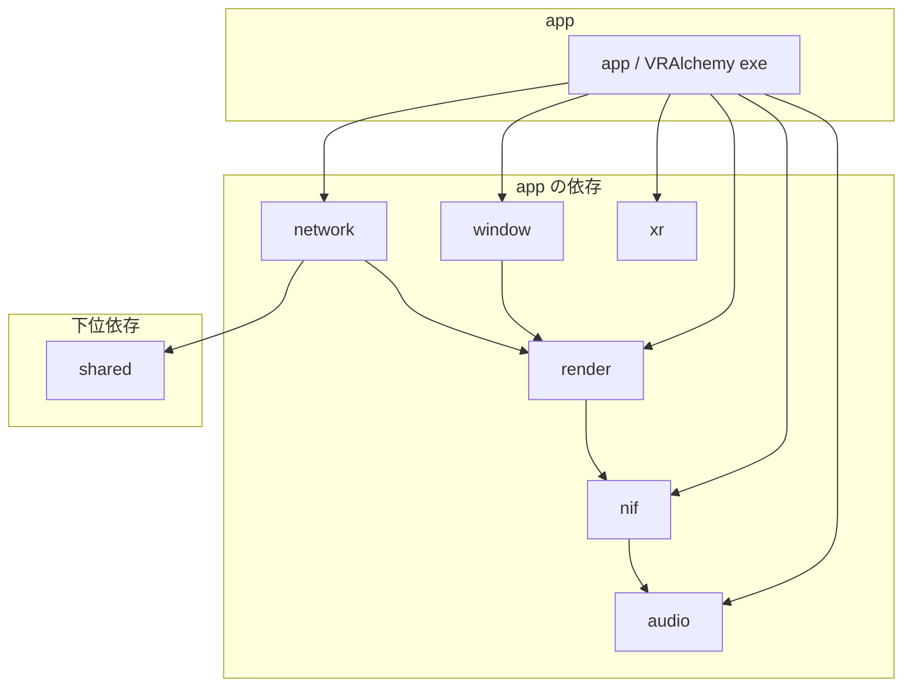
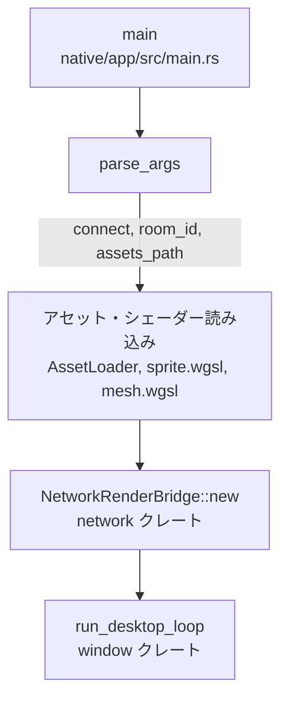
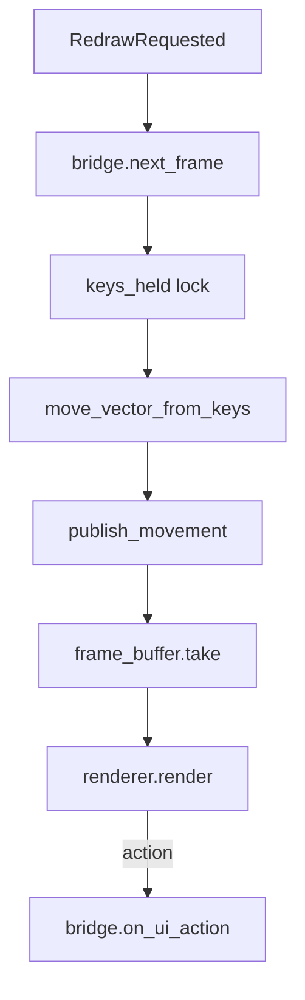
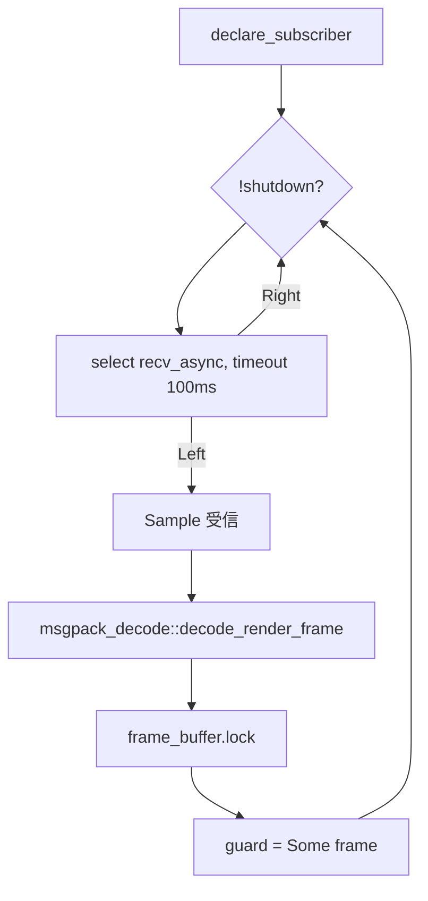

# Rust: app — Zenoh 経由のデスクトップクライアント（VRAlchemy exe）

## 概要

`app` クレートは **Zenoh** 経由でサーバーに接続し、RenderFrame を受信して描画するスタンドアロンクライアント exe（バイナリ名: **VRAlchemy**）です。Elixir の NIF を使わず、サーバーと分離された別プロセスで動作します。デスクトップ（Windows/Linux/macOS）向け。Web/Android/iOS は将来実装予定。

- **パス**: `native/app/`
- **バイナリ**: VRAlchemy
- **依存**: `network`, `render`, `window`, `xr`, `nif`, `audio`

---

## ソースコード構成とモジュールフロー



---

## 全体のデータフロー（サーバー ↔ クライアント）

```mermaid
sequenceDiagram
    participant Server as Elixir サーバー
    participant Zenohex as Zenohex
    participant Zenoh as Zenoh ネットワーク
    participant ZRust as zenoh (Rust)
    participant Recv as run_receiver スレッド
    participant BUF as frame_buffer
    participant Loop as desktop_loop
    participant Render as Renderer

    Note over Server,Render: サーバー → クライアント（フレーム配信）
    Server->>Server: Render コンポーネント<br/>Content.MessagePackEncoder.encode_frame
    Server->>Zenohex: publish_frame(room_id, frame_binary)
    Zenohex->>Zenoh: put game/room/{id}/frame
    Zenoh->>ZRust: subscribe
    ZRust->>Recv: sample (MessagePack bytes)
    Recv->>Recv: decode_render_frame
    Recv->>BUF: Mutex::lock, 格納

    Note over Server,Render: クライアント → サーバー（入力送信）
    Loop->>Loop: next_frame() 内で publish_movement
    Loop->>Loop: keys_held → (dx, dy)
    Loop->>ZRust: rmp_serde::to_vec(MovementPayload)
    ZRust->>Zenoh: put game/room/{id}/input/movement
    Zenoh->>Zenohex: handle_info Sample
    Zenohex->>Server: Msgpax.unpack → {:move_input, dx, dy}
    Server->>Server: send GameEvents
```

---

## エンコード・デコードの詳細フロー

### フレーム受信・デコード（サーバー → クライアント）

```mermaid
flowchart LR
    subgraph Server["Elixir サーバー"]
        RC[Rendering.Render]
        MPE[Content.MessagePackEncoder.encode_frame]
        ZB[ZenohBridge.publish_frame]
    end

    subgraph Client["app (VRAlchemy)"]
        Recv[run_receiver]
        Decode[msgpack_decode::decode_render_frame]
        FromSlice[rmp_serde::from_slice]
        FrameMsg[FrameMsg 中間構造]
        Convert[draw_command_from_msg<br/>camera_from_msg<br/>ui_node_from_msg<br/>MeshDefMsg::to_mesh_def]
        RF[RenderFrame]
    end

    RC --> MPE
    MPE -->|Msgpax.pack!| ZB
    ZB -->|Zenoh put| Recv
    Recv -->|payload.to_bytes| Decode
    Decode --> FromSlice
    FromSlice --> FrameMsg
    FrameMsg --> Convert
    Convert --> RF
```



**エンコード（サーバー側・Elixir）**:

- `Content.MessagePackEncoder.encode_frame/4` で `commands`, `camera`, `ui`, `mesh_definitions` を map に組み立て（Msgpax.pack! でバイナリ化）
- `Msgpax.pack!` で MessagePack バイナリ化
- `Network.ZenohBridge.publish_frame(room_id, frame_binary)` で Zenoh へ publish

**デコード（クライアント側・Rust）**:

- `network::msgpack_decode::decode_render_frame(bytes)` がエントリ（`native/network/src/msgpack_decode.rs`）
- `rmp_serde::from_slice` で `FrameMsg` にデシリアライズ
- `DrawCommandMsg`, `CameraMsg`, `UiNodeMsg`, `MeshDefMsg` を `DrawCommand`, `CameraParams`, `UiNode`, `MeshDef` へ変換（f64 → f32 キャスト含む）

### 入力送信・エンコード（クライアント → サーバー）

```mermaid
flowchart LR
    subgraph Client["app (VRAlchemy)"]
        Keys[keys_held HashSet]
        MoveVec[move_vector_from_keys]
        Payload1[MovementPayload {dx, dy}]
        Encode1[rmp_serde::to_vec]
        Put1[publisher.put]
    end

    subgraph Server["Elixir サーバー"]
        ZB2[ZenohBridge handle_info]
        Msgpax[Msgpax.unpack]
        GE[GameEvents {:move_input, dx, dy}]
    end

    Keys --> MoveVec
    MoveVec --> Payload1
    Payload1 --> Encode1
    Encode1 -->|MessagePack bytes| Put1
    Put1 -->|Zenoh| ZB2
    ZB2 --> Msgpax
    Msgpax --> GE
```

**movement エンコード**（`native/network/src/network_render_bridge.rs`）:

```rust
struct MovementPayload { dx: f64, dy: f64 }
rmp_serde::to_vec(&MovementPayload { dx, dy })
```

**action エンコード**:

```rust
struct ActionPayload { name: &str, payload: HashMap<String, String> }
rmp_serde::to_vec(&ActionPayload { name, payload: empty })
```

---

## msgpack_decode の構造変換

```mermaid
flowchart TB
    Bytes[&[u8] MessagePack]
    FromSlice[from_slice]
    FrameMsg[FrameMsg]
    Cmds[commands: Vec&lt;DrawCommandMsg&gt;]
    Cam[camera: CameraMsg]
    Ui[ui: UiCanvasMsg]
    Mesh[mesh_definitions: Vec&lt;MeshDefMsg&gt;]

    Bytes --> FromSlice
    FromSlice --> FrameMsg
    FrameMsg --> Cmds
    FrameMsg --> Cam
    FrameMsg --> Ui
    FrameMsg --> Mesh

    Cmds --> DC[draw_command_from_msg]
    Cam --> CP[camera_from_msg]
    Ui --> UN[ui_node_from_msg]
    Mesh --> MD[MeshDefMsg::to_mesh_def]

    DC --> RenderFrame[RenderFrame]
    CP --> RenderFrame
    UN --> RenderFrame
    MD --> RenderFrame
```

**中間型（Wire 形式）**:

| 中間型 | 変換先 | 備考 |
|:---|:---|:---|
| `DrawCommandMsg` | `DrawCommand` | `#[serde(tag = "t")]` で player_sprite, sprite_raw 等を判別 |
| `CameraMsg` | `CameraParams` | camera_2d / camera_3d |
| `UiNodeMsg` | `UiNode` | 再帰的に children を変換 |
| `UiComponentMsg` | `UiComponent` | vertical_layout, text, button 等 |
| `MeshDefMsg` | `MeshDef` | vertices は `VertexWire(Vec<f64>, Vec<f64>)` → `MeshVertex` |
| `VertexWire` | `MeshVertex` | `[[px,py,pz],[cr,cg,cb,ca]]` 形式 |

---

## クレート構成



---

## エントリポイント（main.rs）と起動フロー

### 起動フロー



### イベントループ内のフロー（window クレート）



### コマンドライン引数

| 引数 | 説明 |
|:---|:---|
| `--connect`, `-c` | Zenoh 接続先（例: `tcp/127.0.0.1:7447`） |
| `--room`, `-r` | ルーム ID（デフォルト: `main`） |
| `--assets`, `-a` | アセットルートパス |

### 環境変数

| 変数 | 説明 |
|:---|:---|
| `ZENOH_CONNECT` | 接続先（未指定時は zenoh デフォルト scouting） |
| `ASSETS_PATH` | アセットルート |
| `ASSETS_ID` | コンテンツ別サブディレクトリ（例: `vampire_survivor`）で `assets/{id}/` 参照 |

### 初期化

1. `AssetLoader` でアトラス PNG を読み込み
2. `assets/shaders/sprite.wgsl`, `mesh.wgsl` を読み込み（フォールバック: `assets/shaders/`）
3. `NetworkRenderBridge::new(connect_str, room_id)` で Zenoh セッション確立・受信スレッド起動
4. `run_desktop_loop(bridge, WindowConfig)` でイベントループ開始

---

## NetworkRenderBridge（network_render_bridge.rs）

`RenderBridge` トレイトの Zenoh 実装です。

### トピック

| トピック | 方向 | 内容 |
|:---|:---|:---|
| `game/room/{room_id}/frame` | subscribe | MessagePack エンコードの RenderFrame（`network` クレート） |
| `game/room/{room_id}/input/movement` | publish | `{dx, dy}` 移動ベクトル（MessagePack） |
| `game/room/{room_id}/input/action` | publish | `{name, payload}` UI アクション（MessagePack） |

`NetworkRenderBridge` は `native/network/src/network_render_bridge.rs` に定義。`render::RenderFrame` 型を使用。

### 受信スレッドのフロー（run_receiver）



### 入力処理

- `on_raw_key`: `keys_held` HashSet を更新
- `next_frame()`: `keys_held` から WASD/矢印を `(dx, dy)` に変換し、`publish_movement` で movement トピックへ MessagePack publish
- `on_ui_action`: `publish_action` で action トピックへ publish
- `on_focus_lost`: `keys_held` をクリア

---

## 関連ドキュメント

- [MessagePack スキーマ](../messagepack-schema.md)（Frame / DrawCommand / Camera / UI のバイナリ形式）
- [アーキテクチャ概要](../overview.md)（クライアント動作モード）
- [desktop/input](./desktop/input.md)（window クレート）
- [desktop/render](./desktop/render.md)（render クレート）
- [launcher](./launcher.md)（VRAlchemy の起動）
