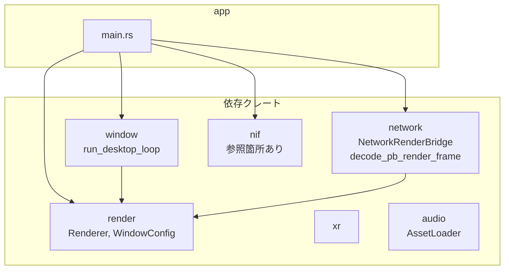
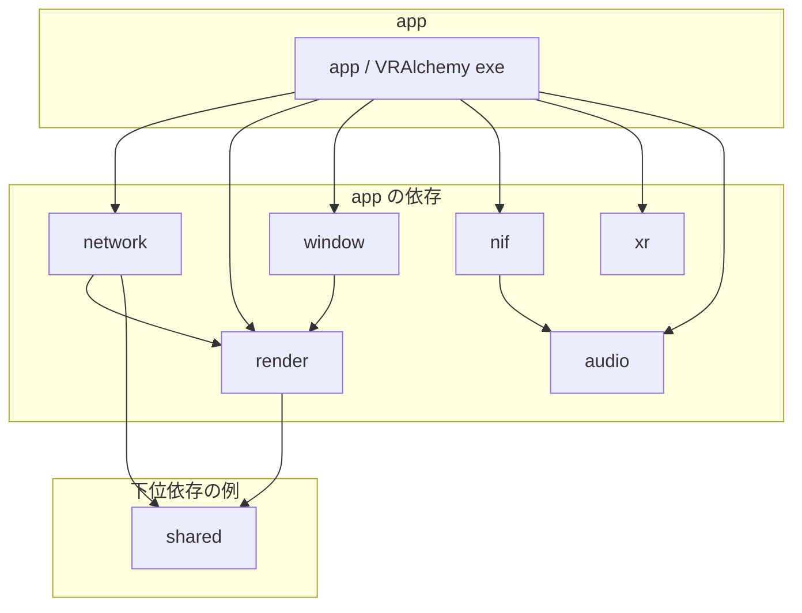
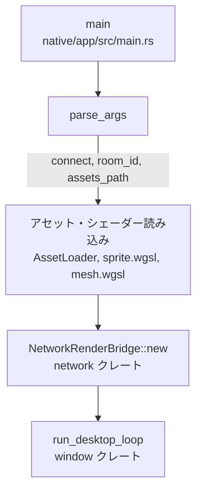
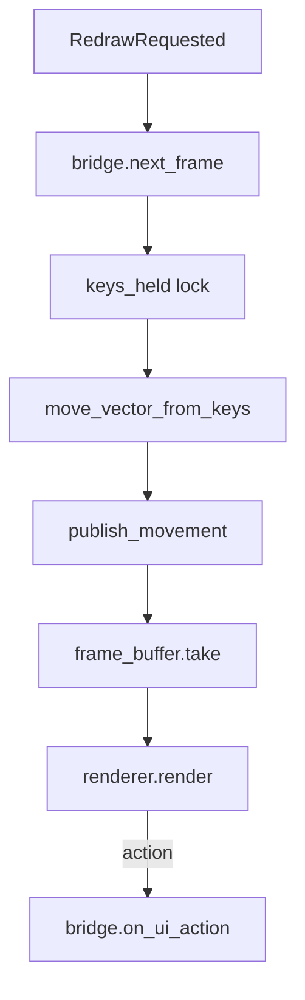

# Rust: app — Zenoh 経由のデスクトップクライアント（VRAlchemy exe）

## 概要

`app` クレートは **Zenoh** 経由でサーバーに接続し、RenderFrame を受信して描画するスタンドアロンクライアント exe（バイナリ名: **VRAlchemy**）です。Elixir の NIF を使わず、サーバーと分離された別プロセスで動作します。デスクトップ（Windows/Linux/macOS）向け。Web/Android/iOS は将来実装予定。

ワイヤ上のフレーム・入力は **protobuf** のみ。

- **パス**: `native/app/`
- **バイナリ**: VRAlchemy
- **依存**: `network`, `render`, `window`, `xr`, `nif`, `audio`

---

## ソースコード構成とモジュールフロー



---

## 全体のデータフロー（サーバー ↔ クライアント）

```mermaid
sequenceDiagram
    participant Server as Elixir サーバー
    participant Zenohex as Zenohex
    participant Zenoh as Zenoh ネットワーク
    participant ZRust as zenoh Rust
    participant Recv as 受信コールバック
    participant BUF as frame_buffer
    participant Loop as desktop_loop
    participant Render as Renderer

    Note over Server,Render: サーバー → クライアント（フレーム配信）
    Server->>Server: Content.FrameEncoder → protobuf bytes
    Server->>Zenohex: publish_frame(room_id, frame_binary)
    Zenohex->>Zenoh: put game/room/{id}/frame
    Zenoh->>ZRust: subscribe
    ZRust->>Recv: sample protobuf bytes
    Recv->>Recv: decode_pb_render_frame
    Recv->>BUF: Mutex::lock, 格納

    Note over Server,Render: クライアント → サーバー（入力送信）
    Loop->>Loop: next_frame 内 publish_movement
    Loop->>ZRust: protobuf_codec::encode_movement
    ZRust->>Zenoh: put game/room/{id}/input/movement
    Zenoh->>Zenohex: Sample
    Zenohex->>Server: Movement.decode → {:move_input, dx, dy}
    Server->>Server: GameEvents
```

---

## エンコード・デコード（protobuf）

### フレーム（サーバー → クライアント）

- **Elixir**: `Content.FrameEncoder.encode_frame/5` → `Alchemy.Render.RenderFrame.encode/1`（`proto/render_frame.proto`）。
- **Rust**: `network::protobuf_render_frame::decode_pb_render_frame`（`render_frame_proto` と同一ロジック）で `render::RenderFrame`（`shared::render_frame` 由来）に変換。実装は `native/network/src/network_render_bridge.rs` の購読コールバック。

### 入力（クライアント → サーバー）

- **movement**: `alchemy.input.Movement`（`proto/input_events.proto`）。`protobuf_codec::encode_movement`。
- **action**: `alchemy.input.Action`。`protobuf_codec::encode_action`。
- **サーバー**: `Network.ZenohBridge` が protobuf をデコードし `GameEvents` へ配送。

---

## クレート構成



---

## エントリポイント（main.rs）と起動フロー

### 起動フロー



### イベントループ内のフロー（window クレート）



### コマンドライン引数

| 引数 | 説明 |
|:---|:---|
| `--connect`, `-c` | Zenoh 接続先（例: `tcp/127.0.0.1:7447`） |
| `--room`, `-r` | ルーム ID（デフォルト: `main`） |
| `--assets`, `-a` | アセットルートパス |

### 環境変数

| 変数 | 説明 |
|:---|:---|
| `ZENOH_CONNECT` | 接続先（未指定時は zenoh デフォルト scouting） |
| `ASSETS_PATH` | アセットルート |
| `ASSETS_ID` | コンテンツ別サブディレクトリ（例: `vampire_survivor`）で `assets/{id}/` 参照 |

### 初期化

1. `AssetLoader` でアトラス PNG を読み込み
2. `assets/shaders/sprite.wgsl`, `mesh.wgsl` を読み込み（フォールバック: `assets/shaders/`）
3. `NetworkRenderBridge::new(connect_str, room_id)` で Zenoh セッション確立・受信スレッド起動
4. `run_desktop_loop(bridge, WindowConfig)` でイベントループ開始

---

## NetworkRenderBridge（network_render_bridge.rs）

`RenderBridge` トレイトの Zenoh 実装です。

### トピック

| トピック | 方向 | 内容 |
|:---|:---|:---|
| `game/room/{room_id}/frame` | subscribe | protobuf `alchemy.render.RenderFrame` |
| `game/room/{room_id}/input/movement` | publish | protobuf `alchemy.input.Movement` |
| `game/room/{room_id}/input/action` | publish | protobuf `alchemy.input.Action` |

`NetworkRenderBridge` は `native/network/src/network_render_bridge.rs` に定義。`render::RenderFrame` 型を使用。

### 受信コールバック

Zenoh から受け取ったバイト列を `decode_pb_render_frame` で `RenderFrame` にし、`frame_buffer` に格納する。

### 入力処理

- `on_raw_key`: `keys_held` HashSet を更新
- `next_frame()`: `keys_held` から WASD/矢印を `(dx, dy)` に変換し、`publish_movement` で movement トピックへ protobuf publish
- `on_ui_action`: `publish_action` で action トピックへ protobuf publish
- `on_focus_lost`: `keys_held` をクリア

---

## 関連ドキュメント

- [zenoh-protocol-spec.md](../zenoh-protocol-spec.md)
- [draw-command-spec.md](../draw-command-spec.md)
- [`proto/render_frame.proto`](../../../proto/render_frame.proto)
- [アーキテクチャ概要](../overview.md)（クライアント動作モード）
- [desktop/input](./desktop/input.md)（window クレート）
- [desktop/render](./desktop/render.md)（render クレート）
- [launcher](./launcher.md)（VRAlchemy の起動）
