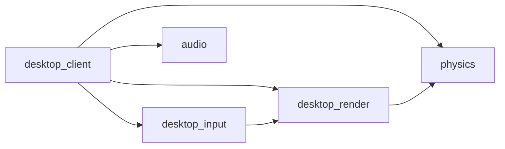
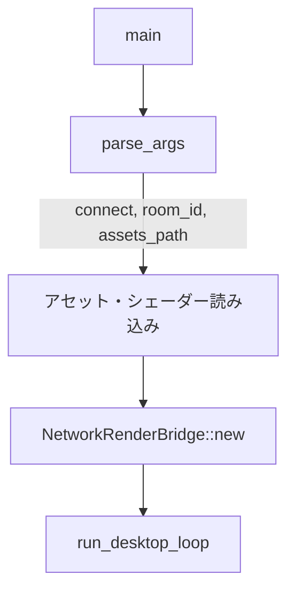
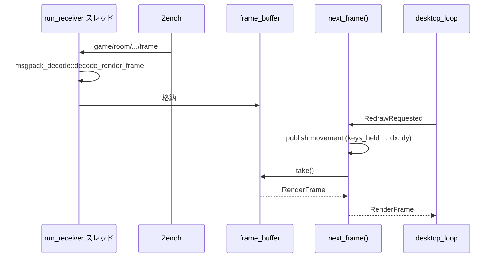

# Rust: desktop_client — Zenoh 経由のスタンドアロンクライアント

## 概要

`desktop_client` は **Zenoh** 経由で Phoenix Server に接続し、RenderFrame を受信して描画するスタンドアロンクライアント exe です。Elixir の NIF を使わず、サーバーと分離された別プロセスで動作します。

- **パス**: `native/desktop_client/`
- **依存**: `desktop_input`, `desktop_render`, `physics`, `audio`, `zenoh`, `rmp-serde`, `serde`

---

## クレート構成

---

## エントリポイント（main.rs）

### 起動フロー

### コマンドライン引数

| 引数 | 説明 |
|:---|:---|
| `--connect`, `-c` | Zenoh 接続先（例: `tcp/127.0.0.1:7447`） |
| `--room`, `-r` | ルーム ID（デフォルト: `main`） |
| `--assets`, `-a` | アセットルートパス |

### 環境変数

| 変数 | 説明 |
|:---|:---|
| `ZENOH_CONNECT` | 接続先（未指定時は zenoh デフォルト scouting） |
| `GAME_ASSETS_PATH` | アセットルート |
| `GAME_ASSETS_ID` | ゲーム ID（例: `vampire_survivor`）で `assets/{id}/` 参照 |

### 初期化

1. `AssetLoader` でアトラス PNG を読み込み
2. `assets/shaders/sprite.wgsl`, `mesh.wgsl` を読み込み（フォールバック: `assets/shaders/`）
3. `NetworkRenderBridge::new(connect_str, room_id)` で Zenoh セッション確立
4. `run_desktop_loop(bridge, WindowConfig)` でイベントループ開始

---

## NetworkRenderBridge（network_render_bridge.rs）

`RenderBridge` トレイトの Zenoh 実装です。

### トピック

| トピック | 方向 | 内容 |
|:---|:---|:---|
| `game/room/{room_id}/frame` | subscribe | MessagePack エンコードの RenderFrame |
| `game/room/{room_id}/input/movement` | publish | `{dx, dy}` 移動ベクトル |
| `game/room/{room_id}/input/action` | publish | UI アクション（ボタン押下等） |

### データフロー

### 入力処理

- `on_raw_key`: `keys_held` HashSet を更新
- `next_frame()`: `keys_held` から WASD/矢印を `(dx, dy)` に変換し、`movement` トピックへ MessagePack で publish
- `on_ui_action`: `action` トピックへ publish
- `on_focus_lost`: `keys_held` をクリア

---

## msgpack_decode

`nif` の decode とは別実装。Zenoh で受信した MessagePack バイナリを `RenderFrame` にデコードします。

---

## 関連ドキュメント

- [アーキテクチャ概要](../overview.md)（クライアント動作モード）
- [desktop/input](./desktop/input.md)
- [desktop/render](./desktop/render.md)
- [launcher](./launcher.md)（desktop_client の起動）
