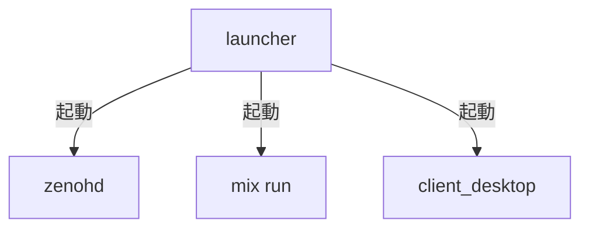
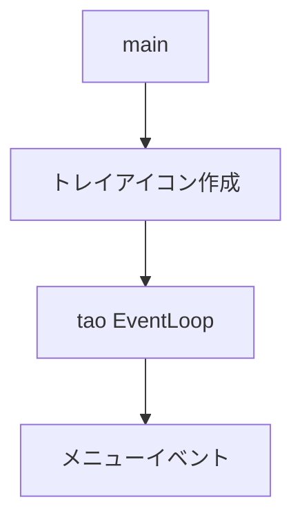

# Rust: launcher — トレイアイコン・ zenohd / Phoenix / Client Run

## 概要

`launcher` はトレイアイコンを表示し、メニューから **zenohd**・**Phoenix Server（mix run）**・**client_desktop** を起動・終了するデスクトップアプリケーションです。Check for Update で GitHub releases を確認し、acknowledgements で謝辞・ライセンスを表示します。

- **パス**: `native/tools/launcher/`
- **依存**: tao, tray-icon, kill_tree, reqwest, rfd, semver

---

## クレート構成

launcher は physics / nif 等のゲームクレートに依存せず、独立したバイナリです。

---

## 起動フロー

---

## デフォルト起動順序

ゲームをプレイするには **zenohd → Phoenix Server → client_desktop** の順で起動する。Client Run は zenohd と Phoenix のポート応答を確認してから client_desktop を起動する。

## メニュー構成

| メニュー | 動作 |
|:---|:---|
| Check for Update | GitHub API で最新リリース取得・バージョン比較 |
| acknowledgements | 謝辞・ライセンステキスト表示 |
| Zenoh Router : Run / Quit | zenohd の起動・終了 |
| Phoenix Server : Run / Quit | `mix run --no-halt` の起動・終了 |
| Client Run | zenohd と Phoenix のポート応答確認後に client_desktop 起動 |
| Quit | zenohd / Phoenix を終了し、アプリ終了 |

---

## ポート確認

| ポート | サービス |
|:---|:---|
| 7447 | zenohd（TCP） |
| 4000 | Phoenix Server |

- 接続試行アドレス: `127.0.0.1`, `[::1]`
- 初回待機: 500ms
- ポーリング間隔: 1 秒
- 最大待機: 60 秒

---

## client_desktop 起動条件

1. zenohd がポート 7447 で応答
2. Phoenix Server がポート 4000 で応答
3. `native/Cargo.toml` が存在
4. client_desktop exe を `native/target/release/` または `debug/` から検出。なければ `cargo run -p client_desktop` で起動

起動引数: `--connect tcp/127.0.0.1:7447 --room main`

---

## プロジェクトルート検索

- 1) `current_dir` から上位を検索して `mix.exs` を探す
- 2) 見つからなければ実行ファイルの親から検索（exe 直接起動時用）

---

## Windows 固有

- Elixir の `mix.bat` / `mix.exe` を `LOCALAPPDATA`, `ProgramFiles`, `Program Files (x86)` 等から検索
- `ALCHEMY_MIX_PATH` 環境変数で mix パスを上書き可能
- `path_with_cargo_bin()` で `%USERPROFILE%\.cargo\bin` を PATH 先頭に追加（Client Run 時）

---

## 関連ドキュメント

- [アーキテクチャ概要](../overview.md)
- [client_desktop](./client_desktop.md)
