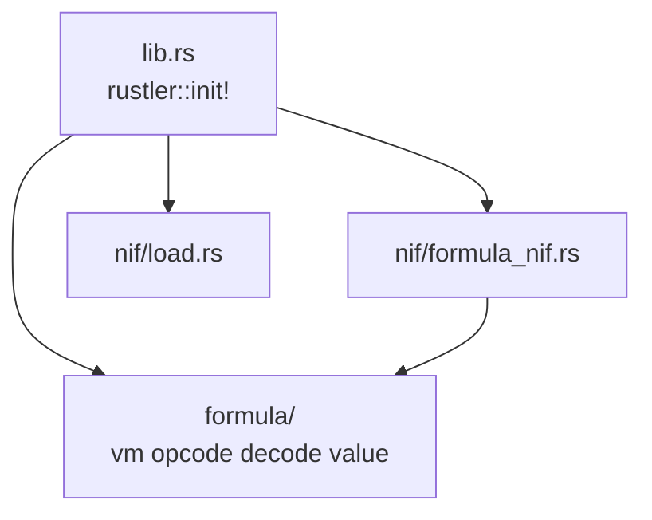

# Rust: nif — Formula VM（Rustler NIF）

> **2026-04**: ゲーム ECS・`physics/`・旧 NIF 群は **削除済み**。本ページは **現行構成** のみ記す。旧 physics の長文仕様は [nif/physics.md](./nif/physics.md)（**アーカイブ**）。

## 概要

`rust/nif` は Elixir `Core.NifBridge` からロードされる **cdylib**。担当は **`run_formula_bytecode/3`（Formula VM）のみ**。

- **依存**: `rustler`, `log`, `env_logger`（`audio` / `prost` / `render_frame_proto` は **もう紐づけない**）
- **呼び出し経路**: Elixir は **`Core.Formula`** 経由（`Core.NifBridge` 直叩きはしない方針）
- **XR / 描画**: **本クレートに含めない**（クライアント `xr` / `render` / Zenoh）

詳細・方針表は **[`rust/nif/README.md`](../../../rust/nif/README.md)**。

---

## クレート構成（現行）

`load.rs` は panic フックと `env_logger` のみ。**`GameWorld` 等の Resource 登録はない**。

---

## 関連ドキュメント

- [アーキテクチャ概要](../overview.md)
- [desktop_client](./desktop_client.md)（クライアントは **nif 非依存**）
- [formula-vm-bytecode.md](../formula-vm-bytecode.md)
- [audio](./nif/audio.md)（**クライアント `audio` クレート**。nif からは未使用）
- [nif/physics](./nif/physics.md)（削除済みコードの参照用）
