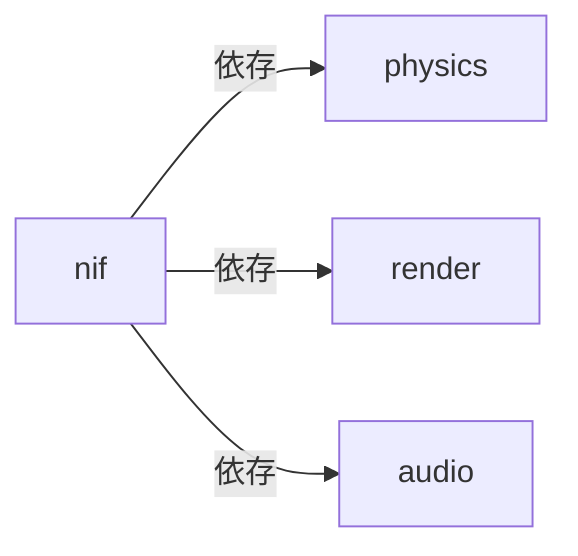
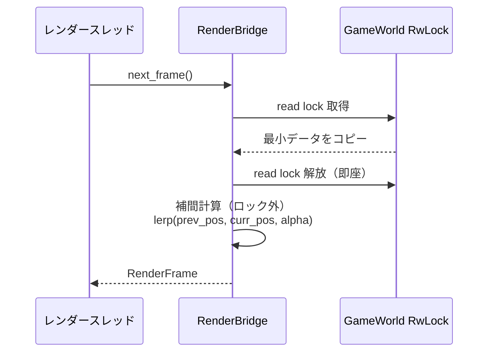

# Rust: nif — NIF インターフェース・ゲームループ

## 概要

`nif` クレートは Elixir と Rust のブリッジです。Rustler NIF のエントリポイント・ゲームループ制御・レンダーブリッジ・セーブ/ロードを担当します。依存: [physics](./physics.md), [render](./render.md), [audio](./audio.md)。

---

## クレート構成



---

## `lib.rs` — エントリポイント

```rust
rustler::atoms! {
    ok, error, nil,
    enemy_killed, player_damaged, item_pickup,
    special_entity_spawned, special_entity_damaged, special_entity_defeated,
    // ... ゲームアトム
}

#[cfg(feature = "umbrella")]
rustler::init!("Elixir.Core.NifBridge", load = nif::load);
```

---

## `nif/` — NIF 関数群

```mermaid
graph TD
    NIF[nif/]
    LOAD[load.rs<br/>パニックフック<br/>リソース登録]
    WORLD[world_nif.rs<br/>ワールド生成・入力・スポーン]
    ACTION[action_nif.rs<br/>武器スロット・ボス操作]
    READ[read_nif.rs<br/>状態読み取り 軽量]
    LOOP[game_loop_nif.rs<br/>ゲームループ制御]
    PUSH[push_tick_nif.rs<br/>Elixir プッシュ型同期]
    RENDER[render_nif.rs<br/>レンダースレッド起動]
    RFRAME[render_frame_nif.rs<br/>レンダーフレーム]
    SAVE[save_nif.rs<br/>セーブ/ロード]
    EVENTS[events.rs<br/>FrameEvent → Elixir アトム変換]
    UTIL[util.rs<br/>ユーティリティ]
    XR[xr_nif.rs<br/>OpenXR VR ブリッジ<br/>feature=xr]

    NIF --> LOAD
    NIF --> WORLD
    NIF --> ACTION
    NIF --> READ
    NIF --> LOOP
    NIF --> PUSH
    NIF --> RENDER
    NIF --> RFRAME
    NIF --> SAVE
    NIF --> EVENTS
    NIF --> UTIL
    NIF --> XR
```



### NIF 関数一覧

**`world_nif.rs`（ワールド生成・入力・スポーン・パラメータ注入）:**

| NIF 関数 | 説明 |
|:---|:---|
| `create_world()` | `GameWorld` リソースを生成して返す |
| `set_player_input(world, dx, dy)` | 移動ベクトルを設定 |
| `spawn_enemies(world, kind_id, count)` | 敵をスポーン |
| `spawn_enemies_at(world, kind_id, positions)` | 指定座標リストに敵をスポーン |
| `set_map_obstacles(world, obstacles)` | 障害物リストを設定 |
| `set_entity_params(world, enemies, weapons, bosses)` | エンティティパラメータを注入 |
| `set_world_size(world, width, height)` | マップサイズを設定 |
| `set_player_hp(world, hp)` | プレイヤー HP を注入 |
| `set_elapsed_seconds(world, elapsed)` | 経過時間を注入 |
| `set_boss_hp(world, hp)` | ボス HP を注入 |
| `set_hud_state(world, score, kill_count)` | HUD スコア・キル数を注入 |
| `set_hud_level_state(world, level, exp, ...)` | HUD レベル・EXP 状態を注入（描画専用） |

**`action_nif.rs`（武器・ボス操作）:**

| NIF 関数 | 説明 |
|:---|:---|
| `set_weapon_slots(world, slots)` | 武器スロット全体を注入（I-2: 毎フレーム差分注入） |
| `spawn_boss(world, boss_id)` | ボスをスポーン |
| `spawn_elite_enemy(world, kind_id, count, hp_mult)` | エリート敵をスポーン |
| `spawn_item(world, x, y, kind, value)` | アイテムをスポーン |
| `set_boss_velocity(world, vx, vy)` | ボス速度を注入（AI） |
| `set_boss_invincible(world, invincible)` | ボス無敵状態を設定（AI） |
| `set_boss_phase_timer(world, timer)` | ボス特殊行動タイマーを設定（AI） |
| `fire_boss_projectile(world, dx, dy, speed, dmg, lifetime)` | ボス弾を発射（AI） |
| `get_boss_state(world)` | ボス状態を取得（AI 用） |
| `add_score_popup(world, x, y, value)` | スコアポップアップを描画バッファに追加 |

> 武器管理は `set_weapon_slots` で毎フレーム Elixir 側から全スロットを注入する設計（I-2）。

**`read_nif.rs`（軽量・毎フレーム利用可）:**

| NIF 関数 | 説明 |
|:---|:---|
| `get_player_pos(world)` | プレイヤー座標 `{x, y}` |
| `get_player_hp(world)` | プレイヤー HP |
| `get_enemy_count(world)` | 生存敵数 |
| `get_hud_data(world)` | HUD 表示データ全体 |
| `get_frame_metadata(world)` | フレームメタデータ |
| `get_weapon_levels(world)` | 全武器レベル（`%{kind_id => level}`） |
| `is_player_dead(world)` | 死亡判定 |

**`game_loop_nif.rs`:**

| NIF 関数 | 説明 |
|:---|:---|
| `physics_step(world, dt)` | 1 フレーム物理ステップ（DirtyCpu） |
| `drain_frame_events(world)` | フレームイベントを取り出す |
| `create_game_loop_control()` | `GameLoopControl` リソース生成 |
| `start_rust_game_loop(world, control, pid)` | 別スレッドで 60Hz 固定ループ開始 |
| `pause_physics(control)` | 物理演算を一時停止 |
| `resume_physics(control)` | 物理演算を再開 |

---

## `render_bridge.rs` — RenderBridge 実装

ロック競合を最小化するため、ロック内でのデータコピーを最小限に抑えます。



---

## `lock_metrics.rs` — RwLock 待機時間メトリクス

| 閾値 | アクション |
|:---|:---|
| read lock > 300μs | `log::warn!` |
| write lock > 500μs | `log::warn!` |
| 5 秒ごと | 平均待機時間をレポート |

---

## 関連ドキュメント

- [アーキテクチャ概要](../overview.md)
- [physics](./physics.md) / [render](./render.md) / [audio](./audio.md)
- [Elixir: core](../elixir/core.md)
