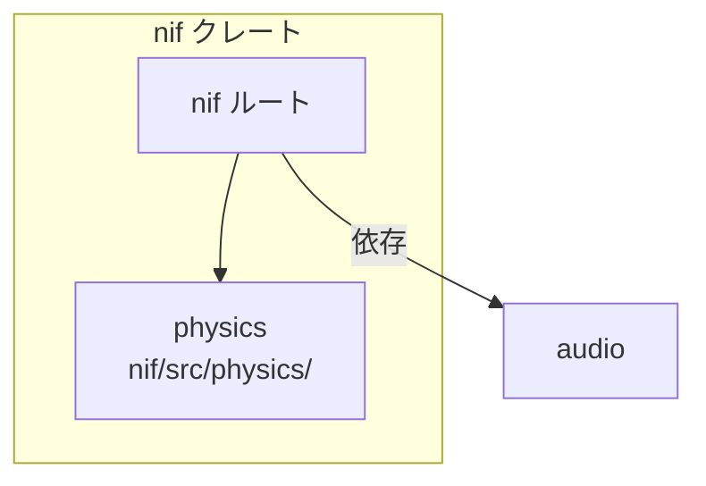
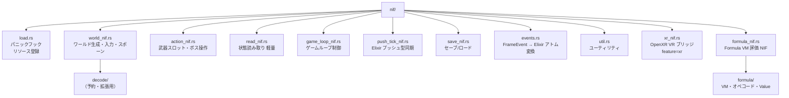

# Rust: nif — NIF インターフェース・ゲームループ

## 概要

`nif` クレートは Elixir と Rust のブリッジです。Rustler NIF のエントリポイント・ゲームループ制御・セーブ/ロードを担当します。描画は Zenoh 経由で `app`（VRAlchemy）に委譲するため、nif は [physics](./nif/physics.md)（nif 内包）と [audio](./nif/audio.md) のみに依存します。

**physics** は独立クレートではなく、`native/nif/src/physics/` に内包されています。

---

## クレート構成

---

## `lib.rs` — エントリポイント

`native/nif/src/lib.rs` で `rustler::atoms!` によりゲームアトムを事前登録し、`rustler::init!("Elixir.Core.NifBridge", load = nif::load)` で NIF をロードする。クレート直下には `lock_metrics.rs`（RwLock 待機メトリクス）・`formula/` があり、`nif/` サブモジュールに NIF 関数群が格納される。`#[cfg(feature = "xr")]` で `xr_bridge` を有効化可能。

---

## `nif/` — NIF 関数群

### NIF 関数一覧

**`world_nif.rs`（ワールド生成・入力・スポーン・パラメータ注入）:**

| NIF 関数 | 説明 |
|:---|:---|
| `create_world()` | `GameWorld` リソースを生成して返す |
| `set_player_input(world, dx, dy)` | 移動ベクトルを設定 |
| `spawn_enemies(world, kind_id, count)` | 敵をスポーン |
| `spawn_enemies_at(world, kind_id, positions)` | 指定座標リストに敵をスポーン |
| `set_map_obstacles(world, obstacles)` | 障害物リストを設定 |
| `set_entity_params(world, enemies, weapons, bosses)` | エンティティパラメータを注入 |
| `set_world_size(world, width, height)` | マップサイズを設定 |
| `set_world_params(world, params)` | 物理定数（player_speed, bullet_speed 等）を注入 |
| `set_elapsed_seconds(world, elapsed)` | 経過時間を注入 |
| `set_player_snapshot(world, hp, invincible_timer)` | プレイヤー HP・無敵タイマーを注入（毎フレーム） |
| `set_entity_hp(world, entity_id, hp)` | エンティティ（敵/ボス）HP を注入 |
| `set_enemy_damage_this_frame(world, list)` | 敵接触ダメージを注入（毎フレーム） |
| `set_hud_state(world, score, kill_count)` | HUD スコア・キル数を注入 |
| `set_hud_level_state(world, level, exp, ...)` | HUD レベル・EXP 状態を注入（描画専用） |

**`action_nif.rs`（武器・ボス・アイテム・弾丸操作）:**

| NIF 関数 | 説明 |
|:---|:---|
| `set_weapon_slots(world, slots)` | 武器スロット全体を注入（I-2: 毎フレーム差分注入） |
| `set_special_entity_snapshot(world, snapshot)` | 特殊エンティティ（ボス等）の衝突用スナップショットを注入（毎フレーム） |
| `set_entity_hp(world, entity_id, hp)` | エンティティ（敵/ボス）HP を設定 |
| `spawn_projectile(world, x, y, vx, vy, damage, lifetime, kind)` | 弾丸をスポーン |
| `add_score_popup(world, x, y, value, lifetime)` | スコアポップアップを描画バッファに追加（R-E1: lifetime は contents SSoT） |
| `spawn_item(world, x, y, kind, value)` | アイテムをスポーン |
| `spawn_enemies_with_hp_multiplier(world, kind_id, count, hp_mult)` | HP 倍率付きで敵をスポーン（エリート敵用） |

ボススポーン・ボス AI は Elixir SSoT 側で制御し、`set_special_entity_snapshot` / `set_entity_hp` で Rust に状態を注入する設計。武器管理は `set_weapon_slots` で毎フレーム Elixir 側から全スロットを注入する設計（I-2）。

**`read_nif.rs`（軽量・毎フレーム利用可）:**

| NIF 関数 | 説明 |
|:---|:---|
| `get_player_pos(world)` | プレイヤー座標 `{x, y}` |
| `get_player_hp(world)` | プレイヤー HP |
| `get_enemy_count(world)` | 生存敵数 |
| `get_bullet_count(world)` | 弾丸数 |
| `get_frame_time_ms(world)` | フレーム時間（ms） |
| `get_hud_data(world)` | HUD 表示データ全体 |
| `get_frame_metadata(world)` | フレームメタデータ |
| `get_magnet_timer(world)` | マグネット効果残り時間 |
| `is_player_dead(world)` | 死亡判定 |
| `get_render_entities(world)` | 描画用エンティティスナップショット（Phase R-2 以前のレガシー等） |

**`render_frame_nif.rs`（P5: RenderFrame protobuf）:**

| NIF 関数 | 説明 |
|:---|:---|
| `push_render_frame_binary(world, binary)` | `Content.FrameEncoder` と同一スキーマの protobuf を `render_frame_proto::decode_pb_render_frame` でデコードし成功すれば `:ok`（**本番ゲームループの毎フレーム必須ではない**。CI・開発時の契約検証・オプトインのデバッグ向け。NIF は `wgpu` 等をリンクせず `render_frame_proto`（prost）のみ。描画バッファへは書き込まない） |

**`formula_nif.rs`（Formula VM 評価）:**

Elixir の FormulaGraph から生成したバイトコードを Rust 側 VM で実行。`formula/` モジュール（vm.rs, opcode, value, decode）が VM 実装を提供。`Core.Formula` / `Content.FormulaTest` が利用。

**`load.rs`:**

NIF ローダー。パニックフック（debug 時）・GameWorld / GameLoopControl のリソース登録・アトム事前登録を行う。

**`game_loop_nif.rs`:**

| NIF 関数 | 説明 |
|:---|:---|
| `physics_step(world, dt)` | 1 フレーム物理ステップ |
| `drain_frame_events(world)` | フレームイベントを取り出す |
| `create_game_loop_control()` | `GameLoopControl` リソース生成 |
| `start_rust_game_loop(world, control, pid)` | 別スレッドで 60Hz 固定ループ開始 |
| `pause_physics(control)` | 物理演算を一時停止 |
| `resume_physics(control)` | 物理演算を再開 |

描画は Elixir の Render コンポーネントが `FrameBroadcaster.put` で Zenoh へ配信し、`app`（VRAlchemy）が `network` 経由で受信する。NIF は GPU 描画スタック（`render` クレート）に依存しない。

---

## `lock_metrics.rs` — RwLock 待機時間メトリクス

| 閾値 | アクション |
|:---|:---|
| read lock > 300μs | `log::warn!` |
| write lock > 500μs | `log::warn!` |
| 5 秒ごと | 平均待機時間をレポート |

---

## 関連ドキュメント

- [アーキテクチャ概要](../overview.md)
- [nif/physics](./nif/physics.md) / [audio](./nif/audio.md) / [desktop_client](./desktop_client.md)
- [Elixir: core](../elixir/core.md)
