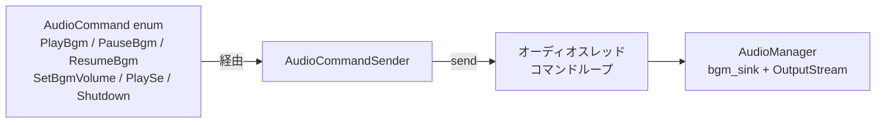
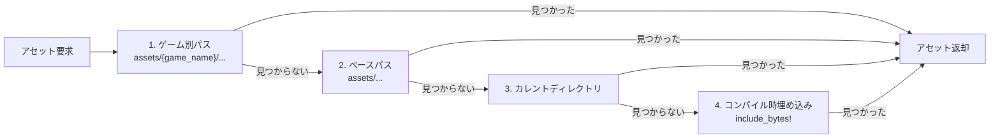

# Rust: audio — オーディオ管理

> **2026-04**: `native/nif` は **`audio` に依存しない**（Formula NIF のみ）。本クレートは主に **クライアント `app`** 等から利用。

## 概要

`audio` クレートは **rodio** によるオーディオ再生とアセット読み込みを担当します。SuperCollider 風のコマンド駆動オーディオスレッドで、BGM / SE の再生・一時停止・再開・音量制御を行います。

- **パス**: `native/audio/`
- **依存**: rodio

---

## `audio.rs`

---

## `asset/mod.rs` — アセット管理

---

## AudioCommand 一覧

| コマンド | 説明 |
|:---|:---|
| `PlayBgm` | BGM 再生 |
| `PauseBgm` | BGM 一時停止 |
| `ResumeBgm` | BGM 再開 |
| `SetBgmVolume(f32)` | BGM 音量 |
| `PlaySe(AssetId)` | SE 再生 |
| `PlaySeWithVolume(AssetId, f32)` | 音量指定で SE 再生 |
| `Shutdown` | オーディオスレッド終了 |

---

## 関連ドキュメント

- [アーキテクチャ概要](../../overview.md)
- [nif](../nif.md)
