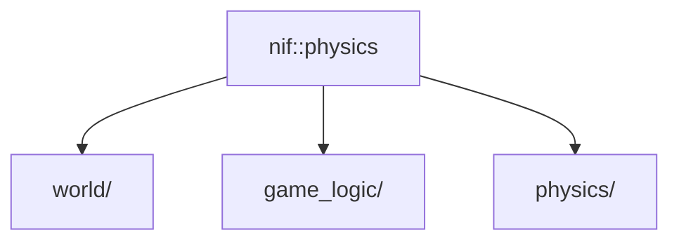

# Rust: nif/physics — 物理演算・ECS コードベース詳細

## 概要

`physics` は **nif クレート内のモジュール**（`native/nif/src/physics/`）です。60Hz 固定の物理演算・空間ハッシュ・ECS・外部注入パラメータテーブルを担当します。独立したクレートではなく、`nif` が Elixir からの NIF 経由で状態を注入・読み取ります。

- **パス**: `native/nif/src/physics/`
- **親クレート**: `nif`（`rustc-hash`, `rayon`, `log` を nif の依存で利用）

---

## モジュール構成



---

## `constants.rs`

| 定数 | 値 | 説明 |
|:---|:---|:---|
| `SCREEN_WIDTH` | 1280 | 画面幅（px） |
| `SCREEN_HEIGHT` | 720 | 画面高さ（px） |
| `MAP_WIDTH` | 4096 | マップ幅（px） |
| `MAP_HEIGHT` | 4096 | マップ高さ（px） |
| `PLAYER_SPEED` | 200.0 | プレイヤー速度（px/s） |
| `BULLET_SPEED` | 400.0 | 弾速（px/s） |
| `CELL_SIZE` | 80 | 空間ハッシュセルサイズ（px） |
| `INVINCIBLE_DURATION` | 0.5 | 無敵時間（秒） |

---

## `entity_params.rs` — 外部注入パラメータテーブル

`EntityParamTables` は `set_entity_params` NIF 経由で Elixir 側から注入される。ハードコードされたパラメータは持たず、`default()` は空テーブルを返す。

```rust
pub struct EntityParamTables {
    pub enemies:  Vec<EnemyParams>,
    pub weapons:  Vec<WeaponParams>,
    pub bosses:   Vec<BossParams>,
}
```

**`EnemyParams`:** `max_hp`, `speed`, `radius`, `damage_per_sec`, `render_kind`, `particle_color`, `passes_obstacles`

**`WeaponParams` と `FirePattern`:** `Aimed`, `FixedUp`, `Radial`, `Whip`, `Aura`, `Piercing`, `Chain` など。

**`BossParams`:** `max_hp`, `speed`, `radius`, `damage_per_sec`, `render_kind`, `special_interval`

---

## `weapon.rs` — WeaponSlot

クールダウン管理のみ。ダメージ計算は `WeaponParams` を参照。

---

## `physics/` — 物理演算ユーティリティ

- **rng.rs** — LCG 乱数（決定論的・no-std）
- **spatial_hash.rs** — FxHashMap ベース空間ハッシュ。セルサイズ 80px で `O(n)` 近傍検索。
- **separation.rs** — 敵分離アルゴリズム
- **obstacle_resolve.rs** — 障害物押し出し（最大 5 回反復）

```rust
struct CollisionWorld {
    dynamic: SpatialHash,  // 毎フレーム更新（敵・弾）
    static_: SpatialHash,  // 障害物（変化なし）
}
```

---

## `world/` — ゲームワールド型

- **GameWorld** — `RwLock<GameWorldInner>`。ResourceArc で Elixir が保持。
- **GameWorldInner** — PlayerState, EnemyWorld, BulletWorld, ParticleWorld, ItemWorld, BossState, EntityParamTables, FrameEvent など。
- **EnemyWorld** 等は SoA（Structure of Arrays）構造。`free_list` で O(1) スポーン/キル。

**FrameEvent:** `EnemyKilled`, `PlayerDamaged`, `ItemPickup`, `SpecialEntityDefeated`, `SpecialEntitySpawned`, `SpecialEntityDamaged`。レベルアップは Elixir 側 `LevelComponent` が EXP 積算で判定。

---

## `game_logic/` — 物理・AI・システム

### `physics_step.rs` — 1 フレーム物理ステップ

経過時間更新 → プレイヤー移動 → 障害物押し出し → Chase AI → 敵分離 → 衝突 → 武器攻撃 → パーティクル → アイテム → 弾丸 → ボス。

### `chase_ai.rs` — 敵追跡 AI

- **x86_64**: SSE2 SIMD で 4 体並列処理。
- **その他**: rayon `par_iter_mut` で並列。

### `systems/`

- **weapons.rs** — 武器発射ロジック（FirePattern 対応）
- **projectiles.rs** — 弾丸移動・衝突・ドロップ
- **boss.rs** — ボス物理のみ（AI は Elixir 側が NIF で注入）
- **effects.rs** — パーティクル更新
- **items.rs** — アイテム収集
- **collision.rs** — 敵 vs 障害物押し出し
- **spawn.rs** — スポーン位置生成
- **special_entity_collision.rs** — ボス等の特殊エンティティ衝突

武器選択肢の生成は Elixir 側 `LevelSystem` が担当。

---

## 関連ドキュメント

- [アーキテクチャ概要](../../overview.md)
- [nif](../nif.md)
- [desktop/render](../desktop/render.md)（render クレート）
- [Elixir: core](../../elixir/core.md)
