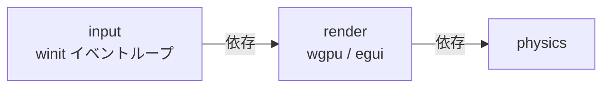

# Rust: render — 描画・ウィンドウ・デスクトップ入力

## 概要

`render` クレートは wgpu による GPU 描画パイプライン・egui HUD・winit ウィンドウ管理・ヘッドレスモードを担当します。Phase R-2 以降、**RenderFrame**（DrawCommand リスト・CameraParams・UiCanvas）は Elixir 側の RenderComponent が `push_render_frame` NIF で RenderFrameBuffer に書き込み、RenderBridge の `next_frame()` がそれを取得して描画する。デスクトップのウィンドウとイベントループは **`input` クレート**（render に依存）が担当し、winit を共有します。

---

## クレート構成

---

## `render` クレート

### `window.rs` — RenderBridge トレイト・ウィンドウ設定

winit ウィンドウの設定と `RenderBridge` トレイトを定義します。実際のイベントループは `input` クレートの `run_desktop_loop` が保持します。

#### キー入力マッピング（RenderBridge 経由）

| キー | 動作 |
|:---|:---|
| W / ↑ | 上移動 |
| S / ↓ | 下移動 |
| A / ← | 左移動 |
| D / → | 右移動 |
| 斜め入力 | 正規化（速度一定） |

#### フレームループ（RedrawRequested）

`bridge.next_frame()` → `renderer.update_instances(frame)` → `renderer.render` → `bridge.on_ui_action(pending_action)`。

### `headless.rs` — ヘッドレスモード

CI / テスト環境向け。`[features] headless = []` で有効化。winit ウィンドウを開かずに物理演算のみ実行可能。

### `renderer/mod.rs` — 描画パス

- `update_instances(RenderFrame)` — RenderFrame の `commands`（DrawCommand 配列）から SpriteInstance 等を構築
- インスタンスバッファ更新 → スプライトパス（render pass）→ egui HUD パス（`frame.ui`）
- DrawCommand: PlayerSprite, Sprite, Particle, Item, Obstacle, Box3D, GridPlane, Skybox, SpriteRaw 等
- UiCanvas: vertical_layout, horizontal_layout, text, rect, progress_bar, button, world_text, screen_flash 等

**スプライトアトラスレイアウト（1600×64px、VampireSurvivor 等 2D コンテンツ用）:**

| オフセット | 内容 |
|:---|:---|
| 0〜255 | プレイヤー 4 フレームアニメ |
| 256〜511 | 敵アニメ（Slime/Bat/Golem） |
| 512〜767 | 静止スプライト（アイテム等） |
| 768〜1023 | ボス（SlimeKing/BatLord/StoneGolem） |

### `renderer/ui.rs` — egui HUD

| 画面 | 内容 |
|:---|:---|
| タイトル | START ボタン |
| ゲームオーバー | 生存時間・スコア・撃破数・RETRY ボタン |
| プレイ中 | HP バー・EXP バー・スコア・タイマー・武器スロット・Save/Load |
| ボス戦 | 画面上部中央にボス HP バー |
| レベルアップ | 武器カード×3、Esc/1/2/3 キー対応、3 秒自動選択 |

---

## シェーダー定義一覧（P4-1）

> 作成日: 2026-03-07  
> 出典: [contents-defines-rust-executes.md](../../plan/contents-defines-rust-executes.md) P4-1  
> 目的: 現行シェーダー（sprite.wgsl, mesh.wgsl）の依存関係・uniform・バインドグループを文書化する。P4 の Elixir 移行設計の前提となる。

### 設計背景

**「Contents 定義 / Rust 実行」** の原則において、シェーダーは現状 **Rust 側に `include_str!` で埋め込み** されている。Unity/Godot のようにエディタがシェーダーを管理する方式、Resonite/NeosVR のようにユーザーが動的にシェーダーを注入する方式と異なり、本プロジェクトは **Elixir（contents）がシェーダー WGSL を定義し、Rust がそれを実行する** 構成を目指す。その第一歩として、現行のシェーダー契約（uniform・バインド・頂点レイアウト）を SSoT として文書化する。

### sprite.wgsl

| 項目 | 内容 |
|:---|:---|
| **パス** | `native/render/src/renderer/shaders/sprite.wgsl` |
| **用途** | 2D スプライト描画（アトラステクスチャ、インスタンシング） |
| **使用箇所** | `renderer/mod.rs`, `headless.rs` |
| **外部依存** | なし（単一 WGSL ファイル） |

#### バインドグループ

| group | binding | 型 | 可視性 | 説明 |
|:---:|:---:|:---|:---|:---|
| 0 | 0 | `texture_2d<f32>` | FRAGMENT | スプライトアトラステクスチャ |
| 0 | 1 | `sampler` | FRAGMENT | サンプラー（ClampToEdge, Nearest） |
| 1 | 0 | `ScreenUniform` | VERTEX | 画面サイズ |
| 2 | 0 | `CameraUniform` | VERTEX | カメラオフセット（2D スクロール） |

#### Uniform 構造体

**ScreenUniform**（group 1）:

| フィールド | 型 | 説明 |
|:---|:---|:---|
| half_size | vec2&lt;f32&gt; | (width / 2, height / 2) |
| _pad | vec2&lt;f32&gt; | アライメント用 |

**CameraUniform**（group 2）:

| フィールド | 型 | 説明 |
|:---|:---|:---|
| offset | vec2&lt;f32&gt; | カメラのワールド座標オフセット（左上） |
| _pad | vec2&lt;f32&gt; | アライメント用 |

#### 頂点・インスタンスレイアウト

**VertexInput**（頂点ごと、location 0）:

| location | 型 | 説明 |
|:---:|:---|:---|
| 0 | vec2&lt;f32&gt; | 頂点位置（0,0〜1,1 の単位矩形） |

**InstanceInput**（インスタンスごと、location 1〜5）:

| location | 型 | 説明 |
|:---:|:---|:---|
| 1 | vec2&lt;f32&gt; | ワールド座標（左上） |
| 2 | vec2&lt;f32&gt; | 表示サイズ (width, height) |
| 3 | vec2&lt;f32&gt; | アトラス UV オフセット (0.0〜1.0) |
| 4 | vec2&lt;f32&gt; | アトラス UV サイズ (0.0〜1.0) |
| 5 | vec4&lt;f32&gt; | 乗算カラー tint (RGBA) |

#### エントリポイント

| ステージ | 名前 | 説明 |
|:---|:---|:---|
| vertex | vs_main | ワールド座標 + カメラオフセット → クリップ座標、UV をフラグメントへ渡す |
| fragment | fs_main | テクスチャサンプル × color_tint を出力 |

#### Rust 側の対応

- **Bind Group 0**: アトラステクスチャビュー + サンプラー（`renderer/mod.rs` の `bind_group`）
- **Bind Group 1**: `ScreenUniform`（`screen_uniform_buf`, `screen_bind_group`）。リサイズ時に更新。
- **Bind Group 2**: `CameraUniform`（`camera_uniform_buf`, `camera_bind_group`）。`update_instances` で `RenderFrame.camera` から更新。

---

### mesh.wgsl

| 項目 | 内容 |
|:---|:---|
| **パス** | `native/render/src/renderer/shaders/mesh.wgsl` |
| **用途** | 3D メッシュ（Box3D / GridPlane / Skybox）描画 |
| **使用箇所** | `renderer/pipeline_3d.rs` |
| **外部依存** | なし（単一 WGSL ファイル） |

#### バインドグループ

| group | binding | 型 | 可視性 | 説明 |
|:---:|:---:|:---|:---|:---|
| 0 | 0 | `MvpUniform` | VERTEX | Model-View-Projection 行列 |

#### Uniform 構造体

**MvpUniform**（group 0）:

| フィールド | 型 | 説明 |
|:---|:---|:---|
| mvp | mat4x4&lt;f32&gt; | ビュー行列 × 透視投影行列（列優先） |

**注**: スカイボックス用 `vs_sky` は **u_mvp を参照しない**。クリップ空間座標を頂点で直接指定するため。パイプラインレイアウト互換のため `mvp_bind_group` は設定されるが、シェーダー内では未使用。

#### 頂点レイアウト

**VertexInput**（mesh.wgsl 共通）:

| location | 型 | 説明 |
|:---:|:---|:---|
| 0 | vec3&lt;f32&gt; | 位置 (x, y, z) |
| 1 | vec4&lt;f32&gt; | 頂点色 RGBA |

※ `MeshVertex` と対応（[mesh-definitions.md](../mesh-definitions.md) 参照）

#### エントリポイント

| ステージ | 名前 | 使用パス | 説明 |
|:---|:---|:---|:---|
| vertex | vs_main | メッシュ・グリッド | MVP 変換を適用し、ワールド→クリップ空間に変換 |
| vertex | vs_sky | スカイボックス | MVP 変換なし。頂点座標をクリップ空間としてそのまま出力 |
| fragment | fs_main | 全パス | 頂点色をそのまま出力 |

#### パイプライン別の違い

| パイプライン | エントリポイント | MVP 使用 | トポロジ | 深度テスト |
|:---|:---|:---|:---|:---|
| mesh_pipeline | vs_main | あり | TriangleList | あり |
| grid_pipeline | vs_main | あり | LineList | あり |
| sky_pipeline | vs_sky | **なし** | TriangleList | なし |

#### Rust 側の対応

- **Bind Group 0**: `MvpUniform`（`mvp_buf`, `mvp_bind_group`）。`render` 内で `CameraParams::Camera3D` から VP 行列を計算し `write_buffer`。
- **頂点バッファ**: `MeshVertex`（position: [f32;3], color: [f32;4]）。Box3D/GridPlane/Skybox ごとに CPU で生成し `write_buffer`。

---

### シェーダーと DrawCommand の対応

| シェーダー | DrawCommand | 備考 |
|:---|:---|:---|
| sprite.wgsl | SpriteRaw, Particle, Obstacle | 2D パス。PlayerSprite/Item は SpriteRaw で代用 |
| mesh.wgsl (vs_main) | Box3D, GridPlane, GridPlaneVerts | 3D パス、深度テストあり |
| mesh.wgsl (vs_sky) | Skybox | 3D パス、深度テストなし、最背面 |

---

### P4 実装状況（P4-2〜5 完了）

- **起動時ロード**: `assets/{game_id}/shaders/sprite.wgsl`, `mesh.wgsl` をファイルから読み込む
- **フォールバック**: ファイル未存在時は `include_str!` を使用
- 詳細: [shader-elixir-interface.md](../shader-elixir-interface.md)

本ドキュメントの uniform・バインド・頂点レイアウトは、コンテンツがカスタム WGSL を定義する際の **契約（Contract）** となる。Rust が期待する bind group レイアウト・頂点属性に適合する必要がある。

---

## `input` クレート（native/input）

デスクトップ入力・ウィンドウ・イベントループを担当します。**render に依存**しており、winit のイベントループの所有権はここにあります。render は描画専用、input は winit によるウィンドウ生成と入力取得を担当します。

- **パス**: `native/input/`
- **依存**: `render`, `winit`, `pollster`

### `desktop_loop.rs` — イベントループ・ウィンドウ・入力

- `run_desktop_loop<B: RenderBridge>(bridge, config)` — winit の `EventLoop` を構築し、`ApplicationHandler` として実行。
- ウィンドウ生成は `resumed` で行い、`Renderer::new(window, ...)` で render の描画器を初期化。
- **キーボード**: `WindowEvent::KeyboardInput` で `PhysicalKey::Code` を取得し、`bridge.on_raw_key(code, state)` に渡す。
- **マウス**: `cursor_grabbed` 時は `DeviceEvent::MouseMotion` を `bridge.on_raw_mouse_motion(dx, dy)` に渡す。マウスクリックでグラブ切り替え。
- **RedrawRequested**: `bridge.next_frame()` で RenderFrame を取得 → `renderer.update_instances` / `renderer.render` → `bridge.on_ui_action(action)`。カーソルグラブ状態は `frame.cursor_grab` で同期。
- **ウィンドウ**: クローズ要求で `event_loop.exit()`。フォーカス喪失で `on_focus_lost`。リサイズで `renderer.resize`。

これにより、デスクトップ版では「入力とウィンドウは input、描画は render」という責務分離が成り立っています。VR 入力は別クレート [input_openxr](./input_openxr.md) を参照してください。

---

## 関連ドキュメント

- [アーキテクチャ概要](../overview.md)
- [nif](./nif.md) / [physics](./physics.md) / [input_openxr](./input_openxr.md)
- [データフロー（レンダリング・入力）](../overview.md#レンダリングスレッド非同期)
- [contents-defines-rust-executes.md](../../plan/contents-defines-rust-executes.md) — P4 シェーダー Elixir 移行計画
- [mesh-definitions.md](../mesh-definitions.md) — メッシュ頂点型（mesh.wgsl と対応）
