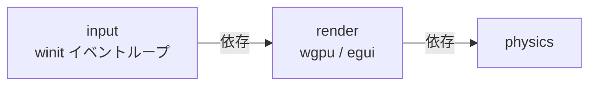

# Rust: render — 描画・ウィンドウ・デスクトップ入力

## 概要

`render` クレートは wgpu による GPU 描画パイプライン・egui HUD・winit ウィンドウ管理・ヘッドレスモードを担当します。デスクトップのウィンドウとイベントループは **`input` クレート**（render に依存）が担当し、winit を共有します。

---

## クレート構成

---

## `render` クレート

### `window.rs` — RenderBridge トレイト・ウィンドウ設定

winit ウィンドウの設定と `RenderBridge` トレイトを定義します。実際のイベントループは `input` クレートの `run_desktop_loop` が保持します。

#### キー入力マッピング（RenderBridge 経由）

| キー | 動作 |
|:---|:---|
| W / ↑ | 上移動 |
| S / ↓ | 下移動 |
| A / ← | 左移動 |
| D / → | 右移動 |
| 斜め入力 | 正規化（速度一定） |

#### フレームループ（RedrawRequested）

`bridge.next_frame()` → `renderer.update_instances(frame)` → `renderer.render` → `bridge.on_ui_action(pending_action)`。

### `headless.rs` — ヘッドレスモード

CI / テスト環境向け。`[features] headless = []` で有効化。winit ウィンドウを開かずに物理演算のみ実行可能。

### `renderer/mod.rs` — 描画パス

- `update_instances(RenderFrame)` — SpriteInstance 配列を構築（最大 14,502 エントリ）
- インスタンスバッファ更新 → スプライトパス（render pass）→ egui HUD パス

**スプライトアトラスレイアウト（1600×64px）:**

| オフセット | 内容 |
|:---|:---|
| 0〜255 | プレイヤー 4 フレームアニメ |
| 256〜511 | 敵アニメ（Slime/Bat/Golem） |
| 512〜767 | 静止スプライト（アイテム等） |
| 768〜1023 | ボス（SlimeKing/BatLord/StoneGolem） |

### `renderer/ui.rs` — egui HUD

| 画面 | 内容 |
|:---|:---|
| タイトル | START ボタン |
| ゲームオーバー | 生存時間・スコア・撃破数・RETRY ボタン |
| プレイ中 | HP バー・EXP バー・スコア・タイマー・武器スロット・Save/Load |
| ボス戦 | 画面上部中央にボス HP バー |
| レベルアップ | 武器カード×3、Esc/1/2/3 キー対応、3 秒自動選択 |

---

## `input` クレート（native/input）

デスクトップ入力・ウィンドウ・イベントループを担当します。**render に依存**しており、winit のイベントループの所有権はここにあります。render は描画専用、input は winit によるウィンドウ生成と入力取得を担当します。

- **パス**: `native/input/`
- **依存**: `render`, `winit`, `pollster`

### `desktop_loop.rs` — イベントループ・ウィンドウ・入力

- `run_desktop_loop<B: RenderBridge>(bridge, config)` — winit の `EventLoop` を構築し、`ApplicationHandler` として実行。
- ウィンドウ生成は `resumed` で行い、`Renderer::new(window, ...)` で render の描画器を初期化。
- **キーボード**: `WindowEvent::KeyboardInput` で `PhysicalKey::Code` を取得し、`bridge.on_raw_key(code, state)` に渡す。
- **マウス**: `cursor_grabbed` 時は `DeviceEvent::MouseMotion` を `bridge.on_raw_mouse_motion(dx, dy)` に渡す。マウスクリックでグラブ切り替え。
- **RedrawRequested**: `bridge.next_frame()` で RenderFrame を取得 → `renderer.update_instances` / `renderer.render` → `bridge.on_ui_action(action)`。カーソルグラブ状態は `frame.cursor_grab` で同期。
- **ウィンドウ**: クローズ要求で `event_loop.exit()`。フォーカス喪失で `on_focus_lost`。リサイズで `renderer.resize`。

これにより、デスクトップ版では「入力とウィンドウは input、描画は render」という責務分離が成り立っています。VR 入力は別クレート [input_openxr](./input_openxr.md) を参照してください。

---

## 関連ドキュメント

- [アーキテクチャ概要](../overview.md)
- [nif](./nif.md) / [physics](./physics.md) / [input_openxr](./input_openxr.md)
- [データフロー（レンダリング・入力）](../overview.md#レンダリングスレッド非同期)
