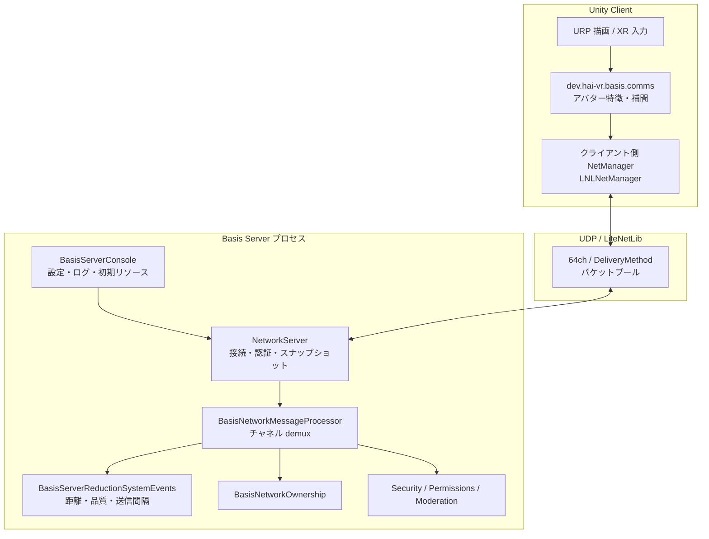

# Basis（BasisVR/Basis）コードベース — アーキテクチャ整理

> 参照リポジトリ: [https://github.com/BasisVR/basis](https://github.com/BasisVR/basis)  
> 解析時点の目安: `developer` ブランチ想定（ローカルでは `git rev-parse HEAD` の値をここに追記するとよい）

本文はローカルツリー `Basis/`（Unity プロジェクト）および `Basis Server/`（.NET コンソールサーバ）を読んだ**構造理解用の要約**である。API の完全列挙やプロトコル仕様の代替にはしない。

---

## 1. リポジトリの物理構成

```text
Basis/                          # リポジトリルート
├── Basis/                      # Unity 6 プロジェクト本体
│   └── Packages/
│       ├── com.basis.server/ # サーバロジックを Unity パッケージとしても同梱（共有・テスト用）
│       ├── dev.hai-vr.basis.comms/   # アバター特徴量の送受信・補間など「コミュニケーション」層
│       ├── com.basis.zeromessenger/  # メッセージング（依存として同梱）
│       └── …                   # OpenXR、Opus、Steam Audio 等の多数の UPM パッケージ
├── Basis Server/             # ヘッドレス .NET サーバ（コンソールエントリ、Docker）
│   ├── BasisNetworkCore/     # 共有コア（チャネル定義、シリアライズ型、LNL 拡張）
│   ├── BasisNetworkServer/   # LiteNetLib 上のゲームサーバ実装
│   ├── BasisNetworkClient/   # スタンドアロンクライアント用ラッパ
│   ├── BasisServerConsole/   # `Program.Main` → `NetworkServer.StartServer`
│   ├── LiteNetLib/           # ベンダリングされた転送層
│   └── Contrib/              # Kv ストア、Crypto、DID 認証、DNS ハンドル等
└── README.md / PHILOSOPHY.md
```

**要点**: 実行形態は「Unity クライアント」と「`Basis Server` のプロセス」の二系統。コアのネットワーク型と LiteNetLib 周りは **`Basis Server` と `com.basis.server` で二重に保持**され、同一アーキテクチャを共有している。

---

## 2. ランタイムのレイヤモデル（概念図）



---

## 3. サーバ起動とライフサイクル

1. **`BasisServerConsole/Program.cs`**  
   - XML 設定の読み込み・環境変数オーバーライド、ログ初期化、`BasisNetworkHealthCheck`。  
   - **`NetworkServer.StartServer(config)`** で LiteNetLib とイベント購読を開始。  
   - `BasisLoadableLoader.LoadXML` で初期リソース定義を読み込み。  
   - シャットダウン時に DB・BSR・統計ワーカー・ログの順で停止。

2. **`NetworkServer`（静的クラス）**  
   - `EventBasedNetListener` + **`LNLNetManager`**（`BasisNetworkCore` 内で `NetManager` を拡張）。  
   - `AuthenticatedPeers` と **`PeerSnapshot`**（接続・切断時に再構築）でブロードキャスト時の `ToArray()` 回避。  
   - **`NetDataWriter` プール**（上限付き）で GC を抑制。  
   - 認証: `PasswordAuth` + **`BasisDIDAuthIdentity`**（設定に応じてファイルベースの権限連携）。  
   - BSR 用に距離閾値・タイマ倍率などを `Configuration` から注入。

3. **イベント配線**（`BasisServerHandleEvents`）  
   - `ConnectionRequest` → バージョン検証、ピア上限、認証、ヘッドレス禁止ポリシー等。  
   - `NetworkReceive` → **`BasisNetworkMessageProcessor.ProcessMessage`**（チャネル番号で巨大 `switch`）。  
   - `PeerDisconnected` → 所有権・保存状態・BSR・コンテンツ共有などのクリーンアップ後、他クライアントへ切断通知。

---

## 4. 転送層: LiteNetLib の使い方

- **プロトコル**: UDP 上の LiteNetLib。IPv4/IPv6 のバインドは `Configuration` で制御。  
- **`BasisNetworkCommons`**（`BasisNetworkCore`）  
  - **`TotalChannels = 64`**（LiteNetLib のチャネル上限に合わせた設計）。  
  - **`PacketPoolSize = 65536`** — コメント上、高同時接続・高送信レート時のプール枯渇を避ける意図が明示されている。  
  - チャネルは **機能別に固定番号**（認証、ボイス、距離別アバター品質×追加データ、シーン、リソース、所有権、DB、統計等）。  
  - アバターは **品質 4 段 × 追加ストリーム有無 × playerID が byte/ushort** の組み合わせでチャネルが倍化（近距離ほど高帯域チャネル）。

- **混雑時の送信制御**（`NetworkServer.TrySend`）  
  - `Sequenced` / `Unreliable` については **キュー深度** を見てスキップ可能（過剰キューイングによる遅延悪化を避ける）。

---

## 5. メッセージ処理: `BasisNetworkMessageProcessor`

受信コールバックは **`channel` 第一のディスパッチ**。

主なグループ（`BasisNetworkMessageProcessor.cs` より）:

| チャネル群の意味 | 処理先の例 |
|------------------|------------|
| ボイス（空間・シャウト） | `BasisServerHandleEvents.HandleVoiceMessage` 等 |
| アバター高頻度（High チャネル等） | **`BasisServerReductionSystemEvents.HandleAvatarMovement`** |
| アバター／シーンの汎用ペイロード | `BasisNetworkingGeneric` |
| 所有権の取得・譲渡・解除 | `BasisNetworkOwnership`（権限ノードと連動） |
| ボイス受信者リスト（通常・反転・ビットフィールド・大規模 ID） | `UpdateVoiceReceivers*` |
| NetID 割当、リソース読込、コンテンツ共有、DB、管理 | 各専用ハンドラ |

**Alchemy への示唆**: チャネル＝論理ストリームの列挙が一箇所に集約されており、運用・デバッグ・帯域計測（`BasisNetworkStatistics`）と相性がよい。一方、**チャネル追加は `TotalChannels` と switch の両方のメンテ**が必要になる点はトレードオフ。

---

## 6. スケール対策の中核: Basis Server Reduction System（BSR）

`BasisServerReductionSystemEvents` は、**大量プレイヤー時のアバター同期コスト**を下げるためのサブシステム。

把握できた設計パターン:

- **`PlayerState` per プレイヤー**  
  - 位置（距離判定用）、世代カウンタ、**ピアごとの最終送信時刻・キャッシュされた距離区間**（ホットループでの float 距離計算削減）。  
  - **品質別に分割された `LocalAvatarSyncMessage`** と **事前シリアライズ済みバイト列**（品質ごと）を保持。  
  - シーケンス番号で新旧判定（アンローカルなクライアント送信との整合）。

- **並列処理**  
  - `Parallel.ForEach` 用に **静的デリゲート** を保持し、毎フレームのクロージャ割り当てを避ける。  
  - `MaxDegreeOfParallelism = ProcessorCount - 1` 程度。

- **メッセージバッファ**  
  - `ConcurrentDictionary` の **ダブルバッファ**（スワップしてクリア）で毎ティック割り当てを避ける。  
  - `QueuedMessage` プールや `ArrayPool` 利用のコメント（高品質ペイロードの共有禁止など安全性）。

- **距離 → 品質 → 送信間隔**  
  - 距離二乗の閾値（High/Medium/Low）を設定から注入。  
  - **ティック分割**（コメント上、受信者ペア処理の O(N²) を複数フレームに分散）の記述あり。

**Alchemy への示唆**: 「**サーバ側で LOD 的に同期品質を落とす**」「**計測可能な統計とプール**」「**ホットパスからの数学の排除**」は、言語が違っても転用価値が高い。実装はゲーム特化（アバター骨格・ブレンドシェイプ前提）なので、**汎用オブジェクト同期**には直接マッピングしない。

---

## 7. 認証・身元・モデレーション

- **接続時**: クライアントは `NetDataWriter` 先頭に **プロトコル／ビルドバージョン**（ushort）、任意で **認証バイト列**、続けて `ReadyMessage` を載せる（`NetworkClient.StartClient`）。  
- **サーバ**: `UseAuth` 時にバイト列検証。  
- **DID**: `Contrib/Auth/Did` と `BasisDIDAuthIdentity` — 分散識別子に基づく身元連携のフック。  
- **権限**: `PermissionManager` + XML（ファイルサポート時）。  
- **モデレーション**: IP/プレイヤー BAN、ワードフィルタ、ヘッドレス接続禁止ポリシー等が `BasisNetworkServer/Security` 配下。

---

## 8. クライアント側（Unity）の補足

- **描画・入力**: OpenXR / SteamVR、URP、Steam Audio 等（README 記載どおり）。  
- **`dev.hai-vr.basis.comms`**:  
  - `HVRAvatarComms`、`FeatureNetworking`、`Transmitter` 等で **特徴量ストリーム** と **補間・再同期** を扱う。  
  - サーバのチャネル設計とは別層だが、**「何を送るか」はクライアントのコンポーネント**に寄っている。

- **ZeroMessenger**: 依存パッケージとして存在（UI/ローカルイベントとサーバ同期の分離の一部として利用されている想定で、BSR とは別軸）。

---

## 9. 運用・デプロイ

- **`Basis Server/Docker/`**: `docker-compose`、設定ディレクトリと `initialresources` のマウント説明。  
- **設定**: XML + 環境変数オーバーライド（Docker README 記載）。  
- **コンソール**: `/players`, `/status`, `/shutdown` 等（`Program.cs`）。

---

## 10. AlchemyEngine との対応表（設計議論用）

| Basis の構成要素 | Alchemy でのおおよその相当（既存ドキュメント） |
|--------------------|-----------------------------------------------|
| チャネル分割 + メッセージ型 | Zenoh / プロトコル設計（[docs/architecture/zenoh-protocol-spec.md](../../architecture/zenoh-protocol-spec.md) 等） |
| BSR（距離・品質・送信レート） | 帯域ポリシー、LOD、権威ある状態同期（[docs/architecture/authoritative-state-sync-policy.md](../../architecture/authoritative-state-sync-policy.md)） |
| 所有権 RPC | コンテンツ側オブジェクトモデル・ネットワーク方針 |
| DID + パスワード | 身元・テナント境界（Alchemy の認可モデルと別検討） |
| Unity パッケージとしてのサーバ共有 | NIF / Elixir 分割方針（共有の仕方は異なる） |
| ボイス（空間／シャウト、受信者リストの複数表現） | 帯域・ミキング・同期方針（[docs/policy/audio-responsibility.md](../../policy/audio-responsibility.md) および今後のボイス／3D オーディオ設計） |

---

## 11. 負荷・スケールの一次情報（公開投稿）

閲覧には X アカウントが必要な場合がある。

### 11.1 高同時接続のデモ（動画）

- [負荷テスト関連投稿（動画）](https://x.com/BasisVR/status/2044403555805827320)

**読み取れる前提**

- **クライアントは Unity（URP 等）で描画している**ため、同時接続デモは **ゲームループ・レンダリング・同期の合成結果**であり、`Basis Server` の転送・還元（BSR）だけに切り出したベンチではない。
- 動画説明にない条件（マシン台数、1 台あたりクライアント数、ボイス、アバター資産、地理的 RTT 等）は、Alchemy への持ち込み時に **未確定としてラベル付け**するのがよい。

### 11.2 オーディオ（ボイス）の劣化レポート

- [オーディオ周りの改善・スケールに関する投稿](https://x.com/BasisVR/status/2000152570523009327)

Basis 側の共有によれば、**同時接続がおおよそ 300〜400 人規模に達したあたりでオーディオ品質の劣化**が現れ、その対策に注力している、という文脈で言及されている（詳細は投稿本文・動画に依存する）。

**Alchemy への含意**

- アバター同期の帯域削減（BSR 等）と独立に、**ボイスは送受信先の組み合わせが爆発しやすい**ため、大人数インスタンスでは早い段階でボトルネックになりうる。
- コード上は `AudioRecipients*` 系チャネルや `Voice` / `ShoutVoice` など受信者指定の表現が複数ある（§5）が、**「何百人までこの戦略で持つか」は別検証**が必要。
- 本リポジトリでは音声の責務の出発点を [audio-responsibility.md](../../policy/audio-responsibility.md) に置いている。Basis の公開情報は、**大人数時のオーディオ劣化対策をプロダクト優先度に載せる根拠**の一つとして参照できる。

再現可能な手順（リポジトリ内スクリプト、CI、数値ログ）が GitHub 側にまとまれば、本節に追記する。

---

## 12. 今後の追記候補

- リポジトリ内の **負荷試験手順・再現コマンド**（あればリンクと要約）。  
- **ボイスパイプライン**（Opus フレーム、受信者リスト戦略）のシーケンス図。  
- **リソースプリロード → スポーン** の状態機械（チャネル 25–28 周辺）。
