# データフロー・通信

## 概要

AlchemyEngine は **Elixir（制御）** と **Rust（演算）** の 2 層構造で動作します。両者の通信は Rustler NIF を介して行われ、ゲームワールドの状態は `GameWorld(RwLock<GameWorldInner>)` として Rust 側に保持されます。

---

## 起動シーケンス

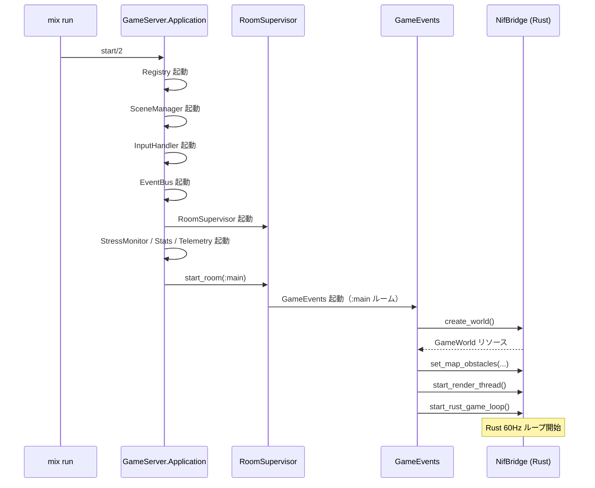

---

## メインゲームループ（定常状態）

### Rust 側（60Hz 固定ループ）

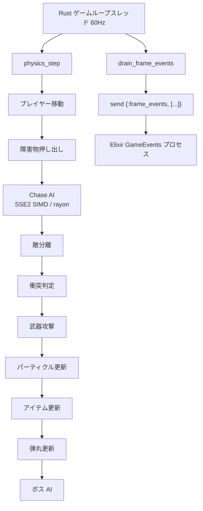

### Elixir 側（イベント駆動）

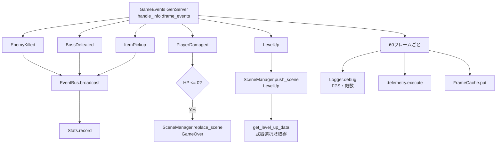

---

## レンダリングスレッド（非同期）

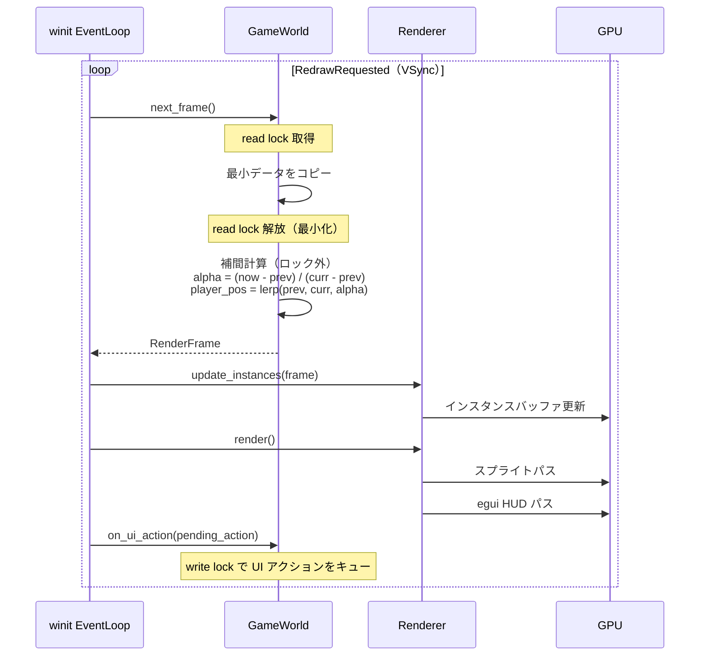

---

## ユーザー入力フロー

### キーボード入力（移動）

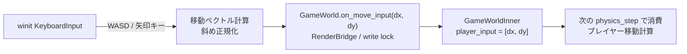

### UI アクション（レベルアップ選択・セーブ等）

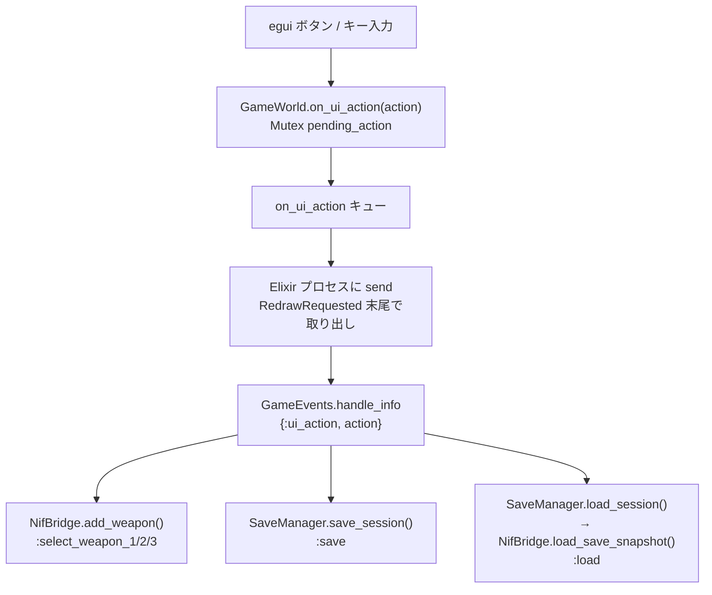

---

## NIF 通信詳細

### RwLock 競合戦略

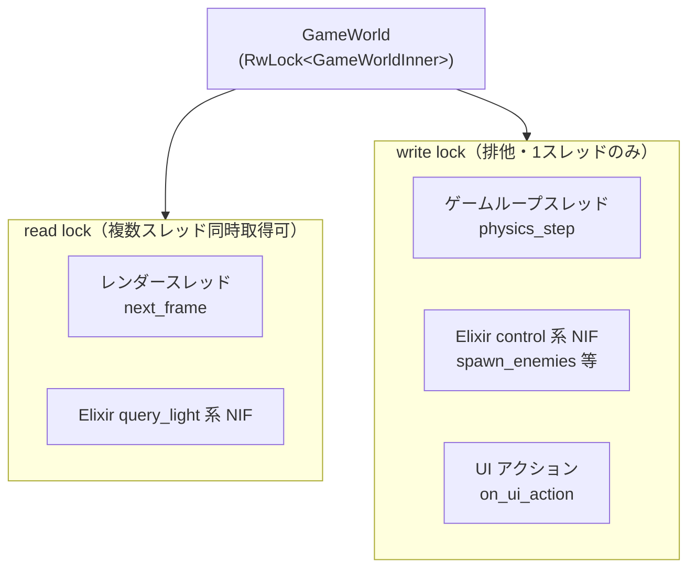

**競合監視（`lock_metrics.rs`）:**
- read lock 待機 > 300μs → `log::warn!`
- write lock 待機 > 500μs → `log::warn!`
- 5 秒ごとに平均待機時間をレポート

### NIF 関数カテゴリ別ロック種別

| カテゴリ | 代表関数 | ロック | 呼び出し頻度 |
|:---|:---|:---|:---|
| control | `create_world`, `spawn_enemies` | write | 低（イベント時） |
| query_light | `get_player_hp`, `get_enemy_count` | read | 高（毎フレーム可） |
| snapshot_heavy | `get_save_snapshot`, `load_save_snapshot` | write | 低（明示操作時） |
| game_loop | `physics_step`, `drain_frame_events` | write | 高（60Hz） |

---

## イベントバス（Elixir 内）

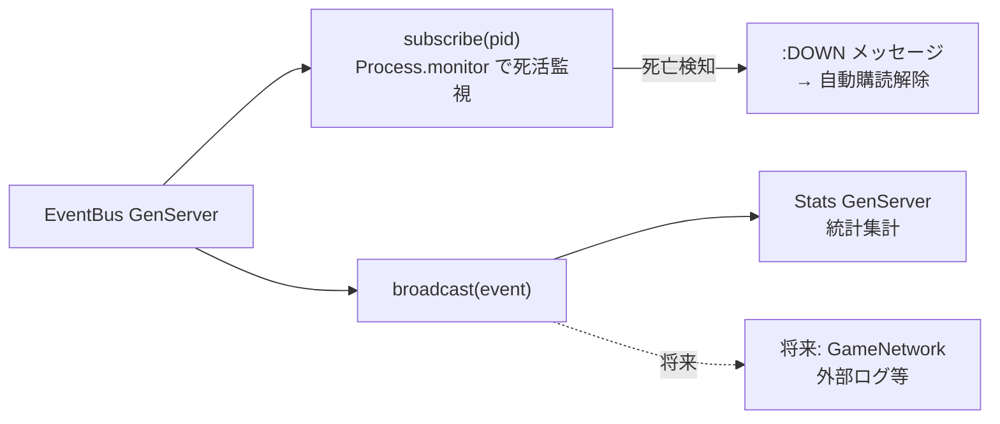

サブスクライバーが死亡した場合、`{:DOWN, ...}` メッセージで自動的に購読解除されます。

---

## セーブ/ロードフロー

### セーブ

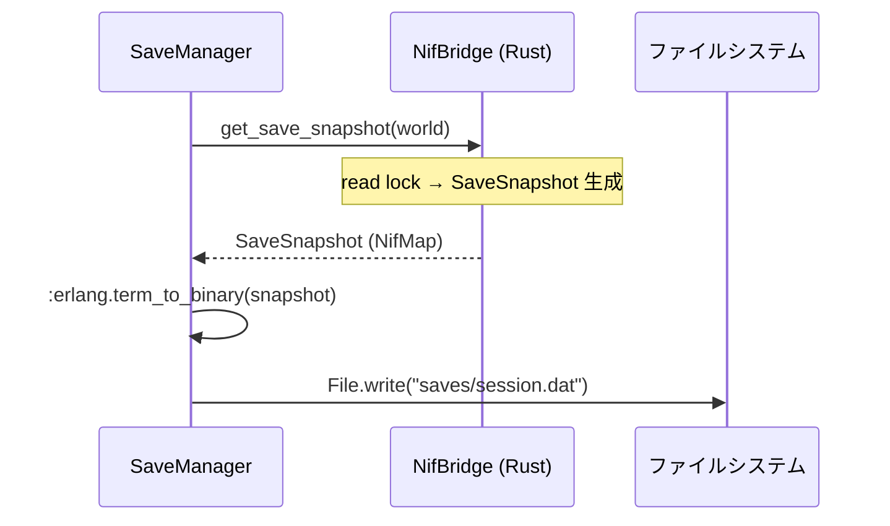

### ロード

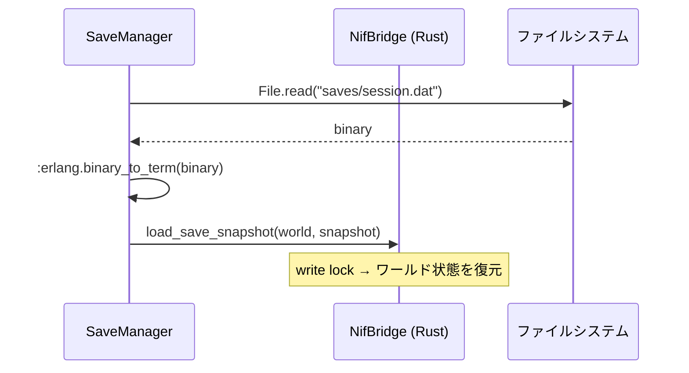

### ハイスコア

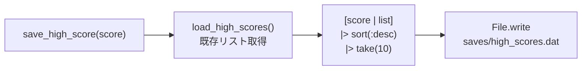

---

## スレッドモデル

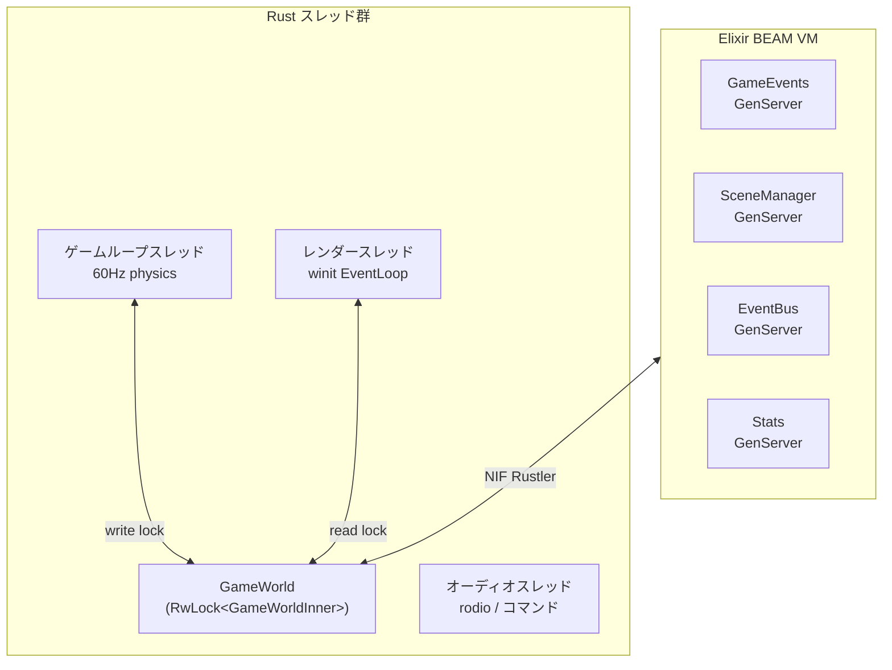

---

## 関連ドキュメント

- [アーキテクチャ概要](./architecture-overview.md)
- [Elixir レイヤー詳細](./elixir-layer.md)
- [Rust レイヤー詳細](./rust-layer.md)
- [ゲームコンテンツ詳細](./game-content.md)
