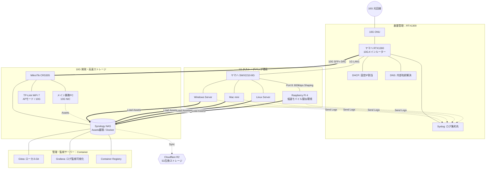

# ラボ開発環境（ネットワーク構成）

個人ラボの開発・検証用ネットワーク構成を Mermaid で示します。物理接続・論理データフロー・管理レイヤを一枚にまとめています。

運用設計（VLAN・FW・ログ・NAS のたたき台）は [lab-environment-operations-stub.md](./lab-environment-operations-stub.md) を参照してください。
