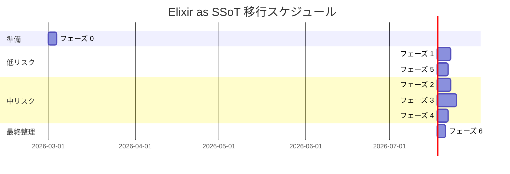

# Elixir as SSoT — 移行実装計画

## 背景と現状の問題

AlchemyEngine の設計思想は **Elixir を Single Source of Truth（SSoT）** とすることだが、
現状は `GameWorldInner`（`RwLock<GameWorldInner>`）という巨大な状態塊が Rust 側に存在し、
**Rust が権威ある状態を持ち、Elixir がポーリングで読み取る**という逆転した構造になっている。

### 現状の問題点まとめ

| 状態 | 現在の場所 | 問題 |
|:---|:---|:---|
| `score` | `GameWorldInner` (Rust) | 権威あるスコアが Rust 内で更新される |
| `level`, `exp` | `GameWorldInner` (Rust) | プレイヤー成長データが Rust 内にある |
| `player.hp` | `GameWorldInner` (Rust) | 最重要ゲーム状態が Rust 内にある |
| `weapon_slots` | `GameWorldInner` (Rust) | 武器構成が Rust 内にある |
| `elapsed_seconds` | `GameWorldInner` (Rust) | ゲーム時間が Rust 内にある |
| `kill_count` | `GameWorldInner` (Rust) | 統計データが Rust 内にある |
| `level_up_pending` | `GameWorldInner` (Rust) | ゲームフェーズ状態が Rust 内にある |
| `boss` (存在・HP) | `GameWorldInner` (Rust) | ボス状態が Rust 内にある |
| `pending_ui_action` | `GameWorldInner.Mutex` (Rust) | UI アクションが Elixir をバイパスする |
| `move_up/down/left/right` | `RenderApp` (Rust) | キー入力が `InputHandler` ETS と二重管理 |
| `RENDER_THREAD_RUNNING` | `static AtomicBool` (Rust) | プロセスグローバル状態が Elixir から不可視 |

---

## 移行の基本方針

Rust は **「純粋な計算エンジン」** に徹する。

```
【移行前】
Rust: 状態を持ち、毎フレーム更新する（権威）
Elixir: Rust をポーリングして読み取る（従属）

【移行後】
Elixir: 権威ある状態を持つ（SSoT）
Rust: Elixir から受け取った状態で計算し、差分イベントを返す（計算エンジン）
```

移行は **6 つのフェーズ** に分けて段階的に実施する。
各フェーズは独立してリリース可能な単位とし、ゲームが動作し続けることを確認しながら進める。

---

## フェーズ 0: 準備・計測基盤の整備

**目的**: 移行の影響を定量的に把握するための計測基盤を整える。

### 0-1. ベンチマーク基準値の記録

移行前の状態でパフォーマンス基準値を記録する。

- `lock_metrics.rs` の read/write 待機時間の平均値
- 60Hz ループの実際の tick 間隔（`StressMonitor` の `overrun_count`）
- `FrameCache` の `physics_ms` 平均値

### 0-2. テスト用 NIF クエリの追加

移行中の正確性検証のため、Rust 側の状態を Elixir 側と比較できる NIF を追加する。

```elixir
# 追加する NIF（read_nif.rs に追加）
NifBridge.get_full_game_state(world_ref)
# → %{score: u32, level: u32, exp: u32, hp: f32, elapsed_seconds: f32, kill_count: u32}
```

### 0-3. `GameEvents` に状態スナップショット比較ログを追加

60 フレームごとに Rust の状態と Elixir の状態（後のフェーズで追加するもの）を比較し、
乖離があれば `Logger.warning` を出力する仕組みを用意する。

---

## フェーズ 1: 統計・スコア系の移行（低リスク）

**目的**: ゲームプレイに影響しない読み取り専用の統計データを Elixir に移す。

**対象フィールド**: `score`, `kill_count`, `elapsed_seconds`

### 1-1. `GameEvents` の状態にスコア・統計フィールドを追加

```elixir
# game_events.ex の GenServer state に追加
%{
  # 既存
  room_id:        room_id,
  world_ref:      world_ref,
  control_ref:    control_ref,
  last_tick:      start_ms,
  frame_count:    0,
  weapon_levels:  initial_weapon_levels,
  # 新規追加
  score:          0,
  kill_count:     0,
  elapsed_ms:     0,
}
```

### 1-2. `frame_events` ハンドラでスコアを Elixir 側で積算

`EnemyKilled` と `BossDefeated` イベントを受信したとき、Elixir 側でスコアを加算する。
Rust 側の `score` フィールドは将来的に削除するが、このフェーズでは並走させる。

現在の `FrameEvent` の定義は以下の通り：

```rust
// native/game_native/src/world/frame_event.rs（現状）
EnemyKilled  { enemy_kind: u8, weapon_kind: u8 },  // exp フィールドなし
BossDefeated { boss_kind: u8 },                     // score フィールドなし
```

`exp_reward` は `enemy_kind` / `boss_kind` から `entity_params` テーブルを引いて取得する。
Elixir 側でもこのテーブルを参照できるよう、`game_content` にパラメータ定義を移植する。

```elixir
# game_content/lib/game_content/entity_params.ex（新規追加）
# Rust の entity_params.rs と同じ値を Elixir 側でも保持する
@enemy_exp_rewards %{0 => 5, 1 => 3, 2 => 20, 3 => 10, 4 => 8}
@boss_exp_rewards  %{0 => 200, 1 => 400, 2 => 800}
@score_per_exp 2  # Rust 側の score += exp_reward * 2 と同じ係数

def enemy_exp_reward(kind_id), do: Map.fetch!(@enemy_exp_rewards, kind_id)
def boss_exp_reward(kind_id),  do: Map.fetch!(@boss_exp_rewards, kind_id)
```

```elixir
# handle_info({:frame_events, events}, state) 内
defp apply_event({:enemy_killed, %{enemy_kind: kind_id}}, state) do
  exp = EntityParams.enemy_exp_reward(kind_id)
  score_delta = exp * @score_per_exp
  %{state | score: state.score + score_delta, kill_count: state.kill_count + 1}
end

defp apply_event({:boss_defeated, %{boss_kind: kind_id}}, state) do
  exp = EntityParams.boss_exp_reward(kind_id)
  score_delta = exp * @score_per_exp
  %{state | score: state.score + score_delta, kill_count: state.kill_count + 1}
end
```

> **注意**: `entity_params` の値が Rust 側と乖離しないよう、フェーズ 0 で追加する比較ログで定期的に検証すること。

### 1-3. `elapsed_ms` をゲームループタイマーから計算

`last_tick` を使って Elixir 側で経過時間を管理する。

### 1-4. `FrameCache` の更新を Elixir 側の値で行う

`FrameCache.put/6` に渡す `score` と `kill_count` を Elixir 側の値に切り替える。

### 1-5. Rust 側の `score` フィールドを削除

`GameWorldInner` から `score`, `kill_count` を削除する。
`FrameEvent` の `EnemyKilled` / `BossDefeated` は現状すでに `exp` / `score` フィールドを持たないため、
`FrameEvent` 定義の変更は不要。
`elapsed_seconds` は物理演算で使用するため、このフェーズでは残す（フェーズ 3 で対処）。

**完了条件**: `StressMonitor` と `Stats` が Elixir 側の値を参照し、Rust 側と一致している。

---

## フェーズ 2: プレイヤー HP の移行（中リスク）

**目的**: 最重要ゲーム状態である `player.hp` を Elixir の権威ある状態にする。

**対象フィールド**: `player.hp`, `player_max_hp`

### 2-1. `GameEvents` state に HP フィールドを追加

```elixir
%{
  # 新規追加
  player_hp:     100.0,
  player_max_hp: 100.0,
}
```

### 2-2. `PlayerDamaged` イベントで Elixir 側の HP を減算

```elixir
defp apply_event({:player_damaged, %{damage: damage}}, state) do
  new_hp = max(0.0, state.player_hp - damage)
  %{state | player_hp: new_hp}
end
```

### 2-3. 死亡判定を Elixir 側に移す

現在 `is_player_dead/1` NIF で行っている死亡判定を、
Elixir 側の `player_hp <= 0.0` チェックに置き換える。

```elixir
# 変更前
if NifBridge.is_player_dead(state.world_ref) do
  SceneManager.replace_scene(GameOver, ...)
end

# 変更後
if state.player_hp <= 0.0 do
  SceneManager.replace_scene(GameOver, ...)
end
```

### 2-4. HP を Rust に注入する NIF を追加

Rust の物理演算（衝突判定）が HP を参照するため、
Elixir 側の HP を毎フレーム Rust に渡す NIF を追加する。

```rust
// world_nif.rs に追加
#[rustler::nif]
pub fn set_player_hp(world: ResourceArc<GameWorld>, hp: f32) -> Atom {
    let mut w = world.0.write();
    w.player.hp = hp;
    atoms::ok()
}
```

```elixir
# GameEvents の handle_info で毎フレーム注入
NifBridge.set_player_hp(state.world_ref, state.player_hp)
```

### 2-5. Rust 側の HP 更新ロジックを「差分イベント発行のみ」に変更

Rust の `physics_step` 内でプレイヤー HP を直接変更するのをやめ、
`PlayerDamaged` イベントを発行するだけにする。
実際の HP 値は Elixir 側が管理し、次フレームで `set_player_hp` で注入される。

**完了条件**: `is_player_dead` NIF が不要になり削除できる。

---

## フェーズ 3: レベル・EXP・武器の移行（中リスク）

**目的**: プレイヤー成長データを Elixir の権威ある状態にする。

**対象フィールド**: `level`, `exp`, `weapon_slots`, `level_up_pending`, `weapon_choices`

### 3-1. `GameEvents` state にレベル・EXP フィールドを追加

```elixir
%{
  # 既存（weapon_levels は残す）
  weapon_levels:    initial_weapon_levels,
  # 新規追加
  level:            1,
  exp:              0,
  exp_to_next:      100,   # 次レベルまでの EXP（game_core の計算式を Elixir に移植）
  level_up_pending: false,
  weapon_choices:   [],
}
```

### 3-2. `EnemyKilled` イベントで EXP を Elixir 側で積算

```elixir
defp apply_event({:enemy_killed, %{exp: exp}}, state) do
  new_exp = state.exp + exp
  {new_level, remaining_exp, exp_to_next} = maybe_level_up(state.level, new_exp)
  %{state | exp: remaining_exp, level: new_level, exp_to_next: exp_to_next}
end
```

### 3-3. レベルアップ判定を Elixir に移す

`LevelUp` イベントを Rust から受け取るのをやめ、
Elixir 側の EXP 積算でレベルアップを検知する。
`level_up_pending` フラグも Elixir 側で管理する。

### 3-4. 武器レベルの管理を `weapon_levels` に一本化

現在 `weapon_levels` は `fetch_weapon_levels/1` NIF で Rust から定期同期しているが、
`add_weapon/2` 呼び出し時に Elixir 側で直接更新するように変更する。

```elixir
# 変更前: NIF 呼び出し後に Rust から再取得
NifBridge.add_weapon(state.world_ref, weapon_id)
new_levels = NifBridge.fetch_weapon_levels(state.world_ref)

# 変更後: Elixir 側で直接更新
NifBridge.add_weapon(state.world_ref, weapon_id)
new_levels = Map.update(state.weapon_levels, weapon_id, 1, &(&1 + 1))
```

### 3-5. レベル・EXP を Rust に注入する NIF を追加

武器の実効ダメージ・クールダウン計算のため、
レベル情報を Rust に渡す NIF を追加する。

```rust
// world_nif.rs に追加
#[rustler::nif]
pub fn set_player_level(world: ResourceArc<GameWorld>, level: u32, exp: u32) -> Atom {
    let mut w = world.0.write();
    w.level = level;
    w.exp = exp;
    atoms::ok()
}
```

### 3-6. `elapsed_seconds` の管理を Elixir に移す

`elapsed_ms`（フェーズ 1 で追加）を秒に変換して Rust に注入する。
Rust の `elapsed_seconds` は物理演算（スポーンタイミング等）で参照されているため、
毎フレーム `set_elapsed_seconds` NIF で注入する。

**完了条件**: `get_level_up_data` NIF の `weapon_choices` を Elixir 側で管理できる。
`fetch_weapon_levels` NIF が不要になり削除できる。

---

## フェーズ 4: ボス状態の移行（中リスク）

**目的**: ボスの存在・HP を Elixir の権威ある状態にする。

**対象フィールド**: `boss: Option<BossState>`

### 4-1. `GameEvents` state にボスフィールドを追加

```elixir
%{
  # 新規追加
  boss_hp:      nil,   # nil = ボス不在, float = ボス HP
  boss_max_hp:  nil,
  boss_kind_id: nil,
}
```

### 4-2. `BossSpawn` / `BossDefeated` イベントで Elixir 側を更新

現在の `FrameEvent` には `BossSpawn` が存在しないため、`BossDamaged` と同様に新設する。

```rust
// frame_event.rs に追加（2つ同時に追加する）
FrameEvent::BossSpawn   { boss_kind: u8 },
FrameEvent::BossDamaged { damage: f32 },
```

`BossSpawn` イベントは `spawn_boss` NIF（`action_nif.rs`）の中でボス生成直後に発行する。
ボスの初期 HP は `BossParams::get(boss_kind).max_hp` から取得できる。

```elixir
defp apply_event({:boss_spawn, %{boss_kind: kind_id}}, state) do
  max_hp = EntityParams.boss_max_hp(kind_id)  # BossParams テーブルから取得
  %{state | boss_hp: max_hp, boss_max_hp: max_hp, boss_kind_id: kind_id}
end

defp apply_event({:boss_defeated, _}, state) do
  %{state | boss_hp: nil, boss_max_hp: nil, boss_kind_id: nil}
end
```

### 4-3. `BossDamaged` イベントを新設

Rust の `physics_step` でボスへのダメージを `BossDamaged` イベントとして発行し、
Elixir 側でボス HP を減算する。（`frame_event.rs` への追加は 4-2 で実施済み）

```elixir
defp apply_event({:boss_damaged, %{damage: damage}}, state) do
  new_hp = max(0.0, state.boss_hp - damage)
  %{state | boss_hp: new_hp}
end
```

### 4-4. ボス HP を Rust に注入する NIF を追加

```rust
#[rustler::nif]
pub fn set_boss_hp(world: ResourceArc<GameWorld>, hp: f32) -> Atom {
    let mut w = world.0.write();
    if let Some(boss) = &mut w.boss {
        boss.hp = hp;
    }
    atoms::ok()
}
```

### 4-5. `get_boss_info` NIF を Elixir 側の状態で置き換え

HUD 表示用のボス HP バーを Elixir 側の `boss_hp` / `boss_max_hp` から取得するよう変更する。

**完了条件**: `get_boss_info` NIF が不要になり削除できる。

---

## フェーズ 5: UI アクション・入力フローの整理（低〜中リスク）

**目的**: `pending_ui_action` と `RenderApp` のキー入力状態の二重管理を解消する。

### 5-1. `pending_ui_action` の Mutex を廃止

現在の UI アクションフロー（描画スレッド → `Mutex` → ゲームループスレッド → Elixir）を、
描画スレッドが直接 Elixir プロセスにメッセージを送るフローに変更する。

```
【変更前】
winit キー入力 → RenderApp → pending_ui_action (Mutex) → ゲームループスレッド → Elixir

【変更後】
winit キー入力 → RenderApp → OwnedEnv::send_and_clear(elixir_pid, {:ui_action, action})
```

`NativeRenderBridge` に Elixir PID を渡し、`on_ui_action` で直接 `send_and_clear` を呼ぶ。

```rust
// render_bridge.rs の on_ui_action を変更
fn on_ui_action(&self, action: String) {
    // Mutex への書き込みをやめ、直接 Elixir に送信
    let mut env = OwnedEnv::new();
    let _ = env.send_and_clear(&self.elixir_pid, |env| {
        (atoms::ui_action(), action).encode(env)
    });
}
```

### 5-2. `RenderApp` のキー入力状態（`move_up/down/left/right`）を整理

`RenderApp` のキー入力フラグは描画スレッド内でのみ使用する一時状態として残す。
ただし、`on_move_input` 経由で `GameWorldInner.player.input_dx/dy` に書き込む代わりに、
Elixir プロセスにメッセージを送るフローに変更する。

`InputHandler` ETS（`:input_state`）は現状 Elixir 側からの入力受付用として存在しているが、
このフローでは描画スレッドが `GameEvents` に直接送信する。
`InputHandler` は将来のネットワーク対応（リモートクライアントからの入力受付）のために残す。

```
【変更前】
winit → RenderApp.move_* → on_move_input → GameWorldInner.player.input_dx/dy (write lock)

【変更後】
winit → RenderApp.move_* → OwnedEnv::send_and_clear(pid, {:move_input, dx, dy})
→ GameEvents.handle_info({:move_input, dx, dy}) → NifBridge.set_player_input(world_ref, dx, dy)
```

これにより `RenderBridge.on_move_input` の write lock が不要になり、
描画スレッドと物理スレッドの RwLock 競合が1つ減る。

### 5-3. `RENDER_THREAD_RUNNING` をプロセス辞書または ETS で管理

`static AtomicBool` を廃止し、Elixir 側の `GameEvents` state に `render_started: boolean` フラグを追加する。
`start_render_thread/1` の二重呼び出し防止は Elixir 側で行う。

```elixir
# GameEvents.start_render_thread/1 の変更
defp maybe_start_render(state) do
  if state.render_started do
    state
  else
    NifBridge.start_render_thread(state.world_ref)
    %{state | render_started: true}
  end
end
```

**完了条件**: `GameWorldInner` から `pending_ui_action: Mutex<Option<String>>` が削除できる。
`RENDER_THREAD_RUNNING` static 変数が削除できる。

---

## フェーズ 6: `GameWorldInner` のスリム化と最終整理

**目的**: フェーズ 1〜5 の移行完了後、`GameWorldInner` を「計算に必要な最小状態」のみに絞る。

### 6-1. 削除対象フィールドの確認

フェーズ 1〜5 完了後に削除できるフィールド：

| フィールド | 移行先 | 移行フェーズ |
|:---|:---|:---|
| `score` | `GameEvents.score` | フェーズ 1 |
| `kill_count` | `GameEvents.kill_count` | フェーズ 1 |
| `level` | `GameEvents.level` | フェーズ 3 |
| `exp` | `GameEvents.exp` | フェーズ 3 |
| `level_up_pending` | `GameEvents.level_up_pending` | フェーズ 3 |
| `weapon_choices` | `GameEvents.weapon_choices` | フェーズ 3 |
| `pending_ui_action` | 直接送信に変更 | フェーズ 5 |
| `boss.hp` (権威) | `GameEvents.boss_hp` | フェーズ 4 |

### 6-2. 移行後の `GameWorldInner` の理想形

```rust
// 移行後: 計算に必要な最小状態のみ
pub struct GameWorldInner {
    // 物理演算の内部状態（Rust が権威を持つ）
    pub frame_id:           u32,
    pub player:             PlayerState,
    //   ↑ PlayerState は以下を保持し続ける（Elixir から注入される値を含む）:
    //     pub x:                f32,   // 座標（Rust が権威）
    //     pub y:                f32,
    //     pub input_dx:         f32,   // Elixir から毎フレーム注入
    //     pub input_dy:         f32,   // Elixir から毎フレーム注入
    //     pub hp:               f32,   // Elixir から毎フレーム注入
    //     pub invincible_timer: f32,   // Rust が権威
    pub player_max_hp:      f32,      // Elixir から注入（HP バー計算用）
    pub level:              u32,      // 武器ダメージ計算用。Elixir から注入
    pub elapsed_seconds:    f32,      // スポーン計算用。Elixir から注入
    pub enemies:            EnemyWorld,
    pub bullets:            BulletWorld,
    pub particles:          ParticleWorld,
    pub items:              ItemWorld,
    pub magnet_timer:       f32,
    pub rng:                SimpleRng,
    pub collision:          CollisionWorld,
    pub obstacle_query_buf: Vec<usize>,
    pub last_frame_time_ms: f64,
    pub weapon_slots:       Vec<WeaponSlot>,  // クールダウン管理のみ
    pub boss:               Option<BossState>,
    //   ↑ BossState.hp は Elixir から毎フレーム注入される
    pub frame_events:       Vec<FrameEvent>,
    pub score_popups:       Vec<(f32, f32, u32, f32)>,
    pub prev_player_x:      f32,
    pub prev_player_y:      f32,
    pub prev_tick_ms:       u64,
    pub curr_tick_ms:       u64,
}
```

> **補足**: `PlayerState` 構造体自体は変更しない。`player.input_dx/dy` と `player.hp` は
> 引き続き `PlayerState` のフィールドとして存在するが、その値の権威は Elixir に移る。
> `PlayerState` のリファクタリング（フィールドの移動等）はこの移行スコープには含めない。

### 6-3. 削除できる NIF 関数の整理

| NIF 関数 | 削除理由 |
|:---|:---|
| `is_player_dead` | Elixir 側の `player_hp <= 0.0` で判定 |
| `fetch_weapon_levels` | `weapon_levels` を Elixir 側で直接管理 |
| `get_boss_info` | `boss_hp` を Elixir 側で管理 |
| `get_hud_data` (一部) | スコア・レベル・HP は Elixir 側から取得 |

### 6-4. ドキュメントの更新

- `architecture-overview.md` のレイヤー責務分担表を更新
- `data-flow.md` のデータフロー図を更新（Elixir → Rust の注入フローを追加）
- `rust-layer.md` の `GameWorldInner` 構造体定義を更新

---

## 移行スケジュールと優先度



### 優先度の根拠

1. **フェーズ 0 → 1 → 5** を先行させる理由:
   - フェーズ 0 は後続の品質保証に必須
   - フェーズ 1（スコア・統計）はゲームプレイに影響しないため最もリスクが低い
   - フェーズ 5（UI アクション）は `pending_ui_action` の Mutex がアーキテクチャ上の異物であり、早期に解消することで後続フェーズのデバッグが容易になる

2. **フェーズ 2（HP）を先にフェーズ 3（レベル）より前に行う理由**:
   - HP は死亡判定という最重要ロジックに直結するため、単独で移行・検証したい

3. **フェーズ 6 を最後にする理由**:
   - 各フェーズで「Rust 側の古いフィールドを残したまま Elixir 側を先行させる」戦略を取るため、
     実際の削除は全フェーズ完了後にまとめて行う

---

## 各フェーズの完了チェックリスト

### フェーズ 0
- [ ] `get_full_game_state` NIF を追加した
- [ ] 移行前のパフォーマンス基準値を記録した
- [ ] 比較ログの仕組みを `GameEvents` に追加した

### フェーズ 1
- [ ] `GameEvents` state に `score`, `kill_count`, `elapsed_ms` を追加した
- [ ] `EnemyKilled` / `BossDefeated` で Elixir 側スコアを積算している
- [ ] `FrameCache` が Elixir 側の値を使っている
- [ ] `GameWorldInner` から `score`, `kill_count` を削除した

### フェーズ 2
- [ ] `GameEvents` state に `player_hp`, `player_max_hp` を追加した
- [ ] `PlayerDamaged` で Elixir 側 HP を減算している
- [ ] 死亡判定が Elixir 側の `player_hp <= 0.0` になっている
- [ ] `set_player_hp` NIF を追加し、毎フレーム注入している
- [ ] `is_player_dead` NIF を削除した

### フェーズ 3
- [ ] `GameEvents` state に `level`, `exp`, `exp_to_next` を追加した
- [ ] `EnemyKilled` で Elixir 側 EXP を積算し、レベルアップを検知している
- [ ] `add_weapon` 後の `weapon_levels` を Elixir 側で直接更新している
- [ ] `set_player_level` / `set_elapsed_seconds` NIF を追加した
- [ ] `fetch_weapon_levels` NIF を削除した

### フェーズ 4
- [ ] `GameEvents` state に `boss_hp`, `boss_max_hp`, `boss_kind_id` を追加した
- [ ] `BossDamaged` イベントを Rust 側で発行し、Elixir 側で HP を減算している
- [ ] `set_boss_hp` NIF を追加し、毎フレーム注入している
- [ ] `get_boss_info` NIF を削除した

### フェーズ 5
- [ ] `on_ui_action` が `Mutex` を使わず直接 Elixir に送信している
- [ ] `on_move_input` が Elixir 経由で `set_player_input` を呼んでいる
- [ ] `RENDER_THREAD_RUNNING` static 変数を削除し、Elixir 側で管理している
- [ ] `GameWorldInner` から `pending_ui_action: Mutex<Option<String>>` を削除した

### フェーズ 6
- [ ] 全削除対象フィールドを `GameWorldInner` から削除した
- [ ] 全削除対象 NIF 関数を削除した
- [ ] `architecture-overview.md` を更新した
- [ ] `data-flow.md` を更新した
- [ ] `rust-layer.md` を更新した

---

## 関連ドキュメント

- [アーキテクチャ概要](./architecture-overview.md)
- [Elixir レイヤー詳細](./elixir-layer.md)
- [Rust レイヤー詳細](./rust-layer.md)
- [データフロー・通信](./data-flow.md)
