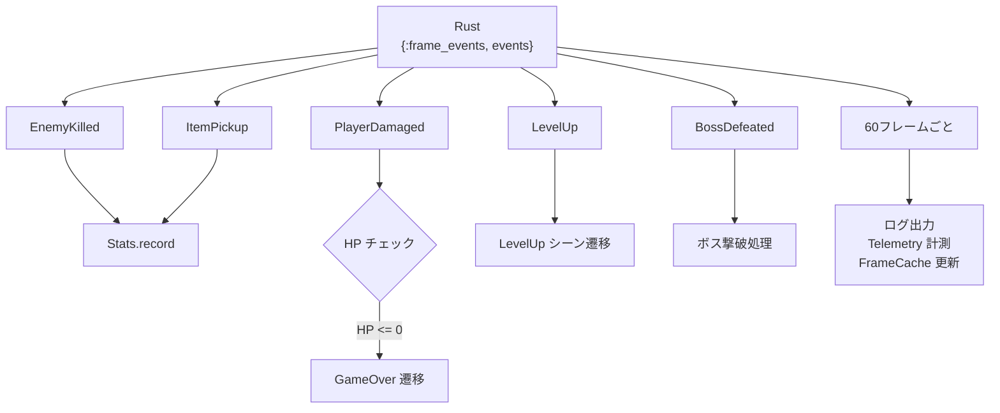

# Elixir レイヤー詳細

## 概要

Elixir 側は **Umbrella プロジェクト** として構成され、4 つのアプリケーションに分割されています。ゲームの制御フロー・シーン管理・イベント配信・セーブ/ロードを担当します。

---

## アプリケーション構成


---

## `game_server` — 起動プロセス

### `application.ex`

OTP Application のエントリポイント。Supervisor ツリーを構築し、全 GenServer を起動します。


起動後に `GameEngine.RoomSupervisor.start_room(:main)` を呼び出してメインルームを開始します。

**設定（`config/config.exs`）:**
```elixir
config :game_server, :current_game, GameContent.VampireSurvivor
config :game_server, :map, :plain
```

---

## `game_engine` — SSoT コアエンジン

### `game_engine.ex` — 公開 API

外部から呼び出す全操作の窓口。エンティティ ID は `game_module.entity_registry()` から解決します。

| 関数 | 説明 |
|:---|:---|
| `spawn_enemies/3` | 敵をスポーン |
| `spawn_boss/2` | ボスをスポーン |
| `spawn_elite_enemy/4` | エリート敵をスポーン（HP 倍率付き） |
| `get_level_up_data/1` | レベルアップ選択肢を取得 |
| `add_weapon/2` | 武器を追加/アップグレード |
| `skip_level_up/1` | レベルアップをスキップ |
| `save_session/1` | セッションをセーブ |
| `load_session/1` | セッションをロード |
| `save_high_score/1` | ハイスコアを保存 |
| `load_high_scores/0` | ハイスコア一覧を取得 |
| `start_rust_game_loop/3` | Rust 60Hz ゲームループを開始 |
| `start_render_thread/1` | レンダースレッドを起動 |
| `pause_physics/1` | 物理演算を一時停止 |
| `resume_physics/1` | 物理演算を再開 |

---

### `nif_bridge.ex` — Rustler NIF ラッパー

Rust NIF 関数の Elixir スタブ定義。`use Rustler` で `game_nif` クレートをロードします。

```elixir
use Rustler, otp_app: :game_engine, crate: :game_nif, path: "../../native/game_nif"
```

NIF 関数は 3 カテゴリに分類されます：

| カテゴリ | 用途 | ロック種別 |
|:---|:---|:---|
| `control系` | ワールド生成・入力・ループ制御 | write lock |
| `query_light系` | HP・座標・HUD などの軽量読み取り | read lock（毎フレーム利用可） |
| `snapshot_heavy系` | セーブ/ロードスナップショット | write lock（明示操作時のみ） |

---

### `game_behaviour.ex` — ゲーム実装インターフェース

ゲームコンテンツが実装すべきコールバック定義。

```elixir
@callback render_type()      :: atom()
@callback initial_scenes()   :: [scene_spec()]
@callback entity_registry()  :: map()
@callback physics_scenes()   :: [module()]
@callback title()            :: String.t()
@callback version()          :: String.t()
@callback context_defaults() :: map()
@callback assets_path()      :: String.t()
```

---

### `scene_behaviour.ex` — シーンコールバック定義

各シーンが実装すべきコールバック。

```elixir
@callback init(init_arg)        :: {:ok, state}
@callback update(context, state) :: {:continue, new_state}
                                  | {:transition, transition, new_state}
@callback render_type()         :: atom()
```

**トランジション種別:**

| 種別 | 動作 |
|:---|:---|
| `:pop` | 現在のシーンをスタックから取り出す |
| `{:push, module, init_arg}` | 新しいシーンをスタックに積む |
| `{:replace, module, init_arg}` | 現在のシーンを置き換える |

---

### `scene_manager.ex` — シーンスタック管理 GenServer

シーンスタックを管理する GenServer。起動時に `game_module.initial_scenes()` からスタックを初期化します。

| 関数 | 説明 |
|:---|:---|
| `push_scene/2` | シーンをスタックに積む |
| `pop_scene/0` | 最上位シーンを取り出す |
| `replace_scene/2` | 最上位シーンを置き換える |
| `update_current/1` | 現在シーンの状態を更新 |

---

### `game_events.ex` — メインゲームループ GenServer

Rust の 60Hz ゲームループから `{:frame_events, events}` を受信し、シーン遷移・UI アクションを処理するコアコンポーネント。

**フレーム処理フロー:**



**シーン遷移パターン:**


---

### `room_supervisor.ex` — DynamicSupervisor

ルーム（ゲームセッション）のライフサイクルを管理します。

| 関数 | 説明 |
|:---|:---|
| `start_room/1` | 新しいルームを起動 |
| `stop_room/1` | ルームを停止 |
| `list_rooms/0` | 実行中ルーム一覧 |

起動時に `:main` ルームを自動開始します。

---

### `room_registry.ex` — Registry ラッパー

`room_id → GameEvents pid` のマッピングを管理します。

---

### `event_bus.ex` — フレームイベント配信 GenServer

Rust から受信したフレームイベントを複数のサブスクライバーに配信します。

| 関数 | 説明 |
|:---|:---|
| `subscribe/1` | イベント購読を登録 |
| `broadcast/1` | イベントを全サブスクライバーに配信 |

`Process.monitor` でサブスクライバーの死活監視を行い、死亡時に自動的に購読解除します。

---

### `input_handler.ex` — キー入力 GenServer

キー入力を受け付け、ETS テーブル `:input_state` に移動ベクトルを書き込みます。

- **対応キー**: WASD + 矢印キー
- **斜め移動**: 正規化処理あり（速度が一定になる）

---

### `frame_cache.ex` — フレームスナップショット ETS

最新フレームのスナップショットを ETS に保持します。`StressMonitor` と `GameEvents` が利用します。

| 関数 | 説明 |
|:---|:---|
| `put/6` | フレームデータを書き込み |
| `get/0` | 最新フレームデータを取得 |

---

### `map_loader.ex` — マップ障害物定義

マップ種別ごとの障害物リストを返します。

| マップ | 障害物数 | 説明 |
|:---|:---|:---|
| `:plain` | 0 | 障害物なし |
| `:forest` | 8 | 木・岩など |
| `:minimal` | 2 | テスト用最小構成 |

---

### `save_manager.ex` — セーブ/ロード

| ファイル | 形式 | 内容 |
|:---|:---|:---|
| `saves/session.dat` | Erlang term binary | セッション全データ |
| `saves/high_scores.dat` | Erlang term binary | ハイスコア上位 10 件リスト |

---

### `stats.ex` — セッション統計 GenServer

`EventBus` を購読して統計を集計します。

| イベント | 集計内容 |
|:---|:---|
| `enemy_killed` | 撃破数 |
| `level_up_event` | レベルアップ回数 |
| `item_pickup` | アイテム取得数 |

---

### `telemetry.ex` — Telemetry Supervisor

ゲームパフォーマンスメトリクスを計測します。

| メトリクス | 説明 |
|:---|:---|
| `game.tick.physics_ms` | 物理演算処理時間 |
| `game.tick.enemy_count` | 現在の敵数 |
| `game.level_up.count` | レベルアップ累計 |
| `game.boss_spawn.count` | ボス出現累計 |

---

### `stress_monitor.ex` — パフォーマンス監視 GenServer

1 秒ごとに `FrameCache` をサンプリングし、フレームバジェット超過時に `Logger.warning` を出力します。

---

## 依存関係


---

## 関連ドキュメント

- [アーキテクチャ概要](./architecture-overview.md)
- [Rust レイヤー詳細](./rust-layer.md)
- [データフロー・通信](./data-flow.md)
- [ゲームコンテンツ詳細](./game-content.md)
