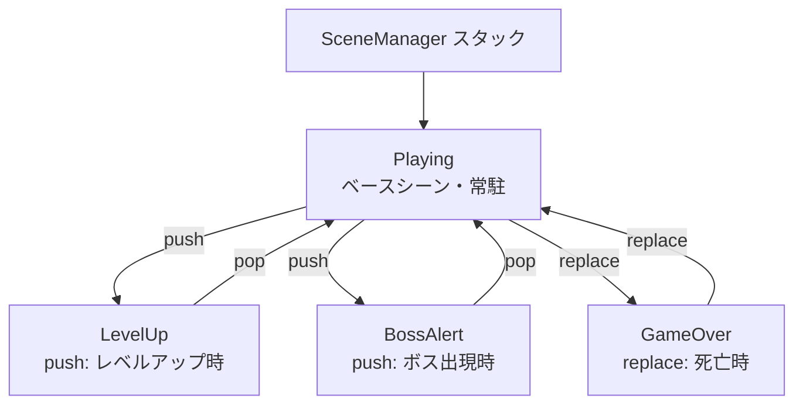
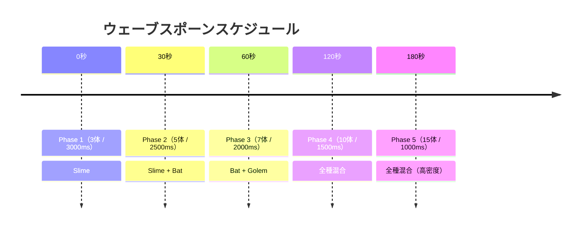
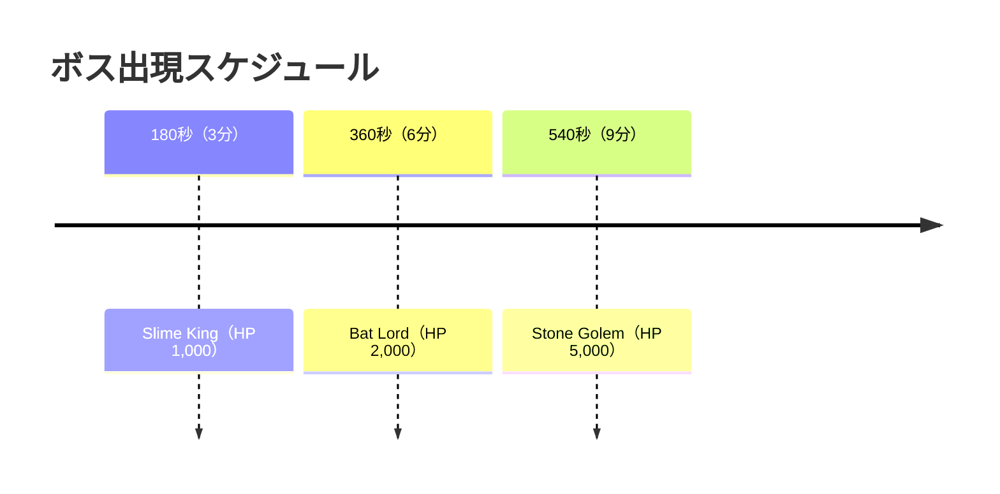
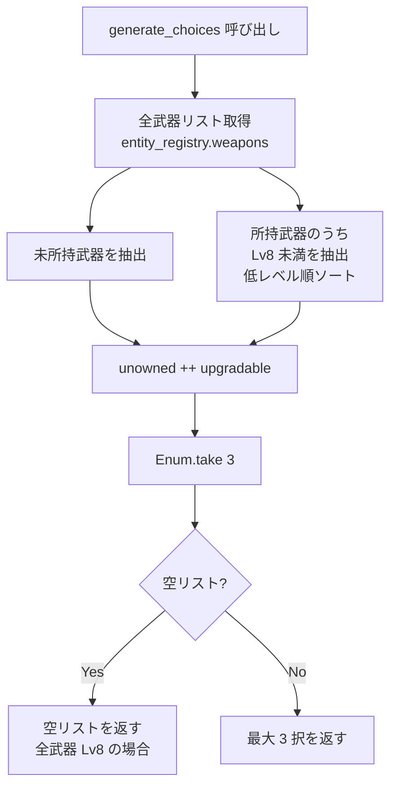

# ゲームコンテンツ詳細（VampireSurvivor）

## 概要

`game_content` アプリケーションは `GameBehaviour` を実装したゲーム固有のコンテンツを提供します。現在は **Vampire Survivor クローン** が実装されています。

---

## `vampire_survivor.ex` — GameBehaviour 実装

`GameBehaviour` の全コールバックを実装するメインモジュール。

```elixir
defmodule GameContent.VampireSurvivor do
  @behaviour GameEngine.GameBehaviour

  @impl true
  def render_type(), do: :sprite_2d

  @impl true
  def title(), do: "Vampire Survivor"

  @impl true
  def version(), do: "0.1.0"

  @impl true
  def assets_path(), do: "assets/vampire_survivor"

  @impl true
  def initial_scenes(), do: [{Scenes.Playing, %{}}]

  @impl true
  def physics_scenes(), do: [Scenes.Playing]

  @impl true
  def context_defaults(), do: %{difficulty: :normal, map: :plain}
end
```

### エンティティレジストリ

Elixir のアトムから Rust の ID（u8）へのマッピング。

```elixir
@impl true
def entity_registry() do
  %{
    enemies: %{
      slime:    0,
      bat:      1,
      golem:    2,
      skeleton: 3,
      ghost:    4,
    },
    weapons: %{
      magic_wand: 0,
      axe:        1,
      cross:      2,
      whip:       3,
      fireball:   4,
      lightning:  5,
      garlic:     6,
    },
    bosses: %{
      slime_king:  0,
      bat_lord:    1,
      stone_golem: 2,
    },
  }
end
```

---

## シーン構成



### `scenes/playing.ex` — プレイ中シーン

メインゲームプレイを管理するシーン。`update/2` で毎フレーム処理を行います。

**主な処理:**

| 処理 | タイミング | 説明 |
|---|---|---|
| 敵スポーン | SpawnSystem の判定 | ウェーブ定義に従って敵を生成 |
| ボスチェック | BossSystem の判定 | 経過時間でボス出現を判断 |
| レベルアップチェック | EXP 閾値超過 | LevelUp シーンに遷移 |
| 死亡チェック | HP <= 0 | GameOver シーンに遷移 |

**トランジション:**
```elixir
# レベルアップ
{:transition, {:push, Scenes.LevelUp, %{choices: choices}}, new_state}

# ボス出現
{:transition, {:push, Scenes.BossAlert, %{boss_kind: :slime_king}}, new_state}

# ゲームオーバー
{:transition, {:replace, Scenes.GameOver, %{score: score, elapsed: elapsed}}, new_state}
```

---

### `scenes/level_up.ex` — レベルアップ選択シーン

武器選択肢を表示し、プレイヤーの選択を待ちます。

**特徴:**
- `auto_select: true` — 3 秒タイムアウトで自動選択（最初の選択肢）
- Esc / 1 / 2 / 3 キーで選択可能
- 選択後は `:pop` で Playing シーンに戻る

```elixir
@impl true
def init(%{choices: choices}) do
  {:ok, %{choices: choices, timer: 3.0, auto_select: true}}
end

@impl true
def update(%{input: input}, %{timer: timer} = state) do
  cond do
    input.key == :select_1 -> {:transition, :pop, apply_choice(state, 0)}
    input.key == :select_2 -> {:transition, :pop, apply_choice(state, 1)}
    input.key == :select_3 -> {:transition, :pop, apply_choice(state, 2)}
    timer <= 0.0            -> {:transition, :pop, apply_choice(state, 0)}
    true                    -> {:continue, %{state | timer: timer - context.dt}}
  end
end
```

---

### `scenes/boss_alert.ex` — ボス出現アラートシーン

ボス出現を 3 秒間アナウンスし、その後ボスをスポーンして `:pop` します。

```elixir
@impl true
def update(context, %{timer: timer, boss_kind: boss_kind} = state) do
  if timer <= 0.0 do
    GameEngine.spawn_boss(context.world, boss_kind)
    {:transition, :pop, state}
  else
    {:continue, %{state | timer: timer - context.dt}}
  end
end
```

---

### `scenes/game_over.ex` — ゲームオーバーシーン

スコア・生存時間・撃破数を表示し、リトライを待ちます。

```elixir
@impl true
def init(%{score: score, elapsed: elapsed, kills: kills}) do
  GameEngine.save_high_score(score)
  {:ok, %{score: score, elapsed: elapsed, kills: kills}}
end

@impl true
def update(%{input: input}, state) do
  if input.key == :retry do
    {:transition, {:replace, Scenes.Playing, %{}}, state}
  else
    {:continue, state}
  end
end
```

---

## `spawn_system.ex` — ウェーブスポーン

経過時間に応じてウェーブ定義から敵をスポーンします。

### ウェーブ定義



| フェーズ | 開始時間 | スポーン間隔 | 1 回の数 | 敵種別 |
|---|---|---|---|---|
| 1 | 0 秒 | 3,000ms | 3 体 | Slime |
| 2 | 30 秒 | 2,500ms | 5 体 | Slime + Bat |
| 3 | 60 秒 | 2,000ms | 7 体 | Bat + Golem |
| 4 | 120 秒 | 1,500ms | 10 体 | 全種混合 |
| 5 | 180 秒 | 1,000ms | 15 体 | 全種混合（高密度） |

### エリート敵

- **条件**: 45 秒以降、30% の確率で混入
- **効果**: HP × 3（`spawn_elite_enemy/4` を使用）

### 上限

- 最大同時存在数: **10,000 体**

```elixir
defmodule GameContent.SpawnSystem do
  @waves [
    {0,   3000, 3,  [:slime]},
    {30,  2500, 5,  [:slime, :bat]},
    {60,  2000, 7,  [:bat, :golem]},
    {120, 1500, 10, [:slime, :bat, :golem, :skeleton, :ghost]},
    {180, 1000, 15, [:slime, :bat, :golem, :skeleton, :ghost]},
  ]

  @max_enemies 10_000
  @elite_threshold_sec 45
  @elite_chance 0.30
  @elite_hp_mult 3.0

  def maybe_spawn(context, state) do
    # 現在のウェーブを選択
    # インターバルチェック
    # エリート判定
    # GameEngine.spawn_enemies / spawn_elite_enemy を呼び出し
  end
end
```

---

## `boss_system.ex` — ボス出現スケジュール

経過時間に応じてボスの出現を管理します。



| 経過時間 | ボス | HP |
|---|---|---|
| 180 秒（3 分） | Slime King | 1,000 |
| 360 秒（6 分） | Bat Lord | 2,000 |
| 540 秒（9 分） | Stone Golem | 5,000 |

```elixir
defmodule GameContent.BossSystem do
  @boss_schedule [
    {180, :slime_king},
    {360, :bat_lord},
    {540, :stone_golem},
  ]

  def check_boss_spawn(elapsed_sec, spawned_bosses) do
    @boss_schedule
    |> Enum.find(fn {time, kind} ->
      elapsed_sec >= time and kind not in spawned_bosses
    end)
    |> case do
      {_time, kind} -> {:spawn, kind}
      nil           -> :no_spawn
    end
  end
end
```

---

## `level_system.ex` — 武器選択肢生成

レベルアップ時に提示する武器選択肢を生成します。

### 選択肢生成フロー



### ルール

1. **未所持武器を優先**（新規取得を促す）
2. **低レベル順でソート**（アップグレードを促す）
3. **最大 3 択**を返す
4. 全武器が最大レベル（Lv8）の場合は空リストを返す

### 武器スロット制限

- **最大スロット数**: 8
- **各武器の最大レベル**: 8

```elixir
defmodule GameContent.LevelSystem do
  @max_slots 8
  @max_weapon_level 8

  def generate_choices(weapon_slots) do
    all_weapons = Map.keys(GameContent.VampireSurvivor.entity_registry().weapons)

    unowned = all_weapons -- Enum.map(weapon_slots, & &1.kind)
    upgradable = weapon_slots
      |> Enum.filter(& &1.level < @max_weapon_level)
      |> Enum.sort_by(& &1.level)

    (unowned ++ Enum.map(upgradable, & &1.kind))
    |> Enum.take(3)
    |> Enum.map(&build_choice(&1, weapon_slots))
  end
end
```

---

## エンティティパラメータ詳細

### 敵パラメータ（Elixir 視点）

| アトム | Rust ID | HP | 速度 | ダメージ | EXP |
|---|---|---|---|---|---|
| `:slime` | 0 | 30 | 60 | 10 | 5 |
| `:bat` | 1 | 20 | 90 | 8 | 4 |
| `:golem` | 2 | 100 | 30 | 20 | 15 |
| `:skeleton` | 3 | 50 | 70 | 12 | 8 |
| `:ghost` | 4 | 40 | 80 | 15 | 10 |

> Ghost は障害物を無視して移動します（`collision.rs` で除外）。

### 武器パラメータ（Elixir 視点）

| アトム | Rust ID | ダメージ | クールダウン | 特性 |
|---|---|---|---|---|
| `:magic_wand` | 0 | 20 | 0.8s | 最近傍追尾 |
| `:axe` | 1 | 40 | 1.5s | 放物線軌道 |
| `:cross` | 2 | 15 | 0.5s | 4 方向同時 |
| `:whip` | 3 | 30 | 1.0s | 左右範囲 |
| `:fireball` | 4 | 35 | 1.2s | 貫通弾 |
| `:lightning` | 5 | 50 | 2.0s | 即時ダメージ |
| `:garlic` | 6 | 10 | 0.3s | 周囲継続 |

**レベルアップ効果（Rust `weapon.rs` で計算）:**
- クールダウン: レベルごとに 7% 短縮（最大 50%）
- ダメージ: レベルごとに基礎ダメージの 25% 増加

### ボスパラメータ（Elixir 視点）

| アトム | Rust ID | HP | 速度 | 特殊行動 |
|---|---|---|---|---|
| `:slime_king` | 0 | 1,000 | 40 | スライム召喚 |
| `:bat_lord` | 1 | 2,000 | 120 | ダッシュ攻撃 |
| `:stone_golem` | 2 | 5,000 | 20 | 岩弾放射 |

---

## EXP・レベルアップ曲線

```
Level → 必要累積 EXP
  1  →    0
  2  →   10
  3  →   25
  4  →   45
  5  →   70
  6  →  100
  7  →  135
  8  →  175
  9  →  220
 10  →  270
 ...
```

計算式（`game_core/src/util.rs`）:
```rust
fn exp_required_for_next(level: u32) -> u32 {
    // 二次関数的増加
    // level * (level + 1) * 5 の近似
}
```

---

## アイテムシステム

| アイテム | 効果 |
|---|---|
| Gem | EXP 取得（敵撃破時にドロップ） |
| Potion | HP 回復 |
| Magnet | 画面内全 Gem を自動吸引 |

**自動収集範囲**: プレイヤー周囲 50px（Magnet 発動時は全画面）

---

## 将来の拡張予定

`game_network` アプリケーションは現在スタブ状態ですが、以下の機能が計画されています：

- Phoenix Channels によるリアルタイムマルチプレイヤー
- UDP による低遅延ゲーム状態同期
- ルームベースのマッチメイキング

---

## 関連ドキュメント

- [アーキテクチャ概要](./architecture-overview.md)
- [Elixir レイヤー詳細](./elixir-layer.md)
- [Rust レイヤー詳細](./rust-layer.md)
- [データフロー・通信](./data-flow.md)
