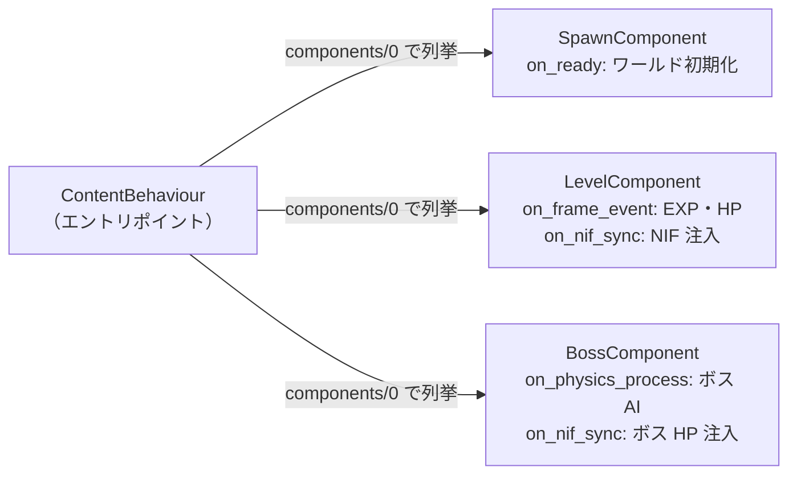
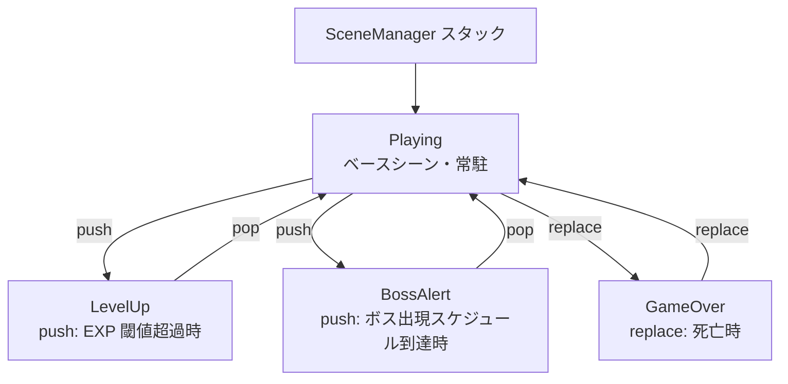
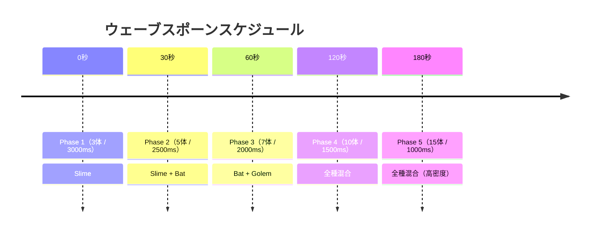
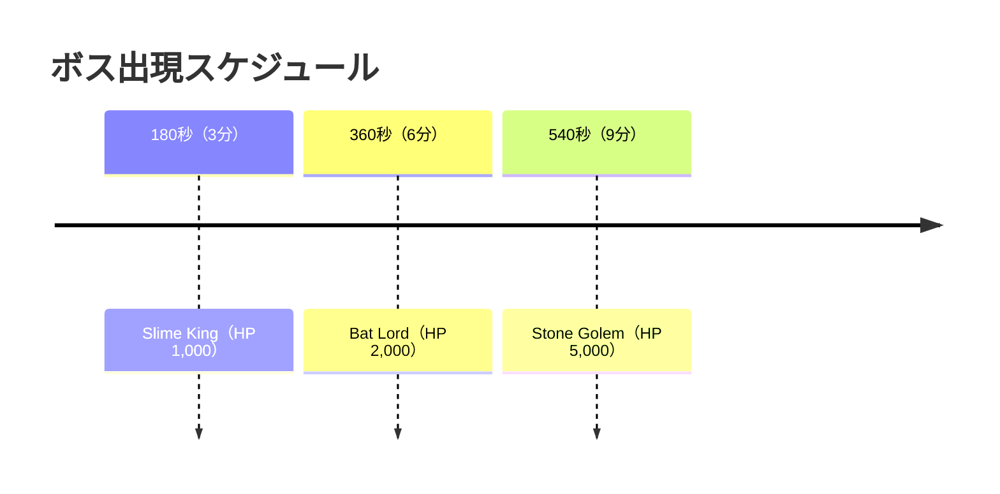

# ゲームコンテンツ詳細

## 概要

`game_content` アプリケーションは `ContentBehaviour` と `Component` ビヘイビアを実装したゲーム固有のコンテンツを提供します。現在は以下の 2 コンテンツが実装されています。

| コンテンツ | モジュール | 説明 |
|:---|:---|:---|
| Vampire Survivor クローン | `GameContent.VampireSurvivor` | 武器・ボス・レベルアップあり |
| Asteroid Arena | `GameContent.AsteroidArena` | 武器・ボスなしのシンプルなシューター |

使用するコンテンツは `config.exs` で指定します。

```elixir
# GameContent.VampireSurvivor または GameContent.AsteroidArena
config :game_server, :current, GameContent.VampireSurvivor
```

---

## コンテンツ設計パターン

各コンテンツは `ContentBehaviour` を実装するエントリポイントモジュールと、`Component` ビヘイビアを実装するコンポーネント群で構成されます。



---

## `GameContent.VampireSurvivor` — VampireSurvivor コンテンツ

### コンポーネント構成

```elixir
def components do
  [
    GameContent.VampireSurvivor.SpawnComponent,   # ワールド初期化・エンティティ登録
    GameContent.VampireSurvivor.LevelComponent,   # EXP・レベル・スコア・HP・武器選択
    GameContent.VampireSurvivor.BossComponent     # ボス HP・AI 制御
  ]
end
```

---

### `spawn_component.ex` — SpawnComponent

旧 `VampireSurvivorWorld` の責務を引き継ぐコンポーネント。

**`on_ready/1`:**
- `set_world_size` NIF でマップサイズ（4096×4096）を注入
- `set_entity_params` NIF でエンティティパラメータを注入

**`entity_registry/0`:**

```elixir
%{
  enemies: %{slime: 0, bat: 1, golem: 2, skeleton: 3, ghost: 4},
  weapons: %{magic_wand: 0, axe: 1, cross: 2, whip: 3, fireball: 4, lightning: 5, garlic: 6},
  bosses:  %{slime_king: 0, bat_lord: 1, stone_golem: 2}
}
```

### エンティティパラメータ（Elixir → Rust 注入）

**敵パラメータ（`enemy_params/0`）:**

| ID | 種別 | HP | 速度 | 半径 | ダメージ/秒 | 障害物すり抜け |
|:---|:---|:---|:---|:---|:---|:---|
| 0 | Slime | 30 | 80 | 20 | 20 | ✗ |
| 1 | Bat | 15 | 160 | 12 | 10 | ✗ |
| 2 | Golem | 150 | 40 | 32 | 40 | ✗ |
| 3 | Skeleton | 60 | 60 | 22 | 15 | ✗ |
| 4 | Ghost | 40 | 100 | 16 | 12 | ✅（壁すり抜け） |

**武器パラメータ（`weapon_params/0`）:**

| ID | 種別 | ダメージ | クールダウン | FirePattern |
|:---|:---|:---|:---|:---|
| 0 | magic_wand | 10 | 1.0s | Aimed（扇状） |
| 1 | axe | 25 | 1.5s | FixedUp（上方向） |
| 2 | cross | 15 | 2.0s | Radial（全方向） |
| 3 | whip | 30 | 1.0s | Whip（扇形判定） |
| 4 | fireball | 20 | 1.0s | Piercing（貫通） |
| 5 | lightning | 15 | 1.0s | Chain（連鎖） |
| 6 | garlic | 1 | 0.2s | Aura（オーラ） |

**ボスパラメータ（`boss_params/0`）:**

| ID | 種別 | HP | 速度 | 半径 | 特殊行動インターバル |
|:---|:---|:---|:---|:---|:---|
| 0 | Slime King | 1,000 | 60 | 48 | 5.0s |
| 1 | Bat Lord | 2,000 | 200 | 48 | 4.0s |
| 2 | Stone Golem | 5,000 | 30 | 64 | 6.0s |

---

### `level_component.ex` — LevelComponent

EXP・レベル・スコア・プレイヤー HP・アイテムドロップ・武器選択 UI を担うコンポーネント。

**`on_frame_event/2`:**
- `{:enemy_killed, enemy_kind, x, y, _}` → EXP/スコア加算・アイテムドロップ・スコアポップアップ
- `{:player_damaged, damage_x1000, _, _, _}` → HP 減算（damage は 1000 倍整数で受け取り）

**`on_nif_sync/1`（差分検知して注入）:**
- `set_hud_state` — スコア・キル数
- `set_player_hp` — プレイヤー HP
- `set_elapsed_seconds` — 経過時間
- `set_hud_level_state` — レベル・EXP・武器選択肢（描画専用）
- `set_weapon_slots` — 武器スロット全体（I-2: 毎フレーム差分注入）

**`on_event/2`:**
- `{:ui_action, weapon_name}` — 武器選択 UI アクション処理
- `{:ui_action, "__skip__"}` — レベルアップスキップ
- `{:ui_action, "__auto_pop__", scene_state}` — 3秒タイムアウト自動選択

---

### `boss_component.ex` — BossComponent

ボス HP・AI 制御を担うコンポーネント。

**`on_frame_event/2`:**
- `{:special_entity_spawned, entity_kind, _, _, _}` → ボス HP を `EntityParams` から初期化
- `{:special_entity_damaged, damage, _, _, _}` → ボス HP 減算
- `{:special_entity_defeated, x, y, _}` → ボス撃破処理（Gem 散布・EXP 加算）

**`on_physics_process/1`:**
- `get_boss_state` NIF でボス状態取得
- `update_boss_ai` でボス AI 制御（`set_boss_velocity` / `set_boss_phase_timer` / `fire_boss_projectile` NIF）

**`on_nif_sync/1`:**
- `set_boss_hp` — ボス HP を差分検知して注入

---

### `entity_params.ex` — Elixir 側パラメータテーブル

Elixir 側が EXP・スコア・ボスパラメータの SSoT を持つモジュール。

```elixir
defmodule GameContent.EntityParams do
  # 敵種別 ID（SpawnComponent の entity_registry と対応）
  @enemy_slime 0
  @enemy_bat 1
  @enemy_skeleton 2   # ← ID 2（Golem ではない）
  @enemy_ghost 3
  @enemy_golem 4

  # 敵 EXP 報酬
  @enemy_exp_rewards %{0 => 5, 1 => 3, 2 => 20, 3 => 10, 4 => 8}

  # ボス EXP 報酬
  @boss_exp_rewards %{0 => 200, 1 => 400, 2 => 800}

  # スコア = EXP × 2
  @score_per_exp 2

  # ボスパラメータ（AI 制御用）
  @boss_params %{
    0 => %{speed: 60.0, special_interval: 5.0},
    1 => %{speed: 200.0, special_interval: 4.0, dash_speed: 500.0, dash_duration_ms: 600},
    2 => %{speed: 30.0, special_interval: 6.0, projectile_speed: 200.0, ...},
  }
end
```

---

## シーン構成（VampireSurvivor）



### `scenes/playing.ex` — プレイ中シーン

メインゲームプレイを管理するシーン。`update/2` で毎フレーム処理を行います。

**Playing シーン state（Elixir SSoT）:**

| キー | 説明 |
|:---|:---|
| `level` | 現在レベル |
| `exp` | 現在 EXP |
| `exp_to_next` | 次レベルまでの必要 EXP |
| `weapon_levels` | `%{weapon_atom => level}` |
| `level_up_pending` | レベルアップ待ちフラグ |
| `weapon_choices` | レベルアップ選択肢リスト |
| `boss_kind_id` | 現在のボス種別 ID（`nil` = ボスなし） |
| `boss_hp` | ボス HP（Elixir SSoT） |
| `boss_max_hp` | ボス最大 HP |
| `spawned_bosses` | 出現済みボス種別リスト |
| `score` | スコア |
| `kill_count` | 撃破数 |
| `player_hp` | プレイヤー HP（Elixir SSoT） |
| `player_max_hp` | プレイヤー最大 HP |
| `elapsed_ms` | 経過時間（ms） |
| `last_spawn_ms` | 最終スポーン時刻（ms） |

**トランジション:**
```elixir
# レベルアップ
{:transition, {:push, Scenes.LevelUp, %{choices: choices}}, new_state}

# ボス出現
{:transition, {:push, Scenes.BossAlert, %{boss_kind: :slime_king}}, new_state}

# ゲームオーバー
{:transition, {:replace, Scenes.GameOver, %{score: score, elapsed: elapsed}}, new_state}
```

---

### `scenes/level_up.ex` — レベルアップ選択シーン

武器選択肢を表示し、プレイヤーの選択を待ちます。

- `auto_select: true` — 3 秒タイムアウトで自動選択（最初の選択肢）
- Esc / 1 / 2 / 3 キーで選択可能
- 選択後は `:pop` で Playing シーンに戻る

---

### `scenes/boss_alert.ex` — ボス出現アラートシーン

ボス出現を 3 秒間アナウンスし、その後ボスをスポーンして `:pop` します。

```elixir
@impl true
def update(context, %{boss_kind: boss_kind, alert_ms: alert_ms} = state) do
  if context.now - alert_ms >= BossSystem.alert_duration_ms() do
    kind_id = GameContent.VampireSurvivor.entity_registry().bosses[boss_kind]
    GameEngine.NifBridge.spawn_boss(context.world_ref, kind_id)
    {:transition, :pop, state}
  else
    {:continue, state}
  end
end
```

---

### `scenes/game_over.ex` — ゲームオーバーシーン

スコア・生存時間・撃破数を表示し、リトライを待ちます。

---

## `vampire_survivor/spawn_system.ex` — ウェーブスポーン

経過時間に応じてウェーブ定義から敵をスポーンします。

### ウェーブ定義



| フェーズ | 開始時間 | スポーン間隔 | 1 回の数 | 敵種別 |
|:---|:---|:---|:---|:---|
| 1 | 0 秒 | 3,000ms | 3 体 | Slime |
| 2 | 30 秒 | 2,500ms | 5 体 | Slime + Bat |
| 3 | 60 秒 | 2,000ms | 7 体 | Bat + Golem |
| 4 | 120 秒 | 1,500ms | 10 体 | 全種混合 |
| 5 | 180 秒 | 1,000ms | 15 体 | 全種混合（高密度） |

### エリート敵

- **条件**: 45 秒以降、30% の確率で混入
- **効果**: HP × 3（`spawn_elite_enemy/4` を使用）

### 上限

- 最大同時存在数: **10,000 体**

---

## `vampire_survivor/boss_system.ex` — ボス出現スケジュール

経過時間に応じてボスの出現を管理します。



### ボスAI（`BossComponent.on_physics_process/1`）

Elixir 側で毎フレーム呼び出され、`set_boss_velocity` / `set_boss_phase_timer` / `fire_boss_projectile` NIF を通じてボスを制御する。

| ボス | 通常移動 | 特殊行動（インターバルごと） |
|:---|:---|:---|
| SlimeKing | プレイヤー追跡（速度 60） | 周囲8方向にスライムをスポーン |
| BatLord | プレイヤー追跡（速度 200） | ダッシュ攻撃（速度 500、600ms 無敵） |
| StoneGolem | プレイヤー追跡（速度 30） | 4方向に岩弾を発射 |

---

## `vampire_survivor/level_system.ex` — 武器選択肢生成

レベルアップ時に提示する武器選択肢を生成します。

### ルール

1. **未所持武器を優先**（新規取得を促す）
2. **低レベル順でソート**（アップグレードを促す）
3. **最大 3 択**を返す
4. 全武器が最大レベル（Lv8）の場合は空リストを返す

### 武器スロット制限

- **最大スロット数**: 8
- **各武器の最大レベル**: 8

---

## EXP・レベルアップ曲線

```
Level → 必要累積 EXP
  1  →    0
  2  →   10
  3  →   25
  4  →   45
  5  →   70
  6  →  100
  7  →  135
  8  →  175
  9  →  220
 10  →  270
 ...
```

---

## アイテムシステム

| アイテム | 効果 |
|:---|:---|
| Gem | EXP 取得（敵撃破時にドロップ） |
| Potion | HP +20 回復 |
| Magnet | 画面内全 Gem を自動吸引 |

**ドロップ確率:**

| アイテム | 確率 | 効果 |
|:---|:---|:---|
| Magnet | 2% | 画面内全 Gem を自動吸引 |
| Potion | 5%（累積 7%） | HP +20 回復 |
| Gem | 残り 93% | EXP 取得（敵種別の報酬値） |

**自動収集範囲**: プレイヤー周囲 50px（Magnet 発動時は全画面）

---

## `GameContent.AsteroidArena` — AsteroidArena コンテンツ

武器・ボス・レベルアップの概念を持たないシンプルなシューター。エンジンがゲーム固有概念を持たなくても動作することを実証する設計。

### コンポーネント構成

```elixir
def components do
  [
    GameContent.AsteroidArena.SpawnComponent,  # ワールド初期化・エンティティ登録
    GameContent.AsteroidArena.SplitComponent   # 小惑星分裂処理
  ]
end
```

### 特徴

- `level_up_scene/0` / `boss_alert_scene/0` を実装しない（オプショナルコールバック）
- 小惑星の分裂処理: Large → Medium × 2 → Small × 2
- シーン構成: Playing / GameOver のみ

---

## 関連ドキュメント

- [アーキテクチャ概要](./architecture-overview.md)
- [Elixir レイヤー詳細](./elixir-layer.md)
- [Rust レイヤー詳細](./rust-layer.md)
- [データフロー・通信](./data-flow.md)
