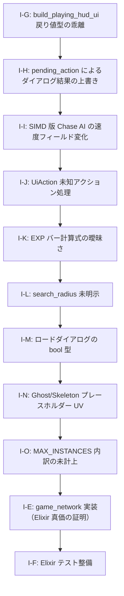

# AlchemyEngine — 改善計画

> このドキュメントは現在の弱点を整理し、各課題に対する具体的な改善方針を定義する。
> 優先度・影響範囲・作業ステップを明記することで、改善作業を体系的に進めることを目的とする。

---

## スコアカード（現状評価）

| カテゴリ | 点数 | 主な減点理由 |
|:---|:---:|:---|
| Rust 物理演算・SoA 設計 | 9/10 | — |
| Rust SIMD 最適化 | 9/10 | — |
| Rust 並行性設計 | 8/10 | — |
| Rust 安全性（unsafe 管理） | 8/10 | — |
| Elixir OTP 設計 | 8/10 | — |
| Elixir 耐障害性 | 6/10 | NIF エラーは捕捉済みだが、ゲームループ再起動などの完全な回復ロジックが未実装 |
| Elixir 並行性・分散 | 1/10 | シングルルームのみ。`game_network` は完全スタブ |
| Elixir ビヘイビア活用 | 7/10 | — |
| アーキテクチャ（ビジョン一致度） | 7/10 | — |
| テスト | 5/10 | Rust 側に単体テストあり。Elixir 側はほぼ未テスト |
| **総合** | **7/10** | |

---

## 課題一覧

### I-E: `game_network` が完全スタブ（Elixir 並行性・分散 1/10 の原因）

**優先度**: 🟡 高（`pending-issues.md` 課題10・11 と同一）

**問題**

Elixir を選んだ最大の根拠である「OTP による耐障害性」「軽量プロセスによる大規模並行性」「分散ノード間通信」が、現状のコードでは一切証明されていない。
`game_network.ex` は実装なしのスタブであり、シングルプレイヤーのローカルゲームとして動作しているだけである。

この状態では「なぜ Elixir + Rust か」という問いにコードが答えられない。

**改善方針**

`pending-issues.md` 課題10（問題2・3）および課題11 の作業ステップを参照。

---

### I-F: Elixir 側のテストがほぼ未整備（テスト 5/10 の原因）

**優先度**: 🟢 中

**問題**

Rust 側には `chase_ai.rs`・`spatial_hash.rs` 等に単体テストが存在するが、Elixir 側（`GameEvents`・`SceneManager`・各シーン・コンポーネント）のテストがほぼ存在しない。

**改善方針**

- `GameEngine.SceneManager` のシーン遷移ロジックを `ExUnit` でテストする
- `GameContent.VampireSurvivor.Scenes.Playing.update/2` の純粋関数部分（EXP 計算・レベルアップ判定）を単体テストする
- `GameEngine.EventBus` のサブスクライバー配信をテストする

**影響ファイル**

- `apps/game_engine/test/` — 新規テストファイル群
- `apps/game_content/test/` — 新規テストファイル群

---

### I-G: `build_playing_hud_ui` の戻り値型の乖離（game_render）

**優先度**: 🔴 重大（修正必須）

**問題**

`renderer/ui.rs:286` の `build_playing_hud_ui` は `Option<String>` を返す関数シグネチャだが、実装は常に `None` を返す（448行目）。
呼び出し元の `build_playing_ui`（237行目）も戻り値を無視しているため、将来この関数からアクションを返そうとした際に気づかずバグになるリスクがある。

**改善方針**

- 戻り値を `()` に変更し、`build_playing_ui` の戻り値型も `Option<String>` から `()` に統一する
- または、将来的にアクションを返す設計を維持するなら `build_playing_ui` でも `Option<String>` を返すよう呼び出し側を修正する

**影響ファイル**

- `native/game_render/src/renderer/ui.rs`

---

### I-H: `pending_action` によるロードダイアログ結果の上書き（game_render）

**優先度**: 🔴 重大（修正必須）

**問題**

`renderer/ui.rs:30〜33` で、`build_load_dialog` の結果（`chosen`）がセットされた後、`pending_action.take()` で無条件に上書きされる。
ロードダイアログの「Load」ボタンと Save ボタンが同一フレームに競合した場合、ダイアログ結果が失われる。

**改善方針**

- `pending_action` の優先チェックを `chosen` のセット前に行うよう順序を変更する
- または `chosen` がすでにセットされている場合は `pending_action` を無視するガードを追加する

**影響ファイル**

- `native/game_render/src/renderer/ui.rs`

---

### I-I: SIMD 版 Chase AI の死亡敵に対する速度フィールド変化（game_physics）

**優先度**: 🔴 重大（修正必須）

**問題**

`chase_ai.rs:141〜214` の `update_chase_ai_simd` では、`alive_mask` を使って死亡敵の位置・速度の書き込みをブロックしているが、速度の計算自体は死亡敵に対しても実行される。
`_mm_rsqrt_ps` の精度誤差により死亡敵の速度フィールドが変化する可能性があり、スカラー版（327〜332行目）との挙動に差異が生じる。
また `alive_mask` が速度フィールドも保護していることがコメントから読み取りにくく、意図が不明確。

**改善方針**

- `final_vx/vy` の `alive_mask` 適用が速度フィールドを保護していることを明示するコメントを追加する
- スカラー版との挙動の一致をテストで担保する

**影響ファイル**

- `native/game_physics/src/game_logic/chase_ai.rs`

---

### I-J: `UiAction::from_action_key` の未知アクション処理（game_render）

**優先度**: 🟡 軽微（推奨）

**問題**

`lib.rs:29` の `UiAction::from_action_key` のデフォルトアーム `_ => Some(Self::ChooseWeapon)` は、タイポした武器名など未知の文字列でも `ChooseWeapon` を返す。

**改善方針**

- 未知のアクション文字列には `None` を返すよう変更する
- または `ChooseWeapon(String)` のように武器名を保持する形にする

**影響ファイル**

- `native/game_render/src/lib.rs`

---

### I-K: EXP バー計算式のフィールド名の曖昧さ（game_render）

**優先度**: 🟡 軽微（推奨）

**問題**

`renderer/ui.rs:336〜340` の EXP バー計算で `exp_total = hud.exp + hud.exp_to_next` を使用しているが、`exp_to_next` が「次レベルまでの残り EXP」なのか「次レベルまでの総必要 EXP」なのかフィールド名から判断できない。

**改善方針**

- `HudData.exp_to_next` のフィールドコメントに「次レベルまでの残り EXP」か「総必要 EXP」かを明記する
- フィールド名を `exp_remaining_to_next` または `exp_needed_for_next` に変更することを検討する

**影響ファイル**

- `native/game_render/src/renderer/mod.rs`
- `native/game_render/src/renderer/ui.rs`

---

### I-L: Spatial Hash フォールバック頻度のリスクと `search_radius` の未明示（game_physics）

**優先度**: 🟡 軽微（推奨）

**問題**

`chase_ai.rs:87` の `find_nearest_enemy_spatial_excluding` は半径を最大 4 回（16 倍）拡大するが、`search_radius` が極端に小さい初期値の場合、O(n) フォールバックに頻繁に落ちる可能性がある。

**改善方針**

- `search_radius` の推奨値・最小値をコメントで明示する
- フォールバック発生回数をデバッグビルドでカウントし、過剰な場合に警告ログを出す仕組みを検討する

**影響ファイル**

- `native/game_physics/src/game_logic/chase_ai.rs`

---

### I-M: ロードダイアログの `bool` 型による意図の不明瞭さ（game_render）

**優先度**: 🟡 軽微（推奨）

**問題**

`renderer/ui.rs:159` で `dialog_type: bool` を使って「確認ダイアログ」と「セーブデータなし通知」を区別しているが、`bool` では意図が不明瞭。

**改善方針**

- `enum LoadDialogKind { Confirm, NoSaveData }` のような型を定義して置き換える

**影響ファイル**

- `native/game_render/src/renderer/mod.rs`（`GameUiState.load_dialog` の型変更）
- `native/game_render/src/renderer/ui.rs`

---

### I-N: Ghost・Skeleton のプレースホルダー UV の明示（game_render）

**優先度**: 🟡 軽微（推奨）

**問題**

`renderer/mod.rs:207〜213` で `Ghost` が `Bat` の UV を、`Skeleton` が `Golem` の UV を流用している。この状態でリリースされると視覚的に誤ったスプライトが表示される。

**改善方針**

- 関数コメントに `TODO: 専用スプライトスロットを確保するまでの暫定措置` を明記する
- アトラスに専用スロットを追加し、正式な UV に置き換える

**影響ファイル**

- `native/game_render/src/renderer/mod.rs`

---

### I-O: `MAX_INSTANCES` の内訳にエリート敵が未計上（game_render）

**優先度**: 🟡 軽微（推奨）

**問題**

`renderer/mod.rs:188` の `MAX_INSTANCES: 14502` のコメント内訳にエリート敵（`kind: 21/22/23`）が含まれていない。エリート敵が多数スポーンした場合に上限を超えてスプライトが欠落するリスクがある。

**改善方針**

- エリート敵の最大スポーン数を見積もり、`MAX_INSTANCES` の内訳コメントに追記する
- 必要に応じて `MAX_INSTANCES` の値を増やす

**影響ファイル**

- `native/game_render/src/renderer/mod.rs`

---

## 改善の優先順位と推奨実施順序

### フェーズ1（短期・重大修正）

1. **I-G**: `build_playing_hud_ui` の戻り値型を修正
2. **I-H**: `pending_action` の優先順位ロジックを修正
3. **I-I**: SIMD 版 Chase AI の `alive_mask` コメント補強・テスト追加

### フェーズ1.5（短期・軽微修正）

4. **I-J**: `UiAction::from_action_key` の未知アクション処理を `None` に変更
5. **I-K**: `exp_to_next` フィールドのコメント・命名を明確化
6. **I-L**: `search_radius` の推奨値コメント追加
7. **I-M**: `load_dialog` の型を `enum LoadDialogKind` に変更
8. **I-N**: Ghost・Skeleton の UV に `TODO` コメント追加
9. **I-O**: `MAX_INSTANCES` の内訳にエリート敵を追記

### フェーズ2（中期）

10. **I-E**: `GameNetwork.Local` 実装 → ローカルマルチプレイヤー → ネットワーク対応
11. **I-F**: Elixir 側テスト整備

---

*このドキュメントは `pending-issues.md` と連携して管理すること。課題が解消されたら該当セクションを削除し、`pending-issues.md` の対応する課題も更新すること。*
