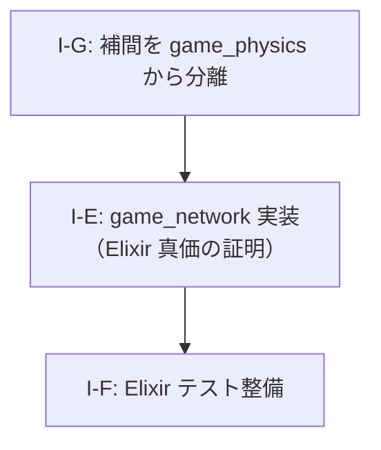

# AlchemyEngine — 改善計画

> このドキュメントは現在の弱点を整理し、各課題に対する具体的な改善方針を定義する。
> 優先度・影響範囲・作業ステップを明記することで、改善作業を体系的に進めることを目的とする。

---

## スコアカード（現状評価）

| カテゴリ | 点数 | 主な減点理由 |
|:---|:---:|:---|
| Rust 物理演算・SoA 設計 | 9/10 | — |
| Rust SIMD 最適化 | 9/10 | — |
| Rust 並行性設計 | 8/10 | — |
| Rust 安全性（unsafe 管理） | 8/10 | — |
| Elixir OTP 設計 | 8/10 | — |
| Elixir 耐障害性 | 6/10 | NIF エラーは捕捉済みだが、ゲームループ再起動などの完全な回復ロジックが未実装 |
| Elixir 並行性・分散 | 1/10 | シングルルームのみ。`game_network` は完全スタブ |
| Elixir ビヘイビア活用 | 7/10 | — |
| アーキテクチャ（ビジョン一致度） | 7/10 | — |
| テスト | 5/10 | Rust 側に単体テストあり。Elixir 側はほぼ未テスト |
| **総合** | **7/10** | |

---

## 課題一覧

### I-E: `game_network` が完全スタブ（Elixir 並行性・分散 1/10 の原因）

**優先度**: 🟡 高（`pending-issues.md` 課題10・11 と同一）

**問題**

Elixir を選んだ最大の根拠である「OTP による耐障害性」「軽量プロセスによる大規模並行性」「分散ノード間通信」が、現状のコードでは一切証明されていない。
`game_network.ex` は実装なしのスタブであり、シングルプレイヤーのローカルゲームとして動作しているだけである。

この状態では「なぜ Elixir + Rust か」という問いにコードが答えられない。

**改善方針**

`pending-issues.md` 課題10（問題2・3）および課題11 の作業ステップを参照。

---

### I-F: Elixir 側のテストがほぼ未整備（テスト 5/10 の原因）

**優先度**: 🟢 中

**問題**

Rust 側には `chase_ai.rs`・`spatial_hash.rs` 等に単体テストが存在するが、Elixir 側（`GameEvents`・`SceneManager`・各シーン・コンポーネント）のテストがほぼ存在しない。

**改善方針**

- `GameEngine.SceneManager` のシーン遷移ロジックを `ExUnit` でテストする
- `GameContent.VampireSurvivor.Scenes.Playing.update/2` の純粋関数部分（EXP 計算・レベルアップ判定）を単体テストする
- `GameEngine.EventBus` のサブスクライバー配信をテストする

**影響ファイル**

- `apps/game_engine/test/` — 新規テストファイル群
- `apps/game_content/test/` — 新規テストファイル群

---

### I-G: 補間（Dead Reckoning）を `game_physics` から完全分離

**優先度**: 🟢 中

**問題**

Elixir は 20-30Hz、描画スレッドは 60-144Hz（ディスプレイ依存）で動作する。
この Hz 差を埋めるフレーム間補間（Dead Reckoning / lerp）は「物理演算」ではなく「描画パイプラインの責務」である。

しかし現状、補間に必要なデータフィールドが `game_physics` の `GameWorldInner` に混入している：

```rust
// native/game_physics/src/world/game_world.rs
pub prev_player_x: f32,   // ← 補間用（物理演算には不要）
pub prev_player_y: f32,   // ← 補間用（物理演算には不要）
pub prev_tick_ms:  u64,   // ← 補間用（物理演算には不要）
pub curr_tick_ms:  u64,   // ← 補間用（物理演算には不要）
```

補間ロジック自体（`InterpolationData`・`calc_interpolation_alpha`・`interpolate_player_pos`）は
すでに `game_nif/src/render_snapshot.rs` に正しく配置されているが、
データの保持場所が `game_physics` に残っている。

**改善方針**

1. `GameWorldInner` から補間用フィールド 4 つを削除する
2. `game_nif/src/render_snapshot.rs` の `InterpolationData` に `prev/curr` の値を直接保持する
3. `push_tick_nif.rs` で物理ステップ後に `InterpolationData` を更新する（`GameWorldInner` を経由しない）
4. `render_bridge.rs` はそのまま `InterpolationData` を参照する

**影響ファイル**

- `native/game_physics/src/world/game_world.rs` — フィールド削除
- `native/game_nif/src/render_snapshot.rs` — `InterpolationData` に状態を持たせる
- `native/game_nif/src/nif/push_tick_nif.rs` — 補間データ更新ロジックを移動
- `native/game_nif/src/nif/world_nif.rs` — `create_world` から補間フィールド初期化を削除

---

## 改善の優先順位と推奨実施順序



### フェーズ1（短期）

1. **I-G**: 補間フィールドを `GameWorldInner` から `game_nif` 側へ移動

### フェーズ2（中期）

1. **I-E**: `GameNetwork.Local` 実装 → ローカルマルチプレイヤー → ネットワーク対応
2. **I-F**: Elixir 側テスト整備

---

*このドキュメントは `pending-issues.md` と連携して管理すること。課題が解消されたら該当セクションを削除し、`pending-issues.md` の対応する課題も更新すること。*
