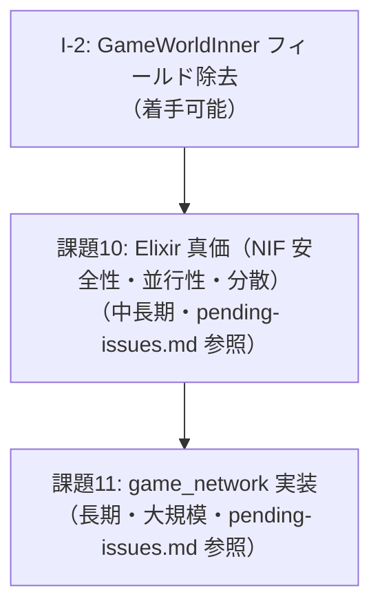

# AlchemyEngine — 改善計画

> このドキュメントは現在の弱点を整理し、各課題に対する具体的な改善方針を定義する。
> 優先度・影響範囲・作業ステップを明記することで、改善作業を体系的に進めることを目的とする。

---

## 課題一覧

| # | 課題 | 優先度 | 難易度 |
|:---|:---|:---|:---|
| I-2 | `GameWorldInner` にルール固有フィールドが残存 | 中 | 中 |

---

## I-2: `GameWorldInner` にルール固有フィールドが残存

### 現状

`weapon_slots`・`boss`・`hud_*` フィールドが Rust のエンジンコアに残っており、`vision.md` の「エンジンは武器・ボスを知らない」という原則と乖離している。

- `weapon_slots` → `add_weapon` NIF で Elixir から操作可能だが、Rust 内部に保持
- `boss` → `spawn_boss` / `set_boss_velocity` 等の NIF で Elixir から制御可能だが、Rust 内部に保持
- `hud_*` フィールド群 → `set_hud_level_state` NIF で毎フレーム注入済み（描画専用）

### 方針

AsteroidArena（2つ目のコンテンツ）が追加されたため、着手可能な状態になった（優先度：中）。

#### フィールド別の対応方針

| フィールド | 現状 | 目標 | 対応方針 |
|:---|:---|:---|:---|
| `weapon_slots: Vec<WeaponSlot>` | `GameWorldInner` に保持 | Elixir 側 Rule state で管理 | Rust からフィールドを削除。`add_weapon` NIF を廃止し、`set_weapon_slots(world, slots)` NIF を新設して毎フレーム Elixir から注入する |
| `boss: Option<BossState>` | `GameWorldInner` に保持 | Elixir 側 Rule state で管理 | Rust からフィールドを削除。`spawn_boss` NIF は引き続き存在させ、ボス物理状態のみ Rust が管理する |
| `hud_level`, `hud_exp` 等 | `set_hud_level_state` NIF で毎フレーム注入（描画専用） | 現状維持（対応済み） | 変更不要 |

#### `weapon_slots` 除去の具体的手順

1. `GameWorldInner` から `weapon_slots: Vec<WeaponSlot>` を削除
2. `game_logic/systems/weapons.rs` の武器発射ロジックを、`physics_step` 呼び出し時に Elixir から渡される武器リストを参照するよう変更
3. `add_weapon` NIF の代わりに `set_weapon_slots(world, slots)` NIF を追加し、毎フレーム Elixir から注入する
4. `Playing` シーン state の `weapon_levels` を `weapon_slots` 形式に拡張する

#### `boss` フィールド除去の具体的手順

1. `GameWorldInner` から `boss: Option<BossState>` を削除
2. ボスの物理状態（位置・速度・当たり判定）を `EnemyWorld` の特殊エントリとして扱うか、別の軽量構造体に移す
3. `spawn_boss` NIF はボスの物理エントリを生成するのみとし、ボス種別の概念を Rust から除去する
4. `get_boss_state` NIF の返り値を物理状態のみ（位置・HP）に限定する

#### 影響ファイル

- `native/game_simulation/src/world/game_world.rs` — フィールド削除
- `native/game_simulation/src/game_logic/systems/weapons.rs` — 武器リスト参照方法の変更
- `native/game_nif/src/nif/action_nif.rs` — NIF シグネチャ変更
- `native/game_nif/src/render_snapshot.rs` — HUD データ取得方法の変更
- `apps/game_engine/lib/game_engine/game_events.ex` — 毎フレームの状態注入ロジック
- `apps/game_content/lib/game_content/vampire_survivor/scenes/playing.ex` — state 拡張

---

## 改善の優先順位と推奨実施順序

### フェーズ1（着手可能）

1. **I-2**: `GameWorldInner` からルール固有フィールドを除去する
2. **課題10（問題1〜2）**: NIF 安全性強化・複数ルーム同時稼働テスト

### フェーズ2（長期）

3. **課題10（問題3）** / **課題11**: `GameNetwork.Local` 実装 → ローカルマルチプレイヤー → ネットワーク対応

---

*このドキュメントは `pending-issues.md` と連携して管理すること。課題が解消されたら該当セクションを削除し、`pending-issues.md` の対応する課題も更新すること。*
