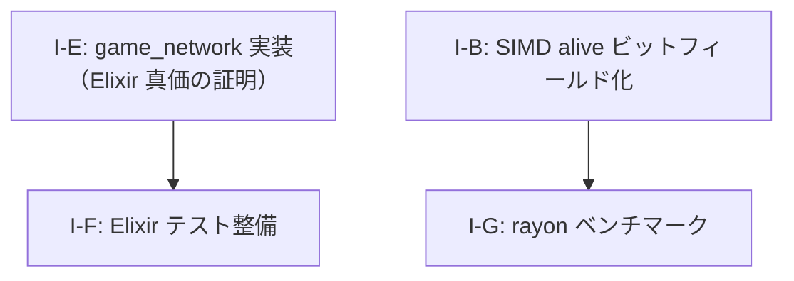

# AlchemyEngine — 改善計画

> このドキュメントは現在の弱点を整理し、各課題に対する具体的な改善方針を定義する。
> 優先度・影響範囲・作業ステップを明記することで、改善作業を体系的に進めることを目的とする。

---

## スコアカード（現状評価）

| カテゴリ | 点数 | 主な減点理由 |
|:---|:---:|:---|
| Rust 物理演算・SoA 設計 | 9/10 | — |
| Rust SIMD 最適化 | 9/10 | `alive` を `Vec<u8>` に変更しスカラー分岐を解消（フェーズ3完了） |
| Rust 並行性設計 | 8/10 | rayon 閾値分岐を追加しオーバーヘッドを回避（フェーズ3完了） |
| Rust 安全性（unsafe 管理） | 8/10 | — |
| Elixir OTP 設計 | 8/10 | — |
| Elixir 耐障害性 | 6/10 | NIF エラーは捕捉済みだが、ゲームループ再起動などの完全な回復ロジックが未実装 |
| Elixir 並行性・分散 | 1/10 | シングルルームのみ。`game_network` は完全スタブ |
| Elixir ビヘイビア活用 | 7/10 | — |
| アーキテクチャ（ビジョン一致度） | 7/10 | — |
| テスト | 5/10 | Rust 側に単体テストあり。Elixir 側はほぼ未テスト |
| **総合** | **7/10** | |

---

## 課題一覧

### I-B: SIMD の `alive` チェックがスカラー分岐（Rust SIMD 7/10 の原因）

**優先度**: 🟢 中

**問題**

SSE2 SIMD で 4 体並列処理しているにもかかわらず、`alive` フラグの読み取りがスカラーの `if` 分岐になっている。

```rust
let alive_mask = _mm_castsi128_ps(_mm_set_epi32(
    if enemies.alive[base + 3] { -1i32 } else { 0 },
    if enemies.alive[base + 2] { -1i32 } else { 0 },
    if enemies.alive[base + 1] { -1i32 } else { 0 },
    if enemies.alive[base + 0] { -1i32 } else { 0 },
));
```

`alive` を `bool` の `Vec` で持っているため、SIMD レジスタへのロードにスカラー分岐が必要になっている。

**改善方針**

- `alive: Vec<bool>` を `alive_bits: Vec<u32>`（ビットフィールド）または `alive: Vec<u8>`（0/0xFF のマスク値）に変更する
- `_mm_set_epi32` の代わりに `_mm_loadu_si128` で直接ロードできるようになり、スカラー分岐が消える
- ベンチマーク（`criterion`）を追加して改善効果を計測する

**影響ファイル**

- `native/game_simulation/src/world/enemy.rs` — `alive` フィールドの型変更
- `native/game_simulation/src/game_logic/chase_ai.rs` — SIMD マスク生成の修正

---

### I-E: `game_network` が完全スタブ（Elixir 並行性・分散 1/10 の原因）

**優先度**: 🟡 高（`pending-issues.md` 課題10・11 と同一）

**問題**

Elixir を選んだ最大の根拠である「OTP による耐障害性」「軽量プロセスによる大規模並行性」「分散ノード間通信」が、現状のコードでは一切証明されていない。
`game_network.ex` は実装なしのスタブであり、シングルプレイヤーのローカルゲームとして動作しているだけである。

この状態では「なぜ Elixir + Rust か」という問いにコードが答えられない。

**改善方針**

`pending-issues.md` 課題10（問題2・3）および課題11 の作業ステップを参照。

---

### I-F: Elixir 側のテストがほぼ未整備（テスト 5/10 の原因）

**優先度**: 🟢 中

**問題**

Rust 側には `chase_ai.rs`・`spatial_hash.rs` 等に単体テストが存在するが、Elixir 側（`GameEvents`・`SceneManager`・各シーン・コンポーネント）のテストがほぼ存在しない。

**改善方針**

- `GameEngine.SceneManager` のシーン遷移ロジックを `ExUnit` でテストする
- `GameContent.VampireSurvivor.Scenes.Playing.update/2` の純粋関数部分（EXP 計算・レベルアップ判定）を単体テストする
- `GameEngine.EventBus` のサブスクライバー配信をテストする

**影響ファイル**

- `apps/game_engine/test/` — 新規テストファイル群
- `apps/game_content/test/` — 新規テストファイル群

---

### I-G: rayon 並列化の閾値未検証（Rust 並行性の補足）

**優先度**: 🟢 低

**問題**

`update_chase_ai` の rayon 版は全敵を `par_iter_mut` で並列化しているが、rayon のスレッドプールのオーバーヘッドが支配的になる敵数（数百体以下）ではシングルスレッドより遅い可能性がある。ベンチマークが存在しない。

**改善方針**

- `criterion` ベンチマークを追加し、敵数 100 / 500 / 1000 / 5000 / 10000 体での処理時間を計測する
- 閾値以下ではシングルスレッド版にフォールバックする分岐を追加する

**影響ファイル**

- `native/game_simulation/benches/` — 新規ベンチマーク
- `native/game_simulation/src/game_logic/chase_ai.rs` — 閾値分岐の追加

---

## 改善の優先順位と推奨実施順序



### フェーズ2（中期）

1. **I-E**: `GameNetwork.Local` 実装 → ローカルマルチプレイヤー → ネットワーク対応
2. **I-F**: Elixir 側テスト整備

### フェーズ3（最適化）✅ 完了

3. **I-B**: SIMD `alive` ビットフィールド化 ✅
4. **I-G**: rayon ベンチマーク追加・閾値分岐 ✅

---

*このドキュメントは `pending-issues.md` と連携して管理すること。課題が解消されたら該当セクションを削除し、`pending-issues.md` の対応する課題も更新すること。*
