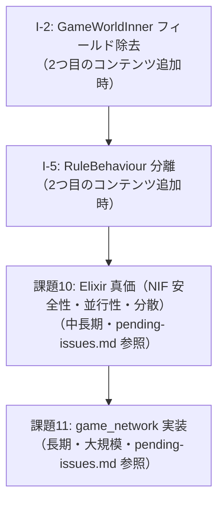

# AlchemyEngine — 改善計画

> このドキュメントは現在の弱点を整理し、各課題に対する具体的な改善方針を定義する。
> 優先度・影響範囲・作業ステップを明記することで、改善作業を体系的に進めることを目的とする。

---

## 課題一覧

| # | 課題 | 優先度 | 難易度 |
|:---|:---|:---|:---|
| I-2 | `GameWorldInner` にルール固有フィールドが残存 | 中 | 中 |
| I-5 | `RuleBehaviour` に VampireSurvivor 固有コールバックが混在 | 中 | 中 |

---

## I-2: `GameWorldInner` にルール固有フィールドが残存

### 現状

`weapon_slots`・`boss`・`hud_*` フィールドが Rust のエンジンコアに残っており、`vision.md` の「エンジンは武器・ボスを知らない」という原則と乖離している。

- `weapon_slots` → `add_weapon` NIF で Elixir から操作可能だが、Rust 内部に保持
- `boss` → `spawn_boss` / `set_boss_velocity` 等の NIF で Elixir から制御可能だが、Rust 内部に保持
- `hud_*` フィールド群 → `set_hud_level_state` NIF で毎フレーム注入済み（描画専用）

### 方針

2つ目のコンテンツを作り始めるタイミングで実施する（優先度：中）。ただし、作業の複雑さを事前に把握するため、影響範囲の調査を先行して行う。

#### フィールド別の対応方針

| フィールド | 現状 | 目標 | 対応方針 |
|:---|:---|:---|:---|
| `weapon_slots: Vec<WeaponSlot>` | `GameWorldInner` に保持 | Elixir 側 Rule state で管理 | Rust からフィールドを削除。`add_weapon` NIF を廃止し、`set_weapon_slots(world, slots)` NIF を新設して毎フレーム Elixir から注入する |
| `boss: Option<BossState>` | `GameWorldInner` に保持 | Elixir 側 Rule state で管理 | Rust からフィールドを削除。`spawn_boss` NIF は引き続き存在させ、ボス物理状態のみ Rust が管理する |
| `hud_level`, `hud_exp` 等 | `set_hud_level_state` NIF で毎フレーム注入（描画専用） | 現状維持（対応済み） | 変更不要 |

#### `weapon_slots` 除去の具体的手順

1. `GameWorldInner` から `weapon_slots: Vec<WeaponSlot>` を削除
2. `game_logic/systems/weapons.rs` の武器発射ロジックを、`physics_step` 呼び出し時に Elixir から渡される武器リストを参照するよう変更
3. `add_weapon` NIF の代わりに `set_weapon_slots(world, slots)` NIF を追加し、毎フレーム Elixir から注入する
4. `Playing` シーン state の `weapon_levels` を `weapon_slots` 形式に拡張する

#### `boss` フィールド除去の具体的手順

1. `GameWorldInner` から `boss: Option<BossState>` を削除
2. ボスの物理状態（位置・速度・当たり判定）を `EnemyWorld` の特殊エントリとして扱うか、別の軽量構造体に移す
3. `spawn_boss` NIF はボスの物理エントリを生成するのみとし、ボス種別の概念を Rust から除去する
4. `get_boss_state` NIF の返り値を物理状態のみ（位置・HP）に限定する

#### 影響ファイル

- `native/game_simulation/src/world/game_world.rs` — フィールド削除
- `native/game_simulation/src/game_logic/systems/weapons.rs` — 武器リスト参照方法の変更
- `native/game_nif/src/nif/action_nif.rs` — NIF シグネチャ変更
- `native/game_nif/src/render_snapshot.rs` — HUD データ取得方法の変更
- `apps/game_engine/lib/game_engine/game_events.ex` — 毎フレームの状態注入ロジック
- `apps/game_content/lib/game_content/vampire_survivor/scenes/playing.ex` — state 拡張

---

## I-5: `RuleBehaviour` に VampireSurvivor 固有コールバックが混在

### 現状

以下のコールバックが汎用インターフェース `RuleBehaviour` に含まれており、VampireSurvivor に特化した概念が混在している：

```elixir
@callback generate_weapon_choices(weapon_levels) :: [atom()]
@callback apply_level_up(scene_state, choices)   :: map()
@callback apply_weapon_selected(scene_state, weapon) :: map()
@callback apply_level_up_skipped(scene_state)    :: map()
@callback initial_weapons()                      :: [atom()]
@callback level_up_scene()                       :: module()
@callback boss_alert_scene()                     :: module()
```

2つ目のコンテンツが「武器」や「ボス」の概念を持たない場合、これらのコールバックは無意味になる。

### 方針

`RuleBehaviour` を **コアコールバック** と **オプション拡張** に分離する。

#### 分離設計

`vision.md` の「エンジンはボスを知らない」原則に従い、ボス固有のコールバックは `RuleBehaviour` から完全に除去する。代わりに `BossRuleBehaviour` として切り出し、ボスの概念を持つルールだけが実装する。

```elixir
# ─── GameEngine.RuleBehaviour（エンジンコア・全ルール共通） ───────────
defmodule GameEngine.RuleBehaviour do
  @callback render_type()          :: atom()
  @callback initial_scenes()       :: [scene_spec()]
  @callback physics_scenes()       :: [module()]
  @callback title()                :: String.t()
  @callback version()              :: String.t()
  @callback context_defaults()     :: map()
  @callback playing_scene()        :: module()
  @callback game_over_scene()      :: module()
  @callback wave_label(elapsed_sec :: number()) :: String.t()

  # エンティティ消滅はボス固有ではなく汎用イベントのためオプションとして残す
  @optional_callbacks on_entity_removed: 4
  @callback on_entity_removed(world_ref, kind_id, x, y) :: :ok
end

# ─── GameEngine.BossRuleBehaviour（ボスの概念を持つルール向け拡張） ───
defmodule GameEngine.BossRuleBehaviour do
  @callback on_boss_defeated(world_ref, boss_kind, x, y) :: :ok
  @callback update_boss_ai(context, boss_state)          :: :ok
end
```

```elixir
# VampireSurvivorRule は両方を実装する
defmodule GameContent.VampireSurvivorRule do
  @behaviour GameEngine.RuleBehaviour
  @behaviour GameEngine.BossRuleBehaviour
  # ...
end
```

武器・レベルアップに関するコールバック（`generate_weapon_choices`・`apply_level_up` 等）は `VampireSurvivorRule` の内部関数に移動し、エンジンコアからは完全に除去する。

#### 移行手順

1. `GameEngine.BossRuleBehaviour` モジュールを新規作成し、`on_boss_defeated/4` と `update_boss_ai/2` を定義する
2. `RuleBehaviour` から `on_boss_defeated`・`update_boss_ai` を削除し、`on_entity_removed` を `@optional_callbacks` に変更する
3. `VampireSurvivorRule` に `@behaviour GameEngine.BossRuleBehaviour` を追加する
4. `GameEvents` のコールバック呼び出し箇所を、`BossRuleBehaviour` の実装有無で分岐させる（`function_exported?/3` で確認）
5. 武器・レベルアップ関連コールバックを `VampireSurvivorRule` の内部関数に移動する
6. 2つ目のコンテンツを追加する際に、ボスなしルールが `BossRuleBehaviour` を実装せずに動作することを確認する

#### 注意点

この変更は `VampireSurvivorRule` の実装に影響するため、I-2（`GameWorldInner` フィールド除去）と同時に実施することを推奨する。2つ目のコンテンツを追加するタイミングが最適な実施時期である。

---

## 改善の優先順位と推奨実施順序



### フェーズ1（2つ目のコンテンツ追加時）

1. **I-2**: `GameWorldInner` からルール固有フィールドを除去する
2. **I-5**: `RuleBehaviour` をコアとオプションに分離する
3. **課題10（問題1〜2）**: NIF 安全性強化・複数ルーム同時稼働テスト

### フェーズ2（長期）

4. **課題10（問題3）** / **課題11**: `GameNetwork.Local` 実装 → ローカルマルチプレイヤー → ネットワーク対応

---

*このドキュメントは `pending-issues.md` と連携して管理すること。課題が解消されたら該当セクションを削除し、`pending-issues.md` の対応する課題も更新すること。*
