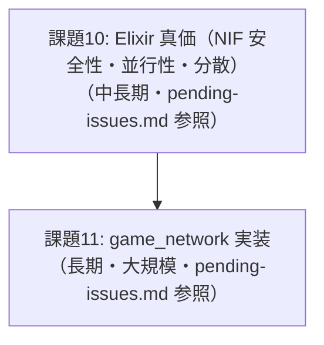

# AlchemyEngine — 改善計画

> このドキュメントは現在の弱点を整理し、各課題に対する具体的な改善方針を定義する。
> 優先度・影響範囲・作業ステップを明記することで、改善作業を体系的に進めることを目的とする。

---

## 課題一覧

現在、着手可能な課題はありません。

---

## 改善の優先順位と推奨実施順序

### フェーズ1（着手可能）

1. **課題10（問題1〜2）**: NIF 安全性強化・複数ルーム同時稼働テスト

### フェーズ2（長期）

2. **課題10（問題3）** / **課題11**: `GameNetwork.Local` 実装 → ローカルマルチプレイヤー → ネットワーク対応

---

*このドキュメントは `pending-issues.md` と連携して管理すること。課題が解消されたら該当セクションを削除し、`pending-issues.md` の対応する課題も更新すること。*
