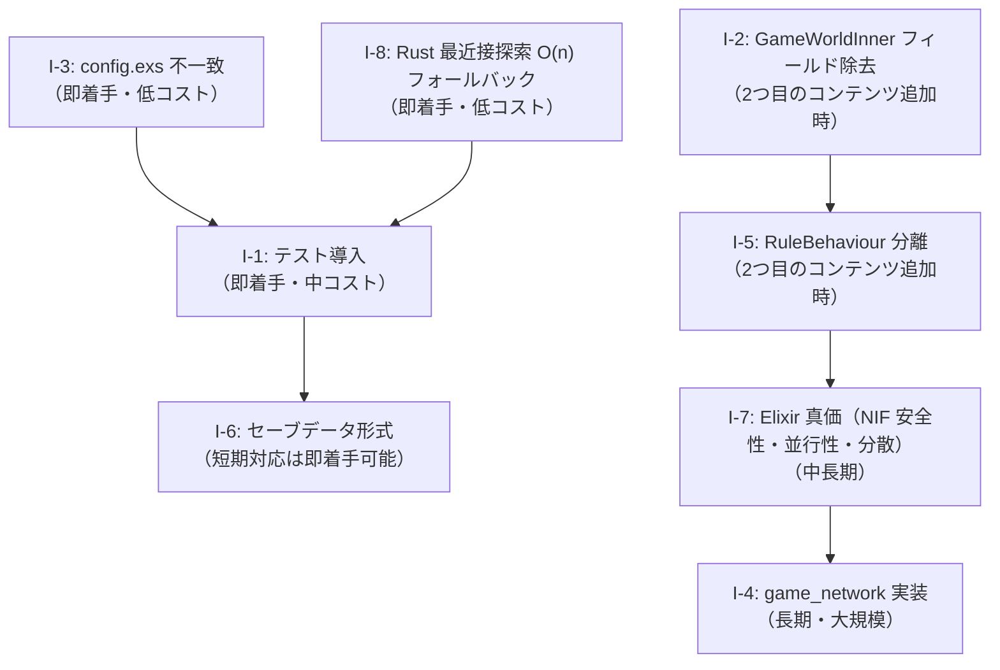

# AlchemyEngine — 改善計画

> このドキュメントは現在の弱点を整理し、各課題に対する具体的な改善方針を定義する。
> 優先度・影響範囲・作業ステップを明記することで、改善作業を体系的に進めることを目的とする。

---

## 課題一覧

| # | 課題 | 優先度 | 難易度 |
|:---|:---|:---|:---|
| I-1 | テストが皆無 | 高 | 中 |
| I-2 | `GameWorldInner` にルール固有フィールドが残存 | 中 | 中 |
| I-3 | `config.exs` の設定キー不一致 | 高 | 低 |
| I-4 | `game_network` が完全スタブ | 低 | 高 |
| I-5 | `RuleBehaviour` に VampireSurvivor 固有コールバックが混在 | 中 | 中 |
| I-6 | セーブデータ形式の移植性 | 中 | 低 |
| I-7 | Elixir の真価（OTP・並行性・分散）が活かされていない | 中 | 高 |
| I-8 | Rust の最近接探索が O(n) 全探索にフォールバックする | 低 | 低 |
| I-9 | `WorldBehaviour` / `RuleBehaviour` を `Component` に統合する | 高 | 中 |

---

## I-1: テストが皆無

### 現状

自動テストが一切存在しない。`WorldBehaviour` / `RuleBehaviour` のインターフェースは整備されているため、ユニットテストを書きやすい構造ではある。`game_simulation` クレートは Rustler 非依存で設計されており、ヘッドレステストが可能なはずだが、現状はゼロである。

### 方針

テストを 3 つの層に分けて段階的に導入する。

#### 層1: Elixir ユニットテスト（即着手可能）

`WorldBehaviour` / `RuleBehaviour` の実装モジュールは純粋な Elixir 関数が多く、NIF 呼び出しを含まないコールバックは ExUnit でそのままテストできる。

**対象モジュールと検証内容:**

| モジュール | テスト対象コールバック | 検証内容 |
|:---|:---|:---|
| `VampireSurvivorWorld` | `entity_registry/0` | エントリのキー・値の型・重複なし |
| `VampireSurvivorWorld` | `setup_world_params/1` | NIF 呼び出し回数（モック） |
| `VampireSurvivorRule` | `generate_weapon_choices/1` | 最大3択・最大レベル時の空リスト |
| `VampireSurvivorRule` | `enemy_exp_reward/1` | 全 kind_id に対する正の整数 |
| `VampireSurvivorRule` | `score_from_exp/1` | EXP → スコア変換の単調増加 |
| `LevelSystem` | `generate_weapon_choices/1` | 未所持優先・低レベル優先・最大8スロット |
| `BossSystem` | `next_boss/1` | 各タイムスタンプで正しいボス種別 |
| `SpawnSystem` | `current_phase/1` | 経過時間とウェーブフェーズの対応 |
| `EntityParams` | EXP・スコアテーブル | 全エントリの存在確認 |

**NIF 依存のモック方針:**

NIF を呼び出すコールバック（`setup_world_params/1` 等）は、`Mox` ライブラリで `GameEngine.NifBridge` をモック化してテストする。

```elixir
# test/support/mocks.ex
Mox.defmock(GameEngine.NifBridgeMock, for: GameEngine.NifBridge.Behaviour)
```

#### 層2: Rust ユニットテスト（`game_simulation` クレート）

`game_simulation` は Rustler に依存しない独立クレートであるため、標準の `cargo test` でヘッドレステストが実行できる。

**対象モジュールと検証内容:**

| モジュール | テスト対象 | 検証内容 |
|:---|:---|:---|
| `physics/spatial_hash.rs` | `insert` / `query_nearby` | セルをまたぐ近傍検索の正確性 |
| `physics/separation.rs` | `apply_separation` | 重複エンティティが分離されること |
| `physics/obstacle_resolve.rs` | `resolve` | 障害物内部に押し込まれないこと |
| `physics/rng.rs` | `next_u32` | 決定論的シード再現性 |
| `game_logic/chase_ai.rs` | `update_chase` | プレイヤー方向への速度ベクトル |
| `world/game_world.rs` | `spawn_enemy` / `kill_enemy` | free_list の O(1) 再利用 |
| `game_logic/systems/weapons.rs` | 各 `FirePattern` | 発射方向・弾数の正確性 |

```rust
#[cfg(test)]
mod tests {
    use super::*;

    #[test]
    fn spatial_hash_cross_cell_query() {
        let mut sh = SpatialHash::new(80);
        sh.insert(0, 79.0, 79.0);  // セル (0,0) の境界
        sh.insert(1, 81.0, 81.0);  // セル (1,1)
        let nearby = sh.query_nearby(80.0, 80.0, 40.0);
        assert!(nearby.contains(&0));
        assert!(nearby.contains(&1));
    }
}
```

#### 層3: Elixir 統合テスト（シーン遷移）

`SceneManager` と各シーンの遷移ロジックを、NIF をモック化した状態で統合テストする。

**対象シナリオ:**

| シナリオ | 検証内容 |
|:---|:---|
| レベルアップイベント受信 | `Playing` → `LevelUp` シーンへの push |
| 武器選択後 | `LevelUp` → `Playing` への pop |
| HP ≤ 0 | `Playing` → `GameOver` への replace |
| ボス出現イベント | `Playing` → `BossAlert` への push |
| リトライ | `GameOver` → `Playing` への replace |

### 作業ステップ

1. `mix.exs` に `{:mox, "~> 1.0", only: :test}` を追加
2. `GameEngine.NifBridge.Behaviour` ビヘイビアを定義（既存 NIF スタブから自動生成可能）
3. `test/support/mocks.ex` を作成
4. `game_content` の純粋関数テストを `test/game_content/` 以下に追加
5. `game_simulation` に `#[cfg(test)]` ブロックを追加
6. CI（GitHub Actions 等）で `mix test` と `cargo test -p game_simulation` を実行

---

## I-2: `GameWorldInner` にルール固有フィールドが残存

### 現状

`pending-issues.md` の課題8として認識済み。`weapon_slots`・`boss`・`hud_*` フィールドが Rust のエンジンコアに残っており、`vision.md` の「エンジンは武器・ボスを知らない」という原則と乖離している。

### 方針

2つ目のコンテンツを作り始めるタイミングで実施する（優先度：中）。ただし、作業の複雑さを事前に把握するため、影響範囲の調査を先行して行う。

#### フィールド別の対応方針

| フィールド | 現状 | 目標 | 対応方針 |
|:---|:---|:---|:---|
| `weapon_slots: Vec<WeaponSlot>` | `GameWorldInner` に保持 | Elixir 側 Rule state で管理 | Rust からフィールドを削除。`add_weapon` NIF を廃止し、`set_weapon_slots(world, slots)` NIF を新設して毎フレーム Elixir から注入する |
| `boss: Option<BossState>` | `GameWorldInner` に保持 | Elixir 側 Rule state で管理 | Rust からフィールドを削除。`spawn_boss` NIF は引き続き存在させ、ボス物理状態のみ Rust が管理する |
| `hud_level`, `hud_exp` 等 | `set_hud_level_state` NIF で毎フレーム注入（描画専用） | 現状維持（対応済み） | 変更不要 |

#### `weapon_slots` 除去の具体的手順

1. `GameWorldInner` から `weapon_slots: Vec<WeaponSlot>` を削除
2. `game_logic/systems/weapons.rs` の武器発射ロジックを、`physics_step` 呼び出し時に Elixir から渡される武器リストを参照するよう変更
3. `add_weapon` NIF の代わりに `set_weapon_slots(world, slots)` NIF を追加し、毎フレーム Elixir から注入する
4. `Playing` シーン state の `weapon_levels` を `weapon_slots` 形式に拡張する

#### `boss` フィールド除去の具体的手順

1. `GameWorldInner` から `boss: Option<BossState>` を削除
2. ボスの物理状態（位置・速度・当たり判定）を `EnemyWorld` の特殊エントリとして扱うか、別の軽量構造体に移す
3. `spawn_boss` NIF はボスの物理エントリを生成するのみとし、ボス種別の概念を Rust から除去する
4. `get_boss_state` NIF の返り値を物理状態のみ（位置・HP）に限定する

#### 影響ファイル

- `native/game_simulation/src/world/game_world.rs` — フィールド削除
- `native/game_simulation/src/game_logic/systems/weapons.rs` — 武器リスト参照方法の変更
- `native/game_nif/src/nif/action_nif.rs` — NIF シグネチャ変更
- `native/game_nif/src/render_snapshot.rs` — HUD データ取得方法の変更
- `apps/game_engine/lib/game_engine/game_events.ex` — 毎フレームの状態注入ロジック
- `apps/game_content/lib/game_content/vampire_survivor/scenes/playing.ex` — state 拡張

---

## ~~I-3: `config.exs` の設定キー不一致~~ ✅ 対応済み

`config.exs` の `:current_game` キーを `:current_world` / `:current_rule` の2キー形式に修正し、
`vision.md` の記述もコードと一致する形式に統一した。

```elixir
# config/config.exs（現在）
config :game_server, :current_world, GameContent.VampireSurvivorWorld
config :game_server, :current_rule,  GameContent.VampireSurvivorRule
config :game_server, :map,           :plain
```

---

## I-4: `game_network` が完全スタブ

### 現状

マルチプレイヤー通信は設計思想の重要な柱だが、`apps/game_network/lib/game_network.ex` は実装なしのスタブである。

### 方針

マルチプレイヤー実装は大規模な作業であるため、段階的なアプローチを取る。現時点では **設計ドキュメントの整備** と **インターフェース定義** を先行させ、実装は後続フェーズとする。

#### フェーズ1: インターフェース定義（即着手可能）

`game_network` が提供すべき責務を明確にし、ビヘイビアとして定義する。

```elixir
defmodule GameNetwork.Behaviour do
  @callback broadcast_state(room_id :: atom(), state :: map()) :: :ok
  @callback send_to_player(player_id :: term(), message :: term()) :: :ok
  @callback subscribe_room(room_id :: atom()) :: :ok
  @callback list_players(room_id :: atom()) :: [term()]
end
```

#### フェーズ2: ローカルマルチプレイヤー（同一 BEAM ノード）

Phoenix Channels を使わずに、Elixir の `Registry` と `PubSub` を使ったローカルマルチプレイヤーを実装する。これにより、ネットワーク層なしでマルチプレイヤーのゲームロジックを検証できる。

#### フェーズ3: ネットワーク対応

- **Phoenix Channels**: WebSocket によるリアルタイム同期
- **UDP**: 低遅延ゲーム状態同期（`gen_udp` または外部ライブラリ）
- **状態同期戦略**: 権威サーバー型（Elixir が SSoT）

#### 技術選定の考慮事項

| 方式 | 遅延 | 実装コスト | 適用場面 |
|:---|:---|:---|:---|
| Phoenix Channels (WebSocket) | 中 | 低 | ターン制・低速アクション |
| UDP (gen_udp) | 低 | 高 | リアルタイムアクション |
| Phoenix Channels + Delta 圧縮 | 中 | 中 | 現実的な妥協点 |

#### 現時点でのアクション

1. `game_network.ex` に `GameNetwork.Behaviour` ビヘイビアを定義する
2. `GameNetwork.Local` モジュールを作成し、ローカル PubSub で動作するスタブ実装を提供する
3. `game_content.md` の「将来の拡張予定」セクションを上記フェーズ計画に更新する

---

## I-5: `RuleBehaviour` に VampireSurvivor 固有コールバックが混在

### 現状

以下のコールバックが汎用インターフェース `RuleBehaviour` に含まれており、VampireSurvivor に特化した概念が混在している：

```elixir
@callback generate_weapon_choices(weapon_levels) :: [atom()]
@callback apply_level_up(scene_state, choices)   :: map()
@callback apply_weapon_selected(scene_state, weapon) :: map()
@callback apply_level_up_skipped(scene_state)    :: map()
@callback initial_weapons()                      :: [atom()]
@callback level_up_scene()                       :: module()
@callback boss_alert_scene()                     :: module()
```

2つ目のコンテンツが「武器」や「ボス」の概念を持たない場合、これらのコールバックは無意味になる。

### 方針

`RuleBehaviour` を **コアコールバック** と **オプション拡張** に分離する。

#### 分離設計

`vision.md` の「エンジンはボスを知らない」原則に従い、ボス固有のコールバックは `RuleBehaviour` から完全に除去する。代わりに `BossRuleBehaviour` として切り出し、ボスの概念を持つルールだけが実装する。

```elixir
# ─── GameEngine.RuleBehaviour（エンジンコア・全ルール共通） ───────────
defmodule GameEngine.RuleBehaviour do
  @callback render_type()          :: atom()
  @callback initial_scenes()       :: [scene_spec()]
  @callback physics_scenes()       :: [module()]
  @callback title()                :: String.t()
  @callback version()              :: String.t()
  @callback context_defaults()     :: map()
  @callback playing_scene()        :: module()
  @callback game_over_scene()      :: module()
  @callback wave_label(elapsed_sec :: number()) :: String.t()

  # エンティティ消滅はボス固有ではなく汎用イベントのためオプションとして残す
  @optional_callbacks on_entity_removed: 4
  @callback on_entity_removed(world_ref, kind_id, x, y) :: :ok
end

# ─── GameEngine.BossRuleBehaviour（ボスの概念を持つルール向け拡張） ───
defmodule GameEngine.BossRuleBehaviour do
  @callback on_boss_defeated(world_ref, boss_kind, x, y) :: :ok
  @callback update_boss_ai(context, boss_state)          :: :ok
end
```

```elixir
# VampireSurvivorRule は両方を実装する
defmodule GameContent.VampireSurvivorRule do
  @behaviour GameEngine.RuleBehaviour
  @behaviour GameEngine.BossRuleBehaviour
  # ...
end
```

武器・レベルアップに関するコールバック（`generate_weapon_choices`・`apply_level_up` 等）は `VampireSurvivorRule` の内部関数に移動し、エンジンコアからは完全に除去する。

#### 移行手順

1. `GameEngine.BossRuleBehaviour` モジュールを新規作成し、`on_boss_defeated/4` と `update_boss_ai/2` を定義する
2. `RuleBehaviour` から `on_boss_defeated`・`update_boss_ai` を削除し、`on_entity_removed` を `@optional_callbacks` に変更する
3. `VampireSurvivorRule` に `@behaviour GameEngine.BossRuleBehaviour` を追加する
4. `GameEvents` のコールバック呼び出し箇所を、`BossRuleBehaviour` の実装有無で分岐させる（`function_exported?/3` で確認）
5. 武器・レベルアップ関連コールバックを `VampireSurvivorRule` の内部関数に移動する
6. 2つ目のコンテンツを追加する際に、ボスなしルールが `BossRuleBehaviour` を実装せずに動作することを確認する

#### 注意点

この変更は `VampireSurvivorRule` の実装に影響するため、I-2（`GameWorldInner` フィールド除去）と同時に実施することを推奨する。2つ目のコンテンツを追加するタイミングが最適な実施時期である。

---

## I-6: セーブデータ形式の移植性

### 現状

`saves/session.dat` と `saves/high_scores.dat` が `:erlang.term_to_binary` 形式で保存されている。この形式には以下のリスクがある：

- **Elixir/OTP バージョン間の非互換**: アトム・タプル・マップの内部表現がバージョンによって変わる可能性がある
- **モジュール名変更時の破損**: `VampireSurvivorRule` 等のモジュール名がアトムとして埋め込まれている場合、リネーム時にデシリアライズ失敗する
- **デバッグ困難**: バイナリ形式のため、テキストエディタで内容を確認できない

### 方針

**段階的な移行**を行う。既存の `:erlang.term_to_binary` 形式を維持しつつ、JSON 形式への移行パスを用意する。

#### 短期対応（即着手可能）

セーブデータのスキーマを明示的に定義し、バージョン番号を付与する：

```elixir
defmodule GameEngine.SaveManager do
  @save_version 1

  def save_session(state) do
    data = %{
      version: @save_version,
      saved_at: DateTime.utc_now() |> DateTime.to_iso8601(),
      state: serialize_state(state)
    }
    binary = :erlang.term_to_binary(data, [:compressed])
    File.write!(save_path(), binary)
  end

  def load_session() do
    binary = File.read!(save_path())
    data = :erlang.binary_to_term(binary, [:safe])
    migrate(data.version, data.state)
  end

  defp migrate(1, state), do: state
  # 将来: defp migrate(2, state), do: ...
end
```

#### 中期対応（推奨）

JSON 形式への移行。`Jason` ライブラリを使用する：

```elixir
def save_session(state) do
  data = %{
    version: @save_version,
    saved_at: DateTime.utc_now() |> DateTime.to_iso8601(),
    state: state_to_json_map(state)
  }
  File.write!(save_path("session.json"), Jason.encode!(data, pretty: true))
end
```

**JSON 移行のメリット:**

| 項目 | `:erlang.term_to_binary` | JSON |
|:---|:---|:---|
| 人間可読性 | ✗ | ✅ |
| バージョン間互換性 | 低（OTP 依存） | 高 |
| 言語間移植性 | Erlang/Elixir のみ | 汎用 |
| パフォーマンス | 高速 | やや低速 |
| アトム安全性 | `:safe` オプションで対応可 | 問題なし |

#### 移行時の注意点

- 既存の `.dat` ファイルを読み込んで `.json` に変換するマイグレーションスクリプトを用意する
- `load_session/0` は `.json` が存在しない場合に `.dat` にフォールバックする移行期間を設ける
- アトムを文字列として保存し、ロード時に `String.to_existing_atom/1` で復元する（未知のアトムによるクラッシュを防ぐ）

#### 影響ファイル

- `apps/game_engine/lib/game_engine/save_manager.ex` — シリアライズ/デシリアライズ実装
- `mix.exs` — `{:jason, "~> 1.4"}` の追加（JSON 移行時）

---

## I-7: Elixir の真価（OTP・並行性・分散）が活かされていない

### 現状

Elixir を選んだ最大の理由は「OTP による耐障害性」「軽量プロセスによる大規模並行性」「分散ノード間通信」のはずだが、現状の実装ではこれらがほとんど活かされていない。

具体的には以下の 3 点が問題である。

#### 問題1: NIF クラッシュが OTP の耐障害性を無効化している

OTP の Supervisor ツリーは「プロセスが落ちても再起動できる」ことを保証するが、Rustler NIF がパニックすると BEAM VM ごと落ちる。現状は `load.rs` でパニックフックを設定しているものの、NIF 内の未捕捉パニックは依然として致命的である。

```
Supervisor
  └── GameEvents (GenServer)
        └── NIF 呼び出し → Rust パニック → BEAM VM クラッシュ
                                            ↑ Supervisor が再起動できない
```

**目標**: Rust 側のパニックを `Result` で返し、Elixir 側で `{:error, reason}` として受け取れるようにする。少なくとも、回復可能なエラーパスを NIF に設ける。

**具体的な対応:**

1. `game_nif` の各 NIF 関数の戻り値を `NifResult<T>` に統一し、`unwrap()` / `expect()` を除去する
2. `physics_step` 内でパニックが起きうる箇所（配列アクセス等）を `get()` による境界チェックに置き換える
3. Elixir 側 `GameEvents` で NIF エラーを受け取った場合の回復ロジックを追加する（ゲームループ再起動等）

#### 問題2: 並行性が活かされていない（1ルームのみ稼働）

`RoomSupervisor` と `Registry` は複数ルームの同時稼働を想定した設計になっているが、実際には `:main` ルーム 1 つしか起動していない。Elixir の「軽量プロセス×数百万」という強みが全く使われていない。

**目標**: 複数ルームを同時稼働させ、各ルームが独立した `GameEvents` プロセスとして動作することを確認する。

**具体的な対応:**

1. `RoomSupervisor.start_room/1` を複数回呼び出して複数ルームを起動するテストを書く
2. 各ルームが独立した `GameWorld` リソース（Rust 側）を持つことを確認する
3. `game_network` のローカル PubSub 実装（I-4 フェーズ2）と組み合わせて、ルーム間通信を実装する

#### 問題3: `game_network` が未実装のため Elixir を選んだ理由が証明されていない

Elixir + Phoenix Channels の組み合わせは、リアルタイムマルチプレイヤーゲームの通信基盤として業界実績がある。しかし現状では `game_network.ex` が空のスタブであり、Elixir を選んだ最大の理由（分散・リアルタイム通信）が未実証のままである。

**目標**: `game_network` に最低限の PubSub 実装を追加し、同一 BEAM ノード上での複数プレイヤー同期を実現する。

**具体的な対応（I-4 フェーズ2 と連携）:**

1. `GameNetwork.Behaviour` ビヘイビアを定義する
2. `GameNetwork.Local` モジュールで `Registry` + `Phoenix.PubSub` を使ったローカル実装を作る
3. `GameEvents` が `EventBus` 経由でルーム状態を `GameNetwork` にブロードキャストする仕組みを追加する

### 方針

優先度は「中」だが、このプロジェクトが Elixir を採用した正当性を証明するために必要な作業である。2つ目のコンテンツ追加（I-2・I-5）と並行して、問題1（NIF 安全性）から着手することを推奨する。

### 作業ステップ

1. **問題1（NIF 安全性）**: `game_nif` の全 NIF 関数の戻り値を `NifResult<T>` に統一する（1〜2日）
2. **問題2（複数ルーム）**: 複数ルーム同時稼働の統合テストを書く（半日）
3. **問題3（game_network）**: I-4 フェーズ2 として `GameNetwork.Local` を実装する（2〜3日）

---

## I-8: Rust の最近接探索が O(n) 全探索にフォールバックする

### 現状

`chase_ai.rs` の `find_nearest_enemy_spatial` は、Spatial Hash の検索半径内に候補がいない場合に O(n) 全探索にフォールバックする。また、Lightning チェーンの除外リスト検索が `Vec<usize>` の線形探索（`exclude.contains(&i)`）になっており、チェーン数が増えると二乗オーダーになる。

```rust
// 半径内に候補がいなければ全探索（敵が散らばっているときに毎フレーム発動）
result.or_else(|| find_nearest_enemy(enemies, px, py))

// Lightning チェーン: O(n) 線形探索
if !enemies.alive[i] || exclude.contains(&i) {
```

### 方針

#### `find_nearest_enemy_spatial` のフォールバック改善

検索半径を段階的に拡大する方式（`search_radius` を 2 倍ずつ増やして再試行）に変更し、全探索を避ける。

```rust
pub fn find_nearest_enemy_spatial(
    collision: &CollisionWorld,
    enemies: &EnemyWorld,
    px: f32, py: f32,
    initial_radius: f32,
    buf: &mut Vec<usize>,
) -> Option<usize> {
    let mut radius = initial_radius;
    for _ in 0..4 {  // 最大 4 回拡大（初期半径 × 16 まで）
        collision.dynamic.query_nearby_into(px, py, radius, buf);
        if let Some(i) = buf.iter()
            .filter(|&&i| i < enemies.len() && enemies.alive[i])
            .min_by(/* 距離比較 */)
        {
            return Some(*i);
        }
        buf.clear();
        radius *= 2.0;
    }
    find_nearest_enemy(enemies, px, py)  // 最終フォールバック（稀）
}
```

#### Lightning チェーン除外リストの改善

現在の `fire_chain` は `hit_vec: Vec<usize>` に命中済みの**敵インデックス**を蓄積し、`find_nearest_enemy_spatial_excluding` に渡している。`exclude.contains(&i)` は敵インデックス `i` に対して線形探索するため O(chain_count × 候補数) になる。

修正方針は **`[bool; MAX_ENEMIES]` のスタック配列をビットマスクとして使う** ことで O(1) 検索を実現する。`MAX_ENEMIES = 300` は `constants.rs` で定義済みであり、300 バイトのスタック消費は許容範囲内である。

> **なぜ `[bool; MAX_CHAIN]` ではないか**
> 除外判定は「チェーン番号」ではなく「敵インデックス（0〜MAX_ENEMIES-1）」で行う。
> `MAX_CHAIN`（チェーン数の上限）と `MAX_ENEMIES`（敵インデックスの上限）は別物であり、
> `[bool; MAX_CHAIN]` でインデックス `i` にアクセスすると範囲外アクセスになる。

```rust
// 変更前（fire_chain 内）
let mut hit_vec: Vec<usize> = Vec::with_capacity(chain_count);
// ...
find_nearest_enemy_spatial_excluding(
    &w.collision, &w.enemies, nx, ny,
    WEAPON_SEARCH_RADIUS, &hit_vec,  // ← &[usize] を渡す
    &mut w.spatial_query_buf,
);

// 変更後
use crate::constants::MAX_ENEMIES;
let mut hit_set = [false; MAX_ENEMIES];  // スタック上に 300 バイト
// ...
hit_set[ei] = true;  // 命中時にフラグを立てる
find_nearest_enemy_spatial_excluding(
    &w.collision, &w.enemies, nx, ny,
    WEAPON_SEARCH_RADIUS, &hit_set,  // ← &[bool; MAX_ENEMIES] を渡す
    &mut w.spatial_query_buf,
);

// find_nearest_enemy_spatial_excluding 側の変更
// exclude: &[usize] → exclude: &[bool]
.filter(|&&i| i < enemies.len() && enemies.alive[i] && !exclude[i])  // O(1)
```

### 影響ファイル

- `native/game_simulation/src/game_logic/chase_ai.rs` — `find_nearest_enemy_spatial_excluding` のシグネチャ変更（`exclude: &[usize]` → `exclude: &[bool]`）
- `native/game_simulation/src/game_logic/systems/weapons.rs` — `fire_chain` の `hit_vec` を `hit_set` に変更

### 作業ステップ

1. `find_nearest_enemy_spatial` に段階的半径拡大ロジックを追加する（2〜3時間）
2. `find_nearest_enemy_spatial_excluding` のシグネチャを `exclude: &[bool]` に変更する（30分）
3. `fire_chain` 内の `hit_vec: Vec<usize>` を `hit_set: [bool; MAX_ENEMIES]` に置き換える（30分）
4. `cargo test` でリグレッションがないことを確認する

---

## 改善の優先順位と推奨実施順序



### フェーズ1（今すぐ着手）

1. **I-3**: `config.exs` の設定キーをコードとドキュメントで統一する（1〜2時間）
2. **I-8**: `find_nearest_enemy_spatial` の段階的半径拡大・Lightning 除外リストのビットマスク化（半日）
3. **I-6（短期）**: セーブデータにバージョン番号を付与し、マイグレーション機構を追加する（半日）
4. **I-1（Elixir 層）**: `game_content` の純粋関数テストを追加する（1〜2日）

### フェーズ2（安定化）

5. **I-1（Rust 層）**: `game_simulation` のユニットテストを追加する（1〜2日）
6. **I-6（中期）**: JSON 形式への移行（半日〜1日）
7. **I-1（統合テスト）**: シーン遷移の統合テストを追加する（1〜2日）
8. **I-7（問題1）**: `game_nif` の全 NIF 関数の戻り値を `NifResult<T>` に統一する（1〜2日）

### フェーズ3（2つ目のコンテンツ追加時）

9. **I-9**: `WorldBehaviour` / `RuleBehaviour` を `Component` に統合する
10. **I-2**: `GameWorldInner` からルール固有フィールドを除去する
11. **I-5**: `RuleBehaviour` をコアとオプションに分離する（I-9 完了後は不要になる可能性あり）
12. **I-7（問題2）**: 複数ルーム同時稼働の統合テストを書く（半日）
13. **I-4（フェーズ1）**: `GameNetwork.Behaviour` インターフェースを定義する

### フェーズ4（長期）

14. **I-7（問題3）** / **I-4（フェーズ2〜3）**: `GameNetwork.Local` 実装 → ローカルマルチプレイヤー → ネットワーク対応

---

## I-9: `WorldBehaviour` / `RuleBehaviour` を `Component` に統合する

### 背景

`vision.md` の思想整理により、「ワールド」と「ルール」の区別はエンジンの責務ではないことが明確になった。
エンジンの上に乗るものはすべて「コンテンツ」であり、コンテンツは**コンポーネントの集合**として表現される。
これは Unity の `MonoBehaviour`、Unreal の `ActorComponent`、Godot の `Node` と同じ思想だ。

### 現状

```elixir
# 2つのビヘイビアが分離して存在する
GameEngine.WorldBehaviour  # assets_path / entity_registry / setup_world_params
GameEngine.RuleBehaviour   # initial_scenes / on_entity_removed / update_boss_ai / ...

# config.exs も2キー
config :game_server, :current_world, GameContent.VampireSurvivorWorld
config :game_server, :current_rule,  GameContent.VampireSurvivorRule
```

### 目標

```elixir
# 1つのビヘイビアに統合
GameEngine.Component  # on_ready / on_process / on_physics_process / on_event

# コンテンツはコンポーネント群を返す
defmodule GameContent.VampireSurvivor do
  def components do
    [
      GameContent.VampireSurvivor.SpawnComponent,
      GameContent.VampireSurvivor.LevelComponent,
      GameContent.VampireSurvivor.BossComponent,
      # ...
    ]
  end
end

# config.exs は1キー
config :game_server, :current, GameContent.VampireSurvivor
```

### `GameEngine.Component` ビヘイビア定義

```elixir
defmodule GameEngine.Component do
  @optional_callbacks [on_ready: 1, on_process: 1, on_physics_process: 1, on_event: 2]

  @callback on_ready(world_ref)          :: :ok  # 初期化時（1回）
  @callback on_process(context)          :: :ok  # 毎フレーム（Elixir側）
  @callback on_physics_process(context)  :: :ok  # 物理フレーム（60Hz）
  @callback on_event(event, context)     :: :ok  # イベント発生時
end
```

### 現在のコールバックとコンポーネントの対応

| 現在 | 移行先コンポーネント | 使用するコールバック |
|---|---|---|
| `WorldBehaviour.setup_world_params/1` | `SpawnComponent` | `on_ready/1` |
| `WorldBehaviour.entity_registry/0` | `SpawnComponent` | （データ定義） |
| `RuleBehaviour.initial_scenes/0` | `SceneComponent` | （データ定義） |
| `RuleBehaviour.update_boss_ai/2` | `BossComponent` | `on_physics_process/1` |
| `RuleBehaviour.on_entity_removed/4` | `LevelComponent` | `on_event/2` |
| `RuleBehaviour.on_boss_defeated/4` | `BossComponent` | `on_event/2` |

### 修正手順

1. `GameEngine.Component` ビヘイビアを新設する
2. `GameEngine.Config` を `:current` キー一本に変更する
3. `GameEngine.GameEvents` のコンポーネント呼び出しを実装する
4. `GameContent.VampireSurvivor` モジュールを新設し、`components/0` を定義する
5. 既存の `VampireSurvivorWorld` / `VampireSurvivorRule` をコンポーネントに分解する
6. `config.exs` を `:current` キーに変更する
7. `WorldBehaviour` / `RuleBehaviour` を削除する

### 影響範囲

- `apps/game_engine/lib/game_engine/config.ex`
- `apps/game_engine/lib/game_engine/game_events.ex`
- `apps/game_engine/lib/game_engine/scene_manager.ex`
- `apps/game_engine/lib/game_engine/world_behaviour.ex`（削除）
- `apps/game_engine/lib/game_engine/rule_behaviour.ex`（削除）
- `apps/game_content/lib/game_content/vampire_survivor_world.ex`（分解）
- `apps/game_content/lib/game_content/vampire_survivor_rule.ex`（分解）
- `config/config.exs`

---

*このドキュメントは `pending-issues.md` と連携して管理すること。課題が解消されたら該当セクションを削除し、`pending-issues.md` の対応する課題も更新すること。*
