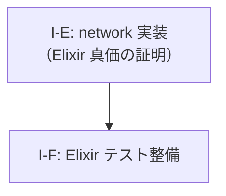

# AlchemyEngine — 改善計画

> このドキュメントは現在の弱点を整理し、各課題に対する具体的な改善方針を定義する。
> 優先度・影響範囲・作業ステップを明記することで、改善作業を体系的に進めることを目的とする。

---

## スコアカード（現状評価）

| カテゴリ | 点数 | 主な減点理由 |
|:---|:---:|:---|
| Rust 物理演算・SoA 設計 | 9/10 | — |
| Rust SIMD 最適化 | 9/10 | — |
| Rust 並行性設計 | 8/10 | — |
| Rust 安全性（unsafe 管理） | 8/10 | — |
| Elixir OTP 設計 | 8/10 | — |
| Elixir 耐障害性 | 6/10 | NIF エラーは捕捉済みだが、ゲームループ再起動などの完全な回復ロジックが未実装 |
| Elixir 並行性・分散 | 1/10 | シングルルームのみ。`network` は完全スタブ |
| Elixir ビヘイビア活用 | 7/10 | — |
| アーキテクチャ（ビジョン一致度） | 7/10 | — |
| テスト | 6/10 | Rust 側テスト拡充（SIMD/スカラー一致テスト追加）。Elixir 側はほぼ未テスト |
| **総合** | **7/10** | |

---

## 課題一覧

### I-E: `network` が完全スタブ（Elixir 並行性・分散 1/10 の原因）

**優先度**: 🟡 高（`pending-issues.md` 課題10・11 と同一）

**問題**

Elixir を選んだ最大の根拠である「OTP による耐障害性」「軽量プロセスによる大規模並行性」「分散ノード間通信」が、現状のコードでは一切証明されていない。
`network.ex` は実装なしのスタブであり、シングルプレイヤーのローカルゲームとして動作しているだけである。

この状態では「なぜ Elixir + Rust か」という問いにコードが答えられない。

**改善方針**

`pending-issues.md` 課題10（問題2・3）および課題11 の作業ステップを参照。

---

### I-F: Elixir 側のテストがほぼ未整備（テスト 5/10 の原因）

**優先度**: 🟢 中

**問題**

Rust 側には `chase_ai.rs`・`spatial_hash.rs` 等に単体テストが存在するが、Elixir 側（`GameEvents`・`Contents.SceneStack`・各シーン・コンポーネント）のテストがほぼ存在しない。

**改善方針**

- `Contents.SceneStack` のシーン遷移ロジックを `ExUnit` でテストする
- `GameContent.VampireSurvivor.Scenes.Playing.update/2` の純粋関数部分（EXP 計算・レベルアップ判定）を単体テストする
- `GameEngine.EventBus` のサブスクライバー配信をテストする

**影響ファイル**

- `apps/core/test/` — 新規テストファイル群
- `apps/contents/test/` — 新規テストファイル群

---

## 改善の優先順位と推奨実施順序

```mermaid
graph TD
    IE["I-E: network 実装\n（Elixir 真価の証明）"]
    IF["I-F: Elixir テスト整備"]

    IE --> IF
```

### フェーズ1・1.5（完了済み）

- ~~**I-G**: `build_playing_hud_ui` の戻り値型を修正~~
- ~~**I-H**: `pending_action` の優先順位ロジックを修正~~
- ~~**I-I**: SIMD 版 Chase AI の `alive_mask` コメント補強・テスト追加~~
- ~~**I-J**: `UiAction::from_action_key` の未知アクション処理を `None` に変更~~
- ~~**I-K**: `exp_to_next` フィールドのコメント・命名を明確化~~
- ~~**I-L**: `search_radius` の推奨値コメント追加~~
- ~~**I-M**: `load_dialog` の型を `enum LoadDialogKind` に変更~~
- ~~**I-N**: Ghost・Skeleton の UV に `TODO` コメント追加~~
- ~~**I-O**: `MAX_INSTANCES` の内訳にエリート敵を追記~~

### フェーズ2（中期）

1. **I-E**: `GameNetwork.Local` 実装 → ローカルマルチプレイヤー → ネットワーク対応
2. **I-F**: Elixir 側テスト整備

---

## 残課題（シーン管理 → contents 移行タスクより）

> 出典: `scene-management-to-contents.md`（削除済み）

### 未解決事項・確認ポイント

| 項目 | 内容 |
|:---|:---|
| **SceneStack の起動タイミング** | ルーム起動時に RoomSupervisor が content の `scene_stack_spec(room_id)` を起動するか、GameEvents の子プロセスとして起動するか要検討 |
| **既存 ContentBehaviour コールバック** | `initial_scenes`, `playing_scene` 等を完全に削除するか、SceneStack 初期化用に content 経由で渡す形に留めるか |
| **後方互換性** | 段階的移行のため、一時的に core と contents の両方に SceneManager/SceneStack が存在する期間を設けるか |

### SceneStack 移行後の改善候補

| 項目 | 内容 | 出典 |
|:---|:---|:---|
| **セキュリティ: update_current / update_by_module の fun 引数** | `handle_call` で受け取った匿名関数 `fun` をそのまま実行しており、GenServer が非信頼呼び出し元に晒された場合の RCE リスクがある。現状は内部呼び出しのみで実質リスクは低いが、API を「コマンド atoms + データ」形式に変更する検討余地あり。 | gemini-code-assist 指摘 |
| **効率: update_by_module のリスト操作** | `Enum.find_index` → `Enum.at` → `List.replace_at` による複数回走査を、`List.update_at/3` で簡潔化できる。 | gemini-code-assist 指摘 |
| **flow_runner の共通化** | 全コンテンツで `Process.whereis(Core.SceneManager)` を返す同一実装。scene_stack_spec/1 導入で差が付くならそのままでよい。共通化する場合は ContentBehaviour のデフォルト実装やヘルパーを検討。 | レビュー |
| **flow_runner の optional_callbacks** | Phase 3 で GameEvents が参照するまでは実質未使用。フェーズ分離を厳密にするなら現時点で `@optional_callbacks` に入れ、Phase 3 に合わせて必須化する選択肢あり（現状は必須のまま）。 | レビュー |
| **GameEvents / GameEvents.Diagnostics の所在** | `apps/core/lib/core/game_events.ex` および `apps/core/lib/core/game_events/diagnostics.ex` はコンポーネント（contents）層にあるべき。core の責務を「ループ制御・イベント配信・コンポーネントライフサイクル」に限定する方針に沿い、移行を検討する。**タスク化済み:** [game-events-to-contents.md](task/game-events-to-contents.md) | 設計 |
| **flow_runner の重複呼び出し** | 各 `handle_info` で `flow_runner(state)` を個別に呼んでいる。イベントハンドラごとに同一値が返る想定であれば、変数にまとめる等で重複を減らす余地あり。 | レビュー |

---

*このドキュメントは `pending-issues.md` と連携して管理すること。課題が解消されたら該当セクションを削除し、`pending-issues.md` の対応する課題も更新すること。*
