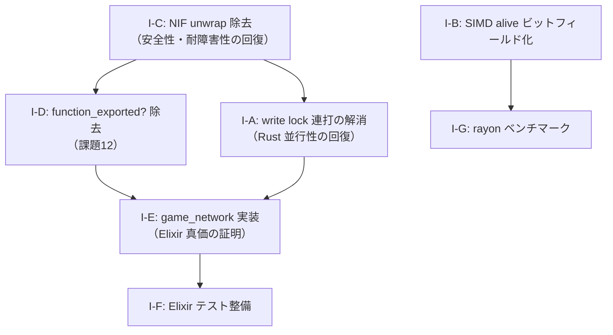

# AlchemyEngine — 改善計画

> このドキュメントは現在の弱点を整理し、各課題に対する具体的な改善方針を定義する。
> 優先度・影響範囲・作業ステップを明記することで、改善作業を体系的に進めることを目的とする。

---

## スコアカード（現状評価）

| カテゴリ | 点数 | 主な減点理由 |
|:---|:---:|:---|
| Rust 物理演算・SoA 設計 | 9/10 | — |
| Rust SIMD 最適化 | 7/10 | `alive` チェックがスカラー分岐で SIMD 効果を半減 |
| Rust 並行性設計 | 5/10 | 毎フレーム write lock 連打が RwLock 競合を生んでいる |
| Rust 安全性（unsafe 管理） | 6/10 | NIF 側の `unwrap` / `expect` が散在 |
| Elixir OTP 設計 | 8/10 | — |
| Elixir 耐障害性 | 2/10 | NIF パニック = BEAM クラッシュ。OTP の最大の強みが無効化 |
| Elixir 並行性・分散 | 1/10 | シングルルームのみ。`game_network` は完全スタブ |
| Elixir ビヘイビア活用 | 4/10 | `function_exported?/3` 汚染がエンジンコアに散在 |
| アーキテクチャ（ビジョン一致度） | 4/10 | AsteroidArena 追加でエンジンコアが汚染された |
| テスト | 5/10 | Rust 側に単体テストあり。Elixir 側はほぼ未テスト |
| **総合** | **6/10** | |

---

## 課題一覧

### I-A: NIF の毎フレーム write lock 連打（Rust 並行性 5/10 の原因）

**優先度**: 🔴 最高

**問題**

Elixir 側が「SSoT」を名乗りながら、毎フレーム以下の NIF を呼んでいる。
これらはすべて `write lock` を取得するため、60Hz で動作する Rust ゲームループと毎フレームロックを奪い合っている。

```
set_hud_state          (score, kill_count)
set_hud_level_state    (level, exp, weapon_choices)
set_elapsed_seconds
set_weapon_slots
set_player_hp
set_boss_hp
```

Rust の真価である「競合のない並行性」がこの設計で台無しになっている。

**改善方針**

- HUD 表示専用の値（score, kill_count, level, exp 等）はレンダースレッドが `read lock` で読める専用バッファ（ダブルバッファリング）に分離する
- ゲームロジックに影響しない純粋な描画用データは `write lock` を使わずに渡せる構造にする
- 変化があったフレームのみ注入する差分更新（既に `last_weapon_levels` で一部実施済み）をすべての注入系に適用する

**影響ファイル**

- `native/game_nif/src/nif/world_nif.rs` — HUD 注入系 NIF の lock 種別見直し
- `native/game_simulation/src/world/game_world.rs` — HUD 専用バッファの分離
- `apps/game_engine/lib/game_engine/game_events.ex` — 差分更新の徹底

---

### I-B: SIMD の `alive` チェックがスカラー分岐（Rust SIMD 7/10 の原因）

**優先度**: 🟢 中

**問題**

SSE2 SIMD で 4 体並列処理しているにもかかわらず、`alive` フラグの読み取りがスカラーの `if` 分岐になっている。

```rust
let alive_mask = _mm_castsi128_ps(_mm_set_epi32(
    if enemies.alive[base + 3] { -1i32 } else { 0 },
    if enemies.alive[base + 2] { -1i32 } else { 0 },
    if enemies.alive[base + 1] { -1i32 } else { 0 },
    if enemies.alive[base + 0] { -1i32 } else { 0 },
));
```

`alive` を `bool` の `Vec` で持っているため、SIMD レジスタへのロードにスカラー分岐が必要になっている。

**改善方針**

- `alive: Vec<bool>` を `alive_bits: Vec<u32>`（ビットフィールド）または `alive: Vec<u8>`（0/0xFF のマスク値）に変更する
- `_mm_set_epi32` の代わりに `_mm_loadu_si128` で直接ロードできるようになり、スカラー分岐が消える
- ベンチマーク（`criterion`）を追加して改善効果を計測する

**影響ファイル**

- `native/game_simulation/src/world/enemy.rs` — `alive` フィールドの型変更
- `native/game_simulation/src/game_logic/chase_ai.rs` — SIMD マスク生成の修正

---

### I-C: NIF の `unwrap` / `expect` 散在（Rust 安全性 6/10 の原因）

**優先度**: 🔴 最高（`pending-issues.md` 課題10 問題1 と同一）

**問題**

`game_nif` の NIF 関数内に `unwrap()` / `expect()` が残存しており、Rust パニックが発生すると BEAM VM ごとクラッシュする。
OTP の Supervisor ツリーによる再起動が完全に無効化される。

**改善方針**

- 全 NIF 関数の戻り値を `NifResult<T>` に統一し、`unwrap()` / `expect()` を除去する
- 配列アクセスは `get()` による境界チェックに置き換える
- Elixir 側 `GameEvents` で `{:error, reason}` を受け取った場合の回復ロジックを追加する

**影響ファイル**

- `native/game_nif/src/nif/*.rs` — 全 NIF 関数の `NifResult<T>` 統一
- `apps/game_engine/lib/game_engine/game_events.ex` — NIF エラー回復ロジック

---

### I-D: `GameEvents` の `function_exported?/3` 汚染（Elixir ビヘイビア 4/10 の原因）

**優先度**: 🔴 最高（`pending-issues.md` 課題12 と同一）

**問題**

エンジンコアである `GameEvents` に、コンテンツ固有の概念（武器選択・レベルアップ・ボスアラート）を判定する `function_exported?/3` が複数散在している。

```elixir
if function_exported?(content, :level_up_scene, 0) do ...
if function_exported?(content, :boss_alert_scene, 0) do ...
if function_exported?(content, :boss_exp_reward, 1) do ...
```

Elixir の強みである `@behaviour` によるポリモーフィズムを放棄した設計であり、コンテンツが増えるたびにエンジンコアが肥大化する。

**改善方針**

`pending-issues.md` 課題12 の作業ステップを参照。

---

### I-E: `game_network` が完全スタブ（Elixir 並行性・分散 1/10 の原因）

**優先度**: 🟡 高（`pending-issues.md` 課題10・11 と同一）

**問題**

Elixir を選んだ最大の根拠である「OTP による耐障害性」「軽量プロセスによる大規模並行性」「分散ノード間通信」が、現状のコードでは一切証明されていない。
`game_network.ex` は実装なしのスタブであり、シングルプレイヤーのローカルゲームとして動作しているだけである。

この状態では「なぜ Elixir + Rust か」という問いにコードが答えられない。

**改善方針**

`pending-issues.md` 課題10（問題2・3）および課題11 の作業ステップを参照。

---

### I-F: Elixir 側のテストがほぼ未整備（テスト 5/10 の原因）

**優先度**: 🟢 中

**問題**

Rust 側には `chase_ai.rs`・`spatial_hash.rs` 等に単体テストが存在するが、Elixir 側（`GameEvents`・`SceneManager`・各シーン・コンポーネント）のテストがほぼ存在しない。

**改善方針**

- `GameEngine.SceneManager` のシーン遷移ロジックを `ExUnit` でテストする
- `GameContent.VampireSurvivor.Scenes.Playing.update/2` の純粋関数部分（EXP 計算・レベルアップ判定）を単体テストする
- `GameEngine.EventBus` のサブスクライバー配信をテストする

**影響ファイル**

- `apps/game_engine/test/` — 新規テストファイル群
- `apps/game_content/test/` — 新規テストファイル群

---

### I-G: rayon 並列化の閾値未検証（Rust 並行性の補足）

**優先度**: 🟢 低

**問題**

`update_chase_ai` の rayon 版は全敵を `par_iter_mut` で並列化しているが、rayon のスレッドプールのオーバーヘッドが支配的になる敵数（数百体以下）ではシングルスレッドより遅い可能性がある。ベンチマークが存在しない。

**改善方針**

- `criterion` ベンチマークを追加し、敵数 100 / 500 / 1000 / 5000 / 10000 体での処理時間を計測する
- 閾値以下ではシングルスレッド版にフォールバックする分岐を追加する

**影響ファイル**

- `native/game_simulation/benches/` — 新規ベンチマーク
- `native/game_simulation/src/game_logic/chase_ai.rs` — 閾値分岐の追加

---

## 改善の優先順位と推奨実施順序



### フェーズ1（✅ 完了）

1. **I-C**: NIF の `NifResult<T>` 統一（OTP 耐障害性の回復）✅
2. **I-D**: `function_exported?/3` 除去（課題12 の実施）✅
3. **I-A**: HUD 注入系の write lock 解消 ✅

### フェーズ2（中期）

4. **I-E**: `GameNetwork.Local` 実装 → ローカルマルチプレイヤー → ネットワーク対応
5. **I-F**: Elixir 側テスト整備

### フェーズ3（最適化）

6. **I-B**: SIMD `alive` ビットフィールド化
7. **I-G**: rayon ベンチマーク追加・閾値分岐

---

*このドキュメントは `pending-issues.md` と連携して管理すること。課題が解消されたら該当セクションを削除し、`pending-issues.md` の対応する課題も更新すること。*
